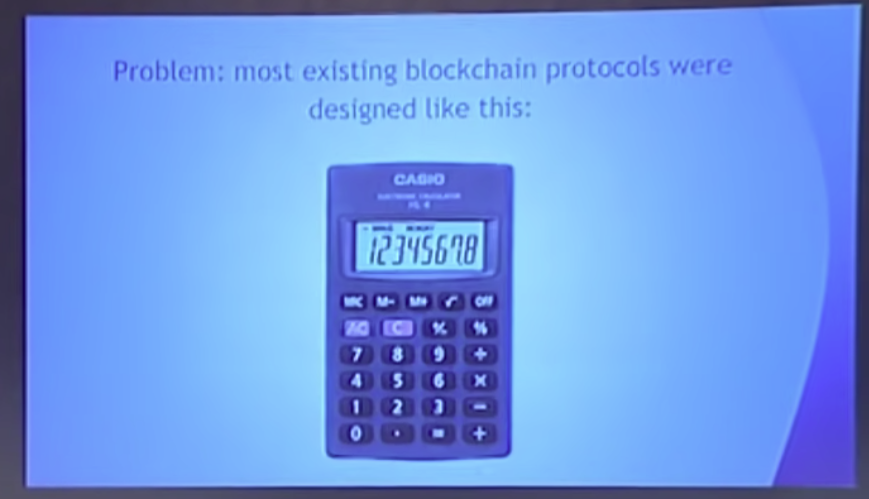
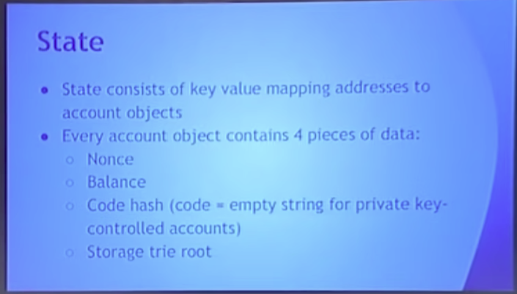
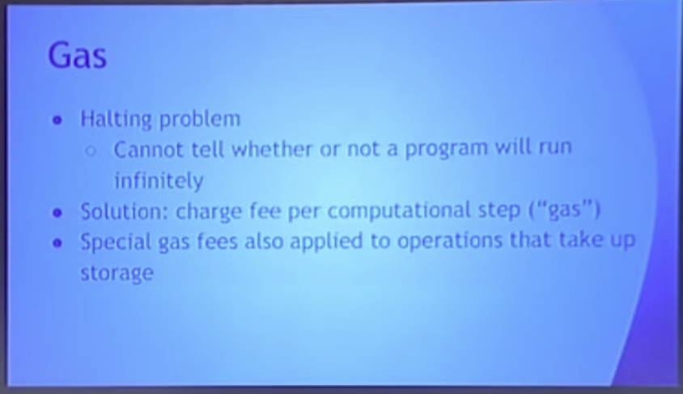

Hello everyone, welcome to the third day of the conference, deep dive into Ethereum protocols, so we started off with Fei Jie wonderful presentation from Alex on the protocol, on top of which the other Ethereum protocols run. So a Kaveri makes sense to follow that up with a presentation on the Ethereum protocol.

So you know the idea behind Ethereum blockchain first came around back at the end of 2013. When people were getting really excited about Bitcoin, people were getting starting to get excited about Blockchain technology and applications beyond currency. And there is a public consensus that blockchains are useful for... stuff. And not just money. So, you know, blockchain could be used for asset issuance, crowdfunding, domain registration, title registration, gambling, prediction markets, Iot, you know people are coming up with some new category of applications every week, and so you know the problem at the time is that most existing blockchain protocols were designed like this:

Single purpose tools that are specifically designed around one particular application.

So in Bitcoins case currency in name, coins case domain registration in prime coins case, you know, trying to do scientific computing and, in my opinion, not doing a very good job of it. So then we had second generation protocols that works like this, so we had protocols that had somewhere around 55 different transaction types, where one transaction type is something like, you know create a binary option. Another one is join a binary option and one for settling a binary option, one for making a bet, one for settling a bet, one for doing some kind of two party dice game and every time someone came up with a new kind of application that was deemed important enough to be worth including, the people who are creating these protocols would just add yet another transaction type.

So at the time you know we had protocols that are 55 transaction types, I even worked for one of them for a few weeks. After I worked one of them for a few weeks another two transaction types got added, good old contracts for difference. So, even still, you know, it's pretty obvious I think from, especially from the standpoint of our current generation of this particular way of doing things, it's just fundamentally limited. So what's the solution, basically, something like a smart phone, so you know the idea is that, instead of having a protocol that's designed around one very small set of use cases, you just create a general purpose operating system and you let people build whatever they want as applications on top of it. So you know, if you do that, then things suddenly become better. You know people, maybe, when you're inventing the protocol, you might be thinking that okay people gonna use this for binary options, contracts for difference, making two party bets, domain registrations and whatever other 50 applications you are aware of at the time, then, you know, release the white paper and six weeks later, you realize that people are inventing applications in a completely different direction and guess what, your protocol does not even have to change one single bit in order to handle them.

So that's the power of generality. So what is the concept behind Ethereum? Well, it's blockchain, seen for six years, pretty boring. With a few tiny additions.

So the first important one is this concept of a built-in programming language, so in Ethereum there is a kind of, a built-in turing complete scripting language. It's essentially a hybrid between kind of standard virtual machine architectures Bitcoin script and a few other things. And the point is that, you know, people can write programs in this script or more realistically in high-level languages like that compile down to the script, then people take their compiled scripts, put them into transactions and send the transactions off to the blockchain, transaction gets confirmed, an address gets generated and you now have a special kind of account at that address called a contract.

So two types of accounts, user accounts controlled by private keys, you know we all the same, old elliptic curve, digital signature algorithm we all know and love. second kind of account contracts controlled by code. So these two types of accounts in Ethereum essentially have completely equal privileges, anything that humans have the right to do, BOTS have the right to do.

So anyone can create an application with any rules by defining it as a contract. So this is essentially the basic principle.

So you know the "Hello World" of Ethereum, I'm creating a decentralized DNS system? So basically you know the idea here is you want to create a system where people can register addresses and if the addresses could be, you know, something something dot eath and if they own an address they should be able to set the IP address associated with that domain address. So the way the system works is fairly simple, so you see a sort of declaration at the top, data domains with an owner, basically a mapping between a domain name and a tuple containing an owner and an IP address, and you have two functions: one of them for registering a domain which basically says if this domain doesn't have an owner yet then sends the owner to or set the owner to, whoever sends that particular transaction. And you have another function set IP address which basically means if you own a domain then you set the ip address to whatever you want to set it to. So you know, fairly simple rule set.

This is, you know, in, of course you know, real-life DNS systems have substantially more more features to them, but sort of the fundamental core basically stays the same, and you know you can probably build a more complex DNS system on top of this, just by turning the IP address into a hash and throwing everything else on IPFS if you really want to but point it's very very simple logic, you can write it in ten line, in 10 lines of serpent code and publish it through the Ethereum blockchain and there you have a system, that's basically like named coin.

So you know this is basically the meaning of, you know, anyone can create an application with any rules. Once this application gets created, then anyone can interact with the application by sending transactions that specify the contracts address as their destination address. So you send the transaction to a contract and that's how you talk to the application, that's how you call functions, that's how you do you know whatever it is that you want to do.

So in Bitcoin, the state is very is very simple. It's basically just a mapping of, this sort of, well, technically speaking, this sort of list of unspent transaction model but what it basically means in practice is it's the list of balance as the rest of sort of the amount of bitcoins that every particular person has and if you want to do a currency system that's basically all you need.

In Ethereum the state is kind of more complex it's this sort of key value mapping, going from addresses to account objects and there's two types of account objects, one of them is the sort of simple accounts controlled by a private key, in that case all you have is nonce and balance. The second kind is accounts that are controlled by code, and in that case you have these extra two fields that get filled up, one of them is the code hash, so the hash, the hash of the code of that particular account and the second is the storage tree root which any sort of fairly intricate way that I'll describe later basically represents the kind of the entire set of storage of that particular account.

So for example, if I create a contract with this code and register a domain then the fact that one particular domain got registered to my, and got registered with me being the owner and then set the ip address to some particular value, that information all goes into any sort of persistent storage of this particular account, so basically no mapping from addresses to what watch of this, is the entire state of the Ethereum system at any particular time.

So code execution, every transaction specifies a "TO" address that it's sending to, so you know this is fairly simple, it's the kind of logic that we all understand, if you set the message then you generally specify who you're sending it to and you want to specify the contents. So what happens if you send a transaction to the "TO" address or "TO" options.

One of them is that the destination address is just a private key control account, in that case all you're doing is moving ether around, so if you do that then it's basically just being a cryptocurrency. What if you're sending to an account that has code then what that's doing is that's basically activating the code and it's actually letting the code run for some number of steps.

So code in Ethereum gives you three things: No.1 you can just send ether to other contracts No.2 you can read and write from the contracts own storage, so for example, if you're going here then the way that I would call the register function is by sending a transaction with data formatted in a particular way and what that function is going to do is or rather well, what transaction actually going to do is it's going to start running the code that actually represents the register method and where it specifies self domains address dot owner equals message sender, that's setting a variable what that actually gets compiled to, is setting a particular key in the contracts own storage, so then the third thing code can do is, you can call or basically sort of create these sort of virtual transactions that go to other contracts, so theoretically, you know, I could create another contract that has some different set of rules and that contract itself can actually interact with this contracts that contract itself can register domains against an ip address of domain as I could.

You know theoretically do just about anything that an account is controlled by an address can do, so every (full) node on the blockchain processes every transaction and stores the entire state just like Bitcoin, it's bold because it's important. So this is sort of one of those points that's important to make because you know people often ask well if I publish transactions to Ethereum who is actually wrote, who actually going to be enforcing the contract and who and how many nodes are running them and so forth.

For Ethereum in 1.0 the answer is very simple, every node in the network runs every transaction and that base in the process of running a transaction, you know, if that transaction goes to a particular contract it actually involves executing contract code and you know setting and changing the state to whatever the state is after the contract gets executed. So firm that's the end point you can actually think of it as being a rather fairly simple system you know you can think of the state as being a database and you can think of each of these contracts as being as as being programs that are sitting on one computer except the computer is massively globally distributed it's actually a highly secure network backed by tens of thousands of computers around the world. So in bold because it's important.

So gas, this is one of those sort of key mechanisms underlying the security of Ethereum, so when you tell people that you have a turing-complete programming language and that you let untrusted parties send code that's executed in a turing-complete programming language by every single computer in entire network, the first thing that they're going to ask is, well what about the halting problem so there is this very widely known result in computer science which basically says that it is mathematically impossible to create an algorithm which can tell whether or not any given program is just going to keep on running forever, so how does the Ethereum prevent attackers from creating programs that just keep on running on everyone's computers forever.

And the answer is this concept of gas so what this basically means is that if your network charges a fee for  every computational step that a contract execution takes, so the specific way that that's implemented is that every block in the Ethereum blockchain has a gas limit, so basically a limit on computational steps. Right now, the gas limit is set to three one four one five nine two which is a nice number that we picked because we're totally not math geeks and so then you know if you're creating a..., if you are a miner and you're creating a block then [ chances are (that) ] = [ it is likely that 很可能 ] you're going to want to fill it with the transactions that give you the most profit. So every transaction specifies a gas price basically an amount of ether that it's willing to pay per unit of gas and it specifies a maximum amount of gas that's willing to take so a transaction might specify I am paying 50 chanin which is basically 50 billion from an ether per unit gas and I'm going to consume up to 500,000 gas, miners see all these transactions coming in they select the ones that have the highest gas price and they include them in the block.

So when each transaction specifies know that it's willing to spend up to 200,000 gas, then what happen, there is two things that could happen: one of them is that execution takes up less than 200,000 gas in which case everything happens normally it's okay, the transaction pays only for the computational steps that it uses, second case that goes over the limit, if that happens then all the execution gets reverted and the reason why that has to be done is because if execution could stop halfway through, then you might be able to sort of perform weird attacks on contracts, so we try to like set the execution to expire just at the time when like one half of the changes it gets made but the other half doesn't get made. And you know we kind of preferred developers and be able to just not worry about that. And so all the execution gets reverted but the transaction still has to pay for the gas anyway, so don't run out of gas.

There's also gas isn't just a sort of simple one computational step, one gas thing, there are some operations, for example, operations that increase the amount of storage that every node has to store and those operations take up a very large amounts of gas. So the gas system is also the sort of fairly intricate set of incentives that are designed in order to encourage you using the resources of Ethereum system responsibly.

So gas limit is sort of the counterparts of the block size limit in bitcoin, how is the gas limits set, fairly simple voting mechanism right now, if you mine a block then you can upvote or downvote the gas limit by a factor, maximum factor of $1/1024$.

There is a default strategy that we currently, sort of, instruct all the clients to follow in the source code which is you have a minimum of 3141592 and if the usage starts bubbling up and hitting close to the gas limit then we target 150% of the long-term exponential moving average (EMA) of the gas usage. So basically sort of targeted so that if it does get filled up the gas what is going to be sort of just a bit higher than what one blocks normally contain.

So there are alternative strategies that we're exploring, so one of them is this, for example, target a particular uncle rate so what uncle's are I'll explain a bit later but the general concept is that the more the blockchain gets clogged up then basically the more blocks and the slower blocks propagate and so the more blogs kind of get lost and don't end up being in the main chain.

And as it turns out thanks to a future of the Ethereum protocol you can actually calculate how much this is happening and so you can kind of target a particular amounts to which it's happening and you can say if we're seeing more than let's say 20 percent waste from blocks being just falling off the network then the gas limit should go down. So there are other strategies that work in centering.

So transactions contain basically seven sets of values, No1. nonce, so what a nonce does is basically every transaction has to have a unique incrementing nonce, so the first transaction you send from an account has to have a nonce 0, second transaction you send has to have a nonce of 1, third a ounce of 2 and so forth. And the reason this is done is to prevent real replay attacks. So if Alice send 10 ether to Bob, you don't want Bob to take that transaction and reinsert it into the blockchain 10 times to give himself another 100 ether, now let's fix that.

Gas price, the amount of ether per unit, startgas are we already covered that, startgas thing, to, the address of the the account that you're sending the transaction to or another contract you're calling, value the amount of ether that you're sending, data is just a field of data the transaction sender can fill the data field with whatever you want, says just an array of bytes no limits on length. But the more there the more data a transaction includes there is actually a fee for that in gas so basically you include 60 you have to pay an extra 60 gas for every byte of transaction data that you include. V, R, S there are values in an elliptic curve signature so look if you're familiar with cryptography you've probably heard of v,r,s the v value is basically an extra flag needed to do public key recovery so basically instead of checking the signature against the public key you actually derive the public key from the signature.

So there's this concept called of receipts, so receipts are objects that kind of get hashed into the Ethereum blockchain and every transaction has a corresponding receipt, so these receipts have a few pieces of data, one of them is an intermediate state root which once again will describe the mechanism later but it's a kind of hash that represents the entire state after the transaction gets executed. No2. cumulative gas used, so the total amount of gas used in that particular block including that transaction, so those first two things are kind of needed to do this sort of step-by-step counting that actually makes it possible to kind of check what the validity of individual transactions very easily.

And the third thing is logs, so logs are this special feature in Ethereum that it's kind of a different kind of storage so in general you know when you set variables that gets set in account storage and that can be read or written by contracts, logs are basically append-only, so if you have a transaction in one particular block and it creates some logs those logs get hashed into that particular block but they are not visible, they cannot be accessed by contracts and they appear just in that block they're not in any kind of persistent state.

So nodes, if they wants to for example they can just not store logs and it can prune and they can prune them, so logs are also 10 times cheaper in terms of gas consumption and storage. And the purpose of logs is to allow sort of efficient light client access to event records so one example where you want to use a log is if you go back to the DNS example you might want to add a single line to create a log in the register method and let's say the set_ip method.

And the reason why you wants to do that is basically in order to allow light clients to very quickly scan through all the logs and sort of see all the instances at which the domains got registered, IP address got changed and so forth. So there's lots of applications that wants to be able to sort of have a history of things that happen and logs are a convenient way of supporting that. So logs have a data field and they have up to 4 topics and there is a protocol that uses bloom filters to make it very easy for light clients to kind of search through logs. So basically if you create a log that has a particular topic then you can very easily search through the entire blockchain and sort of identify all of the logs that's that matched a particular topic.

So if you're in virtual machine, so once again as I mentioned, it's this sort of combination of stack based architectures traditional virtual machines. Stack, so inside of the virtual machine you have the stack basically you know 32 byte fields up to a maximum of 1024 of them. Memory, just in it's an infinitely expanding byte array but the more you expand the byte array the more gas you have to pay, so most of the limits in Ethereum they aren't sort of static, they're economic. And that's just a standard thing you're going to see again and again. Storage, permanent contract storage you can read and write to it. Environment variables, so for example, the virtual machine you can access the block number, the time, the mining difficulty, previous block hash and a whole bunch of other data. So one possible use case of that is let's say if you have a some kind of financial derivative that can only be processed or, you know, called struck or whatever after some particular time then you can say in the contract you can check the current block timestamp against you know some particular limit that you said. Logs, so the virtual machine you can create these logs and there is an opcode by which the virtual machine can itself call other contracts, so this is basically the environment within which this contract code gets executed.

Now you don't have to write in virtual machine bytecode yourself there's high-level languages, so, and one of these high-level languages is called Serpent, so this is one of them, there's also one called Solidity which is being used much more right now, there's one called LLL which is kind of much more low-level if you wants to like really go into low-level code and be as efficient as possible you might want to use LLL. Although you know in my own opinion you should probably consider Serpent as well because Serpent lets you go as well as LLL does and it has high-level features as well. So you know basically you write code in these languages then you have compilers and you compile the contracts into bytecode and you can publish them, you can publish the bytecode in a transaction going to the blockchain.

The ABI, so when you send a transaction, let's say that I wants to call the register method of that particular DNS contract that I keep on using as an example. Function calls get compiled into a transaction data, so in this case the function call gets, the way that it gets encoded is the first 4 bytes are a function ID, the next 32 bytes are the first argument, so this was the the domain that I wanted to change the ip address of, and the second or the second argument ends another 32 bytes which is the ip address that you want to set it to.

So every time you call a function of a contract in Ethereum it actually gets compiled into a transaction which is encoded using this algorithm which you know in simple cases looks like this, just 4 bytes, 32 bytes, keep on going with 32 bytes but there are some special cases involving sort of variable length lists and so forth.

Everything in Ethereum relies on this one serialization algorithm called RLP recursive length prefix encoding, so it's very simple so basically you know if you know it's recursive length prefix encoding so you take the thing, so in this case if you take the word "dog" and you just hex encoded you get 646f67, and you, before it you prefix it with the length, so in this case the length is 3 and you can see a 3 here, over here you know it's an empty string and so you have a length of 0, over here this is a list and so it still has a length of 0 but it has a different sort of start flag because it's meant to be a list and not a string. This is the four people who were set theory geeks this is a set theoretic representation of the number two it gets compiled to this or encoded to this rather if you have a string then you know gets compiled it gets you realized into this so there are like five implementations of this there is a much more detailed description on the Wiki but basically this algorithm is used for blocks, transactions, network protocol, order we sort of everything in Ethereum land.

Ethereum also has a cool new mining algorithm, so the goal of this is called Ethash, so the purpose of this is to be GPU-friendly and ASIC-hard, so it's a target. GPU is as much as much as possible and basically prevent them from the problem in Bitcoin where you have these sort of specialized miners that with extremely large mining farms taking up huge percentages of the network. So the algorithm is this uses memory-hardness to accomplish this goal, so basically instead of traditional proof-of-work algorithms like Bitcoin where the bottleneck is always how much computation you can do, here the bottleneck is memory access. And the theory behind this is that memory is something which is highly optimized in which people spend billions of dollars optimizing existing computers already, and so the opportunity make further up the optimizations is theoretically smaller than it is for computation.

So the way that it does this is by using this sort of we clever multi-level deck instruction, so basically the idea is that you start off with a seed then from the seed to use this memory-hard function create a cache then from the cache you create a dataset and the dataset can be created in parallel, so each individual piece of the dataset actually gets created by hashing together 256 parents come from the cache and if you wants to just actually run the algorithm once, then what you need to do is you take the data that you're mining on turn that into a seed then you grab a random 64 nodes from the pieces of the dataset and you get your result. So what's the point of this, the point of this is that mining with this algorithm actually is memory hard, because if you wants to mine and if you wants to mine at any reasonable speed at all, then you basically have to pre-generate this entire one gigabyte dataset so that every time you pick a different nonce you can just sort of simple from it and that happens fairly quickly.

If you just wants to verify blocks then you don't actually need the gigabyte, all you need is a cache. And the reason why is basically that if when you get to this stage you don't need to create this entire thing you just figure out what 64 indices you want then from each of those 64 indices are just computed from the cache. Now this does require you to make 16384 hash calculations but or as it turns out that's actually not that bad if you're only doing it once. So because verification only needs to happen once this kind of low memory stole verification process actually works. But if you wants to mine then you need to do it with a lot of speed and so he needs to have the gigabyte. So this is kind of the basic principle behind sort of why mining was designed in the particular way that it was in Ethereum. (28:54)

So uncle's so in general bitcoin has a ten-minute block time aetherium has a 17-second block time why is the block time not something even shorter like one second the problem with fast block times is basically stale rates due to network latency so if the block time is extremely long like ten minutes you can think of network latency as being negligible by comparison you can think of it as basically being instant and so we basically don't have problems once you start pushing block x down then your problem is that you have this risk that let's say over here we have one block in 2059 then at some point someone creates another block 2060 that block takes time to propagate through the network and so someone else might actually make another block before hearing about this block and so we have two blocks both on top of the same block 2059 and they're kind of both competing with each other so this is called a fork and the problem is that one of the blogs has to eventually win and the block that doesn't win just kind of gets discarded and the person who mined it doesn't get a reward so this leads the centralization risks so basically the issue is that the more powerful you are as a miner the better you are at getting a high network connectivity and if you created the last block then you don't have that you actually don't have this