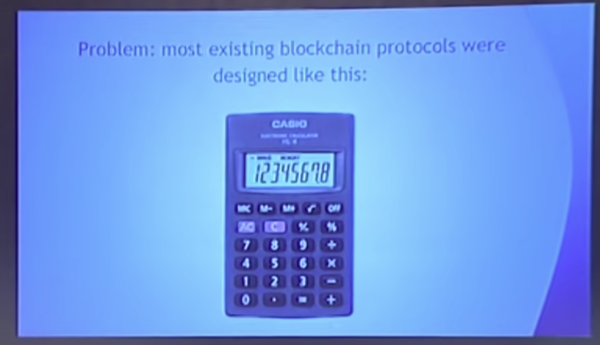

Hello everyone, welcome to the third day of the conference, deep dive into Ethereum protocols, so we started off with Fei Jie wonderful presentation from Alex on the protocol, on top of which the other Ethereum protocols run. So a Kaveri makes sense to follow that up with a presentation on the Ethereum protocol.

So you know the idea behind Ethereum blockchain first came around back at the end of 2013. When people were getting really excited about Bitcoin, people were getting starting to get excited about Blockchain technology and applications beyond currency. And there is a public consensus that blockchains are useful for... stuff. And not just money. So, you know, blockchain could be used for asset issuance, crowdfunding, domain registration, title registration, gambling, prediction markets, Iot, you know people are coming up with some new category of applications every week, and so you know the problem at the time is that most existing blockchain protocols were designed like this:

Single purpose tools that are specifically designed around one particular application.

So in Bitcoins case currency in name, coins case domain registration in in prime coins case, you know trying to do scientific computing and, in my opinion, not doing a very good job of it. So then we had second generation protocols that works like this, so we had protocols that had somewhere around 55 different transaction types, where one transaction type is something like. You know create a binary option. Another one is join a binary option and one for settling a binary option, one for making a bet, one for settling a bet, one for doing some kind of two party dice game and every time someone came up with a new kind of application that was deemed important enough to be worth, including the people who are creating these protocols would just add yet another transaction type. So at the time you know we had protocols that are fifty-five transaction types, I even worked for one of them for a few weeks after I worked one of them for a few weeks.