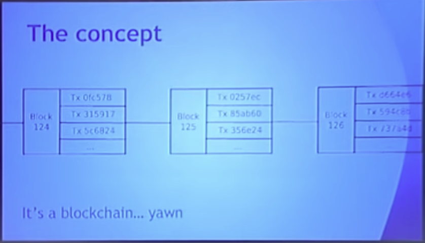
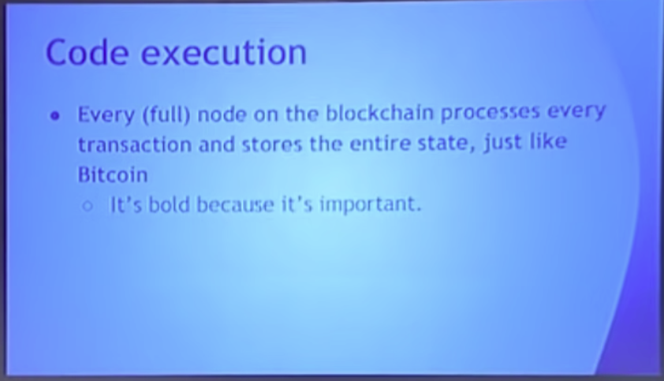

Hello everyone, welcome to the third day of the conference, deep dive into Ethereum protocols, so we started off with Fei Jie wonderful presentation from Alex on the protocol, on top of which the other Ethereum protocols run. So a Kaveri makes sense to follow that up with a presentation on the Ethereum protocol.

So you know the idea behind Ethereum blockchain first came around back at the end of 2013. When people were getting really excited about Bitcoin, people were getting starting to get excited about Blockchain technology and applications beyond currency. And there is a public consensus that blockchains are useful for... stuff. And not just money. So, you know, blockchain could be used for asset issuance, crowdfunding, domain registration, title registration, gambling, prediction markets, Iot, you know people are coming up with some new category of applications every week, and so you know the problem at the time is that most existing blockchain protocols were designed like this:

Single purpose tools that are specifically designed around one particular application.

So in Bitcoins case currency in name, coins case domain registration in prime coins case, you know, trying to do scientific computing and, in my opinion, not doing a very good job of it. So then we had second generation protocols that works like this, so we had protocols that had somewhere around 55 different transaction types, where one transaction type is something like, you know create a binary option. Another one is join a binary option and one for settling a binary option, one for making a bet, one for settling a bet, one for doing some kind of two party dice game and every time someone came up with a new kind of application that was deemed important enough to be worth including, the people who are creating these protocols would just add yet another transaction type.

So at the time you know we had protocols that are 55 transaction types, I even worked for one of them for a few weeks. After I worked one of them for a few weeks another two transaction types got added, good old contracts for difference. So, even still, you know, it's pretty obvious I think from, especially from the standpoint of our current generation of this particular way of doing things, it's just fundamentally limited. So what's the solution, basically, something like a smart phone, so you know the idea is that, instead of having a protocol that's designed around one very small set of use cases, you just create a general purpose operating system and you let people build whatever they want as applications on top of it. So you know, if you do that, then things suddenly become better. You know people, maybe, when you're inventing the protocol, you might be thinking that okay people gonna use this for binary options, contracts for difference, making two party bets, domain registrations and whatever other 50 applications you are aware of at the time, then, you know, release the white paper and six weeks later, you realize that people are inventing applications in a completely different direction and guess what, your protocol does not even have to change one single bit in order to handle them.

So that's the power of generality. So what is the concept behind Ethereum? Well, it's blockchain, seen for six years, pretty boring. With a few tiny additions.

So the first important one is this concept of a built-in programming language, so in Ethereum there is a kind of, a built-in turing complete scripting language. It's essentially a hybrid between kind of standard virtual machine architectures Bitcoin script and a few other things. And the point is that, you know, people can write programs in this script or more realistically in high-level languages like that compile down to the script, then people take their compiled scripts, put them into transactions and send the transactions off to the blockchain, transaction gets confirmed, an address gets generated and you now have a special kind of account at that address called a contract.

So two types of accounts, user accounts controlled by private keys, you know we all the same, old elliptic curve, digital signature algorithm we all know and love. second kind of account contracts controlled by code. So these two types of accounts in Ethereum essentially have completely equal privileges, anything that humans have the right to do, BOTS have the right to do.

So anyone can create an application with any rules by defining it as a contract. So this is essentially the basic principle.

So you know the "Hello World" of Ethereum, I'm creating a decentralized DNS system? So basically you know the idea here is you want to create a system where people can register addresses and if the addresses could be, you know, something something dot eath and if they own an address they should be able to set the IP address associated with that domain address. So the way the system works is fairly simple, so you see a sort of declaration at the top, data domains with an owner, basically a mapping between a domain name and a tuple containing an owner and an IP address, and you have two functions: one of them for registering a domain which basically says if this domain doesn't have an owner yet then sends the owner to or set the owner to, whoever sends that particular transaction. And you have another function set IP address which basically means if you own a domain then you set the ip address to whatever you want to set it to. So you know, fairly simple rule set.

This is, you know, in, of course you know, real-life DNS systems have substantially more more features to them, but sort of the fundamental core basically stays the same, and you know you can probably build a more complex DNS system on top of this, just by turning the IP address into a hash and throwing everything else on IPFS if you really want to but point it's very very simple logic, you can write it in ten line, in 10 lines of serpent code and publish it through the Ethereum blockchain and there you have a system, that's basically like named coin.

So you know this is basically the meaning of, you know, anyone can create an application with any rules. Once this application gets created, then anyone can interact with the application by sending transactions that specify the contracts address as their destination address. So you send the transaction to a contract and that's how you talk to the application, that's how you call functions, that's how you do you know whatever it is that you want to do.

So in Bitcoin, the state is very is very simple. It's basically just a mapping of, this sort of, well, technically speaking, this sort of list of unspent transaction model but what it basically means in practice is it's the list of balance as the rest of sort of the amount of bitcoins that every particular person has and if you want to do a currency system that's basically all you need.

In Ethereum the state is kind of more complex it's this sort of key value mapping, going from addresses to account objects and there's two types of account objects, one of them is the sort of simple accounts controlled by a private key, in that case all you have is nonce and balance. The second kind is accounts that are controlled by code and in that case you have these extra two fields that get filled up, one of them is the code hash, so the hash, the hash of the code of that particular account and the second is the storage tree root which any sort of fairly intricate way that I'll describe later basically represents the kind of the entire set of storage of that particular account.

So for example, if I create a contract with this code and register a domain then the fact that one particular domain got registered to my, and got registered with me being the owner and then set the ip address to some particular value, that information all goes into any sort of persistent storage of this particular account, so basically no mapping from addresses to what watch of this, is the entire state of the Ethereum system at any particular time.

So code execution, every transaction specifies a "TO" address that it's sending to, so you know this is fairly simple, it's the kind of logic that we all understand, if you set the message then you generally specify who you're sending it to and you want to specify the contents. So what happens if you send a transaction to the "TO" address or "TO" options.

One of them is that the destination address is just a private key control account, in that case all you're doing is moving ether around, so if you do that then it's basically just being a cryptocurrency. What if you're sending to an account that has code then what that's doing is that's basically activating the code and it's letting the code and it's actually letting the code run for some number of steps.

So code in Ethereum gives you three things: No.1 you can just send ether to other contracts No.2 you can read and write from the contracts own storage, so for example, if you're going here then the way that I would call the register function is by sending a transaction with data formatted in a particular way and what that function is going to do is or rather well, what transaction actually going to do is it's going to start running the code that actually represents the register method and where it specifies self domains address dot owner equals message sender, that's setting a variable what that actually gets compiled to, is setting a particular key in the contracts own storage, so then the third thing code can do is, you can call or basically sort of create these sort of virtual transactions that go to other contracts, so theoretically, you know, I could create another contract that has some different set of rules and that contract itself can actually interact with this contracts that contract itself can register domains against an ip address of domain as I could.

You know theoretically do just about anything that an account is controlled by an address can do, so every (full) node on the blockchain processes every transaction and stores the entire state just like Bitcoin, it's bold because it's important. So this is sort of one of those points that's important to make because you know people often ask well if I publish transactions to Ethereum who is actually wrote, who actually going to be enforcing the contract and who and how many nodes are running them and so forth.

For Ethereum in 1.0 the answer is very simple, every node in the network runs every transaction and that base in the process of running a transaction, you know, if that transaction goes to a particular contract it actually involves executing contract code and you know setting and changing the state to whatever the state is after the contract gets executed. So firm that's the end point you can actually think of it as being a rather fairly simple system you know you can think of the state as being a database and you can think of each of these contracts as being as as being programs that are sitting on one computer except the computer is massively globally distributed it's actually a highly secure network backed by tens of thousands of computers around the world. So in bold because it's important.

So gasps this is one of those sort of key mechanisms underlying the security of aetherium so when you tell people that you have a turing-complete programming language and that you let untrusted parties send code that's that's executed in a turing-complete programming language by every single computer in an entire network the first thing that they're going to ask is well what about the halting problem so there is this problem there is this very widely known result in computer science which basically says that it is mathematically impossible to create an algorithm which can tell whether or not any given program is just going to keep on running forever so how does the theorem prevent attackers from creating programs that