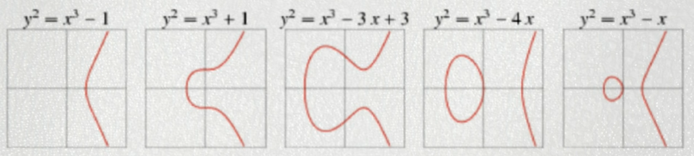
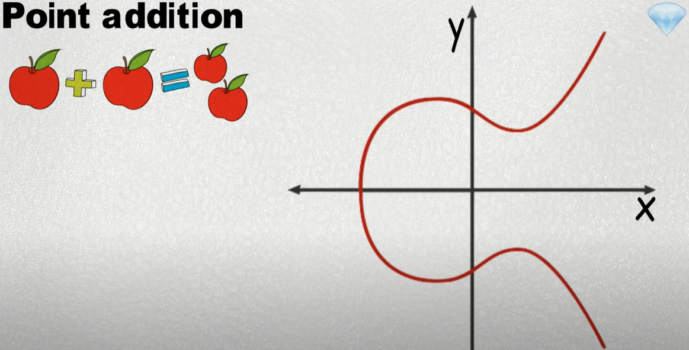
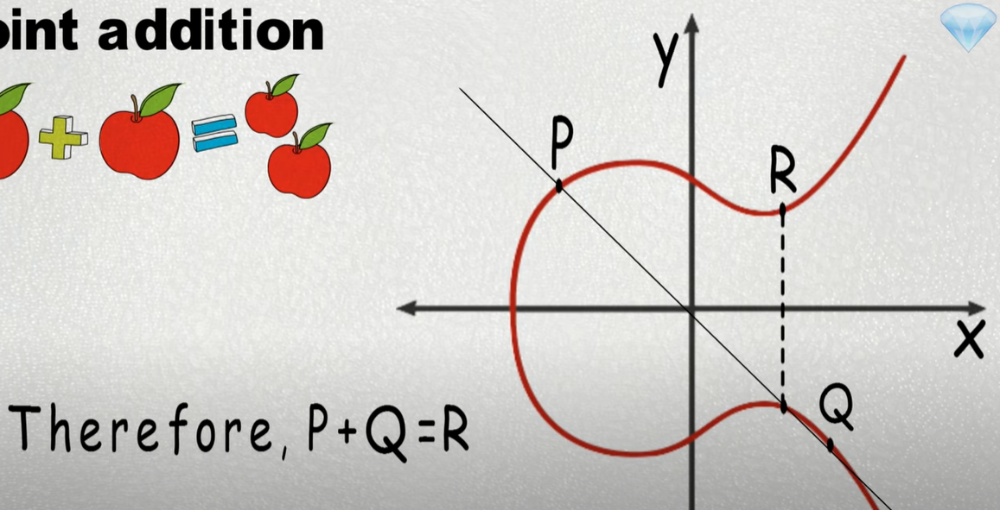
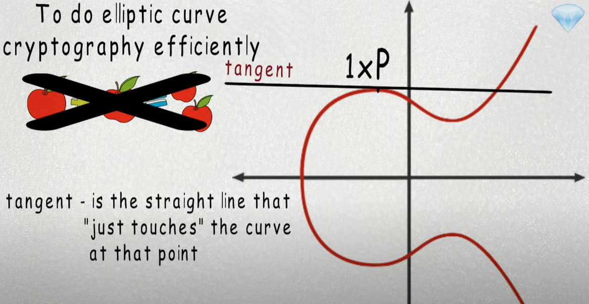
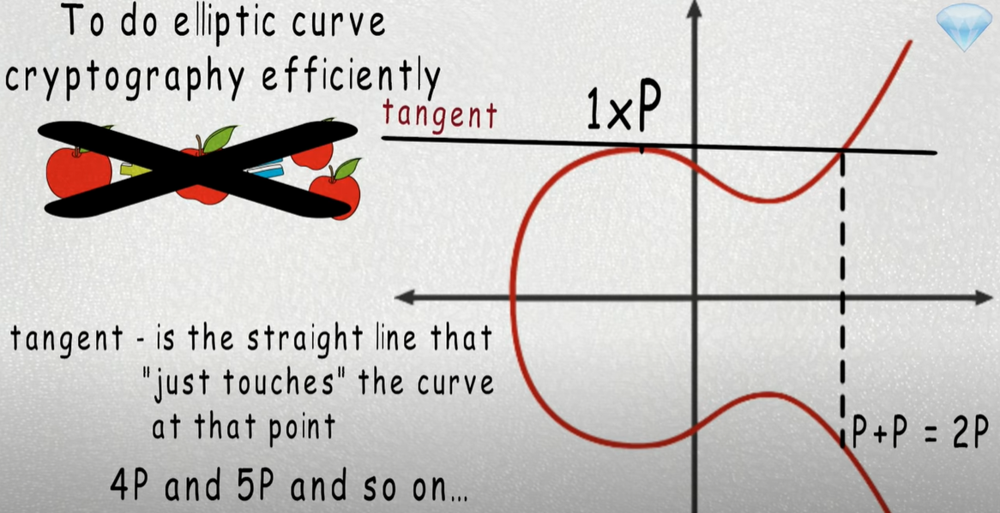
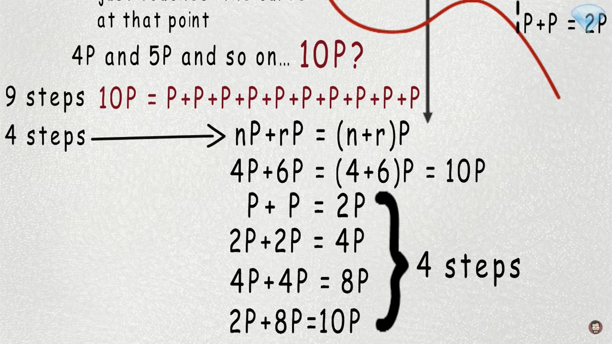

Hey what is up guys

Everyone likes math right?

No?

Well, at least some of us do. Math is very important concept behind bitcoin technology and other cryptocurrencies, especially when it comes to protecting your digital assets. So in this video we will look at the math behind elliptic curve cryptography and how it protects your private key.
Introduction

When someone sends bitcoin to you, they send bitcoin to your address, if you want to spend any of those bitcoins that is send it to your address you create transaction and specify where your bitcoin will go. Such transaction may look like transfer 5 bitcoins from this address to this address. Of course anyone can create a transaction that looks like that.

So if it was added to the blockchain as is without any issues, then you would be out of $35,000 whether you like it or not. Luckily, such a transaction does not belong to the blockchain because it missing a valid digital signature. By adding digital signature, you can prove that you know the private key that corresponds to that address. If you do not know the corresponding private keys, then you probably should not have been telling people to send bitcoin to you via that address since you are unable to spend any of those bitcoins.

When you create a bitcoin address for yourself, you generate private key first, from the private key you compute the corresponding public key, by hashing that public key, you got your address.

Hopefully, you cannot choose the address first and then determine the private key from that. Otherwise you could determine the private key for any address, using this method. wait, what, what is Satoshi's address again?

Public-key cryptography

Public keys, private keys and digital signatures are from the basic components of the public-key cryptography, no matter what mathematical basis is used, to implement public-key cryptography system it must satisfy the following:
    1. it is computationally impossible to derive the private key corresponding to the given public key.
    2. it is possible to prove that one knows the private key corresponding to the public key without revealing any useful information about the private key in the process.

One way to do a public key cryptography is with elliptic curves. Another way is with rsa which revolves around prime numbers, most cryptocurrencies like Bitcoin and Etherium use elliptic curves.

Elliptic curve cryptography

Now the question is what is an elliptic curve? An elliptic curve contains all of the following points that satisfy an equation of the following form: 

  1.  $y2=x3+ax+b$

Let's go back, I don't know eighth grade or whatever, and look at some of the functions of elliptic curves.

First example is  $y2=x3-1$ , if your math sucks and you did not pay any attention in your geometry class, here is how we can draw this function.

We have x-axis and y-axis and we have an equation. Now we are going to plug random integers into x variable to find y. If x equal 1 then x cube also 1, 1 minus 1 equals 0 then y squared equals 0, therefore y equals 0, so when x equal 1 then y equals 0 respectively.

Now, let's say x equals 3 then 3 cubed is 27, 27 minus 1 is 26 then y squared equals 26, therefore y equals $\pm\sqrt{26}$ (plus minus square root of 26) and it equals to $\pm5.01$ (approximately plus minus 5 point 0 1). So when x equals 3 then y equals $\pm5.01$ respectively. 

Now we can plot those numbers. Of course it will be much better to give more integers to x, but we do not have a lot of time, well, you got the idea. 

Here are some examples of elliptic curves. 

Notice all elliptic curves are symmetrical about x-axis. The elliptic curve used by Bitcoin, Etherium and many other cryptocurrencies is called SECP2561. The equation for the SECP2561 curve is $y2=x3+7$ .

This curve looks like this: 

Point addition

You know how you can add two numbers together to get the third one. Well, you can do the same on elliptic curve. You can add two point on elliptic curve together to get the third point on the curve, so add two points on elliptic curves together, you first find the line that goes through those two points then you determine where the line intersects the curve at the third point then you reflect the third point across the x-axis and whatever point you get from that is the result of adding the first two points together.

For example, let's say you want to add the following two points together. First, you find the line that goes through those two points then you find the third point on the curve that line intersects, then you reflect the point across the x-axis, let's call it R, therefore P plus Q equals R.

To do elliptic curve cryptography efficiently, rather than adding two arbitrary points together, we specify a base point on the curve and only at that point to itself. 

For example, let's say we have the following curve with the base point P, initially we have P or 1 multiplied by P (1xP). Now, let's add P to itself. First, we have to find the equation of the line that goes through P. There are infinite search lines. In this specific case we use tangent line. If you do not know what tangent line means, here is the definition: The tangent line to a plane curve at the given point is a straight line that "just touches" the curve at that point.

Now we find the third point that this line intersects and reflected across the x-axis, therefore P adds to itself or P plus P equals to B. We can continue to add P to itself to compute 4P and 5P and so on. 

But how many steps would it take to compute 10P?  It would appear to take 9 steps, because 10P is P add to itself 10 times which requires 9 points addition operations. 

It turns out that we can compute 10P in just four steps. This is because the following property holds four points addition, **n** multiply by P plus **r** multiply by P equals we can take out P and we get **n** plus **r** in parentheses multiply by P.

For example, 4P plus 6P equals 4 plus 6 in parentheses multiply by P, equals to 10p. Therefore, the first way to calculate NP is as follows: P plus P equals 2P, 2P plus 2P equals 4P, 4P plus 4P equals 8P, 2P plus 8P equals 10P which only requires four points addition operations. 

How many steps would it take to compute xP, where x is a random 256-bit integer. In this case, x can range anywhere from zero to very very large integer. It turns out that computing xP would never require more than 510 point addition operations.

I'm just going to give you fast explanation why, at most, the binary expansion of x will contain 256 elements that is up to $2^{255}$ (2 to the power 255), so we won't ever have to add more than 256 points together, therefore, the second step will require at most to 55 points additional operations.
