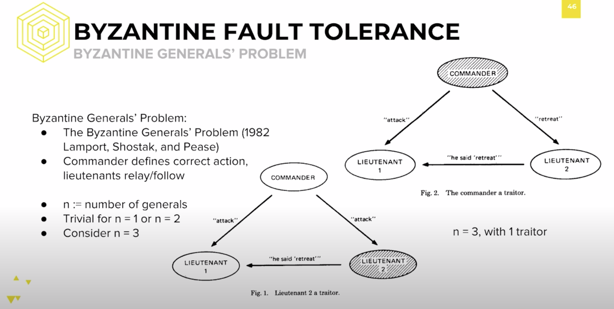
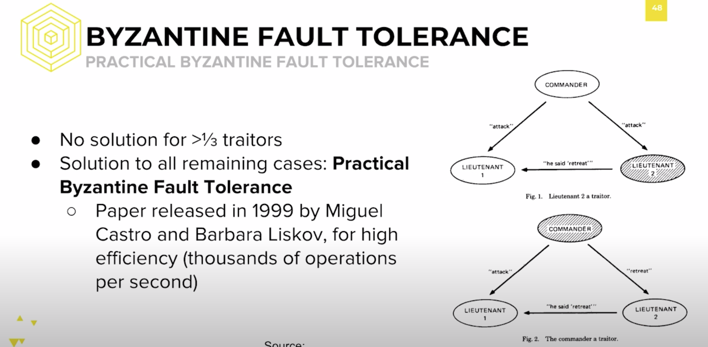
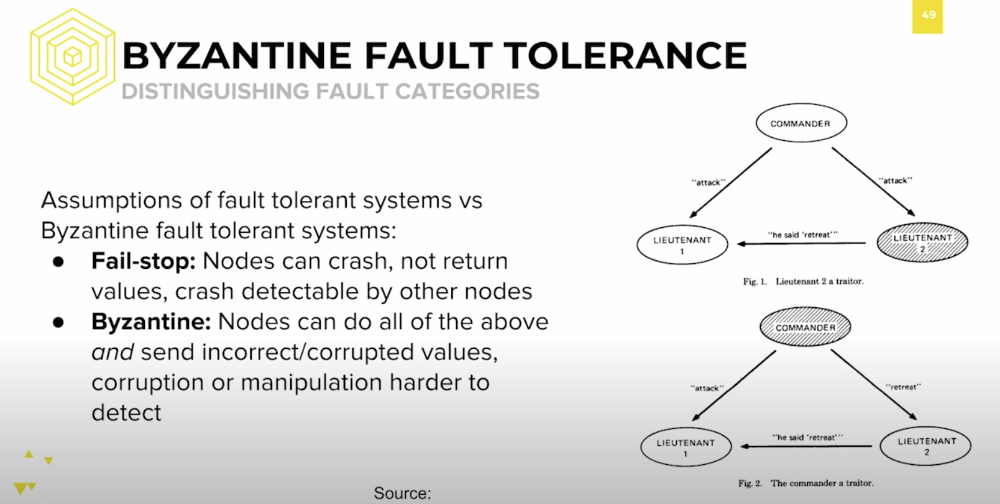
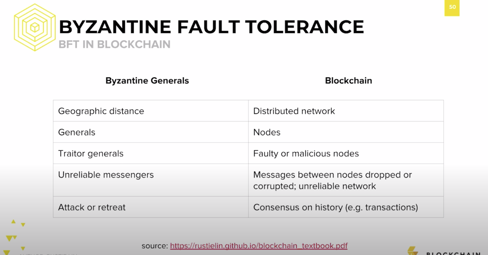

We’ve defined distributed systems, understood the definition of correctness in their context, and understood the various properties and limitations of these systems. We’re now going to finish off by understanding all the possible areas in which these systems can fail, best summarized by the Byzantine Generals’ Problem. 

The Byzantine Generals’ Problem is a question of consensus. Allow me to tell you the story of the Byzantine generals laying siege to an enemy city. They’ve all surrounded the city, but there’s a problem: large physical barriers, like mountains and canyons, separate the generals. They can communicate only by sending messengers. In addition, they had not decided prior whether to attack the city, or to give up and retreat. Only after observing the enemy, do they then decided on a common plan of action. Only an attack launched by all generals at once can successfully conquer the city. 

Having come this far, they send messages with their votes on how to proceed. Okay, you may ask, if they can send messages to each other, then what’s the issue? They just need to collect enough information, right? So what’s the problem? Well, the problem is that some generals may have been bribed. In exchange for their betrayal, they’ll earn themselves a small fortune from the city.These traitor generals will send incorrect information to their peers in order to screw up the attack, preventing consensus. 

In addition, their messengers might get lost or corrupt their messages. The question which remain is: how do we achieve consensus, if we can at all? Spoiler alert: there is no solution in the presence of ⅓ or greater percentage potential traitor generals. We call these potential traitor generals Byzantine nodes, which may act maliciously or arbitrarily. 

In this image, there are two separate triangles. We consider scenarios with 3 generals and 1 traitor, since the case is trivial with just 1 or 2 generals. Let’s say the first general to send out a message is the commanding general issuing commands, and the listening generals are the lieutenant generals. The node on top of the triangle is “Commander,” and the bottom two nodes are labeled “Lieutenant 1” on the left and “Lieutenant 2” on the right. 

The commander casts a vote for either “attack” or “retreat”, and lieutenants record the vote. As you can see in the first triangle, Lieutenant 2 is shaded. This implies, according to our story, it’s a traitor bribed by the enemy. In distributed systems terms, it’s a Byzantine node. Either way, it’s going to send incorrect information to its peers. 

Let’s say the commander votes to “attack,” sending the message to both Lieutenant 1 and Lieutenant 2. Lieutenant 2, to mess things up, tells Lieutenant 1 that the commander said “retreat.” Lieutenant 1 now sees two different facts, only one of which can be true, the commander said attack, or the commander said retreat. 

In the second triangle, the commander is shaded instead. It tells Lieutenant 1 to “attack,” but sends a conflicting message to Lieutenant 2, telling it to “retreat.” Lieutenant 2 dutifully reports to Lieutenant 1 that the commander said to “retreat,” but Lieutenant 1’s problem remains. Notice that, for Lieutenant 1, the information he’s receiving is exactly the same as the previous scenario even though the Byzantine node changed. 

The Commander is telling it to “attack,” but the other Lieutenant claims otherwise. Because these two situations are indistinguishable, the Lieutenant cannot detect which node is malicious. In addition, because there is no clear majority value, Lieutenant 1 cannot decide on a value. With just one Byzantine node out of three, it’s impossible to achieve consensus. 

This example with three nodes extends to any general set of nodes attempting to come to consensus, meaning that consensus with the presence of ⅓ or more Byzantine generals is impossible. If there were a solution that could tolerate more than ⅓ Byzantine nodes, we could use it to solve this much more simple scenario with 3 nodes. Since we know 3 nodes cannot come to consensus with one Byzantine node, we can extend this to a general fraction. However, that doesn’t mean it’s not possible to make an algorithm for the remaining situations. Practical Byzantine Fault Tolerance released in 1999 by Miguel Castro and Barbara Liskov gives an algorithm to allow nodes to come to consensus with no more than ⅓ Byzantine nodes. This paper has inspired many iterations of Byzantine Fault Tolerant algorithms, especially as research into blockchain consensus algorithms continues. Let’s formalize the various types of faults within distributed systems.

There are two main types of faults that are possible. While we can get more detail between the types of faults, these two are the most fundamental to understand. 

The first type of fault is a fail-stop fault. During a fail-stop fault, the node can crash or not return values. Recall that a node’s functionality includes sending, receiving, storing, and processing information. Early research into distributed consensus first aimed to solve these kinds of problems.This kind of failure may be temporary or indefinite, but it will always be easier to handle than the second type of fault. 

A Byzantine fault, referring to the Byzantine Generals’ Problem, is a fault that refers to any arbitrary deviance from the protocol. In other words, not only might nodes stop replying or receiving information, but they might also send corrupted and/or false information. You can note that Byzantine faults are a superset of fail-stop faults. 

The behavior of most attackers, such as that of bribed generals trying to hinder consensus falls under this kind of fault. It is this type of fault that all public blockchains must protect against, since the participants in the blockchain network are unknown and unpredictable. 

Of course, the question after learning all this distributed systems material is, “How does this relate to blockchain fundamentals?” Keep in mind the nature of blockchain. We’ve described it as many things: a technological solution to a social problem, the world’s worst database, and a replacement for trusted third parties. But what is it, in the context of distributed systems? 

Well, a blockchain is simply a data structure governed by a distributed system with an unbounded number of participants in the consensus process and an unknown number of Byzantine faults possible. In other words, it’s the most adversarial environment possible. In spite of the incredibly low amount of restrictions possible, blockchain makes it possible for everyone to come to consensus. Clearly, the distribution of computational power and data storage represents the geographic distance between the generals. The nodes represent generals, and the traitors represent faulty or malicious nodes. The possible dropped packets or messages between nodes represent unreliable messengers, and coming to consensus on whether to include a block or the valid chain of transaction history is the same as coming to agreement on whether to attack or retreat. It’s the same concepts with different names.