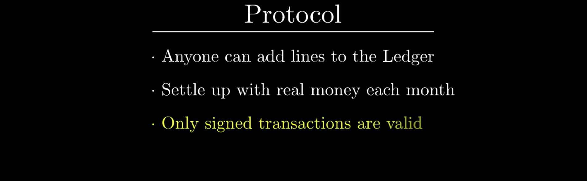
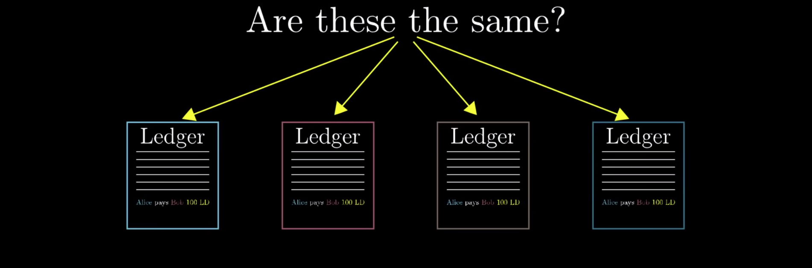
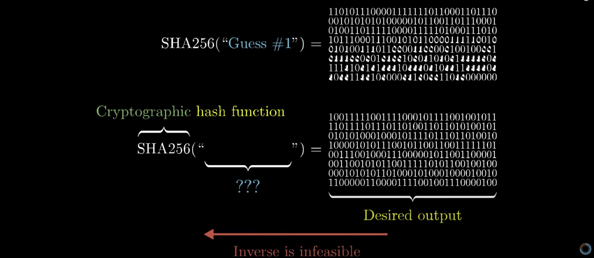

What does it mean to have a bitcoin?

Many people have heard of bitcoin, that’s it’s a fully digital currency, with no government to issue it and no banks needed to manage accounts and verify transactions. And also that no one really knows who invented it. And yet many people don’t know the answer to this question, at least not in full. 

To get there and to make sure the technical details underlying this answer actually feel motivated, what we’re going to is walk through step-by-step how you might have invented your own version of Bitcoin.

We’ll start with you keeping track of payments with your friends using a communal ledger. And then as you start to trust your friends and the world around you less and less, and if you’re clever enough to bring in a few ideas from cryptography to help circumvent the need for trust, what you end up with is what’s called a “cryptocurrency”.

Bitcoin is just the first implemented example of a cryptocurrency, and now there are thousands more on exchanges with traditional currencies. Walking the path of inventing your own can help set the foundation for understanding some of the more recent players in the game, and recognizing when and why there’s room for different design choices. In fact, one of the reasons I chose this topic is that in last year there's been a huge amount of attention and investment and well, honestly, hype directed at these currencies.

And I'm not going to comment or speculate on the current or future exchange rates, but I think we don't agree that anyone looking to buy a cryptocurrency should really know what it is. And I don't just mean in terms of analogies with vague connections to gold-mining, I mean an actual direct description of what computers are doing when we send, receive and create cryptocurrencies.

One thing worth stressing by the way is that even though you and I will dig into the details here and that takes meaningful time, you don’t actually need to know those details if you just want to use the cryptocurrency, just like you don’t need to know the details of what happens under the hood when you swipe a credit card. 

Like any other digital payment there's lots of user-friendly applications that let you send and receive the currencies without thinking about what's going on. The difference is that the backbone underlying this is not a bank that verifying transactions, instead it's a clever system of decentralized trustless verification based on some of the math born in cryptography. 

But to start, I want you to actually set aside the thought of cryptocurrencies and all that just for a few minutes. We’re going to begin the story with something more down-to-earth: Ledgers and digital signatures. If you and your friends exchange money pretty frequently, you know, paying your share of the dinner bill and such, it can be inconvenient to exchange cash all the time. So you might keep a communal ledger that records all of the payments that you intend to make some point in the future.

You know, Alice pays Bob 20, Bob pays Charlie 40, things like that. This ledger is going to be something public and accessible to everyone, like a website where anyone can go and just add new lines. And let's say that at the end of every month, you all get together look at the list of transactions and settle up. If you spent more than you received, you put that money into the pot, and if you received more than you spent, you take that much money out.

So the protocol for being part of this very simple system might look like this: Anyone can add lines to the ledger, and at the end of every month everyone get together to and settle up. Now, one problem with a public ledger like this is that anyone can add a line, what’s to prevent Bob from going in and writing “Alice pays Bob $100” without Alice approving? How are we supposed to trust that all of these transactions are what the sender meant them to be?

Well, this is where the first bit of cryptography comes in: Digital signatures. Like a handwritten signature, the idea here is that Alice should be able to add something next to that transaction, that proves that she has seen it and approved of it. And it should be infeasible for anyone else to forge that signature. 

At first, it might seem like digital signatures shouldn’t even be possible, I mean whatever data makes up the signature can just be read and copied by a computer, so how do you prevent forgeries? Well, the way this works is that everyone generates what’s called a public key/private key pair, each of which looks like some string of bits.

The private key is sometimes also called the “secret” key, so that we can abbreviate it as "sk" while abbreviating the public key as "pk". Now, as the names suggest, the secret key is something you want to keep to yourself. In the real world, your handwritten signature looks the same no matter what document you’re signing.

But a digital signatures is much stronger, because it changes for different messages. It looks like a string of ones and zeros, commonly something like 256 bits, and altering the message even slightly completely changes what the signature on that message should look like. 

Speaking a little more formally, producing a signature involves a function that depends both on the message itself and on your private key. The private key ensures that only you can produce the signature, and the fact that it depends on the message means that no one can just copy one of your signatures and then forge it on another message.

Hand in hand with this is a second function used to verify that a signature is valid, and this is where the public key comes in to play. All it does is output T or F to indicate if this was a signature created by the private key associated with the public key you're using for the verification.

I won’t go into the details how how exactly both these functions work, but the idea is that it should be completely infeasible to find a valid signature if you don’t know the secret key. Specifically, there is no strategy better than just guessing and checking random signatures which you can check using the public key that everyone knows.

Now, think about how many signatures there are with a length of 256 bits, that's $2^{256}$  (2 to the power of 256). This is a stupidly large number, to call it astronomically large would be giving way too much credit to astronomy. In fact, I made a supplemental video devoted just to illustrating what a huge number this is.

Right here, let’s just say that when you verified a signature against a given message is valid, you can feel extremely confident that the only way someone could have produced it is they knew the secret key associated with the public key you used for verification. 

Making sure that people sign transactions on the ledger is pretty good but there's one slight loophole.

If Alice signs a transaction like “Alice pays Bob $100”, even though Bob can’t forge Alice’s signature on new messages, he could just copy that same line as many times as he wants, I mean that message signature combination remains valid.

To get around this what we do is makes sort when you sign a transaction, the message has to also include some sort of unique id associated with that transaction. That way, if Alice pays Bob 100 multiple times, each one of those lines on the ledger requires a completely new signature.

Alright, great, digital signatures remove a huge aspect of trust in this initial protocol. But even still, if you were to really do this, you would be relying on an honor system of a sort. Namely, you’re trusting that everyone will actually follow through and settle up in cash at the end of each month. What if, for example, Charlie racks up thousands of dollars in debt and just refuses to show up?

The only real reason to revert back to cash to settle up is some people, I’m looking at you Charlie, owe a lot of money. So maybe you have the clever idea that you never actually have to settle up in cash as long as you have some way to prevent people from spending too much more than they take in.

May be what you do is start by having everyone pay 100 into the pot, and then have the first few lines of the ledger read “Alice gets 100, Bob gets 100, Charlie gets 100,etc. Now, just don’t accept any transactions when someone is spending more than they already have on the ledger.

For example, if the first two transaction are “Charlie pays Alice 50” and “Charlie pays Bob 50”, if he were to try to add “Charlie pays You 20”, that would be invalid, as invalid as if he never signed it. Notice, this means that verifying a transaction requires knowing the full history of transactions up to that point and this is, more or less, going to be true for cryptocurrencies, though there is a little room for optimization.

What’s interesting here is that this step removes the connection between the Ledger and actual physical US dollars. In theory, if everyone in the world was using this Ledger, you could live your whole life just sending and receiving money on this ledger without ever having to convert to real US dollars.

In fact, to emphasize this point, let’s start referring to quantities on the ledger as “LedgerDollars”, or LD for short. You are of course free to exchange LedgerDollars for real US dollars, for example maybe Alice gives Bob a $10 bill in the real world in exchange for him adding and signing the transaction “Bob pays Alice 10 LedgerDollars” to this communal ledger.

But exchanges like that, they are not guaranteed by the protocol. It’s now more analogous to how you might exchange Dollars for Euros or any other currency on the open market, it’s just its own independent thing. This is the first important thing to understand about Bitcoin or any other cryptocurrency: 

What it is is a ledger?

The history of transactions is the currency. Of course, with Bitcoin, money doesn’t enter the ledger with people buying in using cash, I’ll get to how new money enters the ledger in just a few minutes. But before that, there’s actually an even more significant difference between our currency system of LedgerDollars and how cryptocurrencies works.

So far, I’ve said that this ledger is in some public place, like a website where anyone can add new lines. But that would require trusting a central location. Namely, who hosts that website? Who controls the rules of adding new lines? 

To remove that bit of trust, we’ll have everybody keep their own copy of the ledger. Then when you want to make a transaction like “Alice pays Bob 100 LedgerDollars” what you do is broadcast that out into the world for people to hear and to record on their own private Ledgers.

But unless we do something more, this system is absurdly bad. How could you get everyone to agree on what the right ledger is? 

When Bob receives a transaction like “Alice pays Bob 10 LedgerDollars”, how can he be sure that everyone else received and believes that same transaction, that he’ll be able to later on go to Charlie and use those same 10 LedgerDollars to make a transaction?

Really, imagine yourself just listening to transactions being broadcast. How can you be sure that everyone else is recording the same transactions and in the same order? This is really the heart of the issue, this is an interesting puzzle.

Can you come up with a protocol for how to accept or reject transactions and in one order so that you can feel confident that anyone else in the world who is following that same protocol has a personal ledger that looks the same as yours? This is the problem addressed in the original Bitcoin paper.

At a high level, the solution Bitcoin offers is to trust whichever ledger has the most computational work put into it. I’ll take a moment to explain exactly what that means, it involves this thing called a “Cryptographic hash function”. The general idea that will build to is that if you use computational work as a basis for what to trust, you can make it so that fraudulent transactions and conflicting ledgers would require an infeasible amount of computation to bring about.

Again, I'll remind you this is getting well into the weeds beyond what anyone would need to know just to use a currency like this. But it’s a really cool idea, and if you understand it, you understand the heart of bitcoin and other cryptocurrencies.

So first things first, what's a hash function? The inputs for one of these functions can be any kind of message or file, it really doesn't matter and the output is a string of bits with some kind of fixed length, like 256 bits. This output is called the “hash” or “digest” of the message, and the intent is that it looks random. It’s not random, it always gives the same output for a given input.

But the idea is that if you slightly change the input, maybe editing just one of the characters, the resulting hash changes completely. In fact, for the hash function that I’m showing here, called SHA256, the way the output changes as you slightly change that input is entirely unpredictable.

You see, this is not just any hash function, it’s a cryptographic hash function. That means it’s infeasible to compute in the reverse direction. If I show you some specific string of ones and zeros and ask you to find an input so that the SHA256 hash of that input gives this exact string of bits, you will have no better method than just guess and check.

Again, if you want to feel for how much computation would be needed to go through $2^{256}$ guesses, just take a look at the supplement video. I actually had way too much fun writing that thing.

You might think that if you just really dig into the details of how exactly this function works, you could reverse engineer the appropriate input without having to guess and check, but no one has ever figured out a way to do that. Interestingly, there’s no cold hard rigorous proof that it’s hard to compute in the reverse direction, and yet, a huge amount of modern security depends on cryptographic hash function and the idea that they have this property.If you were to look at what algorithms underlie the secure connection that your browser is making with YouTube right now, or that it makes with a bank, you will likely see a name like SHA256 show up in there. 

For right now, our focus will just be on "How such a function can prove that a particular list of transactions is associated with a large amount of computational effort?". Imagine someone shows you a list of transactions, and they say “Hey I found a special number so that when you put that number at the end of this list of transactions and apply SHA256 to the entire thing, the first 30 bits of the output are all zeros”.

How hard do you think it was for them to find that number? Well, for a random message, the probability that a hash happens to start with 30 successive zeros is $\frac{1}{2^{230}}$, which is about 1 in a billion.

And because SHA256 is a cryptographic hash function, the only way to find a special number like that is just guessing and checking. So this person almost certainly had to go through about a billion different numbers before finding this special one, and once you know that number, it's really quick to verify, you just run the hash and see that there are 30 zeros.

So in other words, you can verify that they went through a large amount of work but without having to go through that same effort yourself. This is called a “proof of work”. And importantly, all of this work is intrinsically tied to the list of transactions. If you change one of those transactions even slightly, it would completely change the hash, so you’d have to go through another billion guesses to find a new proof of work, a new number that makes it so that the hash of the altered list together with this new number starts with 30 zeros.

So now, think back to our distributed ledger situation. Everyone is there broadcasting transactions, and we want a way for them to agree on what the correct ledger is. As I said, the core idea behind the original bitcoin paper is to have everyone trust whichever ledger has the most work put into it. 

The way this works is to first organize a given ledger into blocks where each block consists of a list of transactions together with a proof of work that is a special number so that the hash of the whole block starts with a bunch of zeros.

For the moment let’s say that it has to start with 60 zeros, but later I’ll return back to a more systematic way you might want to choose that number. In the same way that a transaction is only considered valid when it's signed by the sender, a block is only considered valid if it has a proof of work.

And also, to make sure there is a standard order to these blocks, we’ll make it so that a block has to contain the hash of the previous block at its header. That way, if you were to go back and change any one of the blocks or to swap the order of two blocks, it would change the block that comes after it, which changes that block’s hash, which changes the one that after it and so on. That would require redoing all of the work finding a new special number for each of these blocks that makes their hashes start with 60 zeros.

Because blocks are chained together like this instead of calling it a ledger, it's common call it a “Blockchain”.

As part of our updated protocol, we’re now allow anyone in the world to be a “block creator”. What that means is that they’re gonna listen for the transactions being broadcast, collect them into some block and then do a whole bunch of work to find a special number that makes the hash of that block start with 60 zeros, then once they find it, they broadcast out the block they found.

To reward a block creator for all this work, when she puts together a block, we’ll allow her to include a very special transaction at the top of it, in which she gets, say, 10 LedgerDollars out of thin air. This is called the block reward. And it’s a exception to our usual rules about whether or not to accept transactions.

It doesn’t come from anyone, so it doesn’t have to be signed. It also means that the total number of LedgerDollars in our economy increases with each new block. Creating blocks is often called “mining”, since it requires doing a lot of work and it introduces new bits of currency into the economy.

But when you hear or read about miners, keep in mind that what they’re really doing is listening for transactions, creating blocks, broadcasting those blocks and getting rewarded with new money for doing so.

From the miners perspective, each block is like a miniature lottery where everyone is guessing numbers as fast as they can until one lucky individual finds a special number that makes the hash of the block start with many zeros, and get reward.

For anyone else who just wants to use this system to make payments instead of listening for transactions, they all listening for blocks being broadcast by miners and updating their own personal copies of the blockchain.

Now, the key addition to our protocol is that if you hear two distinct blockchains with conflicting transaction histories, you defer to the longest one, the one with the most work put into it.

If there’s a tie, just wait, until you hear of an additional block that makes one of them longer.

So even though there is no central authority, and everyone is maintaining their own copy of the blockchain, if everyone agrees to give preference to whichever blockchain has the most work put into it, we have a way to arrive at decentralized consensus. To see why this makes for a trustworthy system, and to understand what point you should trust that a payment is legit, it’s actually really helpful to walk through exactly what it would take to fool someone using this system.

Maybe Alice wants to fool Bob with a fraudulent block, namely she tries to send him one that includes her paying him 100 LedgerDollars, but without broadcasting that block to the rest of the network.

That way everyone else still thinks that she has those 100 LedgerDollars. To do this, she would have to find a valid proof of work before all of the other miners each working on their own block. And that can definitely happen! Maybe Alice just happens to win this miniature lottery before everyone else. But Bob is still gonna be hearing the broadcasts made by other miners, so to keep him believing the fraudulent block, Alice would have to do all of the work herself to keep adding blocks to this special fork in Bob’s blockchain, that’s different from what he’s hearing from the rest of the miners.

Remember, as per the protocol, Bob always trusts the longest chain that he knows about. Alice might be able to keep this up for a few blocks if just by chance she happens to find blocks more quickly than the rest of the miners on the network all combined. But unless she has close to 50% of the computing resources among all miners, the probability becomes overwhelming that the blockchain that all of the other miners are working on grows faster than the single fraudulent blockchain that Alice is feeding Bob.

So after enough time, Bob just gonna reject what he’s hearing from Alice, in favor of the longer chain that everyone else is working on. Notice that means you shouldn’t necessarily trust a new block that you hear immediately. Instead, you should wait for several new blocks to be added on top of it. If you still haven’t heard of any longer blockchains, you can trust that this block is part of the same chain everyone else is using. And with that, we’ve hit all the main ideas. This distributed ledger system based on a proof of work is more or less how the Bitcoin protocol works, and how many other cryptocurrencies work. There’s just a few details to clear up. Earlier I said that the proof of work might be to find a special number so that the hash of the block starts with 60 zeros. The way the actual bitcoin protocol works is to periodically change that number of zeros so that it should take, on average, 10 minutes to find a block. So as there are more and more miners on the network, the challenge gets harder and harder in such a way that this miniature lottery only has about one winner every 10 minutes. Many newer cryptocurrencies have much shorter block times. All of the money in Bitcoin ultimately comes from some block reward. These rewards 50 Bitcoin per block. There’s a great site called “block explorer” where you can look through the bitcoin blockchain, and if you look at the very first few blocks on the chain, they contain no transactions other than the 50 Bitcoin reward to the miner. Every 210,000 blocks, which is about every 4 years, that reward gets cut in half. So right now, the reward is at 12.5 Bitcoin per block, and because this reward decreases geometrically over time, there will never be more than 21 million bitcoin in existence. However, this doesn’t mean miners will stop earning money. In addition to the block reward, miners can also pick up transactions fees. The way this works is that whenever you make a payment, you can optionally include a small transaction fee with it that will go to the miner of whatever block includes that payment. The reason you might do this is to incentivize miners to actually include the transaction you broadcast into the next block.