This is a blockchain demo, we're going to do this in a very visual way though , I'm going to make it very easy to understand by stepping through the key pieces of what a blockchain is in a visual way. But before we get started we need to take a look at this thing that we call a SHA-256 hash.

OK, a hash this is one of them right here, hash looks like a bunch of random numbers, and essentially what it is it's a fingerprint of some digital data and it just so happens it's the fingerprint of whatever i type in this box, so if I type my name "anders" into this box you see that the hash has changed, matter of fact it changed every time I typed a letter, right?

So I'm go back to,(删掉了多余的，输入变为anders) so it says anders, OK, so this is the hash of the name anders all lower case it starts with 19ea, right? OK, so if i delete that and I go again type "anders" again you can see it starts with 19ea the same exact hash, in that sense it's a digital fingerprint of this data whatever data is here.

Every time you type exactly the same data you get exactly the same hash and i can type anything i want, so I can you can have nothing like this you know e3b0 that's the hash of nothing or you could type tons and tons of stuff, a matter of fact you could put like the Library of Congress in here and you would get a hash, and the interesting thing about it is regardless of there, if there's a tiny amount of information, no information or the entire library of congress you're always going to get a hash that is this long, this many characters.

You're not going to be able to pre guess what this is, you kind of have to put the library of congress in here to figure out what the hash is but you always get exactly the same hash regardless how many times you put exactly the same information in.

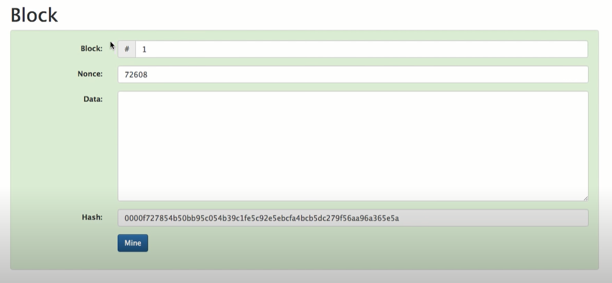

So what I'm gonna do is extend this idea of a hash into something that we're going to call a block. Alright so let's take a look at a block, so this is a block and it's exactly like the hash, it's just that data section I've broken out now into three sections, one called block, this is just some kind of a number, this is block number 1, on nonce which is just yet another number we'll go into what that is in a second and then just some more data just very similarly to the way that we had it before.

However the hash of this which includes all of this information up here is down here and it begins with four zeros, you see that? it's a relatively unusual hash, you know, most of them are not really going to start with four zeros like that but this one happens to, and because it does totally arbitrarily, i'm gonna to say that this block is signed.

OK, so what would happen if I were to change any one piece of this information, let's say if I were to type something here, the hash is gonna to change and what's a chance of if I type letters, this hash is gonna to start with four zeros, pretty low it's probably not, right?

So let's see what happens when I do that, I'm just gonna say "hi", oh look at that, this hash does not start with four zeros and so the big background here is turned to red, so now you know that this block with this information in it is not a valid or assigned block. OK, and that's where this nonce comes in, this nonce is just a number that you can set to try to find a number that fits so that this hash starts with four zeros again.

All right so how do we do that, well let's start with one, that start with now it's 32, so that's not one, let's try two FF now, 3 4 5 6, so actually get the idea like I could sit here all... there's one that starts with 0, I could sit here all day typing these numbers and trying to figure out one that actually is going to hash out to something that starts with four zeros, gonna take a long time.

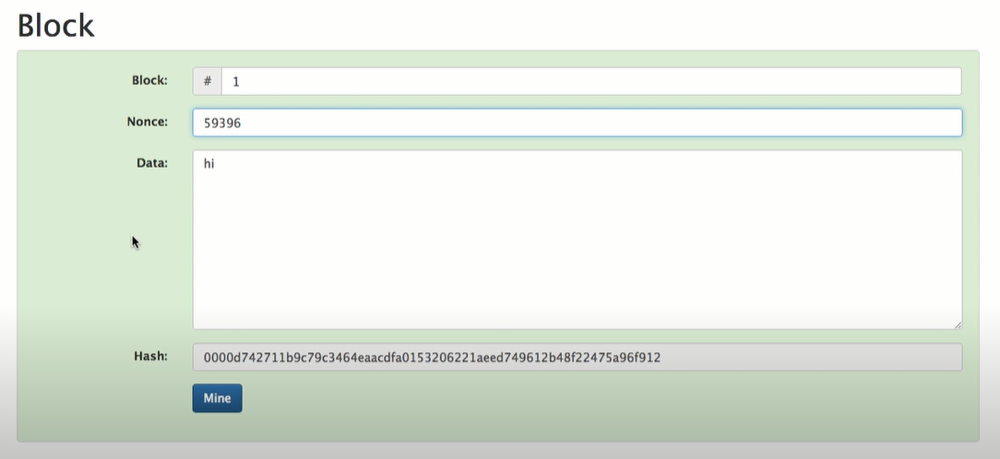

So here I have my little mind but I'm sure you've been wondering what happens if I press that, so what's going to happen when I press this "mine" button, it's gonna to run through all the numbers from 1 all the way up to try to find one where the hash starts with four zeros, in this process is called mining, let's do it right now.

Now, it's checking all of the numbers from 1 all the way up.... look there now it's stopped at 59396 and that one just happens to hash out to something that starts with four zeros and it satisfies my little definition of what a signed block is.

OK, so that's a block, now can you tell me what a blockchain is? It's probably just a chain of these blocks, well, how do you put them together? let's let's do that.

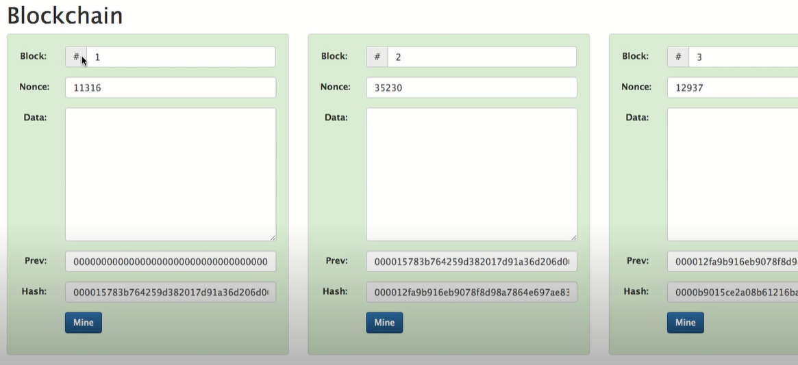

All right, so here is my blockchain, I have block number 1, it has some kind of a nonce just like before, there's some data area too, but that has this previous here, it's a bunch of zeros, let's let's roll forward, this is block 2 and block 3 and 4, this block chain has 5 blocks on it right?

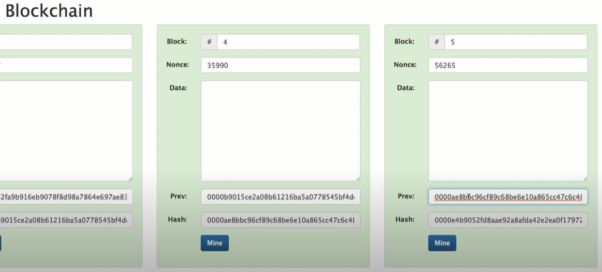

The previous here starts with 0000ae8 is this number ae8, and then this previous you know b90 is this one over here, b90, so you can see that each block points backwards to the one before it, you remember that, that first block over here, there actually is no previous, so it's just a bunch of zeros, it's actually just a fake number.

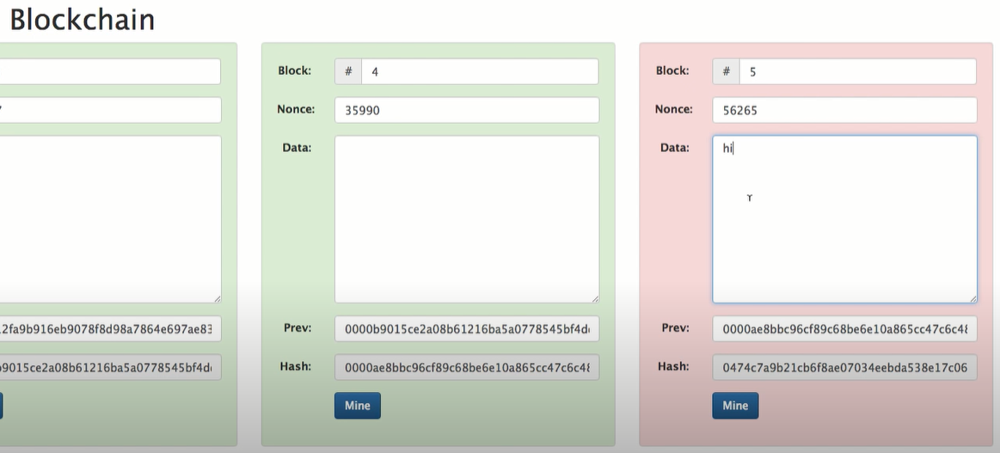

OK, so just like we did before what happens if I change some information here, it's going to change the hash of this block and it's gonna to invalidate it right? Well, let's try that, so I'm gonna to type "hi" again, sure enough that block is invalid, all right, just as we assume, but what would happen I'm gonna to fix that, now we'll go back to something that work, what would happen if I change something in this block (block 4), right?

It's going to change this hash but this hash gets copied up to this previous, so it's gonna it's gonna to change this one too, right? so it should break both blocks, so let me try typing "hi" in there and sure enough, all right? so we can go back as far as we want, you know, to some point in the past and break that block and it will break all the blocks since then, everything before is still green but this one is red, it's, so if i wanted to, you know, change something in this block chain, I could just go over to block number 5 right here

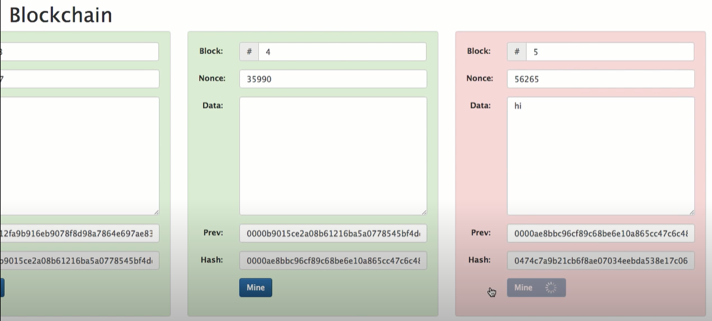

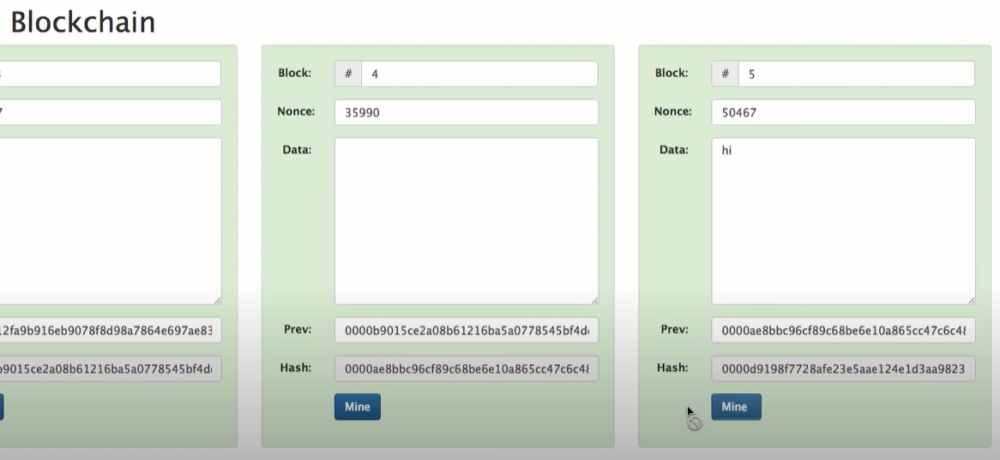

We could change it, I'll put "hi" and then we could remine it, you know, and pick a different nonce, we'll do it right now, and we could essentially alter the chain, so that we should be good down right?

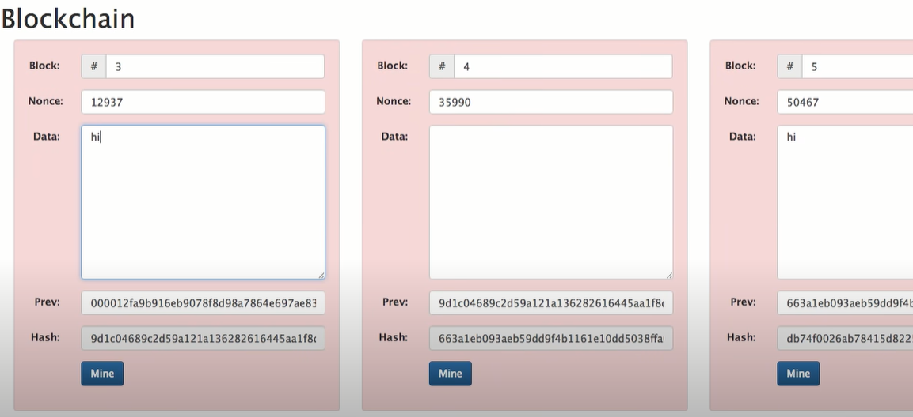

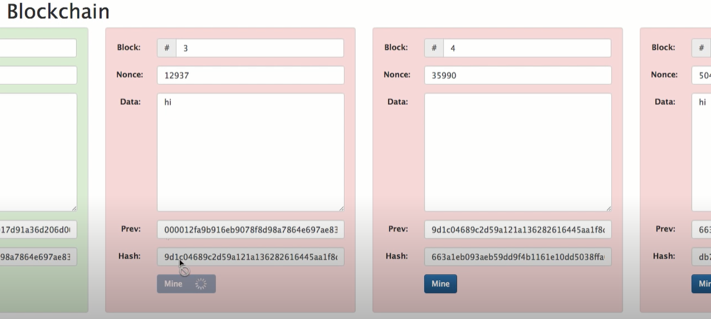

All right ,what happens if i go back in time to here, and I break it here, now I have to mine this block which will pick a nonce that makes this block hash out to four zeros, if we can find one, sometimes it takes a while because it's gotta run through a lot of ....

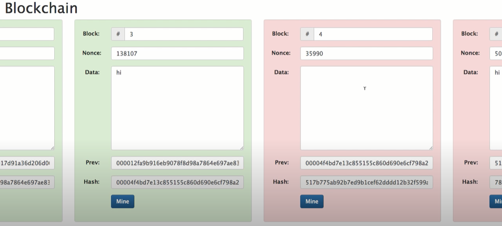

There it is, it found one at 138107, all right but this one (指block 4) is still broken because although this one starts with four zeros, adding the four zeros with different stuff up here still makes this block hash out incorrectly, so I also have to mine this block.

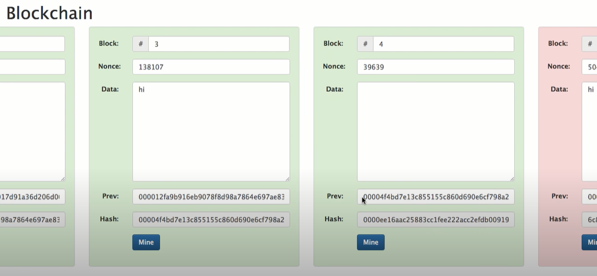

All right and that takes some amount of time, that one was a little bit quicker and then I have to mine this block (指block5) to fix it, all right, so what we're showing here is that if I go and change this last block all I have to do is remine this block, if I go way back in time to back here and I make a change like that (break block1) , I'm gonna to have to mind this one this one this one and this one, so the more blocks that go by the more blocks in the past that we are the harder and harder and harder it is to make a change. And so that's how a blockchain is going to resist mutation, resist change.

OK, so now, you know, if I do this, in this block here you can see that I've changed it to "hi" and remine it blah blah blah, how would I know that my block chain has been remined?

All right, let's take a look at that, I'm gonna hit this little distributed thing, so now we have a just distributed blockchain, it looks exactly like the last blockchain ok? up to five, that but this is peer A, the first peer, if we go down here you can see here is peer B and it happens to have an exact copy of the blockchain there's actually also a peer C down here.

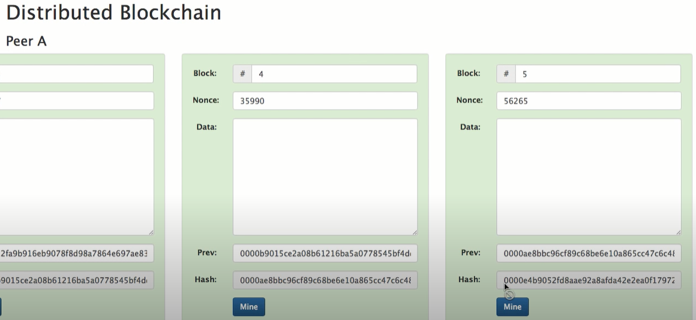

This could go on forever, there's many many peers out on the internet and they all have a complete copy of the blockchain, so in this case if I look at this hash it's 0000e4b right? if I go down to this one (peer B) I notice it also has e4b if I go down to this last one it has e4b.

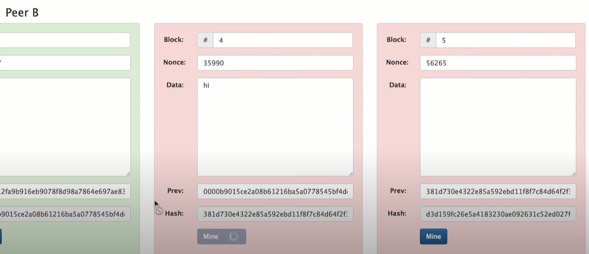

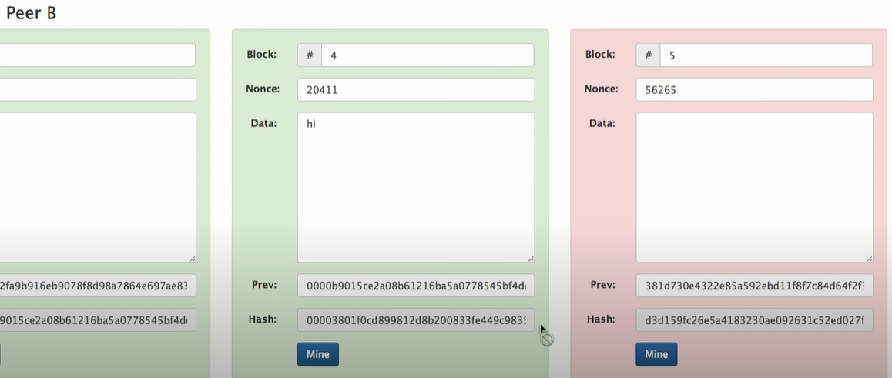

So they must be identical and I'm going to demonstrate that by going here and typing something, I'll type "hi" again and then I will remine this block, I've got some other number, now let's put some other number up here so I should be able to mine this block okay now all the chains are green.

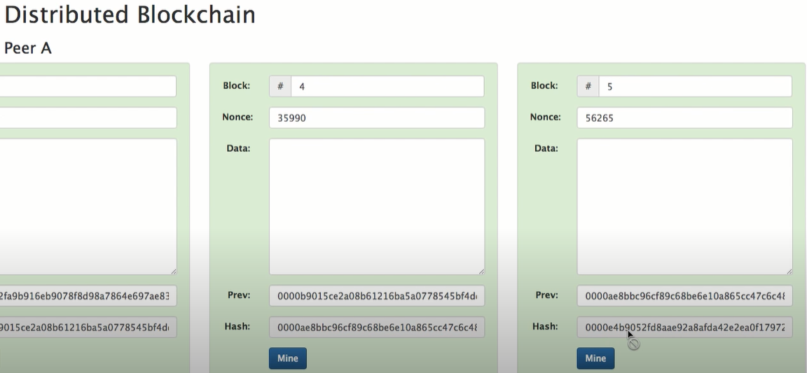

However, this chain says the last hash is e4b the bottom one says that to e4b and this middle one here says 4cae, so I know just by glancing at this one little hash that something is wrong in this blockchain even though all of the hashes start with four zeros, I know that this one is different and it's different because I have two, it's essentially two against one, we are a little democracy here right? this guy argues that it's e4b, this guy argues that it's 4ca and this one is e4b, so e4b wins, so that's how a completely distributed copy having a copy on many different computers they can all very quickly see if all of the blocks are identical.

Remember blockchains can have, you know, 4 500,000 blocks very easily so rather than checking through all of them, all you really have to do is look at the hash of the most recent one and you can see that if anything in the past, anything way back here was altered, you can tell by looking at this, at the last block in the chain.

You know, it's going to hash out to something that doesn't start with four zeros and looks very different from what the hash is on the good chains are. OK, so that's a blockchain, that's the entire thing, there is no more to it than that but it's kind of not really useful.

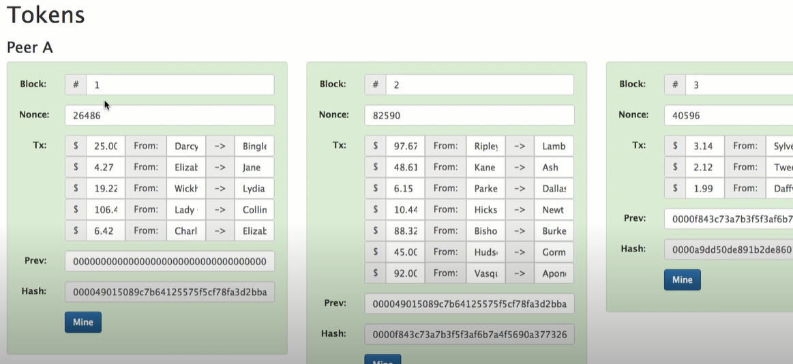

Because we don't have some something in this data area that means anything I keep typing, my name or hi and that's kind of that's sort of irrelevant information so what we really want is a token.

So let's do a token on our blockchain, all right now look at this, so I have this token just totally arbitrarily, I'm calling these, I guess dollars right? so we have 25 dollars from Darcy to Bingley, 4 dollars and 27 cents go from Elizabeth to Jane, you get the idea, it's basically there's all these transactions that are happening and I've just replaced the data with these transactions and just like we saw before, you know, so there's multiple blocks here, this one has more transaction, it doesn't matter how many transactions there are, there can be many or there can be few or none.

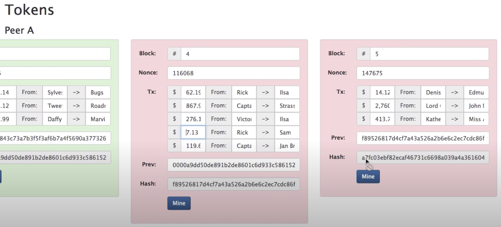

If we keep going forward here just like we saw before, if we go down and we notice we have all these other copies of the same block chain right? so now here's where the immutability is important. If I change something back here, you'll notice that this is you know a7fc blah blah blah, it's something else.

So it's something different than what's down here (和peer B相比), so in this way, I mean it's very important that if I were to go back in time and change some value that we would notice, it's very important with money that you don't lose track and that's the whole point of using a blockchain here, this is a whole point of resisting any kind of modifications, you know, of things that have happened in the past.

So that's the reasoning behind having using a blockchain to remember tokens, now one thing I would mention here is that we're not listing, you know, Darcy has 100 dollars and he's giving 25 of it to Bingley. The only thing we're saying is Darcy gives 25 to Bingley. We're not remembering a bank account balance, we're only remembering money movements.

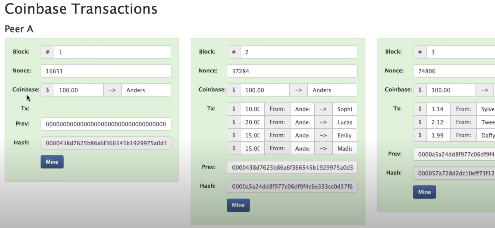

So this begs the question "does Darcy have 25?" Well we have a problem here, in this version of the blockchain: we don't actually know if Darcy has 25. So let's look at a coinbase transaction. So if we look back here, a coinbase, we're going to add a coinbase transaction to our blocks and this is very similar to what we've seen before but we're just adding a coinbase at the top and what that's saying is we're going to invent a 100 dollars out of thin air and give it to Anders.

There's no transactions in this block because nobody had any money previous to this. In the next block another 100 dollars comes out of nowhere and goes to Anders, I'm a fan I love it right, I'll take a 100 bucks, now we have some transactions you can see that they're all from Anders, they're all from me because I'm the only one who has any money at this point.

So I'm sending 10 of my dollars to Sophie. Do I have ten dollars? Yeah, I do, I look back and I see that this coinbase transaction has given me 100 so I have at least 10 and I can send it on and you add all these up and they don't go over 100 and it follows sort of a basic rule of a currency that you can't invent it out of thin air, you can't create money out of thin air, it's dispersion is controlled.

So now if we look at this blockchain that we've created and we step forward in time and we notice that we see that Jackson is giving Alexa 2 dollars and so does Jackson actually have 2 dollars to give Alexa? Well, we go back a block before, we see that Emily had gotten 10 (这里应该是15) dollars from Anders, gave 10 to Jackson and so Jackson does have the money, so we can just go backwards and and find that out.

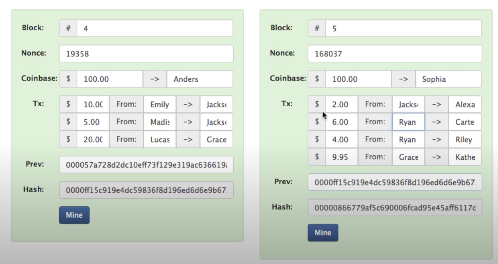

That's actually one of the benefits of having a "Prev" here, it's easy to go backwards, we just look for the block that looks like that that has that hash, and here it is, right here, so you points to blocks back in time and allows us to trace the provenance of any coin that we want.

So that's a basic block chain and we're running a currency on top of it and as you know blockchains are, there many copies, everybody has a copy of it, so if we mutate, you know, this and make it six dollars these go invalid it does not agree with with these block chains down here, these copies of the same block chain down here.

So this resist tampering which is what you want for a currency, it works very well for things that are small and transactional like this, and they're just a very efficient way to handle agreement on what has happened in the past, as kind of this immutable history that goes down with time, so that's a basic blockchain and a token on it.

There we're glossing over some main points but if you dig into the demo and and click through these things and play around with it you get a better and better idea of how this works, there will be a part 2 where we go into a little bit more detail about how the transactions are created, till then.