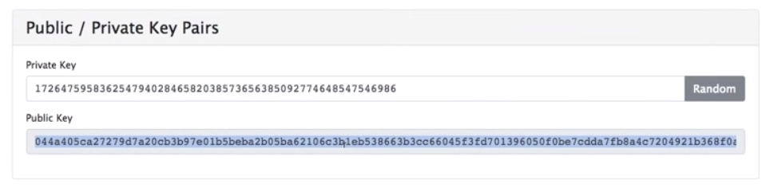
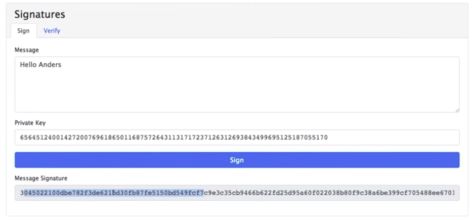
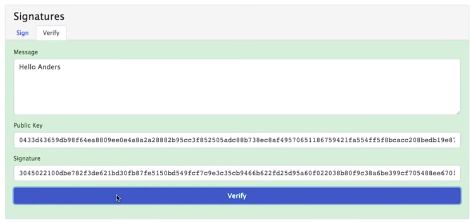
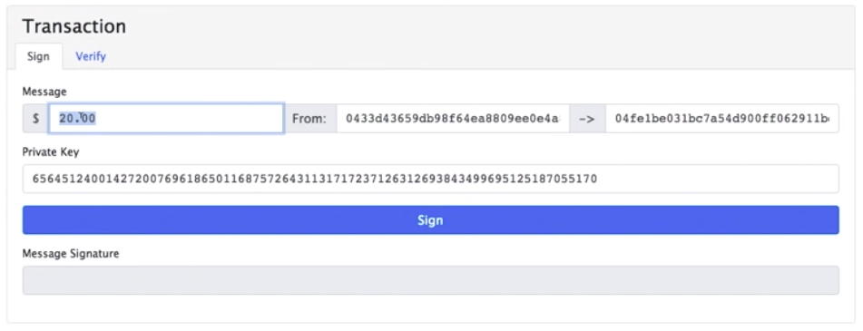
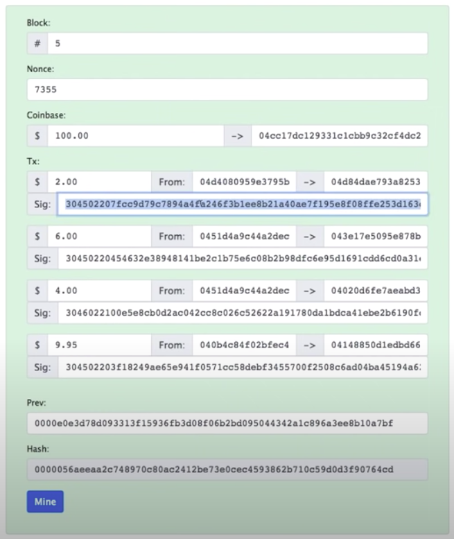
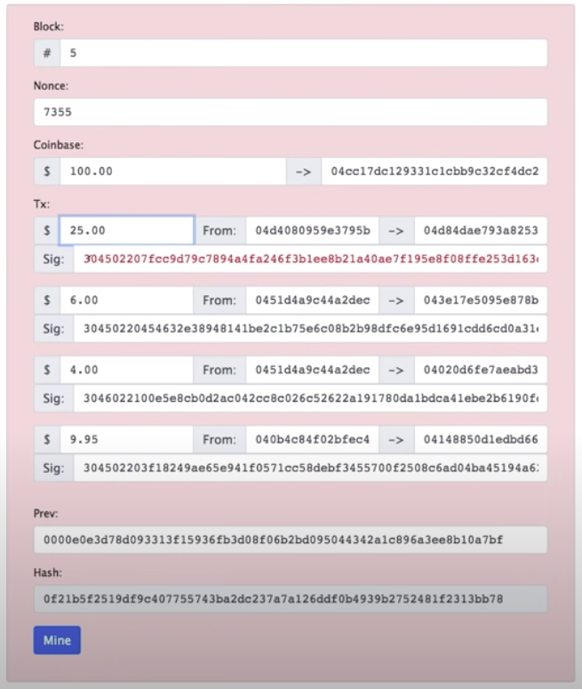
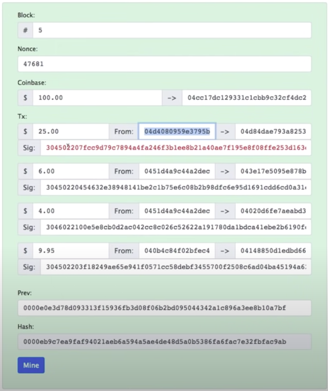

Welcome back, Last time we looked at a blockchain and how it works, particularly in the financial context and we have these transactions that we were creating that move money from one person to another.

But there's a big problem with this and that is what's to stop somebody from just adding a Transaction that spends all of someone else's money to them. There's seems to be no protection here for that, so what we're gonna do is, we're gonna look at ways to add transactions to a blockchain that keep it so not just anyone can create these transactions.

In order to do this, we need to look at another cryptographic primitive and that is public private key pairs, and then we'll use that for signatures, so let's take a look at that right now. So here's a public/private key pair, the private key here It's just, you know, It's a really really long number and any number is a private key right? you could make this be 1, 1 is a private key, It's not a very good one, lots of people have thought of the number one before, but you could, you know, you could pick some really really long number and it's sort of a random number and we can use that as a private key.

Now, You can see every time I'm adding digits here its recomputing the public key that relates to that private key, and that's why the stuff down here starts changing, so as the name would imply, this private key is to be kept private, only you have this private key and you never tell it to anyone else. OK, and just as the name implies, public key, the public key here, you just tell everyone this is something that you want everybody to know.

This is something that there's no harm in letting everyone know, there is not a way to derive from this public key what the private key is. OK, so it's just a kind of a public version of this private key that does not reveal what the private key is. OK, so I'm gonna hit my little random number generator, so I get a nice really long private key and it's not something, you know, where the numbers are close together where I typed on the keyboard, it's something a little bit more random looking. And then the system has derived a public key from this, so this is going to be my private key, and I'm gonna use this to do signatures. So let's do that right now.

So, here's a message signature, so here is a message. I'm gonna type, you know, "hello Anders", that's me and I have my private key here 656 whatever it is, it's my private key, only I have that and here's the message that only I have. And I can hit sign and come up with a message signature here, now this message signature I can pass to someone else.

I'm gonna hit my little verify button, I'm gonna pass this message signature to someone else, to anybody else, OK, now of course they don't have my private key because I keep that private, nobody else can see that. But I publicize my public key and they know that, everybody knows that this is my public key. So given this message and everybody knows my public key and given the signature that I just made, you should be able to verify this.

Now, of course if I hit verify, sure enough the screen goes green, this is a valid message and I have verified that whoever signed this message and came up with a signature had access to the private key behind this public key.

Okay, and if I have kept that private key secret that must be me. OK, so that's a message signature and how you can sign something and verify it. Now, instead of just using this freeform text box let's put some structure around this.

I'm gonna make a transaction here instead, all right? This is similar to what we saw before, the message I'm gonna say is, I'm gonna send 20 dollars from this, happens to be my public key to somebody else's public key, whoever, this is that I'm sending money to, okay?

I of course because I'm Simon smashes. I have my private key, I never tell anybody the private key, but I can use this private key to sign this message which consists of these three things up here. And if I hit "sign", I get a message signature, now I send this whole thing out, I send out my message and my signature to somebody else and they know that I'm trying to send 20 dollars from my public key to this somebody else's public key, you'll notice this little blue box around the from public key, that suggests that you can check this signature against this public key to see whether or not the private key behind this public key actually sign this message.

So let's hit verify sure enough it verifies, so I know that the person in possession with the private key behind this public key must only beyonders are sending 20 dollars to some other public key.

OK, now, let's use this in the blockchain, let's go back to the blockchain case where we're looking at before. Now, you'll notice a couple of different things here. First of all, there's not names here anymore, there are just public keys in the "from" and the "to", and you'll also notice that I added a signature section here.

OK, so In this case, this is public key sending 2 dollars to this public key, and here's a message signature that says that it is what happens if I change this to you know 25 dollars. OK, of course it broke the block but it also broke the signature, the signature is not verified and that's why the signature is turning red.

So, wow, we couldn't press the little mine button, you know, a miner could take this altered block and remine this block. They're gonna end up with something where the block is signed which should eventually happen, and there we go, and the signature though is still invalid, because the the minor has no... they don't have my private key, they only have my public key, so they can't come up with the right signature.

OK, so that's the way we can make sure that the message this transaction here was posed by the person that had the money and only that person not just anyone else on the Internet. So that's how public private key pair message signing is used to protect transactions and make sure that they are from the people that they proposed, that they're from.

Now if you think about it, it actually works really well because in order to create a new address, a new public key, the only thing you have to do is go back and come up with a new private key, a new random number. You didn't have to go to a Centralized Authority (CA) to come up with a public/private key pair, you know, you just make up a private key and you use it, you derive the public key from it and you put that out there and that's how people can pay you.

So that's a blockchain, and again it's a financial context all successful production block chains that are distributed use a token of some sort so they did they're all they'll have a financial context, so that's you know how a blockchain will work, I mean I have glossed over a couple of the details but for the most part, the the overall idea here that you're looking at is very similar to the way that Bitcoin works and many other cryptocurrencies as well, so that's a blockchain.