So Bitcoin and Etherium are two of the most popular cryptocurrencies out there, but have you taken the time to look at how they compare, how they're similar and different in a variety of different aspects like their origin, monetary policy, scripting language, how they handle network upgrades and so forth.

Well if you haven't, then this video is for you whether you are a newbie or someone who's been around the space for a while but hasn't taken the time to really dive in and compare Bitcoin to Etherium. And if you want to learn all about this topic, then sit back, relax and just keep on watching.

Hi everyone I'm kevin from Bitcoin for Beginners. This channel is all about learning with no frills nor fluff. So this video is a little bit longer than other ones, so I will leave the timestamps down below for your viewing pleasure also while you're watching this video. If you find anything helpful whatsoever, you can support us by smashing like button subscribing down below, hit that notification bell and let's get started in Bitcoin vs Etherium.

So these two coins have been the top two coins by market cap for the majority of the past few years, many people like to compare these two projects, but although they have some similarities, they have more differences in similarities. It's kind of like comparing apples to oranges. So, let's take a look at all of these.

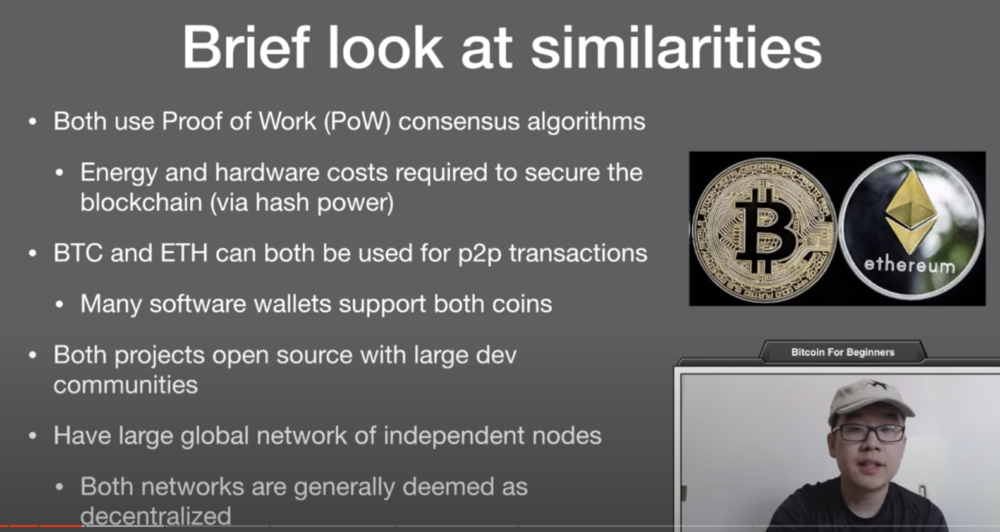

First, a brief look at their similarities. Both use proof of work consensus algorithms right now, and what this means is that you have to invest energy and hardware costs in order to secure the blockchain, the mining and hash power per se, BTC and ETH can both be used for p2p transactions. Many software wallets support both of these popular coins. Both projects are also open source with large developer communities. They also have a large global network of independent nodes and are generally deemed as decentralized.

But now, let's get to the differences starting with origin. Bitcoins origin came in 2009 with Satoshi Nakamoto published the white paper. No fundraising was done whatsoever and miners had to mine on the bitcoin network to receive the very first bitcoins, Sotoshi himself, around 1 million bitcoin, and this is supposed to be the largest amount for any single owner, however, he never spent any and disappeared from the internet without anyone knowing his identity.

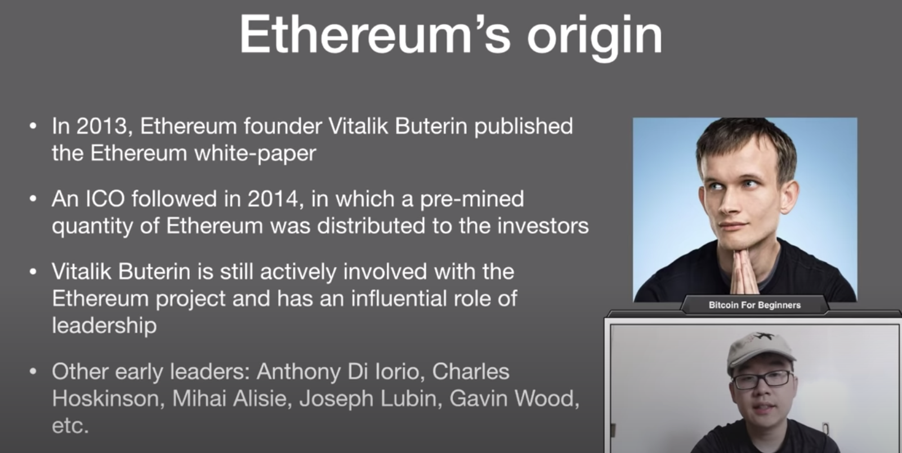

Ethereum on the other hand, its origin story happened in 2013, when founder of Vitalik Buterin published the etherium white paper, an ICO followed in 2014, in which a pre mined quantity of ethereum was distributed to investors who mainly invested with Bitcoin. Vitalik Buterin still actively involved with a Ethereum project and has an influential role of leadership, other early leaders include the Iorio, Hoskinson, Alesie, Lubin, Gavin, Wood and so forth.

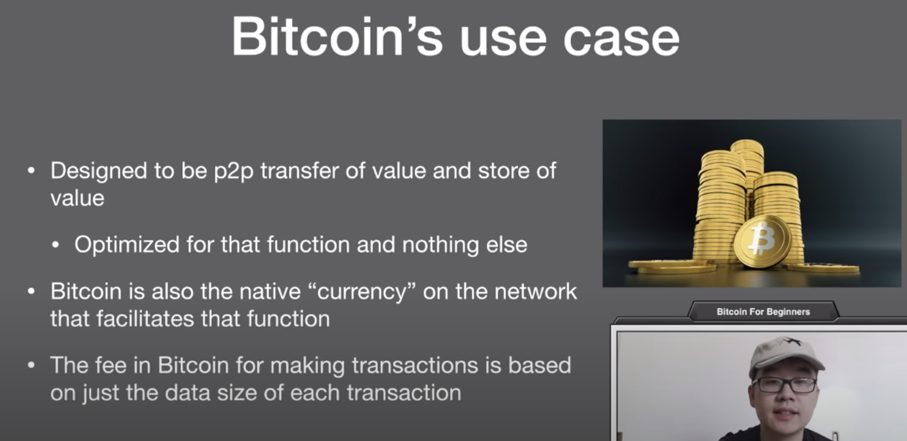

Now, let's take a look at bitcoins use case. It's designed to be a peer-to-peer transfer of value and store of value. It's optimized for that function and nothing else. Bitcoin is also the native currency on the network that facilitates that function. The fee in bitcoin is for making transactions, and that's just based on the data size of each transaction.

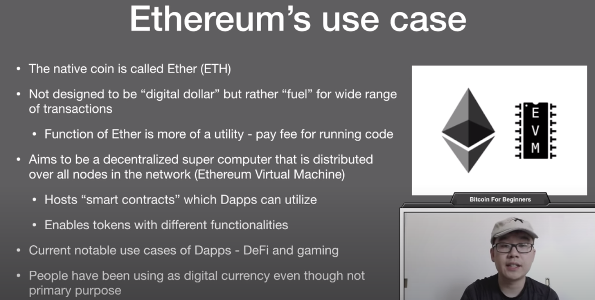

Ethereum on the other hand, its native coin, it's called ether or ETH. It's not designed to be a digital dollar per se like bitcoin, but rather fuel for a wide range of transactions and functions. The function of ether is more of like a utility, you pay a fee to run the code on the network. Ethereum aims to be a decentralized world computer that is distributed and nodes all across the network, and this is called the Ethereum Virtual Machine. It can host smart contracts on which decentralized apps can use function and also it enables tokens like ERC20 tokens with a lot of different functionalities in their own apps. Current notable usages of the apps include decentralized finance and also gaming. People have also been using ether as a digital currency, even though that's not its main purpose.

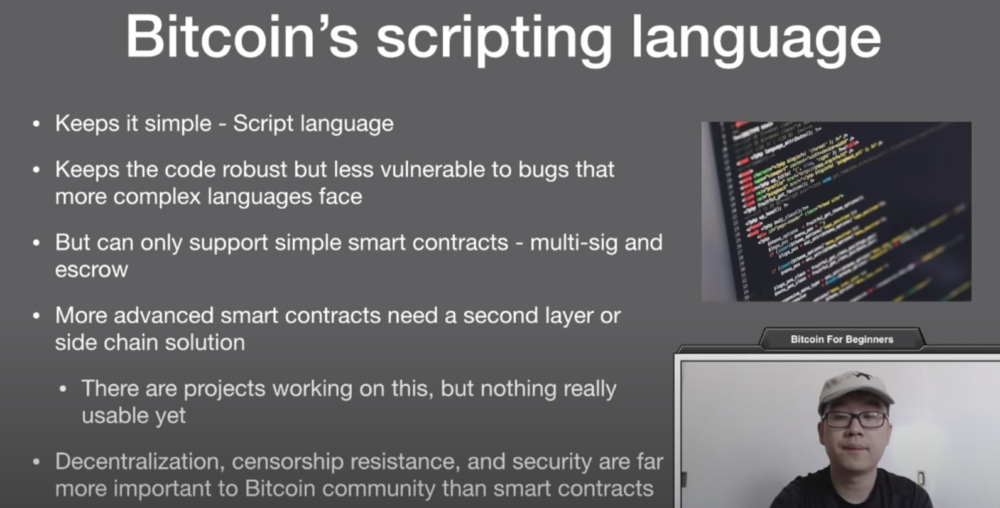

Now in terms of scripting language, Bitcoin keeps it simple, it uses the script language. This keeps the code robust, but also less vulnerable to bugs that the more complex languages face, but on the other hand, this means it can only support simple smart contracts like multi-sig and escrow. More advanced smart contracts on Bitcoin is doable, but they need a second layer solution or a side chain solution. Now there are projects working on this, nothing really tangibly implemented yet, but even though Bitcoin can't handle powerful smart contracts, that's okay, because its main focus and the whole community thinks so as well, is on the centralization, censorship resistance and security. These are of the utmost important to the Bitcoin community.

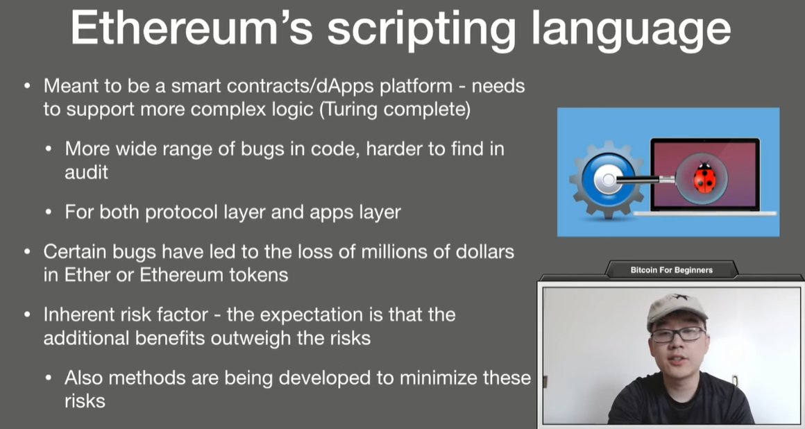

Ethereum scripting languages design with its purpose in mind, Ethereum meant to be a smart contracts and decentralized apps platform. This means it needs to support more complex logic, Turing complete is the technical word for it. This means that there can be a more wide range of bugs in its code and harder to find in such an audit for both the protocol layer and the apps layer. Certain bugs have led to the loss of millions of dollars in ether or Ethereum tokens. So there is this inherent risk factor right, but the expectation is that the additional benefits of this powerful logic outweigh the risks. Also, there are methods being developed by the Ethereum space to minimize these risks, so keep that in mind as well.

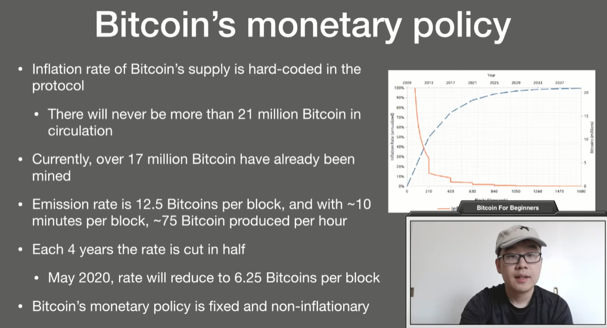

Now, let's take a look at monetary policy, the inflation rate of Bitcoin supply is hard-coded into the protocol. There will never be more than 21 million bitcoins in circulation. Currently over 17 million bitcoin have already been mined and the emission rate is 12.5 bitcoins per block and with roughly ten minutes per block, this means 75 bitcoin produced per hour. Roughly speaking each 4 years the rate is cut in half. This is called the halving or happening, and in May 2020 the rate will be reduced as 6.25 bitcoins per block. Bitcoins monetary policy is considered to be fixed and non-inflationary.

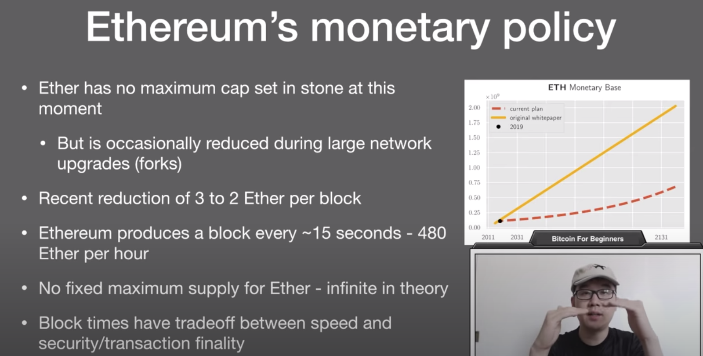

Etherreum, on the other hand, is different. It has no max cap set in stone at this moment, but it's occasionally reduced during large network upgrades or forks per se. There was a recent reduction of 3/2 ether rewards for block and Ethereum produces the block roughly every 15 seconds, this equates to 480 ethers per hour. There's no fixed maximum supply for ethers, so it is impotent in theory, always going up. But do know, just a short discussion, that's in terms of block times, why would you choose something less, like a few seconds compared to Bitcoin which is like 10 minutes? There are tradeoffs between speed and also security/transaction finality, so, depending on the use case of your cryptocurrency there's an optimal line for that lover.

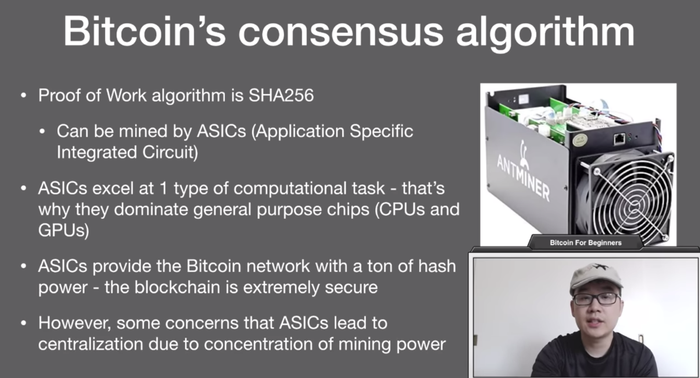

Terms of consensus algorithm, Bitcoin's proof of work algorithm is SHA-256. This can be mined by ASICs or what you see on the right Application Specific Integrated Circuit. ASICs are meant to do one specific type of computational task and that's it, that's why they can dominate general purpose chips like cpus or gpus, and in the case of Bitcoin ASICs they're built for mining, their algorithm better than anything else. ASICs provide the Bitcoin network with a ton of hash power and this means the blockchain is extremely secure, it would take a lot a lot of resources for someone to a 51% attack. However, there are some concerns that ASICs lead to decentralisation due to the concentration of mining power. However, this is debated and disputed within the community.

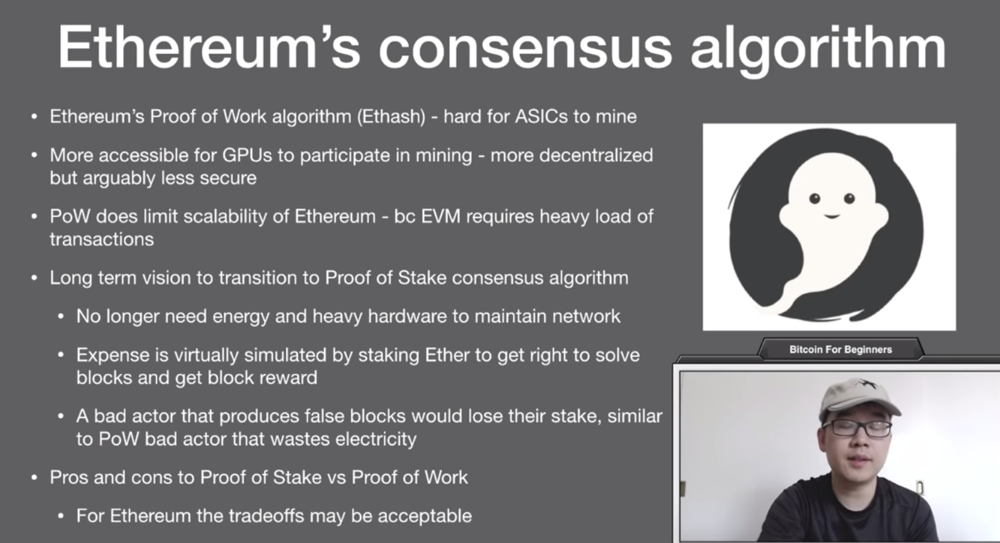

Ethereum on the other hand, it's proof of work algorithm is called Ethash, and this is designed to make it hard for a ASICs to mine. They make it more accessible to GPUs what you have in your computer to run graphics per se to participate in mining, this is more decentralized approach for arguably less secure. Proof of work does limit the scalability of Ethereum, and if you think about it, the Ethereum Virtual Machine, this world supercomputer requires a heavy load of transactions and complex logic, right? So the long term vision has always been to transition to proof of stake consensus algorithm. This means you no longer need energy and heavy hardware to maintain the network. Instead, the expense is virtually simulated by staking ether to get the right to solve blocks and get the block rewards. Now, a bad actor that produces false blocks will lose their stake, similar to the proof of work bad actors that wastes electricity, they lose the money that he spent in the electricity by trying to produce false blocks. There are pros and cons to proof of work and proof of stake outside the scope of this video, but let me just say that for Ethereum, the tradeoffs may be acceptable.

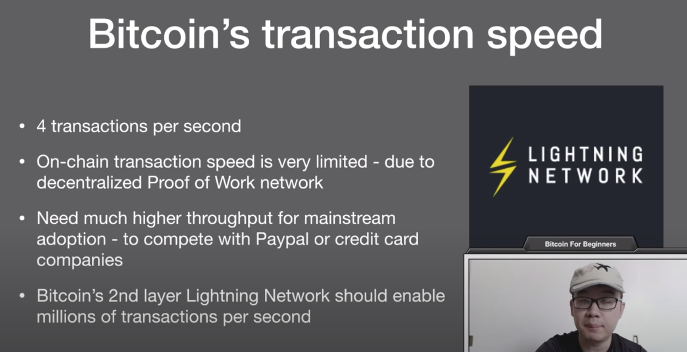

Terms of bitcoins transaction speeds. It has 4 transactions per second and the on-chain transaction speed is very limited. This is due to the decentralization of the proof of work network. Now we of course need higher throughput to achieve mainstream adoption right? to compete with Paypal or credit card companies, this is true peer-to-peer electronic cash. Now Bitcoin's second layer, lightning network, should enable millions of transactions per second and fit the bill.

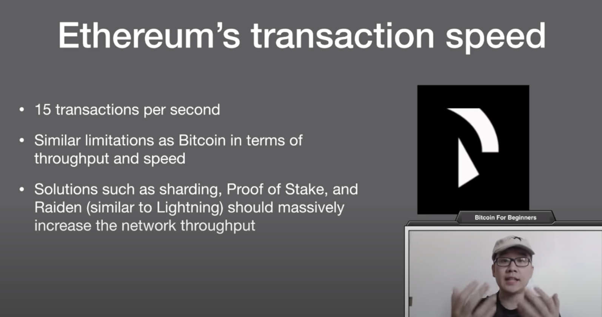

Ethereum on the other hand, is a little bit faster at 15 transactions per second, but it does have similar limitations to bitcoin at the end of the day, they also have solutions in the work like sharding, proof of stake, raiden, which is similar to Lightning, and these should massively help increase in network throughput.

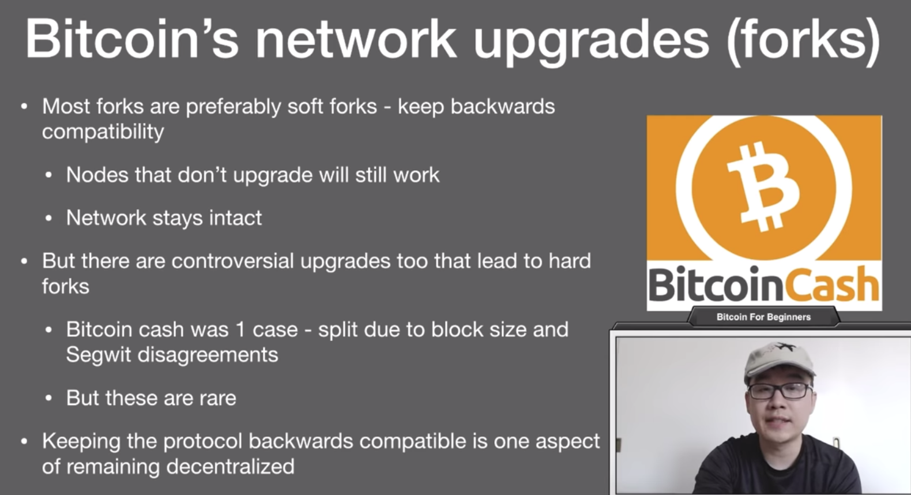

In terms of network upgrade or what we know better as Forks(分叉), most forks in the Bitcoin world are preferably soft forks. This keeps backwards compatibility, this means that nodes do not have to upgrade their software and they will still work fine and the network stays intact. But there are controversial upgrades that do lead to a hard fork. Bitcoin cash was one case, a split due to the block size and Segwit disagreements. But these are indeed rare in the Bitcoin space. Keeping the protocol backwards compatible is one aspect of remaining decentralized and that is why it's a focus and priority in the Bitcoin world.

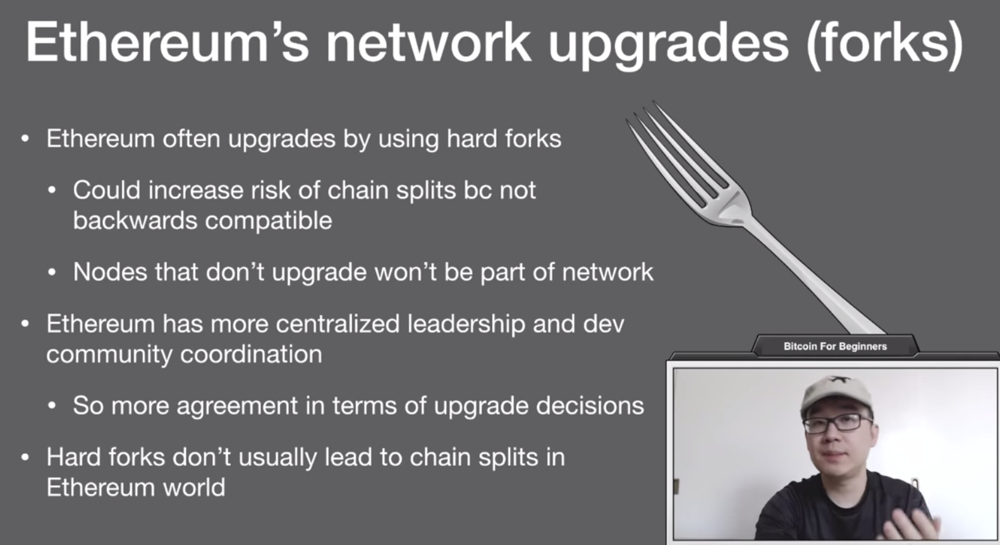

Now for Ethereum, Ethereum is often upgraded by hard forks and this could increase the risk of chain splits, because these are not backwards compatible and you have to upgrade. Nodes that don't upgrade won't be part of the network. Now Ethereum does have more centralized leadership and the developer community coordination. So there's more agreement in terms of upgrade decisions, what this means is that hard forks don't usually lead to chain splits in terms of the Ethereum world.

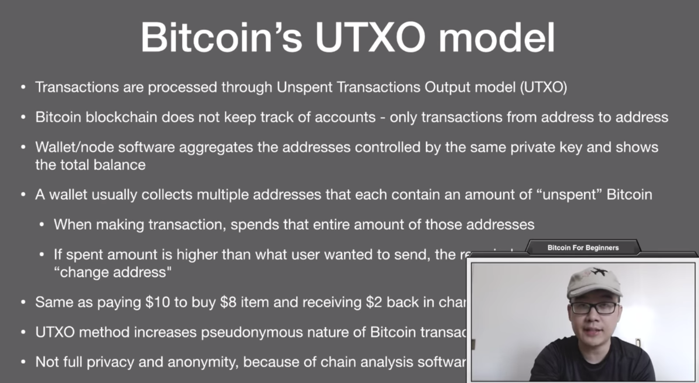

Now, in terms of transaction models, Bitcoin has one that's called the unspent transactions output model or UTXO which you might have seen in various articles around. Now the Bitcoin blockchain does not keep track of accounts, it only tracks transactions from address to address. So the wallet/node software kind of aggregates the addresses controlled by the same private key. Remember, one private key can control a bunch of different addresses and show the total balance that you have. A wallet usually collects multiple addresses that contain an amount of unspent bitcoin. So when you make a transaction, you spend the entire amount of those addresses. Now, if spending that amount means that you sent higher than what you really wanted to send, then the remainder is sent to a "change address”. You can think of this as paying 10 bucks in cash to buy an 8 item and receiving 2 back in change. Now that UTXO method is built, so that it increases the pseudonymous nature of bitcoin transactions, this means that you are known by your address, but you don't have to give away any part of your identity in order to transact. Now, this does not provide full privacy and anonymity though, because of the advent of chain analysis software which kind of pieces together do like data science and so forth.

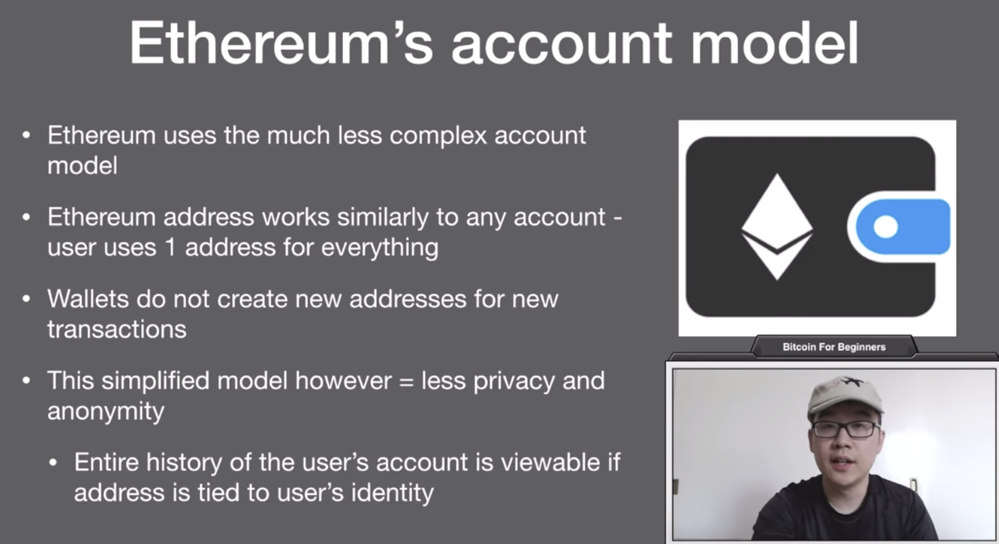

Ethereum on the other hand, uses an account model. This is a much less complex account model and you get one Ethereum address which works similarly to any account, a user would use one address for everything. Now, of course, you can have two addresses or make a third one as well, but you can use them and continually use them for perpetuity. Wallets, do not create new addresses every time there's a new transaction not for change, not for spending and so forth. That stuff is in the Bitcoins UTXO process. This simplified model, however, does equal less privacy and anonymity, because the history of the entire users account is viewable, unlike ether, scan, for example, if the address is tied to user's identity.

Now, what are some final thoughts here? If they're in bitcoin are more different than you might initially expect, this does not mean that we think there's a security of one over the other. Most of them have to do with the different applications and use case scenarios and the difference and design and development. Also reflecting their different goals, bitcoin and theorem are honestly not even trying to compete but are rather attempting to service different needs, so ask users and investors it's important to familiarize yourself with their differences and implications, so you can make a better decision as to your personal investment goals and what you want to use if you do want to use cryptocurrency for various purposes thanks for watching. Let us know your thoughts about bitcoin versus the theorem, how they stack up. What are the similarities and differences as you can see a lot of differences if I miss anything, let me know if you have any thoughts in your mind.