```sh
npx hardhat run scripts/SimpleUpgradeable/deploy_box_v1.ts  

Box deployed to: 0xFA7A518D42123871E8eB96C905381293328c9797
```


执行完命令之后去etherscan上查询刚才deploy好的合约

https://goerli.etherscan.io/address/0xFA7A518D42123871E8eB96C905381293328c9797#code

```js
defaultNetwork: "gorli",
  networks: {
    gorli: {
      url: `${process.env.INFURA_KEY}`,
        accounts: [
          `${process.env.ACCOUNT_4_PK}`,
          `${process.env.ACCOUNT_3_PK}`,
        ],
    },
  },
```

https://goerli.etherscan.io/address/0x7FA7fB4D35f0F4F3959A65098D1D9Cf69E49Ac48

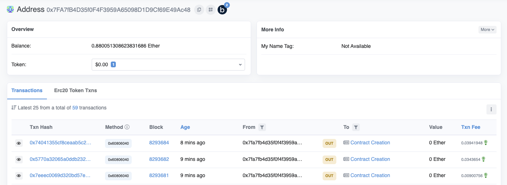

因为我的配置里配置的accounts第一个是account 4，所以可以看到有account 4地址下新增3条交易

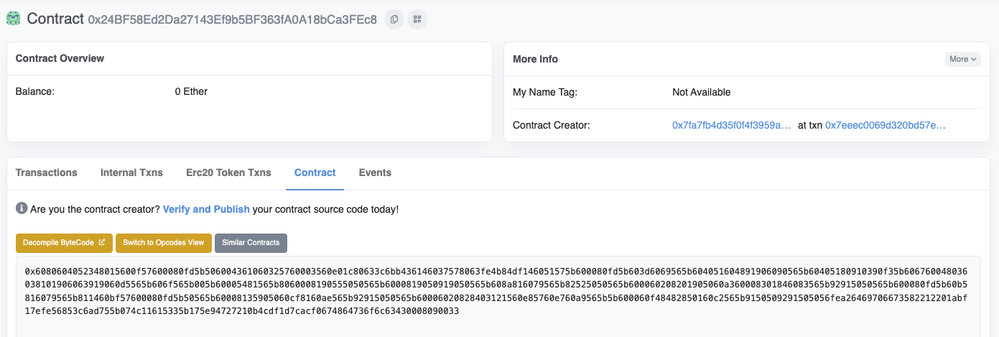

最下边那条交易是部署的Box，也就是implementation，可以看到代码并未被验证

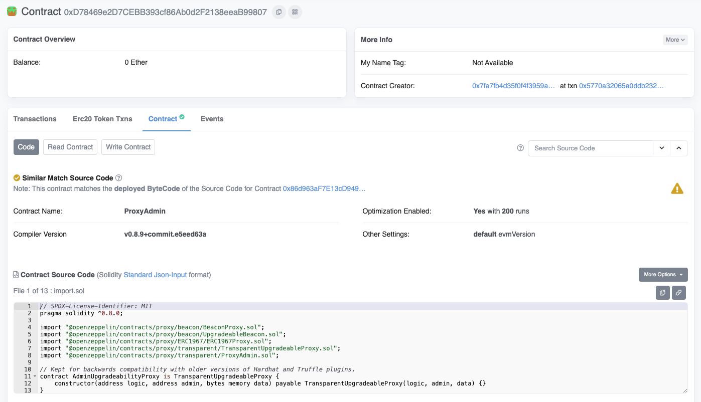

第二条交易，可以看到部署的是ProxyAdmin

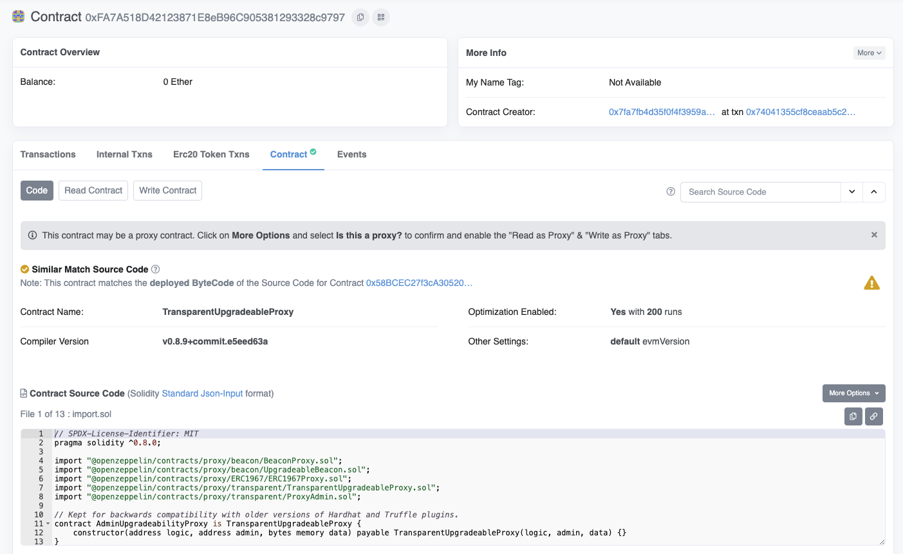

第一条交易，可以看到部署的是Transparent Upgradeable Proxy


接下来进行verify，先复制第三条交易部署的Box implementation地址

```sh
// 0x24BF58Ed2Da27143Ef9b5BF363fA0A18bCa3FEc8

npx hardhat verify 0x24BF58Ed2Da27143Ef9b5BF363fA0A18bCa3FEc8

Successfully submitted source code for contract
contracts/SimpleUpgradeable/Box.sol:Box at 0x24BF58Ed2Da27143Ef9b5BF363fA0A18bCa3FEc8
for verification on the block explorer. Waiting for verification result...

Successfully verified contract Box on Etherscan.
https://goerli.etherscan.io/address/0x24BF58Ed2Da27143Ef9b5BF363fA0A18bCa3FEc8#code
```

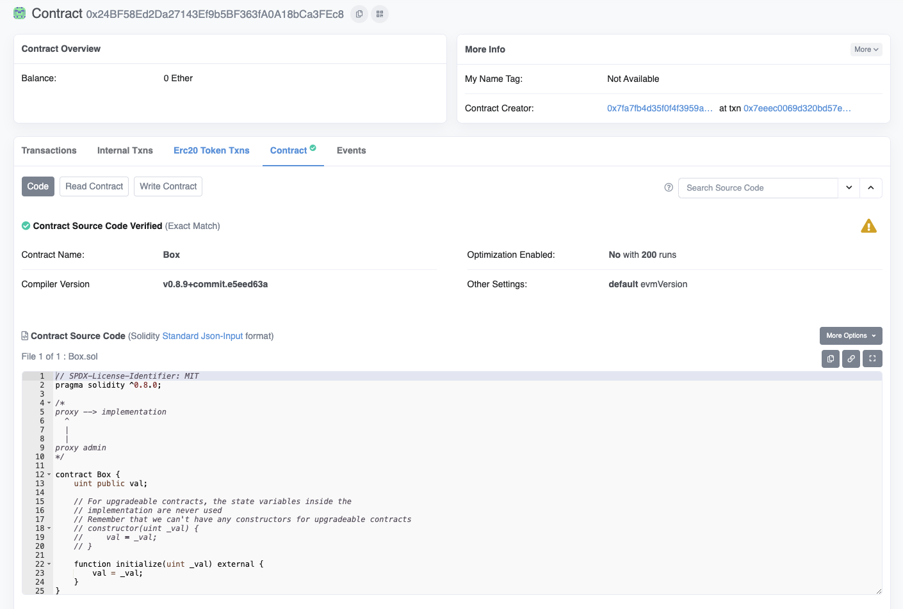

执行完命令之后可以看到代码已经被验证了

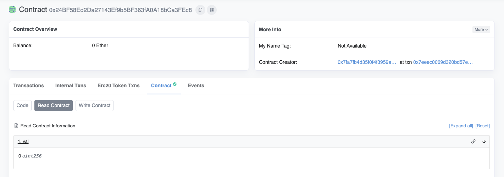

deploy的时候会自动执行Box中的Initialize，我们设置了参数为42，但此时在Read Contract中是0，这里其实是对的，因为是把Box中的代码拿到proxy中执行，所以Box中的val是0没有任何问题

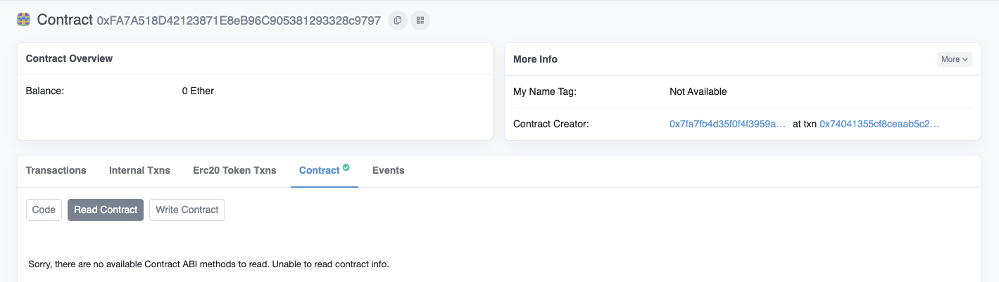

我们回到proxy合约的Read Contract，此时可以看到显示Sorry, there are no available Contract ABI methods to read. Unable to read contract info. 所以我们需要告诉Etherscan这个合约是个proxy合约，并且implementation的地址

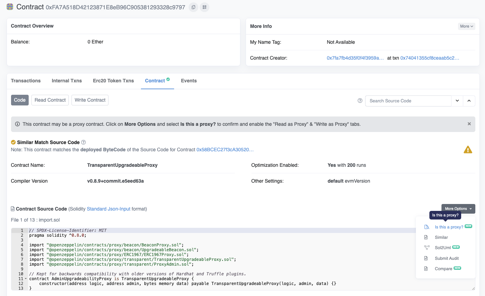

此时我们点击Code -> More Options -> Is this a proxy

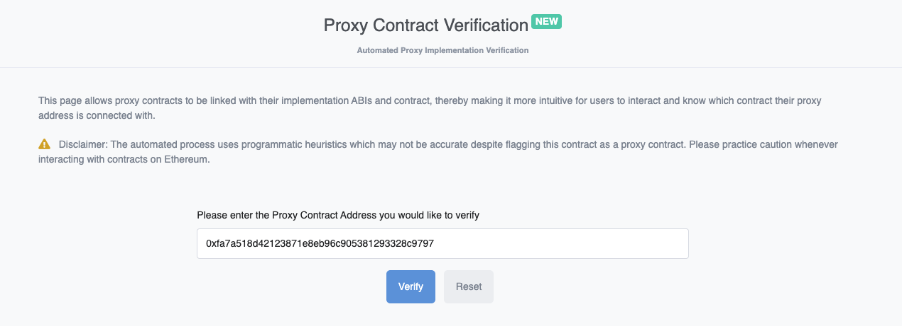

继续点击Verify

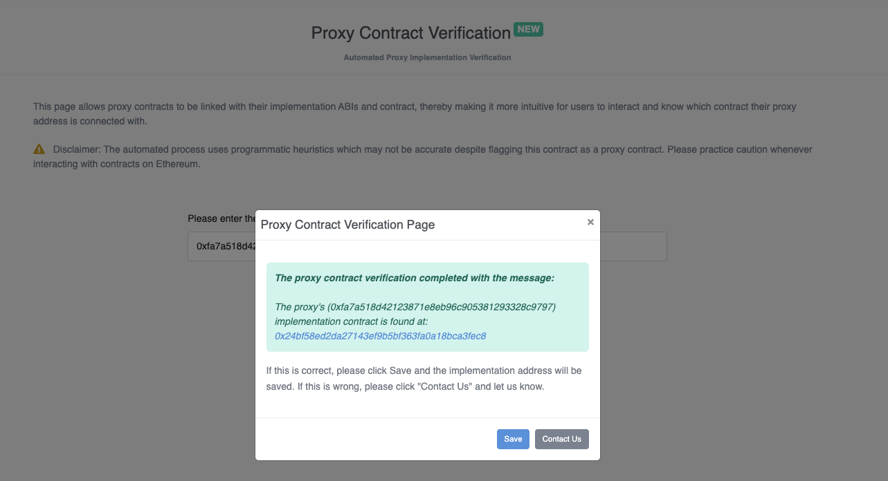

继续点击Save

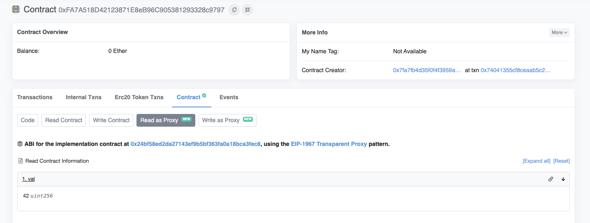

再次回到proxy，已经可以看到多了两个tab，点击Read as Proxy，已经可以看到val的值为42了