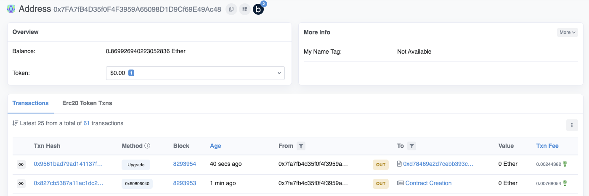
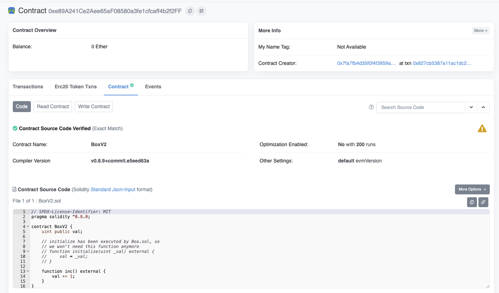
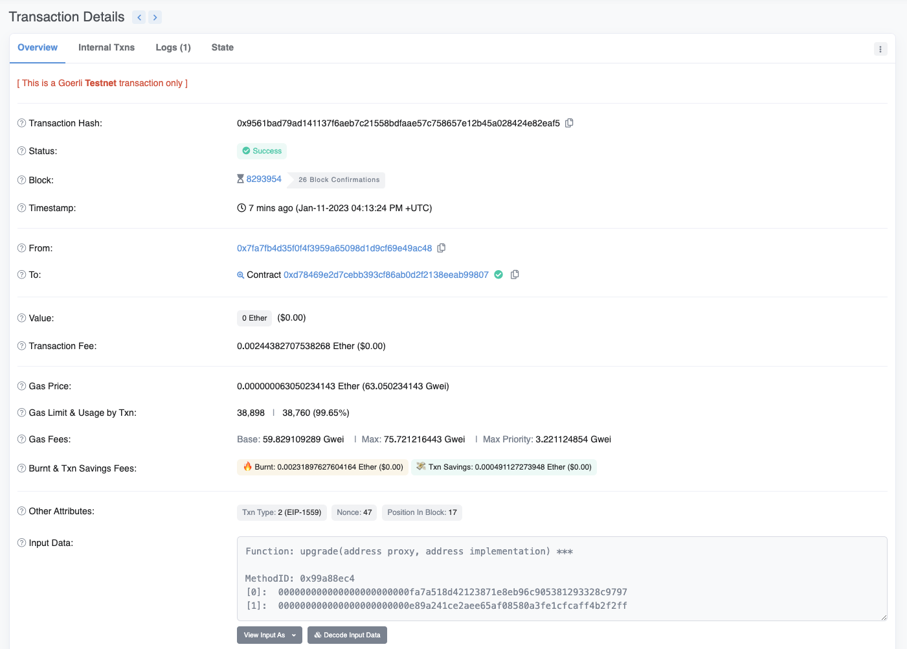
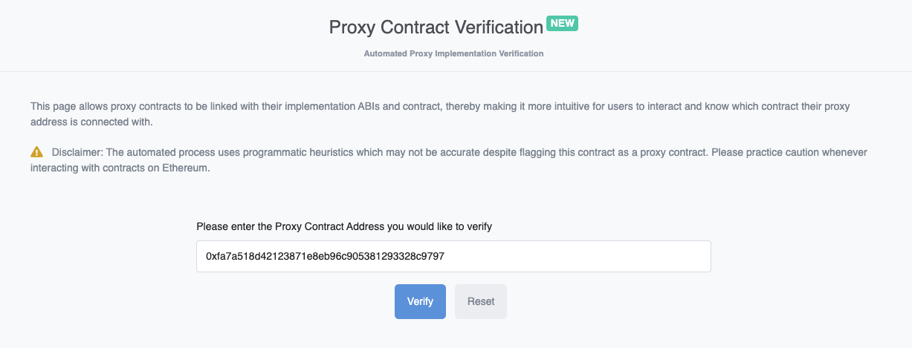
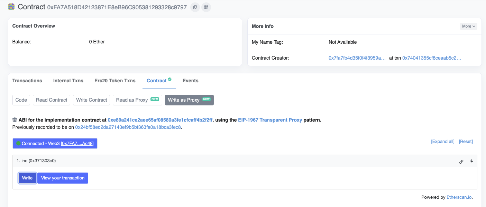
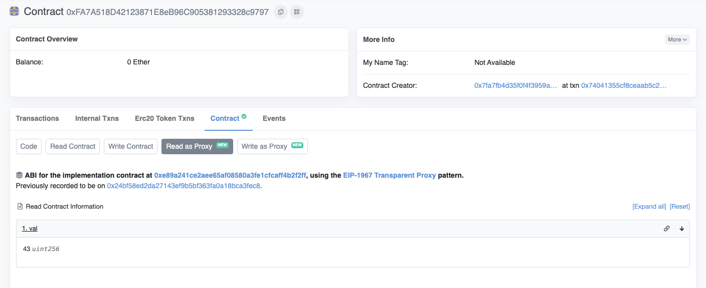

```sh
npx hardhat run scripts/SimpleUpgradeable/deploy_box_v1.ts  

Box deployed to: 0xFA7A518D42123871E8eB96C905381293328c9797
```


执行完命令之后去etherscan上查询刚才deploy好的合约

https://goerli.etherscan.io/address/0xFA7A518D42123871E8eB96C905381293328c9797#code

```js
defaultNetwork: "gorli",
  networks: {
    gorli: {
      url: `${process.env.INFURA_KEY}`,
        accounts: [
          `${process.env.ACCOUNT_4_PK}`,
          `${process.env.ACCOUNT_3_PK}`,
        ],
    },
  },
```

https://goerli.etherscan.io/address/0x7FA7fB4D35f0F4F3959A65098D1D9Cf69E49Ac48


因为我的配置里配置的accounts第一个是account 4，所以可以看到有account 4地址下新增3条交易


最下边那条交易是部署的Box，也就是implementation，可以看到代码并未被验证


第二条交易，可以看到部署的是ProxyAdmin


第一条交易，可以看到部署的是Transparent Upgradeable Proxy


接下来进行verify，先复制第三条交易部署的Box implementation地址

```sh
// 0x24BF58Ed2Da27143Ef9b5BF363fA0A18bCa3FEc8

npx hardhat verify 0x24BF58Ed2Da27143Ef9b5BF363fA0A18bCa3FEc8

Successfully submitted source code for contract
contracts/SimpleUpgradeable/Box.sol:Box at 0x24BF58Ed2Da27143Ef9b5BF363fA0A18bCa3FEc8
for verification on the block explorer. Waiting for verification result...

Successfully verified contract Box on Etherscan.
https://goerli.etherscan.io/address/0x24BF58Ed2Da27143Ef9b5BF363fA0A18bCa3FEc8#code
```


执行完命令之后可以看到代码已经被验证了


deploy的时候会自动执行Box中的Initialize，我们设置了参数为42，但此时在Read Contract中是0，这里其实是对的，因为是把Box中的代码拿到proxy中执行，所以Box中的val是0没有任何问题


我们回到proxy合约的Read Contract，此时可以看到显示Sorry, there are no available Contract ABI methods to read. Unable to read contract info. 所以我们需要告诉Etherscan这个合约是个proxy合约，并且implementation的地址


此时我们点击Code -> More Options -> Is this a proxy


继续点击Verify


继续点击Save


再次回到proxy，已经可以看到多了两个tab，点击Read as Proxy，已经可以看到val的值为42了


```sh
npx hardhat run scripts/SimpleUpgradeable/deploy_box_v2.ts

Box upgraded
```

我们执行命令来将Box更新为BoxV2



可以看到account 4下边又多了两条交易

第二条交易是部署BoxV2，第一条交易是调用ProxyAdmin合约的upgrade方法

```sh
// 0xe89A241Ce2Aee65aF08580a3fe1cfcaff4b2f2FF
npx hardhat verify 0xe89A241Ce2Aee65aF08580a3fe1cfcaff4b2f2FF

Successfully submitted source code for contract
contracts/SimpleUpgradeable/BoxV2.sol:BoxV2 at 0xe89A241Ce2Aee65aF08580a3fe1cfcaff4b2f2FF
for verification on the block explorer. Waiting for verification result...

Successfully verified contract BoxV2 on Etherscan.
https://goerli.etherscan.io/address/0xe89A241Ce2Aee65aF08580a3fe1cfcaff4b2f2FF#code
```



我们再次调用命令对BoxV2进行验证，可以看到code中的代码已经有inc方法了



可以看到第一条交易中显示调用了upgrade方法，将Box更新为了BoxV2



回到proxy合约，当我们更新了implementation，即BoxV2，我们需要告诉Etherscan point to latest implementation，重新点击Is this a proxy来进行更新



更新完之后，我们点击Write as Proxy，然后再点击connect to Web3，再点击Write，以此来调用BoxV2中的inc方法



再次回到Read as Proxy可以看到val已经变为43了，证明合约已经被更新了