In this video we're going to learn about the weird parts of solidity.


By weird, we mean unusual or unexpected, like this.

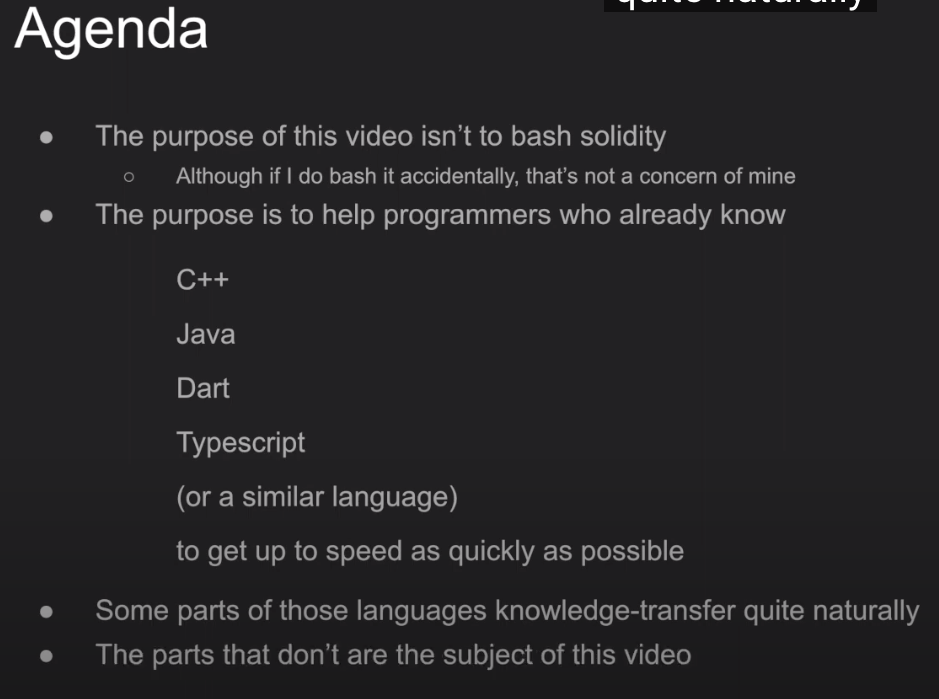

The purpose of this video isn't to bash solidity, although if I do bash it accidentally, that is not my concern. Instead, this video is targeted to programmers who already know languages like c++, Java, dart, TypeScript or something like that, and if we review the parts that are different in solidity, you'll be able to get up to speed as quickly as possible, because those languages knowledge-transfer to solidity quite naturally, and the parts that overlap are not the subject of this video.

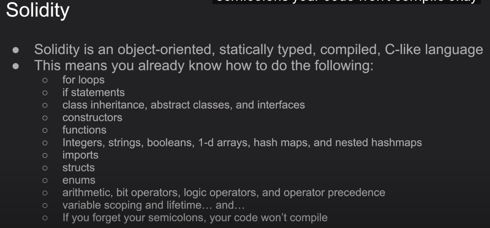

Solidity is a object-oriented statically typed compiled c-like language, just like the languages I mentioned earlier. So that means you already know how to do the following: for loops, if statements, class inheritance, abstract classes and interfaces, constructors, functions, integers, strings, booleans, 1-d arrays, hash maps and nested hashmaps, imports, structs, enums, arithmetic, bit operators, logic operators and operator precedence, variable scoping and lifetime, and if you forget your semicolons, your code won't compile.

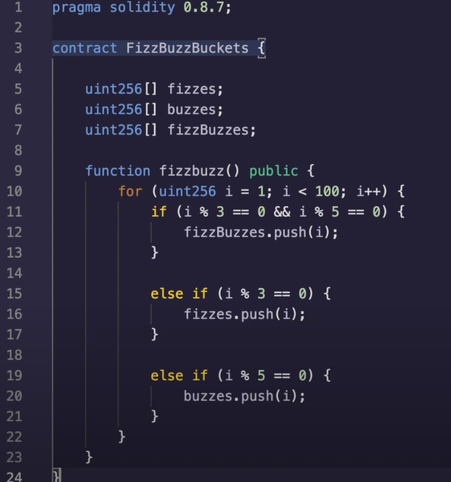

Okay. So if we look at this code, it should be pretty obvious what's going on, you'll note that there aren't any print statements, because solidity does not have a natural notion of printing things which should be no surprise. It runs on the blockchain, not on your console, but here we have the classic fizzbuzz program where the numbers are being put into the appropriate array rather than being printed out.

Okay, let's move on to the weird stuff now the reason solidity can be weird is because it's both a language and a framework wrapped up into one. So ruby is a separate entity from ruby on rails and python is separate from django, java from spring and so forth, but solidity kind of matches its languageness and framework together, which can be a bit unexpected sometimes.


Solidity does not have floating types, so you can't specify 2.2 or pi or e. Function and variable visibility have some overlaps with java, but their naming can be a bit misleading. The functions are state sensitive. Strings are weird nested. Arrays are weird. There's no garbage collector or free, like you have in C++. The address type is something you haven't seen before. Msg.sender and tx.origin can lead to confusion, there's stuff related to payments of course, because this involves ethereum, and this is not an exhaustive list, but this should hit the important ones.

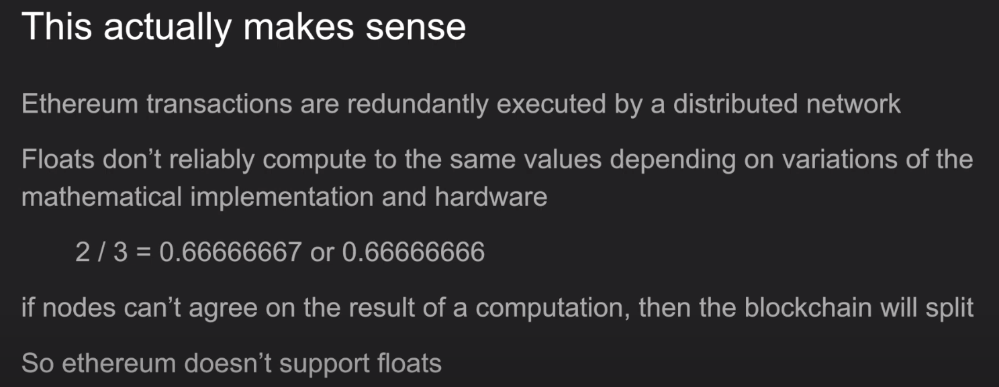

No floats, well, this actually makes sense because ethereum transactions are redundantly executed by a distributed network, which means for a bunch of nodes to reliably arrive at the same conclusion, all of the computations need to be carried out exactly the same way. And, floats don't do that because when you divide, say 2/3, you might end up with a number on the left or the number on the right, and this is just a simple example for a rational number. If nodes can't agree on that, then the blockchain will split. One version of the blockchain will believe that two over three is 0.6667 and the other one we'll believe otherwise, so Ethereum doesn't support floats. Is this a good thing or a bad thing? I don't know, but we don't want blockchain splits and modern problems require modern solutions.

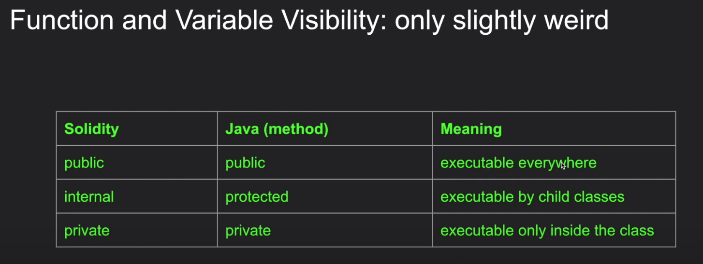

Function and variable modifiers, if you used java before you've seen public, protected and private method modifiers for the methods inside your classes, and solidity has something very similar to it, which behaves the same way, except that protected gets labeled to internal, and maybe arguably internal is actually a better name. As a quick refresher public means it can be executed everywhere and internal or protected means it can be executed inside the class or by the child class, and private means even the child class can't execute it. Now, solidity actually has another type, which is called external, which is not on this slide, but external is meant to be executed outside of the class, but not inside of the class.

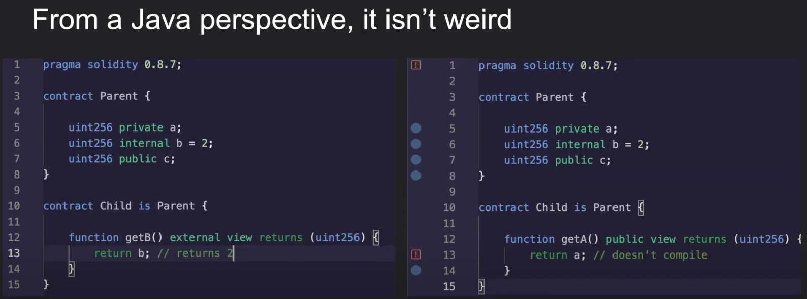

So this is what it will look like. This will work as expected. The child extends its parent and b comes from the parent, and this returns 2. In this case, private is working as you would expect when the child extends the parent, a is not visible to the child. Okay cool.

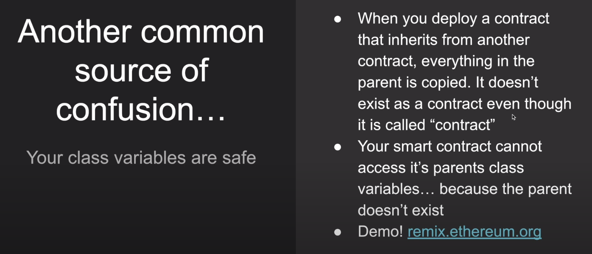

However, the way solidity conflates "contract" with "class" is weird, so something that I've seen be a source of confusion for developers is that when you deploy a contract that inherits from another contract, everything in the parent is copied. There really isn't a notion of a parent existing anywhere, as when you say "oh I'm using the parent's variable", no, you are not using the parent's variable, you are using a copy of the parent's variable. So you, there is no, you're not really accessing a parent contract, you're just accessing a protocol that's defined by the parent.

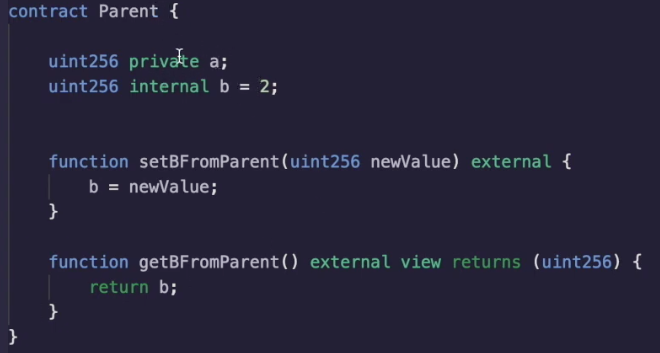

Let's demo this, okay, so I have a parent which has variables a and b. We actually don't care about a, we just care about b here, so I can set the b from the parent with this new value and I can get the b from the parent by returning b.

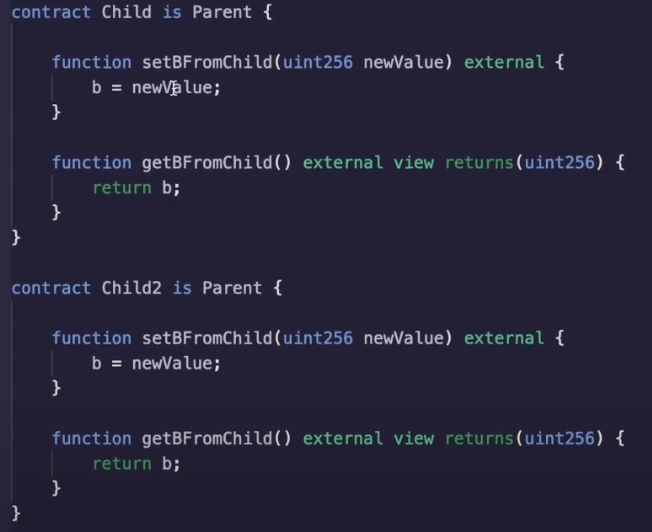

We have two children. One will do the same exact thing except we'll call the function something different, setBFromChild and getBFromChild. Child2 can also set the b and child2 can also get the b. Okay, um, let's compile this okay. I've deployed both of the contracts.

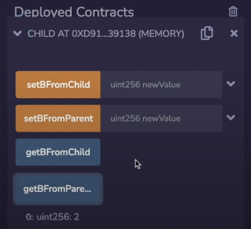

Now in the first contract. Let's set, first of all, just to check what's going on, let's call the function getBFromParent, it's 2 as we expect, and let's get b from child and it's still 2, Now, even though it says get b from parent, this contract doesn't actually exist in any meaningful sense. So if we set b from the child like this and we get b from the child, oh wait. That's not interesting! So if we set b from child to this, and we get this, we will also have apparently set b to be 4 from the parent. However, this other contract, which extends the parent, is still going to see two, because this is a completely separate contract. So, even if we quote unquote set it from the parent, sorry, I'm using boring values. Here, let's say we set this to 6 and we get b. Okay, it comes back as 6 over here. It's still 4.

Okay, so this shouldn't really be surprising I guess, but when we say oh, this is inheriting from the parent contract, it makes it sound like. Oh, the parent contract is a separate entity. No, it is not, it's just a nice way of sorting the functionality of the entire contract which is only one thing.

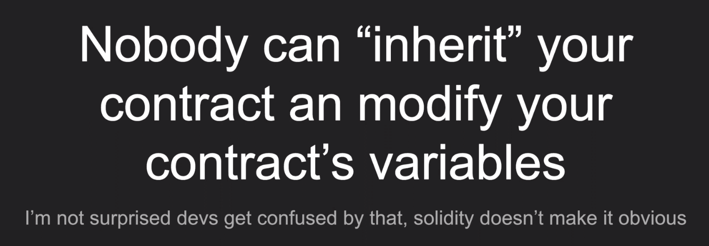

So I've seen some concerns about public variables that, oh, maybe you know somebody can extend my contract and change the values, because now they have access as being part of the child. No, it doesn't work like that. The parent is always copied.

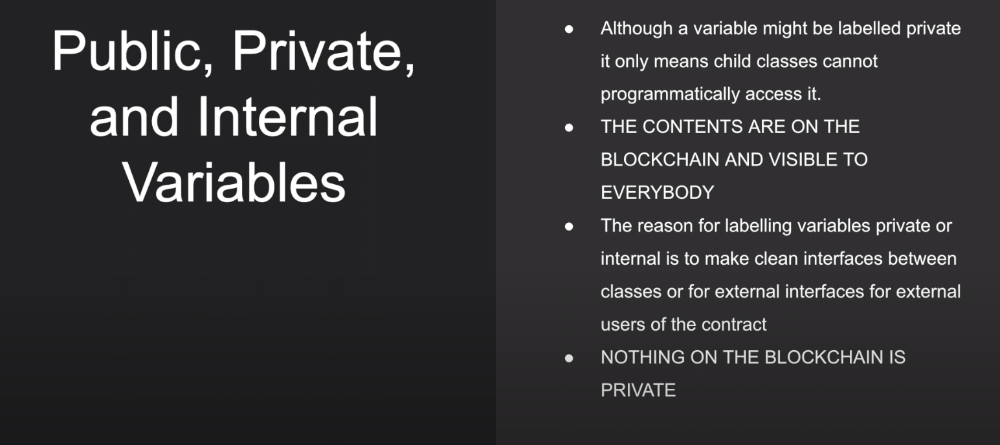

But, more importantly, private variables are not private. You cannot access them from the children, but the blockchain nodes have to be able to execute your transactions which means they have to know what's inside of that private variable right? So anyone can run a blockchain node and figure out what's inside the private variable. So don't put anything sensitive inside of private variables. This is just to make your interfaces cleaner between classes and nothing on the blockchain is private. As a matter of fact, private variable or not, it has to be stored all over the world. So anything you put up, there is stuck there forever.

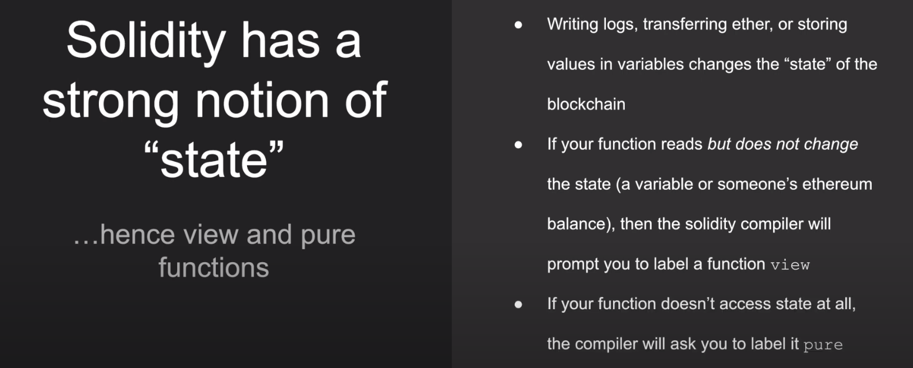

Okay, solidity cares about state, because the blockchain remembers everything that came before it and if you change what's written on the blockchain, that has to be stored forever and that costs more uh gas fees, so solidity tries to segment out functions that can change the state or not. So it introduces something called view and pure functions and if a function either writes logs, transfers ether or stores values in variables, it changes the state of the blockchain. You read the state of the blockchain say, check someone's balance or look at variables, then the compiler will prompt you to label your functions as view. This also increases security, because when a function is labeled view, it is not allowed to change the state of the blockchain and that actually reduces a security risk, because people can't make a change, because people can't make a state change through that entry point. And if your function doesn't access the state at all, then the compiler will ask you to label it pure.


Here's a good example: a is a storage variable which is stored on the blockchain and if you get a it will return it. So it is a view function. Over here, we are returning the maximum between two different variables with this ternary operator which is something you've seen before hopefully, and this is just a pure function because it doesn't access any state variables or ask for any balances.

Okay, one more thing to note: a function being pure, view or state changing is independent of if it is private, internal or public, so these are orthogonal issues.

Okay, now, let's talk about some really weird stuff. 


Strings and array-like variables. Grab your cup of coffee and let's dive in. This will not compile, even though this looks perfectly reasonable. We're just setting the string over here, solidity does not like it.


There's an error message over here and it's going to ask you to do one of two things: it's going to ask you to label it as "calldata" or "memory", but you must have one of these two keywords there.

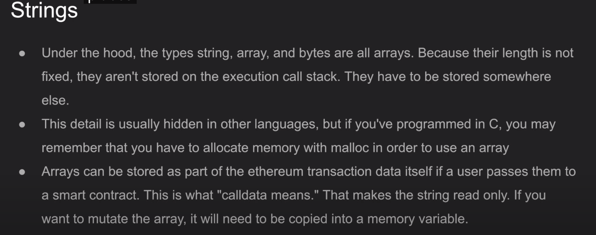

Why is that? Well, under the hood, string types and arrays and bytes, these are all really arrays are not stored on the execution stack because their length is not fixed. Okay, that makes sense. They have to be stored somewhere else and if you've used C before then this probably isn't surprising, because whenever you dealt with dynamic length arrays you had to malloc some memory and other languages just kind of hide that from you, like if you're using uh I don't know java, it's just gonna keep a pointer to where that string is stored in memory.

Ethereum can store them in one of two places. One is in the actual transaction. So if you were to send a string to this contract from earlier (指前边BadString那个合约), then as part of the transaction, when you fire it off from your MetaMask, it's already there, so it's saying just access what's inside of the transaction. Otherwise, if you want to copy it into memory, then it's saying hey, allocate memory for this string that's incoming to this function.

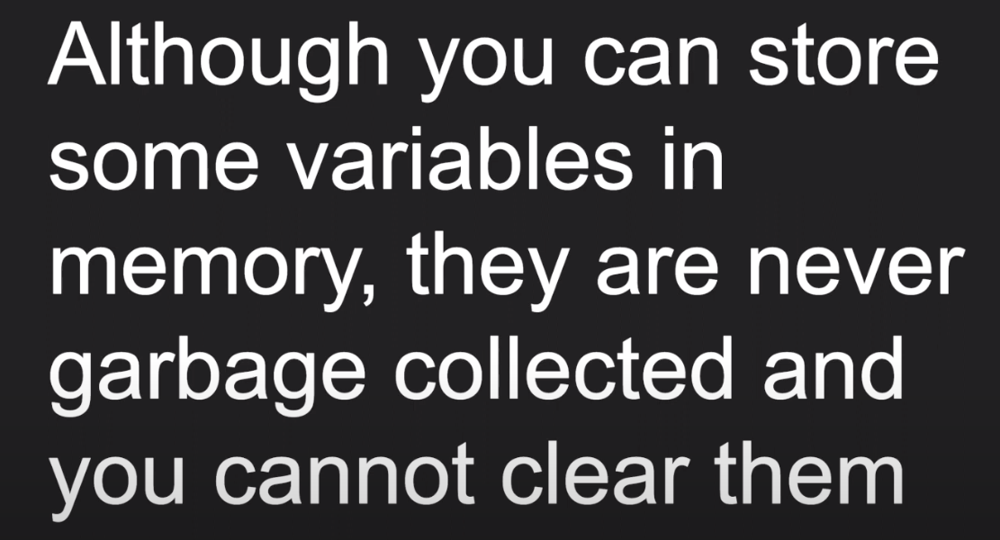

Speaking of memory, although you can store variables in memory, they are never garbage collected and you cannot clear them. So, even though we were talking about allocating memory, when you add that memory keyword, you cannot clear that memory. Why is that? Well, you can't have any use-after-free errors. If you can't free memory, it eliminates an entire class of errors. Modern problems require modern solutions. Web 3 is the future...

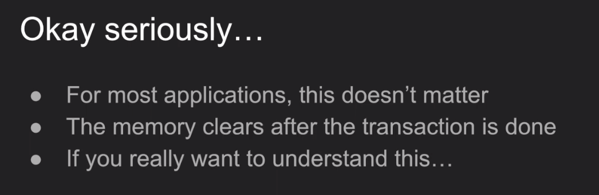

Okay seriously, for most applications, this actually doesn't matter because the memory clears after the transaction is done, so any intermediate state that is not stored to the storage variables or results in an ethereum transfer or what have you gets erased. So if you really want to understand this, I suggest you take my advanced solidity course on udemy, where I really dive into this, but for now you don't have to worry about it. Just understand that memory gets cleared each time the execution completes.


Okay by the way we are still talking about strings, we're not done yet. More on string weirdness. You cannot concatenate strings in solidity, so saying string1  plus string2 will not compile. Solidity, does not have a built in way to convert integers to strings, you have to use a library, that is definitely strange. You cannot compare string equality in solidity, you have to compare them character by character or compare their hashes, and this actually makes sense, because if you try to compare arrays with the dual equal signs, that's kind of semantically ambiguous, don't try to do that here.


Let's talk about something really weird multi-dimensional. Arrays are declared backwards and used forwards, so the code you see here will actually result in an array out of bounds exception because although  

```solidity
uint[2][1] matrix
```

the first index here has two units and this has one unit 

```solidity
matrix[1][0] = 2
```

over here, you are accessing the one index of something that only has a zero index in it, and so everything blows up, that's how I feel about it.

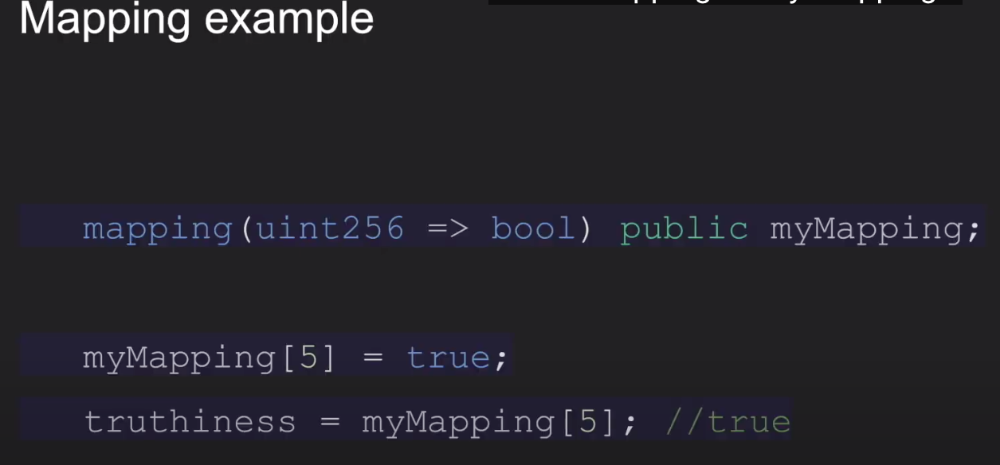

Mappings, let's talk about mappings, okay, mappings are just like hash maps and they kind of behave the way you would expect them to over. Here we have a mapping from integers to booleans, although you can put your own types in there, and here we set the key 5 to be true and truthiness now has the value true in it nothing mysterious.

So if you wanted to iterate over the map, can you do it like? You would do here and say python? No, you can't.

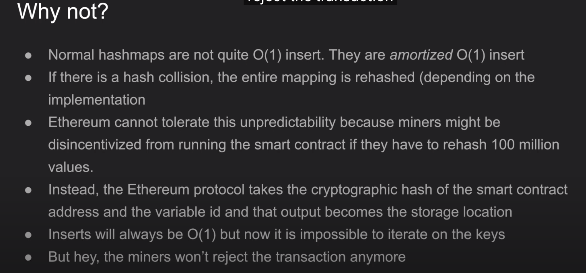

Why not. Well, normal hash maps are not quite over one inserts. They are amortized over one insert, so a hashmap is famous. Oh, you can put it in and get it out in of one time and they're awesome. Well, that's not quite true because if there's a hash collision, what happens is the hash algorithm will rehash everything so that the collision is no longer there and rehashing everything takes, of course, and time. And Ethereum cannot tolerate this unpredictability, because if a miner encounters a transaction, that's going to result in a rehash, they are not going to want to do it if there are 100 million values inside of the hash map and the transaction will probably never go through. So instead, the ethereum protocol takes the cryptographic hash of the smart contract address and the variable id and the key and that output hash becomes the storage location. So you are not going to ever get any storage conflicts, so inserts will always be of one. But since you can't reverse engineer a hash, it's now impossible to iterate on the keys, but, hey the miners will not reject the transaction anymore.

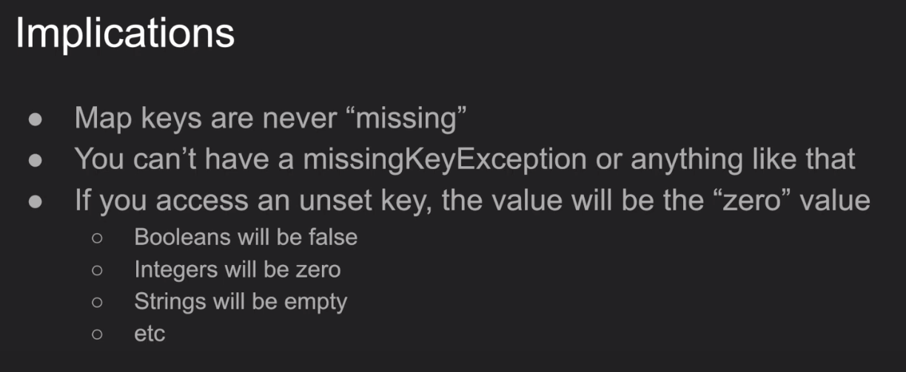

Okay, there's actually more implications to this. The other one is that the map keys are never missing. So if you ever try to access a key that isn't inside of a hash map, you're going to get like a missing key exception, or something like that. Instead, if you access a key that has never been used before or set before, I should say its value will be zero, so booleans will be false, integers will be zero strings will be empty and so on. Basically, whatever the zero value is, it will become zero, because well, let's think about how this would work. So you ask for a certain value that has never been set before, the hash will land somewhere in its huge space and the there will be nothing in storage over there. So it's zero, that's actually how it worked. It does not check if the key exists or not and then gives you a zero for it not being there. It's actually checking a storage location that does not exist at all and that's why it's zero.

Msg.sender and tx.origin. So these two global variables tell you which address initiated the transaction to the smart contract, now they're called global variables because you can just access them inside of the function call but obviously they're going to change depending on who initiated the function.

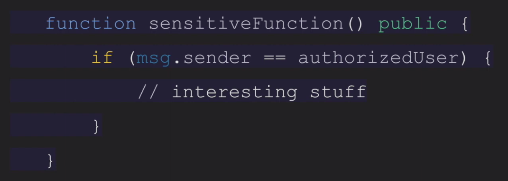

So what's the difference? Well, let's first of all see how it's used. Here's an example. So let's say you want to have a function that only certain people can use, like they are the ones who are authorized to use the application or they're accessing a balance they have, and you don't want to share that balance with other people. Well, if you call msg.sender you're going to get back the address type which we just discussed and if authorized user is stored inside of a storage variable somewhere, then you can validate that the correct person is calling this function and then do the interesting stuff.


So this is a very common pattern, so why do they use msg.sender instead of tx.origin? Well, that's because tx.origin is liable to man in the middle attacks, so it's not just users who can call your smart contract, it's also other smart contracts. So if a user calls a smart contract that calls your smart contract, then the smart contract will think that there isn't something in the middle if you are using tx.origin, because tx.origin is always the wallet that initiated the account, but msg.sender might be a smart contract. So somebody else is interacting with your smart contract in between you and your user. Msg.sender will detect that and we'll say hey this smart contract address does not match the authorized user address, so you are not allowed to do whatever you're trying to do, if you use tx.origin as a source of authorization, then there's a problem that when a user uses other smart contracts, then those smart contracts can elevate their privileges to do whatever the user was authorized to do inside of your application, so don't use tx.origin.

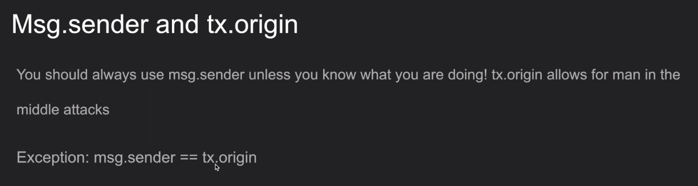

There is an exception for this. If you want to check if a smart contract is calling your smart contract, you can use checkmsg.sender == tx.origin. So if the user is calling you directly, then tx.origin will of course be the user and msg.sender will also be the user. But if the user called a smart contract which is then calling your application, msg.sender will be the smart contract and tx.origin will be the user and you can detect that this funny situation is happening.

```solidity
pragma solidity ^0.8.10;

contract ERC20ish {

    mapping(address => uint256) private balances;
    address federalReserve;

    constructor(){
        federalReserve = msg.sender;
    }

    function getMyBalance() public view returns (uint256) {
        return balances[msg.sender];
    }

    function paySomeone(address receiver, uint256 amount) public {
        require(balances[msg.sender] >= amount, "you don't have enough money");
        balances[msg.sender] -= amount;
        balances[receiver] += amount;
    }

    function addToBalance(address receiver, uint256 amount) public {
        require(msg.sender == federalReserve, "you not allowed to print money");
        balances[receiver] += amount;
    }
}
```

Enough theory, let's build a simple bank, so we have a mapping like we saw earlier, which is an address to their balance and we'll call it balances, good variable name, and in order for the balances to become non-zero, we need to have somebody who can print the money, which is, of course, the federal reserve, so when this smart contract is initialized, the variable federalReserve will be set to message.sender. So the address that deploys a contract is the msg.sender inside of the constructor function. Okay, I haven't explained constructors before, but if you used pretty much any other language I listed earlier, it's probably pretty obvious what's going on here. Next, we will add a nice function which will get the balance because remember this is private, so people can't access it very conveniently, it's not private people can still see the balances, but it's you don't have a nice interface if people want to interact directly with it, they kind of have to dig into the storage of the ethereum network and that's a little bit inconvenient. So you can get back their balances, it's a view function of course, because you are looking at the state, balances as a storage variable and it's a state that is stored on the blockchain.

Okay, you can pay somebody, we haven't seen the keyword require here, but I think this is pretty intuitive, before you send a certain receiver an amount of money, you want to check that you can actually send that amount making sure that your balance is actually enough. Then it will subtract your balance and add it to the receiver's balance. Now note here, that because this is checking explicitly msg.sender, other people can't steal your money, because if you, if you try, you cannot specify anything other than msg.sender. So anyone who calls this function will always be moving their own money. Now addToBalance is, of course, how money ends up in circulation. Well, first of all, we need to make sure that only the federal reserve is the one who is inflating the currency supply. You are not allowed to print money as the error message that happens if someone other than the federalReserve calls addToBalance, and, of course, the federalReserve can increase a target person's balance. Okay, this is actually not too different from how an erc20 token works, which is why I called it erc20ish, so feel free to copy this code and play around with it.

But what about real ether? Well, uh, obviously you weren't moving money around as part of the languages syntax in other languages, so we have to introduce some new keywords here: msg.value, payable, .balance and .transfer. Remember how we had msg.sender. Well, that tells you who sent it, but msg.value is the amount of ethereum that they sent along with the transaction.

```solidity
pragma solidity ^0.8.10;

contract BalanceDemo {

    mapping(address => uint256) balances;

    function deposit() public payable {
        balances[msg.sender] += msg.value;
    }

    function withdraw(uint256 amount) public {
        require(balances[msg.sender] >= amount, "not enough deposit");
        balances[msg.sender] -= amount;
        payable(msg.sender).transfer(amount);
    }

    function getContractBalance() public view returns (uint256) {
        return address(this).balance;
    }

    function amIRich() public view returns (bool) {
        if(msg.sender.balance >= 100 ether) {
            return true;
        }
        return false;
    }
}
```

Okay, demo, again we have our balances and how this contract is going to work. Is it's pretty uh behaves like a very simple bank. Someone is able to deposit ethereum in here. So if you call deposit(), the amount of value that you send will be stored inside of balances, now functions cannot receive ether unless they are marked as payable, that's really nothing complicated. If this payable function was here and someone tried to send ether to it, then the transaction would get rejected. So let's say I send 1 ether along with this transaction and now my balance will be set to 1 ether. I can withdraw up to the amount that I have deposited, so before I attempt to withdraw, I have to check that I'm not withdrawing more than the amount that I have and if so then my balance will get deducted and it's going to transfer it back to me, so msg.sender when I'm withdrawing that means hey I want this, my ether back, you cannot just send it to addresses, you need to wrap it with the payable keyword just like we have with the function here. So if an address is interacting with money, then you need to wrap it with payable and then you can call .transfer the amount that you are trying to withdraw.

Okay, so there's that .transfer keyword. If you wanted to see how much money is inside the smart contract, because several people are using it, you can use the pattern address this .balance. You don't need to do payable here, because you're not moving any money around and get contract balance doesn't need to be payable because you are not sending ether to it. Same thing with withdraw. Withdraw is not, you're not sending money to the contract, you're taking money out. So it does not need to be payable.

Note how this uh ether keyword here. What is this? Well ether is actually specified in units of 1 out of 10 to the 18, which are called units of way. So when you send a decimal value of ether you are actually sending the appropriate amount of smaller units. Remember how ether doesn't have floats, because floats could lead to blockchain splits, and so our solution to get rid of blockchain splits is to get rid of floats. Modern problems require modern solutions, so this is just a nice shortcut of saying 100 times 10 to the 18, which is the units of which is the smallest divisible unit of ether.

And just to review the um view and not view so payable or deposit and withdraw these both modify the state because they are changing the balances, so they are not view functions, but these two are just looking at balances. Therefore they are view functions. They are not pure because they are looking at state, which is the balance that an address has.

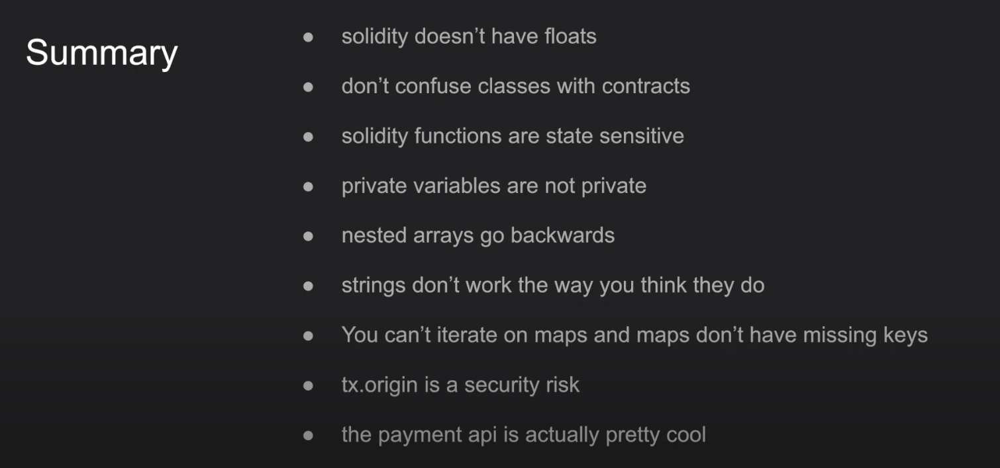

Okay, summary, solidity does not have floats, don't confuse classes with contracts. Solidity functions are state sensitive, private variables are not private. Nested arrays go backwards, strings don't work the way that you think they do and you can't iterate on maps and maps don't have missing keys. Tx.origin is a security risk and the payment api is actually pretty cool.