In this video we're going to build a simple NFT, now it will loosely follow the ERC721 specification (eip.ethereum.org/EIPS/eip-721), but we won't follow it exactly just for the sake of simplicity. You shouldn't use this code in production, everybody uses the OpenZeppelin library which I'll get to later and there's a good reason for that. However, if we dive into OpenZeppelin right now, there's going to be a lot of code to look at and I think it will make it harder to understand what's going on. So we'll build the core functionality by hand here and then move on to OpenZeppelin once you know enough and just use that for the rest of the course.

```solidity
contract SimpleNFT {
	mapping(uint256 => address) private _owners;
}
```

Okay, let's go um. The most important thing in an NFT is the associative array between users and the tokens that they owned. So you're always going to see something like this, a mapping from uint256 to address, and this will be private and we'll call it owners.

Now why are we going from token id to address rather than the other way around? The reason for that is because you can know in advance which token ids you're going to produce but you can't know in advance which addresses are going to own it, and you cannot iterate over mappings inside of solidity. So let's say you know that your token ids are going to be 0, 1, 2, etc, etc up until 100, then you can just loop through all of the keys here and figure out who the owners are.

But you can't do it the other way, not without storing an additional list of addresses and that's going to force the contract to store more things and be more gas heavy. So, let's uh do that and the next thing that we're going to care about is obviously, if we query the token id we want to know who owns it. Well, let's uh fulfill this specification bit by bit, so an erc721 token needs to fulfill all of these functions, which we're obviously going to study each of these in detail.

But the first thing that we care about is the owner of, we care about who owns the tokens, kind of obviously right? and that's the function ownerOf, and it's saying it needs to have this signature over here, it needs to take a token id and return the owner, which is the address, so we will do that. We will return owner's token id. Now, this leads to an interesting uh question. What, if you specify a token id that is not part of the collection, like, let's say token 101 is not part of the collection. Your this thing is going to return the 0 address, because that's what mappings do if you ask for a key that's not inside of, that hasn't been specified before, it defaults to the 0 value.

```solidity
    /// @notice Find the owner of an NFT
    /// @dev NFTs assigned to zero address are considered invalid, and queries
    ///  about them do throw.
    /// @param _tokenId The identifier for an NFT
    /// @return The address of the owner of the NFT
    function ownerOf(uint256 _tokenId) external view returns (address);
```

According to the specification it says, nfts assigned to the 0 address are invalid and queries about them do throw, so it should throw an exception. So what are we going to do about that specification that it should throw?

```solidity
function ownerOf(uint256 _tokenId) external view returns (address){
	require(_owners[_tokenId] != address(0), "no such token");
	return _owners[_tokenId];
}
```

Well, we can just have a require statement, right? So the required statement will cause the transaction to revert. If somebody asks for a token id that hasn't been minted yet, then we shouldn't say the 0 address owns it. It should cause the transaction to revert, so let's say require "_owners[_tokenId]" does not equal the 0 address, no such token, okay, so we fulfilled the ownerOf. Obviously this is going to return a exception each time, because there's no mechanism inside of this, contract for things to be minted. Okay, let's add that.

https://eips.ethereum.org/EIPS/eip-721

Now the interesting thing here is that the ERC721 specification doesn't really say how you should mint things. It kind of leaves that up to you. So if you actually read that part of the specification here, it says, "Creation of NFTs ("minting") and destruction of NFTs ("burning") is not included in the specification, your contract may implement these by other means. See the "event" documentation for your responsibility when creating or destroying NFTs".

```solidity
function mint(uint256 _tokenId) external {}
```

Don't worry we will get to that later, but we need to create a mechanism for minting NFTs. So let's do that. Function, mint, uint256 token id external. So, just to keep things simple for now, we're going to say anybody can mint an NFT for themselves using whatever token id they like. This is obviously an extremely bad design. We should have some restrictions around what tokenid you can put in there and restrictions around who can mint and we probably want to target the money to do that, but just for the sake of simplicity, I'm going to create a very simple mint function that gets the job done and puts tokens into existence.

```solidity
function mint(uint256 _tokenId) external {
	require(_owners[_tokenId] == address(0), "already minted");
	require(_tokenId < 100, "_tokenId too large");
	_owners[_tokenId] = msg.sender;
}
```

So what we're going to do is say owners, token id. So this is going to create a new entry inside of this mapping and set it to msg.sender, Okay. Now we do have a problem here, because we probably want to revert this if someone already minted a token, because we don't want to just overwrite token ownership. Let's say I come in and I mint token10 and I set it to my address and then you come in and then set your address to mint token10, well, you've just stolen the token from me. So let's require that the owners of the token id is equal to the 0 address. So that way, you, you can only mint token ids that have not been taken yet and just to make this more interesting, because you could really mint a wide range of token ids. Just so, most nfts have a limited supply, at least the way that they're currently used. So just for the sake of it, let's also say that you can't mint a token id bigger than 100, so we're going to require that the token id is less than 100, so everything is going to go from 0 to 99 um token id, too large, okay.

So p, this function can only be called for numbers 0 through 99, and that's going to effectively limit our supply. Now. This is not the way people normally do it, but just for the sake of simplicity, I'm going to implement it this way. Okay, so we have an ability to bring tokens into existence and a way to ask who owns them.

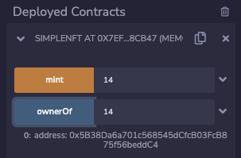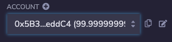

Let's test this out, so I'm going to compile and I'm going to deploy this, now, let's try it out. So I'm going to mint token id 7 for myself. I mint and who is the owner of token 7. Well, it's going to be 0x5 b3, which is of course, the default first address inside of the remix environment.

```solidity
    /// @notice Transfers the ownership of an NFT from one address to another address
    /// @dev Throws unless `msg.sender` is the current owner, an authorized
    ///  operator, or the approved address for this NFT. Throws if `_from` is
    ///  not the current owner. Throws if `_to` is the zero address. Throws if
    ///  `_tokenId` is not a valid NFT. When transfer is complete, this function
    ///  checks if `_to` is a smart contract (code size > 0). If so, it calls
    ///  `onERC721Received` on `_to` and throws if the return value is not
    ///  `bytes4(keccak256("onERC721Received(address,address,uint256,bytes)"))`.
    /// @param _from The current owner of the NFT
    /// @param _to The new owner
    /// @param _tokenId The NFT to transfer
    /// @param data Additional data with no specified format, sent in call to `_to`
    function safeTransferFrom(address _from, address _to, uint256 _tokenId, bytes data) external payable;

    /// @notice Transfers the ownership of an NFT from one address to another address
    /// @dev This works identically to the other function with an extra data parameter,
    ///  except this function just sets data to "".
    /// @param _from The current owner of the NFT
    /// @param _to The new owner
    /// @param _tokenId The NFT to transfer
    function safeTransferFrom(address _from, address _to, uint256 _tokenId) external payable;

    /// @notice Transfer ownership of an NFT -- THE CALLER IS RESPONSIBLE
    ///  TO CONFIRM THAT `_to` IS CAPABLE OF RECEIVING NFTS OR ELSE
    ///  THEY MAY BE PERMANENTLY LOST
    /// @dev Throws unless `msg.sender` is the current owner, an authorized
    ///  operator, or the approved address for this NFT. Throws if `_from` is
    ///  not the current owner. Throws if `_to` is the zero address. Throws if
    ///  `_tokenId` is not a valid NFT.
    /// @param _from The current owner of the NFT
    /// @param _to The new owner
    /// @param _tokenId The NFT to transfer
    function transferFrom(address _from, address _to, uint256 _tokenId) external payable;
```

Okay, that's pretty simple! Now this, of course is not interesting because once it's minted to me I just own it forever, so we need to implement an ability to transfer it. What you see here, there's actually a "safeTransferFrom" and another "safeTransferFrom" and a "transferFrom". What is the difference between all of these? Well, if you look at their different signatures, let's compare these two because they have the same function name. The difference between them is bytes. So if you wanted to initiate a transfer and send some additional information along with the transfer like, let's say "thanks for doing business", then you could put that message inside of here. But if you didn't care about that, you just say I want to transfer from this address to this address, and this is the token id that I want to move. That's what you would normally do.

So, what's the difference between "safeTransferFrom" and "transferFrom", because clearly they're, both taking the same exact parameters here, well, "safeTransferFrom" is going to first check if the recipient is a smart contract, because if you transfer an NFT to a smart contract and that smart contract does not have the ability to transfer the nft again then the nft will be stuck there and be effectively useless, so there are two mechanisms for this. The "safeTransferFrom" is more complicated because it checks if the recipient is a smart contract.

```solidity
function transferFrom(address _from, address _to, uint256 _tokenId) external payable {
	
}
```

So for now we're going to skip that and we're going to implement "transferFrom", so let's do that, now transfer from to and token id. This is actually pretty simple. We're going to take our mapping of owners and remember the key is the token id. So this token id is going to be set to the recipient, which is "to", now hopefully you're noticing a very obvious problem with this, one is, first of all, we don't know if this actually came from this address (指"_from"), this could have been known by somebody else and also we don't want to just call anyone to be able to call this function, because you could just steal NFTs from people, I'll just call this and hey you have token seven, I'm just going to take it from you and the other thing we need to check for is: we need to check if the token id actually exists.

```solidity
function transferFrom(address _from, address _to, uint256 _tokenId) external payable {
	// check if the token id exists
	require(_owners[_tokenId] != address(0), "token does not minted.");
	require(_owners[_tokenId] == _from, "token does not minted.");
	require(msg.sender == _from);
	
	_owners[_tokenId] = _to;
}
```

Okay, so first of all, let's check if the token id exists, we're going to require that owners of token id is not equal to the 0 address. Then we're going to require that the address "_from" is actually the owner of the token. And the other thing that we'll want to remember we don't want just anybody to call this function, so there's actually a little bit more complication to this, because you might be thinking well, the only person who's going to be calling "transferFrom" is going to be the person who owns the token, because only the owner should be able to transfer their token right. Well, yes, that's true, but there's actually an additional specification inside of ERC721 where you can allow other people to transfer tokens on their behalf If you give them the privilege to. We'll get to that in a bit, but for now, let's just keep it simple and say "from" has to be msg.sender, so require msg.sender is equal to from so this means only people who own the token are able to transfer it.

Okay this is not actually fulfilling the specification. This is wrong, but I'm not trying to be uh super close to this thing, I'm just trying to give you an idea of what's going on. So let's recompile this thing and get rid of the old one here and deploy it, okay, let's mint token4 for ourselves. We see that we are the owner of and now let's comes the transfer, so from oops, from myself and now, let's transfer the NFT to another address. Let's say this guy copy this address and to and I'm going to transfer token4 now, because if I initiate the transaction right now, I'm not initiating it from the account "from", the actual nft owner. So if I hit transact here, it's just going to fail, as you can see here, boom, can't do that you are required to be the owner okay, so our security worked here, now, let's actually switch to be the owner, and transact, okay, that succeeded.

Now, if we ask for the owner of 4 again now it's going to change to ab8, okay, what I want to do now is make sure that what we're doing is actually on track with how NFTs are actually used in the real world right now. I don't want to just keep okay we're following a spec we're building an nft. We want to build nfts that people are actually using. So let's see the relationship between the functions that we're creating here and how NFTs are used on OpenSea.

So let's go to opensea.io and let us look at the cool cats collection, cools, cool cats. Okay, now, let's see who owns this cat and when we look at details, we're going to see the contract address and the token id okay. Now I want you to remember 8696 because remember how we were minting like token4 to ourselves last time. Well, this is token8696, let's see how the relationship between what's inside of this smart contract and what we've been doing. So I'm going to open up this thing, and it's going to take me to etherscan and I am going to hit contract, read the contract and look for ownerOf, there it is, so if I put in 8696 and query it, it's going to say, the owner of this is fcfc32, something something c5e. Well, is that the actual owner of this? Well, if we go uh look at what opensea is saying, then it's going to say it's owned by nftboho and let's see this guy's ethereum address or, girl I don't actually know. So if I click down it says 0fcfc5e, which is exactly what we have here.

Okay, that's pretty cool. If you wanted to transfer this well, you cannot, because you don't own this nft, I presume, here we can see this contract fulfilling the safe transfer from and the transfer from. If so, if this was initiated, we see the same arguments that we saw earlier, the from and the to and the tokenId. All right cool. Now, of course, a very natural question is: well, where's the jpeg. Well, that is what we are going to look at. We are going to implement the token uri function and when we put in 8696 in here, whoops, then what it's going to do is give us back a resource id and it says https://coolcatsnft.com/cat/8696 and we put that into our browser and we actually get a json file back. And we get a json file back now. This might seem a little bit counterintuitive, because we thought okay wait a minute, aren't these supposed to be jpegs? Well, traditionally, how the nfts are configured nowadays is that resource url points you to a json file that allows you to put extra metadata about the about the nft. So it says it's a "blue cat" and it has a hat and the hat is "visor blue". That is where opensea, if I go back here, is getting this information: blue cat, skin hat, visor, blue and so forth. There were other traits that I didn't read off, but they're all listed there. 

Now let us look at the actual image. So if you look at the image field inside of this json file, then we can copy this and put it over here and there is the actual cat stored on ipfs. Don't worry if you don't know what ipfs is right now, that is something that we will discuss later. Now what we want to do is replicate the mechanism that this cool cats contract is doing, so that we can store jpegs. Okay. What we will need is a url, so originally cool cats was storing them inside of uh something like this, so they had something like string. Let's call it baseURL is equal to https://api.coolcatsnft.com/cat/8696. Okay, but we don't want to hard code this. We want this to be um, a number that we're going to put in there, which is going to be a number from 0 to 99, and we also are not doing the cool cats nft we're using our own. So I'm just going to say example.com/images. There's, of course, nothing there, but you get the point.

Now one thing you might be noting is hey wait a minute, couldn't we just point these jpegs to the cool cat and then copy it? Well, no, because that's not what makes nfts unique as we talked about earlier, it's the combination of the smart contract address and the token id that makes nfts unique, not the resources that they point to off chain. So we have our baseURL, next thing: we're going to want to be doing is concatenating. Well, you can't concatenate in solidity, but we want to be building a string. That's going to contain the integer in here that corresponds to our token, now, but what was the interface for getting back the url? Well, remember, when we looked back here, we were looking at, tokenURI was the function that told us where the actual image was stored, or rather, where the json was, which told us where the image was stored, and this is not a coincidence.

```solidity
/// @title ERC-721 Non-Fungible Token Standard, optional metadata extension
/// @dev See https://eips.ethereum.org/EIPS/eip-721
///  Note: the ERC-165 identifier for this interface is 0x5b5e139f.
interface ERC721Metadata /* is ERC721 */ {
    /// @notice A descriptive name for a collection of NFTs in this contract
    function name() external view returns (string _name);

    /// @notice An abbreviated name for NFTs in this contract
    function symbol() external view returns (string _symbol);

    /// @notice A distinct Uniform Resource Identifier (URI) for a given asset.
    /// @dev Throws if `_tokenId` is not a valid NFT. URIs are defined in RFC
    ///  3986. The URI may point to a JSON file that conforms to the "ERC721
    ///  Metadata JSON Schema".
    function tokenURI(uint256 _tokenId) external view returns (string);
}
```

This is part of the ERC721 specification, so I'm going to go back there. If we look at tokenURL, then this is part of the interface that gives us a distinct Uniform Resource Identifier (URI) for a given asset, and it throws token id is not valid. So this is the resource identifier which in this case is an http url or it could be an ipfs url, but don't worry about that we'll get to that later. Okay, let's paste this in here, what we want to do is return, or at least at the end of when everything is completed, if someone asks for let's say token 5, then we want to return this.

```solidity
function tokenURI(uint256 _tokenId) external view returns (string) {
	return "https://example.com/image/5"
}
```

So how can we go about doing this? Well, we don't want to hard code it. What we will want to do is first of all fulfill the specification and check hey is this actually existing because we don't want to return a url. If someone says uh 101, remember, 101 is not a valid token or dc a token id. So we don't want to say example.com images, slash 101, because that would be wrong.

```solidity
function tokenURI(uint256 _tokenId) external view returns (string) {
	require(_owners[_tokenId] != address(0), "does not exist.");
	return "https://example.com/image/5"
}
```

So what we were going to do is require that the owners of token id is not equal to the zero address, does not exist. Now, let's return the actual string here. So I'm going to show you how to do this wrong and then I'm going to show you how to fix it. Otherwise, I'm going to just be giving you too much new code and you're going to be wondering why I'm doing it, so I'm going to return a string by doing this return string. So what I'm going to do is going to be cast to a string and I'm going to say, abi.encodePacted baseURL and I'm going to put the token id in there. Okay, well, first of all something breaks, it says: data location must be memory or calldata for return type. So it's saying this needs to have a memory keyword in there because strings are stored in memory.

```solidity
string baseURL = "https://example.com/images/";

function tokenURI(uint256 _tokenId) external view returns (string memory) {
	require(_owners[_tokenId] != address(0), "does not exist.");
	return string(abi.encodePacked(baseURL, _tokenId));
}
```

Now, why on earth was the solidity code that they gave us inside of the eip specification wrong? Well, it wasn't. This is for an interface specification, it's not for the actual contract, but since we are not building an interface here, we're building the actual contract, we need to say where the string is stored in, strings are either memory or calldata. Calldata only applies if it's inside of the function arguments, and this is not a function argument, it's a return type. Okay, so we have this now you're going to actually see some funny results here.

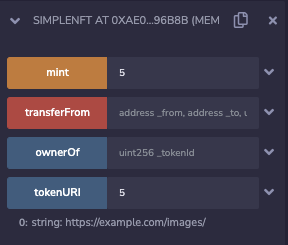

So if I deploy this contract and first of all, if I try to ask hey, what's the tokenURI for 5, it's going to give me an error, it says revert here. So that's what we expected, let's mint token 5, so that we don't have that problem and then when we get tokenURI back, um it's empty, it's only giving us the baseURL, what what what happened? Well, uh! This is not a string. This is an integer and we are effectively trying to mix these two types together which is just not gonna work. So if we wanted to convert this thing to a string, well, ideally we would do something like to string over here, but unfortunately this is not valid solidity. We need to import a library to do this and luckily OpenZeppelin provides us a nice utility for that.

https://github.com/OpenZeppelin/openzeppelin-contracts/blob/master/contracts/utils/Strings.sol

We're going to import OpenZeppelin to get that tostring functionality. So if I look at OpenZeppelin contracts on github, then we will be able to recover the path that we need for that. So if I look inside of contracts and I'm going to look inside of utils and I'm going to look at strings, and here in this library, we have a "toString" utility which is going to take the uint256 and return the the string. This is actually some pretty complicated code here, so luckily we don't have to do that ourselves. Well, let's go back to remix we're going to need to remember this.

```solidity
import "@openzeppelin/contracts/utils/Strings.sol";
```

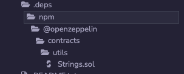

We're going to import "@openzeppelin/contracts/utils/Strings.sol" and then whoops what's going on here. Sorry, let me just comment out this broken code for now and return an empty string so that the compiler stops yelling at us. Now what just happened when I did this, well, if I look inside of the file explorer and then go to npm openzeppelin, then here we have strings.sol that thing from github just got dropped in here. That's what this app thing is doing like this, we're basically just taking a shortcut and doing an npm install for openzeppelin, and then we are following the same path inside of the github in order to get the utility back, so to make this ".tostring" valid. What we need to do is associate uh the this library with the uint256.

```solidity
using Strings for uint256;
```

So if we say "using Strings for uint256", what that is going to do is associate this library with un256. So if we call .toString on a uint256, then that's effectively going to put that uint256 inside of this function argument and just give us the string back. So that's I know this is throwing a bit more information at you, but you're going to see this pattern all the time so we might as well learn it now.

```solidity
function tokenURI(uint256 _tokenId) external view returns (string memory) {
	require(_owners[_tokenId] != address(0), "does not exist.");
	return string(abi.encodePacked(baseURL, _tokenId.toString(), ".jpeg");
}
```

So let's go back here and uncomment this get rid of this, and now this should work as expected. If we wanted to say jpeg at the end, then we could just say jpeg and now all of these things are going to fall together quite nicely. So I'm I compiled it by hitting uh command s on my macbook and now I'm going to erase the old contract, deploy this one and mint token 5 and get the url for token 5 and there it is https://example.com/images/5.jpeg, make that a little nicer, okay cool! So this is how we can have jpegs associated with our smart contract which is on the blockchain fully.

When you looked at this, you notice that hey wait a second. This doesn't make sense. If we only allow msg.sender to initiate the transactions, then if we buy something on opensea, how on earth is this going to work? Because if I try to buy this, I'm not the owner of this particular nft. So when I hit checkout, I'm not going to be able to move the nft out of this person's wallet into my wallet or I guess it's technically not inside of the wallet, but I don't have the authority to change this associative array over here, changing that particular nft to my address that's what happens when the ownership changes. So how can we solve this?

```solidity
    /// @notice Enable or disable approval for a third party ("operator") to manage
    ///  all of `msg.sender`'s assets
    /// @dev Emits the ApprovalForAll event. The contract MUST allow
    ///  multiple operators per owner.
    /// @param _operator Address to add to the set of authorized operators
    /// @param _approved True if the operator is approved, false to revoke approval
    function setApprovalForAll(address _operator, bool _approved) external;
```

Well, according to the erc721 specification, we can have a function called setApprovalForAll which is going to enable or disable approval for a third party ("operator") to manage all of msg.sender's assets. So what that means on opensea is you can allow opensea to manage all of your assets and or at least all of your assets for a particular nft collection and that will allow them to move the nft out of your wallet and into the buyer's wallet. So we can actually uh see that in action here, so this person must have granted opensea access to... let's copy this, it must have granted opensea approval to move the asset out. 

etherscan.io/tokenapprovalchecker

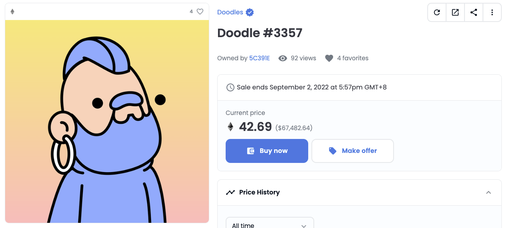

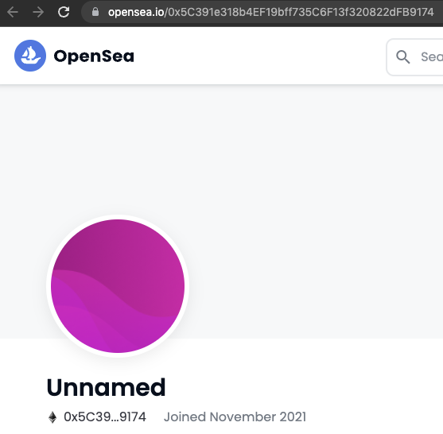

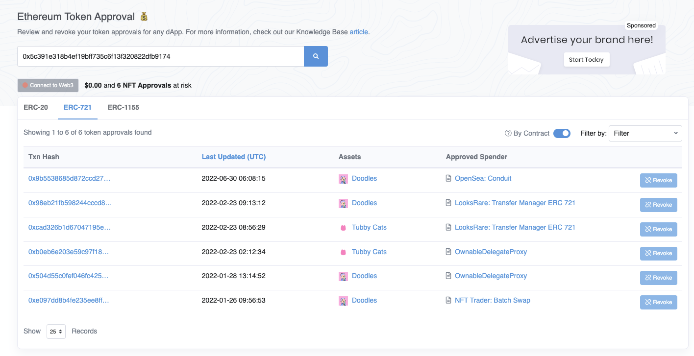

So if we look at uh etherscan token approval, you can actually see that in action. So I'm going to put this person's address in there and if we look at erc721, okay here he has approved this doodle's asset to be controlled by opensea. Okay, now this particular approval thing is coming, excuse me, is coming from this (指setApprovalForAll方法) being set all right. 

Now, you can imagine that this is kind of dangerous, because if you allow another address to move around assets for you, then it can steal them, and this is certainly a somewhat controversial design decision for tokens, because it certainly introduces a security vulnerability and there have been token thieves because of this kind of a thing, but this is the specification and that's what we have to learn about. So let's keep going with this.

```solidity
mapping(address => mapping(address => bool)) private _operators;
```

Now, let's create a data structure that allows us to track this thing. So what it's saying is we need to be able to approve or disapprove. So what we are going to have is a mapping from address to another mapping that goes from address to boolean and we're going to call this operators. Okay, what on earth is going on here?

Well, this (指第一个address) is going to be msg.sender. This (值第二个address) is going to be the address you are approving which the example we've been using is opensea smart contract and then a boolean to say, if it's approved or not, and now we can set this, well, I need to copy over this function don't I?

```solidity
function setApprovalForAll(address _operator, bool _approved) external {
	_operators[msg.sender][_operator] = _approved;
}
```

So, let's copy this, over here, and then we are going to... then we're going to take this variable and say: msg.sender will be the first address, the operator is the one we are granting privileges to, and we will say that if they are approved or not. Now how can we actually set this inside of the transfer? Well, what we need to do is say, only the owner is allowed to transfer things, but the other thing we want to check for is if msg.sender is approved for the _from address.

```solidity
function transferFrom(address _from, address _to, uint256 _tokenId) external payable {
	// check if the token id exists
	require(_owners[_tokenId] != address(0), "token does not minted.");
	require(_owners[_tokenId] == _from, "token does not minted.");
	// || 之后为新添加的部分
	require(msg.sender == _from || _operators[_from][msg.sender], "required to be owner");
	
	_owners[_tokenId] = _to;
}
```

So what we will do is operators from and then msg.sender and this just will return a boolean. So if this is true then this will pass. Okay, so what's going on here is saying msg.sender can obviously move their own assets, or if msg.sender is an approved operator for where the nft is coming from, then we are allowed to conduct this also. Now there is something that we need to take care of here, after it's, after this nft has been transferred, then we should set this thing back to false so because the asset is no longer owned by this person anymore.

```solidity
function transferFrom(address _from, address _to, uint256 _tokenId) external payable {
	// check if the token id exists
	require(_owners[_tokenId] != address(0), "token does not minted.");
	require(_owners[_tokenId] == _from, "token does not minted.");
	// || 之后为新添加的部分
	require(msg.sender == _from || _operators[_from][msg.sender], "required to be owner");
	
	_operators[_from][msg.sender] = false;
	_owners[_tokenId] = _to;
}
```

So we should just get rid of the privileges, so there's no floating privileges, so I'm going to do, operators and get from and msg.sender, then we're going to set it back to false. Okay um, what just happened. Oh I put the variables in wrong. Sorry so this is _from and this is _from also, let's see this in action.

We are going to deploy this contract and we want to set an approval, so right now I'm operating as 5b3 as usual, I'm going to mint it, and now I want to approve this address to be able to manage my all of my tokens. I'm going to copy this put that in here and this address this dd87 address can now manage all of my tokens that are owned by 5b3. Okay, so we're going to set this to true and transact, now that that is set, then we can see the operator moving the token on behalf of the original owner. So let's copy the original owner and from and let's say we're going to move it to this address, ab8 we'll copy that put it in here and we will move token 5. Now the person who can actually conduct this transaction is either the owner or the approved one. Let's do the approved one just to make this interesting and before we do that, let's see that the owner of token token5 is in fact 5b38. We conduct the transfer it goes through, and when we check the owner again it has moved to ab8.

Okay. Now, it's probably would be really handy to know if you know if an address is approved for another address, so the erc721 specification has this "isApprovedForAll" uh function over here, which is just returning the values that are inside of here (指了下setApprovalForAll方法) ,

```solidity
function isApprovedForAll(address _owner, address _operator) external view returns (bool) {
	return _operators[_owner][_operator];
}
```

because it returns bool as you can see, so we will just return. This owner, obviously, okay so setApprovalForAll and isApprovedForAll lets you manage any nft regardless. If you wanted to give someone more granular privileges, then you could use "approve" and that will only allow it for a certain token id, so this is safer if you wanted, say a smart contract to be moving only particular token ids, there's just no reason to set to do set approval for all, because that gives you too much privileges. So we're not actually going to implement uh this one for now, because I don't want to bore you with the details and we're going to move over to OpenZeppelin fairly soon. But I just wanted to show you how erc721 gives you a mechanism to move assets that are not owned by you to another address, assuming that the original owner has given the privileges to the appropriate smart contract or wallet.

Now there is one more interesting thing that we need to cover that you may have been wondering about. You will note that opensea seems to pick up pretty well that oh there's this is tokenid 8066, 2331, 1633 and so on. So how does opensea know all of these numbers in the first place, if our contract, well, we said it could go from 0 to 99, but opensea is not going to read the source code inside of our smart contract and determine that because this is pretty arbitrarily structured right? In fact, the erc721 specification specifically says: "While some erc721 smart contracts may find it convenient to start with id 0 and simply increment by 1 for each new nft, callers shall not assume that the id numbers have any specific pattern to them and must treat the id as a 'black box'".

Ok, so how can opensea know this because there's no guarantee that the ids will be sequential, well, that is where the "events" come in handy. So whenever you conduct a transfer, you are supposed to log that event to the ethereum blockchain or log or emit an event. That means the same thing in the context of ethereum. 

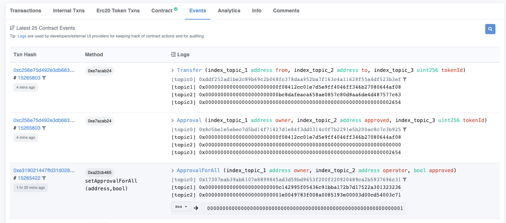

So when you look at the actual smart contract for this, let's again go back to contract address. If we look at the events, then we are going to see a transfer from a certain address to another address and another topic, which is the token id. So there was a transfer from this address to this address, using this token id, which is written in hexadecimal, but if we convert this to decimal, we'll see it corresponds to the token id. By looking at all of the transfers that's how you are able to figure out, well, which token ids exist and "to" who owns them because remember

```solidity
mapping(uint256 => address) private _owners;
```

 if you look back here, we can once we once we know all of the token ids that exist, then we can outside of the blockchain, just keep calling ownerOf over and over again and find out which addresses own things, that's how opensea is able to know who owns each of these assets.

```solidity
    /// @dev This emits when ownership of any NFT changes by any mechanism.
    ///  This event emits when NFTs are created (`from` == 0) and destroyed
    ///  (`to` == 0). Exception: during contract creation, any number of NFTs
    ///  may be created and assigned without emitting Transfer. At the time of
    ///  any transfer, the approved address for that NFT (if any) is reset to none.
    event Transfer(address indexed _from, address indexed _to, uint256 indexed _tokenId);
```

Okay. So if we wanted to actually implement this ourselves properly, we can create the event like so and then emit this event.

```solidity
 function transferFrom(address _from, address _to, uint256 _tokenId) external payable {
   // check if the token id exists
   require(_owners[_tokenId] != address(0), "token does not minted.");
   require(_owners[_tokenId] == _from, "token does not minted.");
   require(msg.sender == _from || _operators[_from][msg.sender], "required to be owner");

  // 新添加部分
  emit Transfer(_from, _to, _tokenId);
  _operators[_from][msg.sender] = false;
  _owners[_tokenId] = _to;
}
```

So we can on a transfer, emit transfer, and this is going to be _from, _to, _tokenId.

```solidity
function mint(uint256 _tokenId) external {
  require(_owners[_tokenId] == address(0), "already minted");
  require(_tokenId < 100, "_tokenId too large");
  // 新添加部分
  emit Transfer(address(0), msg.sender, _tokenId);
  _owners[_tokenId] = msg.sender;
}
```

Okay, another thing that we need to do is when we mint this thing. This is also considered a transfer, because if we mint something but we don't admit an event, then opensea or other marketplaces have no way of knowing that token came into existence, or at least not a very it's very inconvenient for them to find out, so we will also emit a transfer event here, and this will be from address 0 (from address(0) is convention for minting), it will go to msg.sender and the tokenId will be the tokenId that was just created. 

```solidity
/// @dev This emits when the approved address for an NFT is changed or
///  reaffirmed. The zero address indicates there is no approved address.
///  When a Transfer event emits, this also indicates that the approved
///  address for that NFT (if any) is reset to none.
event Approval(address indexed _owner, address indexed _approved, uint256 indexed _tokenId);

/// @dev This emits when an operator is enabled or disabled for an owner.
///  The operator can manage all NFTs of the owner.
event ApprovalForAll(address indexed _owner, address indexed _operator, bool _approved);
```

Similarly, we have events for approval and approveForAll, so based off of the thing we did in the last video (应该是指前边的内容，这个视频经过他自己剪辑了) .

```solidity
function setApprovalForAll(address _operator, bool _approved) external {
	_operators[msg.sender][_operator] = _approved;
	emit ApprovalForAll(msg.sender, _operator, _approved);
}
```

If we wanted to follow the specification, we also need to specify an ApprovalForAll event and put that whoops and put that inside of this function. So emit approve for all and the owner will, of course, be msg.sender and the operator will just be the operator. So I will delete this, and approved is if the approval was given or not.

```solidity
/// @notice Count all NFTs assigned to an owner
/// @dev NFTs assigned to the zero address are considered invalid, and this
///  function throws for queries about the zero address.
/// @param _owner An address for whom to query the balance
/// @return The number of NFTs owned by `_owner`, possibly zero
function balanceOf(address _owner) external view returns (uint256);
```

Okay, at this point, we've covered almost everything, so we've discussed what these events are. The only thing we haven't looked at is balanceOf which we will get to the next video. The last thing that we're going to look at is the balanceOf function. Now this is rarely used in practice, so I'm not going to go into it in too much detail, but it is helpful to know what it is and what it does. What it does is it "count all nfts assigned to an owner", and this means, if you own token id 5, 10 and 12, then your balanceOf would be 3. If you ask it about the zero address, it's considered invalid and it should throw an exception. Okay, let's implement it.

```solidity
mapping(address => uint256) private _balances;

function mint(uint256 _tokenId) external {
  require(_owners[_tokenId] == address(0), "already minted");
  require(_tokenId < 100, "_tokenId too large");
  emit Transfer(address(0), msg.sender, _tokenId);
  _owners[_tokenId] = msg.sender;
  
  // 新添加内容
  _balances[msg.sender] += 1;
}
```

Now how this will traditionally track things is with a mapping that goes from address to uint256, and this would be stored in balances, when we mint it we're going to want to increment the balance. For this address, so when it's minted now they own one piece, or at least one more piece than they used to so the balance is incremented.

```solidity
function transferFrom(address _from, address _to, uint256 _tokenId) external payable {
  // check if the token id exists
  require(_owners[_tokenId] != address(0), "token does not minted.");
  require(_owners[_tokenId] == _from, "token does not minted.");
  require(msg.sender == _from || _operators[_from][msg.sender], "required to be owner");

  emit Transfer(_from, _to, _tokenId);
  _operators[_from][msg.sender] = false;
  _owners[_tokenId] = _to;
  
  // 新添加内容
  _balances[_from] -= 1;
  _balances[_to] += 1;
}

function balanceOf(address _owner) external view returns (uint256) {
	require(_owner != address(0), "zero address");
	return _balances[_owner];
}
```

The other time that someone's balance might change is on the transferFrom, so the person who is sending the nft has their balance decremented and the person receiving the nft has their balance incremented, no surprises there and so the actual implementation we'll simply check that we're not asking about the zero address and then just return the balances of the address in question.

So let's see this in action we will deploy our contract as usable and the address we are using is zero a0. So let's copy that and mint a few nfts for ourselves, we will mint 5, 12 and 10. Our balance of as expected should be 3, and if we conduct a transfer then this should go down. So if we transfer from our owner address to a different address and let's transfer number 5, we can uh oops, I didn't switch that, there we go. Let's do number 5 and we see that our balanceOf has gone down and if we look at the recipient, we expect to see a balance of 1. If we ask for the balance of an address that doesn't have anything, then we will get 0 which is to be expected.

https://github.com/OpenZeppelin/openzeppelin-contracts/blob/master/contracts/token/ERC721/ERC721.sol

We are now ready to dive into the OpenZeppelin contract and understand what's really going on, when we first look at the erc721 nft implementation by OpenZeppelin there's going to be a lot of unfamiliar stuff at first glance. That's why I wanted to really build out the protocol step by step so that you don't get overwhelmed by seeing a bunch of new stuff here, with the exception of the Strings library which we use to convert integers to strings, a lot of this will be unfamiliar, but that's okay, we're going to cover it later.

```solidity
// Token name
string private _name;

// Token symbol
string private _symbol;

/**
* @dev See {IERC721Metadata-name}.
*/
function name() public view virtual override returns (string memory) {
	return _name;
}

/**
* @dev See {IERC721Metadata-symbol}.
*/
function symbol() public view virtual override returns (string memory) {
	return _symbol;
}
```

There are two new things that we see here. One is a string private name and a string private symbol. These are later paired with getter functions, name and symbol.

```solidity
// The metadata extension is OPTIONAL for ERC-721 smart contracts (see “caveats”, below). This allows your smart contract to be interrogated for its name and for details about the assets which your NFTs represent.

/// @title ERC-721 Non-Fungible Token Standard, optional metadata extension
/// @dev See https://eips.ethereum.org/EIPS/eip-721
///  Note: the ERC-165 identifier for this interface is 0x5b5e139f.
interface ERC721Metadata /* is ERC721 */ {
    /// @notice A descriptive name for a collection of NFTs in this contract
    function name() external view returns (string _name);

    /// @notice An abbreviated name for NFTs in this contract
    function symbol() external view returns (string _symbol);

    /// @notice A distinct Uniform Resource Identifier (URI) for a given asset.
    /// @dev Throws if `_tokenId` is not a valid NFT. URIs are defined in RFC
    ///  3986. The URI may point to a JSON file that conforms to the "ERC721
    ///  Metadata JSON Schema".
    function tokenURI(uint256 _tokenId) external view returns (string);
}
```

And these two are part of the extended metadata option for erc721.

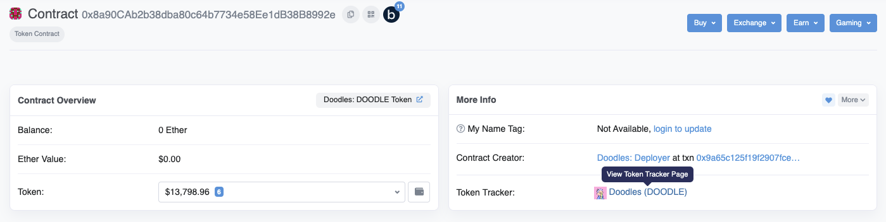

And if you look at a nft contract, you will see them being used by etherscan and by other websites, so BoardApeYachtClub (这里是Doodles) is what was set for the name and BAYC (这里是DOODLE) was the token.

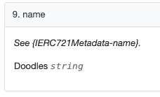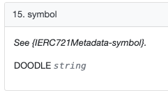

In fact, if we were to call those functions over here, let's find name and we see it is BoardApeYachtClub (这里是Doodles) and token or I'm sorry and symbol would be BAYC (这里是DOODLE). This is optional, but you should definitely include them in your contracts. But that's, but don't worry, because open zeppelin will include that for you.

```solidity
// Mapping from token ID to owner address
mapping(uint256 => address) private _owners;

// Mapping owner address to token count
mapping(address => uint256) private _balances;

// Mapping from token ID to approved address
mapping(uint256 => address) private _tokenApprovals;

// Mapping from owner to operator approvals
mapping(address => mapping(address => bool)) private _operatorApprovals;
```

So let's keep going, over here we see the mappings that we had created from earlier. We had just looked at the _balances which is keeping the per address balance of how many tokens somebody owns inside of a collection. We saw the _owners which is the mapping from the tokenId to who owns it, and we have the _operatorApprovals which is saying for this particular owner has he or she provided operator approval to an external address, true or false. The, remember how we said the single token approval is more secure because it doesn't offer as many privileges, well, here we have it, for a given token who is authorized to use it besides the owner.

```solidity
    /**
    * @dev Initializes the contract by setting a `name` and a `symbol` to the token collection.
    */
    constructor(string memory name_, string memory symbol_) {
      _name = name_;
      _symbol = symbol_;
    }
```

In the constructor phase, the name and the symbol are set, but that's all.

```solidity
    /**
     * @dev See {IERC165-supportsInterface}.
     */
    function supportsInterface(bytes4 interfaceId) public view virtual override(ERC165, IERC165) returns (bool) {
        return
            interfaceId == type(IERC721).interfaceId ||
            interfaceId == type(IERC721Metadata).interfaceId ||
            super.supportsInterface(interfaceId);
    }
    
    /**
     * @dev See {IERC721-balanceOf}.
     */
    function balanceOf(address owner) public view virtual override returns (uint256) {
        require(owner != address(0), "ERC721: address zero is not a valid owner");
        return _balances[owner];
    }
    
    /**
     * @dev See {IERC721-ownerOf}.
     */
    function ownerOf(uint256 tokenId) public view virtual override returns (address) {
        address owner = _owners[tokenId];
        require(owner != address(0), "ERC721: invalid token ID");
        return owner;
    }
```

SupportsInterface is not something we've seen before, but we'll cover it later, here is balanceOf which is the function we worked on earlier. As noted, the zero address cannot have a balance, otherwise it just returns the value that's stored inside of the mapping, ownerOf is the same function we implemented at the beginning, it just returns who owns a particular token id and, of course, the zero address cannot own a token id. We just looked at name and symbol, these are the functions that return these private variables. tokenURI, this is something we had implemented earlier, which gave us the off chain url that to point to the actual asset which were jpegs in our, in our case.

```solidity
    /**
     * @dev See {IERC721Metadata-tokenURI}.
     */
    function tokenURI(uint256 tokenId) public view virtual override returns (string memory) {
        _requireMinted(tokenId);

        string memory baseURI = _baseURI();  // Todo
        return bytes(baseURI).length > 0 ? string(abi.encodePacked(baseURI, tokenId.toString())) : "";
    }
    
    /**
     * @dev Base URI for computing {tokenURI}. If set, the resulting URI for each
     * token will be the concatenation of the `baseURI` and the `tokenId`. Empty
     * by default, can be overridden in child contracts.
     */
    function _baseURI() internal view virtual returns (string memory) {
        return "";
    }
```

_base.URI you'll see something interesting here, because it's hard coded to be an empty string, but what they actually expect you to do is to override this internal function with the actual base url, and when you overwrite it, then that's going to do what we did earlier, it's going to take the baseURI (指tokenURI函数里 Todo那行的baseURI), which comes from this function, which you should override and then effectively concatenate it with the token id which is converted to a string. So this is how you can have a per token id url, you'll note that this doesn't really allow you to have an extension at the end. So if you wanted to have a .json or a .jpeg file, you'll have to override the entire function yourself.

```solidity
    /**
     * @dev See {IERC721-approve}.
     */
    function approve(address to, uint256 tokenId) public virtual override {
        address owner = ERC721.ownerOf(tokenId);
        require(to != owner, "ERC721: approval to current owner");

        require(
            _msgSender() == owner || isApprovedForAll(owner, _msgSender()),
            "ERC721: approve caller is not token owner or approved for all"
        );

        _approve(to, tokenId);
    }
    
    /**
     * @dev Approve `to` to operate on `tokenId`
     *
     * Emits an {Approval} event.
     */
    function _approve(address to, uint256 tokenId) internal virtual {
        _tokenApprovals[tokenId] = to;
        emit Approval(ERC721.ownerOf(tokenId), to, tokenId);
    }
```

Approve is a single token approval, so this one allows an owner of a particular token id to give authority to an external address for that particular token id, one thing that can help make sense of the pattern of code in this library is that the actual implementation is carried out by internal functions that are prepended with an underscore. So if we look for the implementation of _approve, then this is where the token approval is actually assigned the address that is approved to manage it and the event is emitted. So this is the actual business logic, but it's internal and external contracts or wallets cannot just call it because it needs to be gated with the require statements that make sure that only the people with the authority to conduct this operation are conducting it. So, first of all, we have the checks and then we actually carry out the business logic. The internal function actually conducts the logic and the public gives you access, but between it there are some security checks in place, and you will see this pattern a lot where you see a function with the external facing name being public, but the internal one being prepended with an underscore and being inside of the public facing function.

```solidity
    /**
     * @dev See {IERC721-getApproved}.
     */
    function getApproved(uint256 tokenId) public view virtual override returns (address) {
        _requireMinted(tokenId);

        return _tokenApprovals[tokenId];
    }
```

getApproved simply returns the address that is approved for a particular token id.

```solidity
    /**
     * @dev See {IERC721-setApprovalForAll}.
     */
    function setApprovalForAll(address operator, bool approved) public virtual override {
        _setApprovalForAll(_msgSender(), operator, approved);
    }
    
    /**
     * @dev Approve `operator` to operate on all of `owner` tokens
     *
     * Emits an {ApprovalForAll} event.
     */
    function _setApprovalForAll(
        address owner,
        address operator,
        bool approved
    ) internal virtual {
        require(owner != operator, "ERC721: approve to caller");
        _operatorApprovals[owner][operator] = approved;
        emit ApprovalForAll(owner, operator, approved);
    }
```

setApprovalForAll is the same function we had implemented earlier in order to allow marketplaces to trade tokens on the seller's behalf, so setApprovalForAll is actually implemented in this internal function over here, and it's just setting the nested mapping the way we did earlier and emitting the event that is required by the specification.

```solidity
    /**
     * @dev See {IERC721-isApprovedForAll}.
     */
    function isApprovedForAll(address owner, address operator) public view virtual override returns (bool) {
        return _operatorApprovals[owner][operator];
    }
```

isApprovedForAll returns what's inside of the mapping.

```solidity
    /**
     * @dev See {IERC721-transferFrom}.
     */
    function transferFrom(
        address from,
        address to,
        uint256 tokenId
    ) public virtual override {
        //solhint-disable-next-line max-line-length
        require(_isApprovedOrOwner(_msgSender(), tokenId), "ERC721: caller is not token owner or approved");

        _transfer(from, to, tokenId);
    }
```

And transferFrom implements the transfer function that we had done, but before it does that it checks if the person is approved or owner, so are they the owner of the token or have they been added as an approved operator by the address, now note this funny msg.sender (指_msgSender()) over here. This doesn't quite look like what we were expecting it to, again this is one reason that I wanted to actually implement it ourselves so that we don't get overwhelmed with all of these implementation details, but don't worry, I will get to that later.

```solidity
    /**
     * @dev See {IERC721-safeTransferFrom}.
     */
    function safeTransferFrom(
        address from,
        address to,
        uint256 tokenId
    ) public virtual override {
        safeTransferFrom(from, to, tokenId, "");
    }

    /**
     * @dev See {IERC721-safeTransferFrom}.
     */
    function safeTransferFrom(
        address from,
        address to,
        uint256 tokenId,
        bytes memory data
    ) public virtual override {
        require(_isApprovedOrOwner(_msgSender(), tokenId), "ERC721: caller is not token owner or approved");
        _safeTransfer(from, to, tokenId, data);
    }
    
    /**
     * @dev Safely transfers `tokenId` token from `from` to `to`, checking first that contract recipients
     * are aware of the ERC721 protocol to prevent tokens from being forever locked.
     *
     * `data` is additional data, it has no specified format and it is sent in call to `to`.
     *
     * This internal function is equivalent to {safeTransferFrom}, and can be used to e.g.
     * implement alternative mechanisms to perform token transfer, such as signature-based.
     *
     * Requirements:
     *
     * - `from` cannot be the zero address.
     * - `to` cannot be the zero address.
     * - `tokenId` token must exist and be owned by `from`.
     * - If `to` refers to a smart contract, it must implement {IERC721Receiver-onERC721Received}, which is called upon a safe transfer.
     *
     * Emits a {Transfer} event.
     */
    function _safeTransfer(
        address from,
        address to,
        uint256 tokenId,
        bytes memory data
    ) internal virtual {
        _transfer(from, to, tokenId);
        require(_checkOnERC721Received(from, to, tokenId, data), "ERC721: transfer to non ERC721Receiver implementer");
    }
```

Remember how safeTransferFrom had two possible signatures. One had bytes and the other one didn't, well, under the hood, OpenZeppelin is just going, If you call the safeTransferFrom signature without the bytes as part of the argument, then it's just going to call its own safeTransferFrom implementation with the bytes being empty, and here is the safeTransferFrom with giving bytes as an option to be specified inside of the argument. _safeTransfer conducts a transfer and then checks if the receiver is, if they are a smart contract, are they actually able to receive the tokens. Now this might look kind of funny, but ethereum transactions are all-or-nothing. So if you conduct a transfer and then revert it then the transfer is reverted also.

```solidity
    /**
     * @dev Returns whether `tokenId` exists.
     *
     * Tokens can be managed by their owner or approved accounts via {approve} or {setApprovalForAll}.
     *
     * Tokens start existing when they are minted (`_mint`),
     * and stop existing when they are burned (`_burn`).
     */
    function _exists(uint256 tokenId) internal view virtual returns (bool) {
        return _owners[tokenId] != address(0);
    }
```

_exists is just a nice shortcut function for us checking, remember we can't get a uri for a token that is not part of the collection. Well, this is a more general form of it. Just, if the mapping holding the owner is not pointing to the zero address then it's assumed to exist.

```solidity
    /**
     * @dev Returns whether `spender` is allowed to manage `tokenId`.
     *
     * Requirements:
     *
     * - `tokenId` must exist.
     */
    function _isApprovedOrOwner(address spender, uint256 tokenId) internal view virtual returns (bool) {
        address owner = ERC721.ownerOf(tokenId);
        return (spender == owner || isApprovedForAll(owner, spender) || getApproved(tokenId) == spender);
    }
```

_isApprovedOrOwner is what it sounds like it just checks for a particular token id is the spender allowed to spend it or are they the original owner via this mechanism (指ERC721.ownerOf(tokenId)).

```solidity
    /**
     * @dev Safely mints `tokenId` and transfers it to `to`.
     *
     * Requirements:
     *
     * - `tokenId` must not exist.
     * - If `to` refers to a smart contract, it must implement {IERC721Receiver-onERC721Received}, which is called upon a safe transfer.
     *
     * Emits a {Transfer} event.
     */
    function _safeMint(address to, uint256 tokenId) internal virtual {
        _safeMint(to, tokenId, "");
    }

    /**
     * @dev Same as {xref-ERC721-_safeMint-address-uint256-}[`_safeMint`], with an additional `data` parameter which is
     * forwarded in {IERC721Receiver-onERC721Received} to contract recipients.
     */
    function _safeMint(
        address to,
        uint256 tokenId,
        bytes memory data
    ) internal virtual {
        _mint(to, tokenId);
        require(
            _checkOnERC721Received(address(0), to, tokenId, data),
            "ERC721: transfer to non ERC721Receiver implementer"
        );
    }
```

_safement and _safement is analogous to transfer and safeTransfer what _safement is going to do is do a regular _mint and then check if the recipient was a smart contract and if so, then make sure that it actually is a, has the mechanism to interact with erc721 contracts. This is something that I'll get into more detail later, so don't worry about that for now.

```solidity
    /**
     * @dev Mints `tokenId` and transfers it to `to`.
     *
     * WARNING: Usage of this method is discouraged, use {_safeMint} whenever possible
     *
     * Requirements:
     *
     * - `tokenId` must not exist.
     * - `to` cannot be the zero address.
     *
     * Emits a {Transfer} event.
     */
    function _mint(address to, uint256 tokenId) internal virtual {
        require(to != address(0), "ERC721: mint to the zero address");
        require(!_exists(tokenId), "ERC721: token already minted");

        _beforeTokenTransfer(address(0), to, tokenId);

        _balances[to] += 1;
        _owners[tokenId] = to;

        emit Transfer(address(0), to, tokenId);

        _afterTokenTransfer(address(0), to, tokenId);
    }
```

Here's the actual mint functionality. First of all, we require that we can't mint to the zero address and, second of all, we can't mint something that we have minted already and here's the changes in balances that we had talked about, and this is where the ownership is actually set, and it emits the event that is required.

```solidity
    /**
     * @dev Hook that is called before any token transfer. This includes minting
     * and burning.
     *
     * Calling conditions:
     *
     * - When `from` and `to` are both non-zero, ``from``'s `tokenId` will be
     * transferred to `to`.
     * - When `from` is zero, `tokenId` will be minted for `to`.
     * - When `to` is zero, ``from``'s `tokenId` will be burned.
     * - `from` and `to` are never both zero.
     *
     * To learn more about hooks, head to xref:ROOT:extending-contracts.adoc#using-hooks[Using Hooks].
     */
    function _beforeTokenTransfer(
        address from,
        address to,
        uint256 tokenId
    ) internal virtual {}

    /**
     * @dev Hook that is called after any transfer of tokens. This includes
     * minting and burning.
     *
     * Calling conditions:
     *
     * - when `from` and `to` are both non-zero.
     * - `from` and `to` are never both zero.
     *
     * To learn more about hooks, head to xref:ROOT:extending-contracts.adoc#using-hooks[Using Hooks].
     */
    function _afterTokenTransfer(
        address from,
        address to,
        uint256 tokenId
    ) internal virtual {}
```

The before token transfer and after token transfer are utilities that you can specify on your own uh later. So what it does is it gives you an ability to override this function and say, oh maybe I don't want to transfer to certain addresses, so inside of this function I could just replace it with a list of addresses that I don't want to transfer to or have some other logic, maybe like a time lock or something.

```solidity
    /**
     * @dev Internal function to invoke {IERC721Receiver-onERC721Received} on a target address.
     * The call is not executed if the target address is not a contract.
     *
     * @param from address representing the previous owner of the given token ID
     * @param to target address that will receive the tokens
     * @param tokenId uint256 ID of the token to be transferred
     * @param data bytes optional data to send along with the call
     * @return bool whether the call correctly returned the expected magic value
     */
    function _checkOnERC721Received(
        address from,
        address to,
        uint256 tokenId,
        bytes memory data
    ) private returns (bool) {
        if (to.isContract()) {
            try IERC721Receiver(to).onERC721Received(_msgSender(), from, tokenId, data) returns (bytes4 retval) {
                return retval == IERC721Receiver.onERC721Received.selector;
            } catch (bytes memory reason) {
                if (reason.length == 0) {
                    revert("ERC721: transfer to non ERC721Receiver implementer");
                } else {
                    /// @solidity memory-safe-assembly
                    assembly {
                        revert(add(32, reason), mload(reason))
                    }
                }
            }
        } else {
            return true;
        }
    }
```

And here's the _checkOnERC721Received again. This is something that we will get to later, but this is for dealing with um, sending erc 721 tokens to smart contracts.

Okay and then that covers it. There was, even after all, of the material we've looked at so far, there was still a lot of stuff. I said I have to cover later. That's why I wanted to break it down piece by piece, but the stuff that we'll be covering later is not as core to the functionality to erc 721. So we will not need to review that in depth until we've actually implemented some tokens using this library and then we'll be able to have more motivated examples for studying these new functions. 

```solidity
pragma solidity ^0.8.7;

import "@openzeppelin/contracts/utils/Strings.sol";
import "@openzeppelin/contracts/token/ERC721/ERC721.sol";

contract OpeenZepplinNFT is ERC721 {

}
```

Now that we've covered the groundwork for the OpenZeppelin erc721 implementation, we can start moving pretty quickly in implementing our own fnfts using that library. So I've imported the OpenZeppelin erc721 solidity file that we just looked at and I've created a contract that extends it now. The compiler is unhappy with me right now, because I haven't overridden the constructor and remember the constructor in the source code that we just looked at requires us to specify a name and a symbol.

```solidity
contract OpenZeppelinNFT is ERC721 {
	constructor() ERC721("MyNFT", "MN") {
		
	}
}
```

So let's do that. We will have our own constructor, which won't do anything yet, but then we have to override the constructor for the parent contract. So the first argument is the name and the next one is the symbol. So let's call this um MyNFT and MN. Okay, that's a pretty pathetic name, I'm sorry, but it gets the point across, so we will close it off like this and I will recompile it and now it's happy. Okay. So let's actually run it the way. It's right now to see what's going on. Okay, so I've compiled it and I will and I will select the file that we've been using. Okay, now, we've hard coded what the name and uh symbol are, So it's "MyNFT" and "MN", the base uri, well, we actually, we cannot ask about tokenURI right now, because no nothing has been minted and we don't actually have the ability to mint anything. But here we have our transfer functions created for us, as well as the approval functions and the balanceOf which, of course, is going to be zero for everybody, because nothing has been minted yet. So we will add the mint functionality in the next video.

```solidity
function mint() {
	_mint(msg.sender, tokenId);
}
```

Okay, let's add the mint functionality, we are going to create a function called mint and what we are going to have to do is call the internal mint function, so because we've inherited from erc721, this function, _mint is available to us, it's internal and we are creating a child contract, an internal functions are available to the children. This is kind of like protected in java. If you have done that before. So, let's call the internal _mint, what is required as part of the signature there, is a "to" address and a token id, so we will just say it will be minted to the person who's calling it and then we need to specify the token id. So how, well, let's follow convention and do it this way. So how are we going to set this because, obviously, if I try to compile this, it's going to yell at me. Well, it's going to yell at me about a couple things: one is I didn't specify function visibility here, so let's get rid of that and I also didn't specify tokenid, so the pretty classic way of handling this is to specify the token supply manually. Now some variations of erc721 have token supply built into the specifications, we will get that later.

```solidity
uint256 public tokenSupply = 0;
```

We will get to that later, but for now, let's just do it this way, uint I'm sorry, uint 256 public tokenSupply is equal to 0. You don't actually need to do this because variables default to 0, but I'm just doing that to make it explicit for now. So when you're starting off nothing has been minted. So when this is minted, then the first nft will be token 0.

```solidity
function mint() {
	_mint(msg.sender, tokenSupply);
	tokenSupply++;
}
```

And then after that, we are going to want to increment the tokenSupply like this. So every time somebody calls mint, the sequential id will be minted. So let's try that out. Let me get rid of this old contract and deploy this, uh when you deploy this, make sure that you select the file you're actually using, because if you select OpenZepplin implementation then the mint function won't be there, because they have underscore _mint which is not public, and you can't see it.

All right, let's min some stuff. So if I hit mint, okay, supposedly I just created an nft, let's see if I actually did, so who is the owner of tokenId 0? Well, that's me. Okay, fantastic. Now, let's see my balance and I have 1. All right, so if I mint again, then my balance should be 2 and if somebody else mints, I will just change to this account, and press mint. Now the owner of token 2 is that new address. Okay cool. Now this is how tokens come into existence. So, let's make this a little bit more sophisticated because one thing we... because two things are missing here, one is we want to generally limit the supply of nfts, so I assume most of you watching this are trying to build nfts for like a profile picture collection and those typically are limited to a supply of like 1000 or 3000 or 5000 or 10000 or something like that. So we want to limit the supply and that's probably pretty easy to do and the other one is we want to accept payments, so I will show you how to do both of those in the following videos.

```solidity
uint256 public constant MAX_SUPPLY = 5;
```

Okay, limiting the supply should be quite easy. Usually the pattern is to specify the maximum supply up here, uh with a constant and let's just say that we're setting the maximum supply to 5, just so that we can easily test, this would be quite small, you would probably make it more like 5000, but let's say 5 for now, and the other thing we'll want to do is to make this constant, because well, first of all, your customers generally expect that this should not be modified and, second of all, constant variables are actually more gas efficient than regular variables, because when you have a public variable that isn't a constant it, this gets stored inside of the ethereum state and you have to do read and write io access to access this particular variable and that can drive up the gas cost we'll talk a little bit more about that later, but if you really want to dive into it, you can take my gas course on solidity, link in the description, constant variables are cheaper because this is actually stored inside of the contract's byte code. So, as the code is executing, it can more directly access that variable.

```solidity
function mint() {
	require(tokenSupply < MAX_SUPPLY, "supply used up");
	_mint(msg.sender, tokenSupply);
	tokenSupply++;
}
```

Anyway what we would add over here is a require statement and we want to say tokenSupply is less than MAX_SUPPLY and we would say "supply used up" or something like that. So will this work? Well, we are going, if we are currently at token supply 0, this will pass, at 1 it will pass, at 2 it will pass, at 3 it will pass, at 4 it will pass but the time, but at 4 this will get incremented to 5 and 5 uh is not going to work, because 5 is not less than 5, so we will have 0 1 2 3 and 4 which is a total supply of 5 as expected.

https://github.com/OpenZeppelin/openzeppelin-contracts/blob/master/contracts/access/Ownable.sol

Okay, now, let's discuss withdrawing the funds from the contract. The way this is traditionally done is by making the contract owned by the person who deployed the address and then only withdrawing to that address. So there is an OpenZeppelin library called Ownable.sol

```solidity
abstract contract Ownable is Context {
	address private _owner;
	
  /**
  * @dev Initializes the contract setting the deployer as the initial owner.
  */
  constructor() {
  	_transferOwnership(_msgSender());
  }

  /**
  * @dev Throws if called by any account other than the owner.
  */
  modifier onlyOwner() {
    _checkOwner();
    _;
  }

  /**
  * @dev Returns the address of the current owner.
  */
  function owner() public view virtual returns (address) {
  	return _owner;
  }
  
  /**
  * @dev Throws if the sender is not the owner.
  */
  function _checkOwner() internal view virtual {
  	require(owner() == _msgSender(), "Ownable: caller is not the owner");
  }
}
```

And what this does is it keeps track of the address that deployed the contract, so that this address is able to have special privileges. With the onlyOwner modifier, so _checkOwner is, of course, going to check if the owner() that private variable (指  _owner) is the same as the person interacting with the contract.

```solidity
import "@openzeppelin/contracts/utils/Strings.sol";
import "@openzeppelin/contracts/token/ERC721/ERC721.sol";
import "@openzeppelin/contracts/access/Ownable.sol";

contract OpenZeppelinNFT is ERC721, Ownable {

  uint256 public tokenSupply = 0;
  uint256 public constant MAX_SUPPLY = 5;
  uint256 public constant PRICE = 1 ether;

	constructor() ERC721("MyNFT", "MN") {
		
	}
}
```

So what this would look like is this, it's going to extend the Ownable, willing to import it first, we would import OpenZeppelin contracts uh, what is it, access, ownable.sol, okay, that compiles good and what that's gonna give us access to is the modifier onlyOwner.

```solidity
function withdraw() external onlyOwner {
	payable(msg.sender).transfer(address(this).balance);
}
```

So this is what the withdraw function would look like, okay, so what is going on here? Well, when someone calls withdraw, then the person who calls withdraw will gets sent the money, but only the owner is able to receive the balance and the entire contract balance will be sent to them. So this is a very common pattern that you will see in nft implementations, so I wanted to show it to you. There are some things I don't like about it, which I will explain in a second but first of all, let's see it in action and see that it actually works, so we're going to deploy this contract and for the sake of convenience, I've changed the price to be 1 ethereum. So that way, I don't have to keep copying and all of those numbers with 1 with a bunch of zeros in them. So, first of all, let us have this address, deploy the contract and when we look at the owner variable, I'm sorry the owner function, then we're going to see it 03c6f, okay, now, let's have another address mint an nft, they will have to pay 1 ether for it and they will mint.

```solidity
pragma solidity ^0.8.7;

import "@openzeppelin/contracts/utils/Strings.sol";
import "@openzeppelin/contracts/token/ERC721/ERC721.sol";
import "@openzeppelin/contracts/access/Ownable.sol";

contract OpenZeppelinNFT is ERC721, Ownable {

  uint256 public tokenSupply = 0;
  uint256 public constant MAX_SUPPLY = 5;
  uint256 public constant PRICE = 1 ether;

	constructor() ERC721("MyNFT", "MN") {
		
	}

  function mint() external payable {
    require(tokenSupply < MAX_SUPPLY, "supply used up");
    require(msg.value == PRICE, "wrong price");

    _mint(msg.sender, tokenSupply);
    tokenSupply++;
  }

  function viewBalance() external view returns(uint256) {
  	return address(this).balance;
  }

  function withdraw() external onlyOwner {
  	payable(msg.sender).transfer(address(this).balance);
  }
}
```

Now, let's have them mint, 2 nfts, so we can have 2 ether inside of the contract. Okay, they minted 2 nfts. Now, if this address that is minting tries to call the withdraw function, then it's going to get blocked because it says owner, "Ownable: caller is not the owner". Okay, that's where the security is working as expected. So if we go back to the original address that deployed the contract and then hit withdraw, then it doesn't block, it at work and if we look at the balance of this address now it has 102 ether or 101.99999. Well, that's because the original, the other address, put two ether into the contract and this one withdrew it.

Okay, so what don't I like about this, well, there's a, it gives you some additional functionality that lets you shoot yourself in the foot. The first one is renounceOwnership. So if you do renounceOwnership, what it's going to do is transfer ownership to the zero address, which means any function that has this onlyOwner modifier in front of it, is not going to work, and you, if you renounce ownership before removing the balance, then the ethereum would remain stuck in this contract and you would never be able to withdraw it. This has actually happened to a couple projects sometimes, so I think it just creates an unnecessary risk. The other one is to transfer the ownership, so you could transfer the ownership to another owner and if which this just creates an avenue for something to go wrong. So if you know that, if you end up transferring it to an address that you don't control, then you end up in the same situation, where there's a bunch of functions that you can't use anymore. Now there, now, depending on your design pattern this isn't necessarily a bad thing. Some people might expect you to renounce ownership so that they know that the contract is more decentralized after a certain point and that's fine. But this is something that you should think about the pros and cons of using before you actually do it.

```solidity
function renounceOwnership() public override {
	require(false, "cannot renounce");
}

function transferOwnership(address newOwner) public override {
	require(false, "cannot transfer ownership");
}
```

If you still want to use this ownable library in this pattern, then what you can do is override those functions, so you could say, function renounce, oh, let's copy it, renounce ownership, so we're going to copy this and replace this (指virtual) with an override, and we don't need this modifier (指onlyOwner) anymore, and we will just replace this with something that will just block it. So it will require false, which is always, which is always not going to work, and we could do the same thing for transferOwnership and then replace this with an override, and we don't need this. So if we deploy this contract, so I'm going to erase the old one and deploy this. If you accidentally hit renounce ownership, then it gets blocked, but now you're adding these safeguards in that you created a lot of complication for yourself because you're using this library. So I'm not the biggest fan of this thing. If you lose track of ownership there, you might lose some functionality and that also doesn't allow you to update the royalties anymore or any other data on opensea because opensea doesn't see you as the owner of the contract, so you lose some privileges.

```solidity
address deployer;

constructor() ERC721("MyNFT", "MN") {
	deployer = msg.sender;
}

function withdraw() external {
	payable(deployer).transfer(address(this).balance);
}
```

I personally think it's better to do something like this, address deployer is, and then set the deployer here, it's equal to msg.sender, and then maybe let's make this immutable. So what a immutable variable does is it can be set during the initialization, but after that it can't be changed and then inside of withdraw I would require uh or actually what I would do is just hard code this to the deployer and then transfer the balance, and we don't even need this check (指onlyOwner) anymore. So if somebody else calls withdraw, it doesn't matter because it's going to go to our address.

Now, I guess if you're careful, this isn't really an issue, but I don't think it's a good idea to code in things that can go wrong because murphy's law might eventually sting you. But this is the conventional way (指使用Ownable的做法) of doing it. You're going to see this pattern a lot just be aware of the drawbacks.

In this video, I'm going to explain what ipfs is and why it is so popular with nfts, I'm not going to be explaining in detail how it works. That's been well documented online. So you can look it up on your own, but I want to get you to know enough about ipfs, so that you are able to start using it, and you know what issues to look out for.

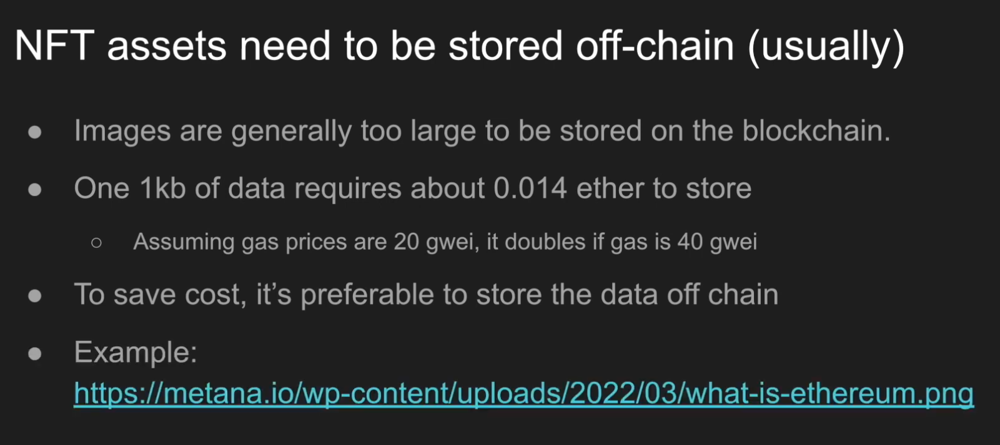

Okay, so nft assets need to be stored off-chain usually. There's some exceptions to this, but most of the time, the assets that are associated with an nft like a image or a video or a piece of music is too big to be kept on-chain. And if we work out the calculations which we're not going to do here, in general, you can think that 1kb of data requires about 0.014 ether to store it on the blockchain. It actually would take more than that, but this is the minimum amount. Now you may note that the price of, the price of gas changes with time, so so this is making an assumption that ethereum costs 20 gwei at the time. If you go to a website like etherscan.io gas tracker, it will tell you what the current gas price of ether is.

http://etherscan.io/gastracker

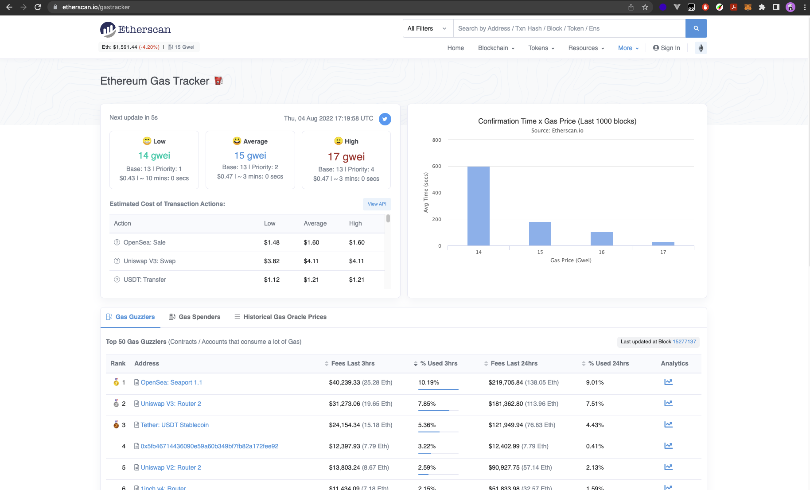

Let's actually do that really quickly. So etherscan.io/gastracker. Okay, it's actually worth worth 13 gwei at this time, but historically it's fluctuated between something like 10 to, sometimes over 100. So it can vary a lot, but either way 0.014 ether is quite a bit of money, and that's just for 1kb. Most pictures are not that small, 100kb is pretty normal, so you're already looking at 1.4 ether to store an image and, of course, that's quite expensive.

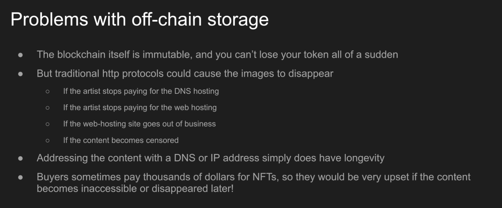

So a solution to this is to point to a url off-chain and some nfts do this. But there is a drawback to this, one is the blockchain itself is immutable and you can't lose all of your tokens all of a sudden, but that doesn't apply to http protocols, because images there could disappear. For example, the person who launched the nft might stop paying for the dns. The artist stops paying for the web hosting or the web hosting itself has an issue or goes out of business, or the content becomes censored depending on country or locale or whatever. So this doesn't make for a good customer experience. If, okay, you have the nft associated with your address, but the asset isn't there anymore.

So this is a fundamental problem with addressing content with the dns or ip addresses. They simply do not have longevity and they are quite mutable and, of course, we know nfts costs a lot. So this is, this is actually quite a problem, because buyers don't feel good about paying thousands of dollars for an nft knowing that it could vanish just because something happened to the web host or the artist stops paying or even in front of your situations the artist intentionally changes the asset that is stored on the website.

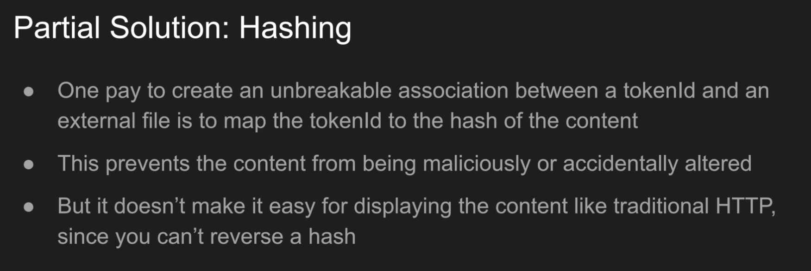

Okay, so one way to get us in the right direction is to think about hashing. So if we store the hash of the image, then now the association between the actual token id and the asset that it's representing isn't changeable anymore. So this would solve the situation, that okay, there's no ambiguity about what picture is associated with this particular token id. But the problem with that is that hashing doesn't work for actually displaying the content. It just works for ensuring that the content wasn't tampered with.

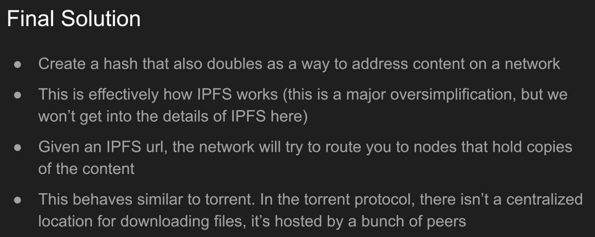

So http, so a hash will prevent tampering, but it doesn't help with addressing the content, because you can't reverse engineer a hash, but that actually gets us to what the final solution ends up being. If you could use the hash itself as a form of an internet address, then anybody who is able to produce the content that results to that hash is able to host the image, and this is actually how ipfs works, where the hash of the content is itself, the address. And I'm kind of oversimplifying some things here, but that's basically how you can think about it, again, if you are interested in the exact details you can look around, this has been pretty well documented multiple times. When it comes to ipfs, the network will try to route you to different nodes inside of a peer-to-peer network that hold copies of your file, so you can think of ipfs as being pretty similar to bittorrent, in bittorrent you have an address, but what it's really doing is giving you a mechanism to reassemble the file from multiple different places.

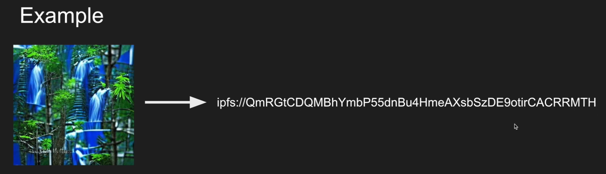

So if you take this image over here and took its ipfs hash, this is what you would get, and this is how you would actually try to locate the nodes inside of the ipfs network that is holding a copy of this image.

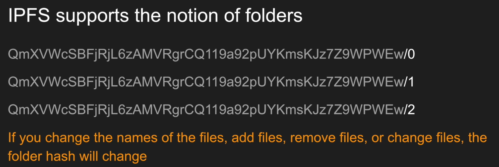

Ipfs also supports a notion of folders, so you can have a base folder and then different files inside of it. Now I just named them 0, 1 and 2, like we would with an nft, but this could be dog.jpg and cat.png or 2.json, but keep in mind that, because these are hashes, if you change anything inside of the folder or anything with an image, then the hash changes and that's a good thing for us, because we want to make sure that the content is not tampered with, but it also means that you need to get it right.

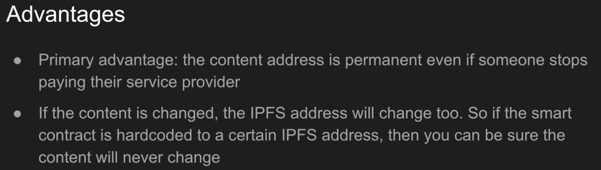

The primary advantage is because there's no single owner over the content, then, even if the artist stops paying for hosting the image behind the ipfs I'll get to that in a second, someone else is able to host the content themselves and they don't have to worry about tot owning the url, because as long as they can produce the hash, then it's able to be located on the network and the nft image is able to be shown. So if the smart contract is hard-coded to a certain ipfs address, then you can be sure that the image will never change just by the nature of how the hashes work.

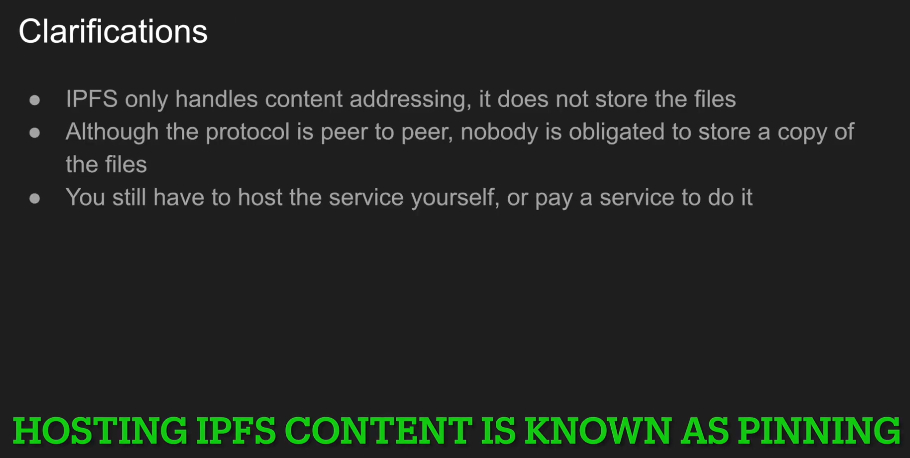

Here are some important things that you need to know. Ipfs does not store the files, it just handles the content addressing, so you still have to host the file yourself, the, unlike bittorrent, there isn't really an expectation that people are going to be hosting copies of the file, so you either have to host it yourself or pay for it, and this could be done by um, using, running an ipfs node, your ipfs node yourself or using some third parties which I'll talk about later.

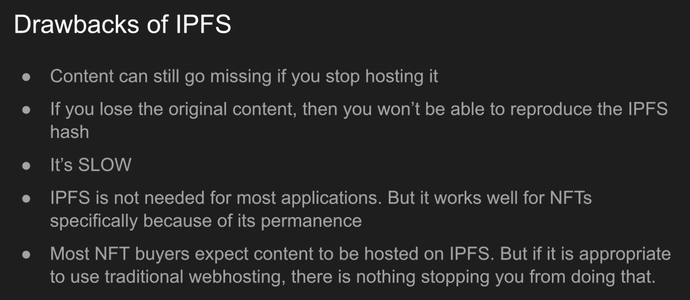  

So what are some drawbacks of ipfs? Well, if nobody is hosting the content, then nobody will be able to pull up the image. More importantly, if you have a folder full of assets and you lose that folder and nobody is able to reproduce the ipfs hash again, then it won't be possible to display the image. Ipfs is very slow. It's a peer-to-peer routing where it's bouncing around different nodes trying to find who has a content so resolving an ipfs request can sometimes take up to a minute in my experience, so because of this ipfs is not needed for most applications, but for nfts, where there isn't expected to be longevity in the images. This is not a problem, it's actually a good thing. Nowadays, buyers are going to ask questions if you don't host the images on ipfs, it's kind of become standard at this point for most nft projects, so you should use it otherwise you're going to expect buyers at nft collectors asking you questions, but I can't assume that you're only going to be using nfts for the ways that they have been traditionally used as profile picture collections. If you have a situation where you specifically want the data to be mutable, and it's not a problem that you have centralized control over the images, then it's totally okay to use http, there's no law about it or anything. I'm just trying to inform you of what the market norms are at this time.

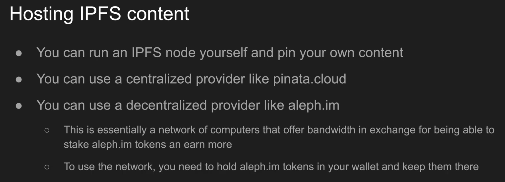

So actually hosting it as I alluded to, you can run an ipfs node yourself and pin your own content, or you can use a centralized provider like pinata.cloud, this is a provider I've used and I found them to be pretty user-friendly or you can use a decentralized provider like aleph.im. So this is itself a decentralized protocol that has its own token and computers in the network offer some of their computing power and bandwidth in exchange for being able to earn more tokens. So this behaves somewhat like a decentralized amazon web service.

And to use the network I'm going to show you how to do this later, you just need to hold alif.im tokens in your wallet and that allows you a certain amount of storage and bandwidth on the network. That's all for this. I'm going to give you some demonstrations on how to use ipfs next, but this should give you a pretty good idea of what ipfs is why we use it and what to look out for.

To get yourself set up, I first of all recommend that you download the brave browser from brave.com, because this browser lets you conveniently view ipfs files. So that's what I'm going to be using for this video. This is a derivative of firefox, so it will work with the same extensions. Now the images need to be prepared first because remember how we saw the nft pointed to a json file which then pointed to the images. Well, until we upload the images, we don't know what the ipfs hash of those images are going to be, so we won't be able to create the json file for the nft. So I've created a couple images that I'm going to use for the nft data.

Here they are some of them may look familiar with the exception that I've added sunglasses to them, so this entire folder needs to be uploaded to ipfs. One thing you need to be really careful of, if you are using a macbook, is that sometimes you're going to have a hidden file in here called .dstore, so make sure you look for any hidden files on a mac, because if there's any hidden files in here it's going to change the hash of the folder because obviously the file content is different, so be very careful with that.

app.pinata.cloud

Now I'm going to show you, so the first thing that I'm going to do is upload this to pinata. So pinata is a service for hosting your files and making them retrievable from the, from the ipfs hash, because remember, an ipfs hash is related to content, but nobody on this decentralized network is required to host the file, they just route you to where your files might be hosted and you can use this service to actually host your files, so I've already uploaded them over here. So you can see the hash that is created, but I'll just remove this. So that you can see this process all over again, so just to go to the from the beginning.

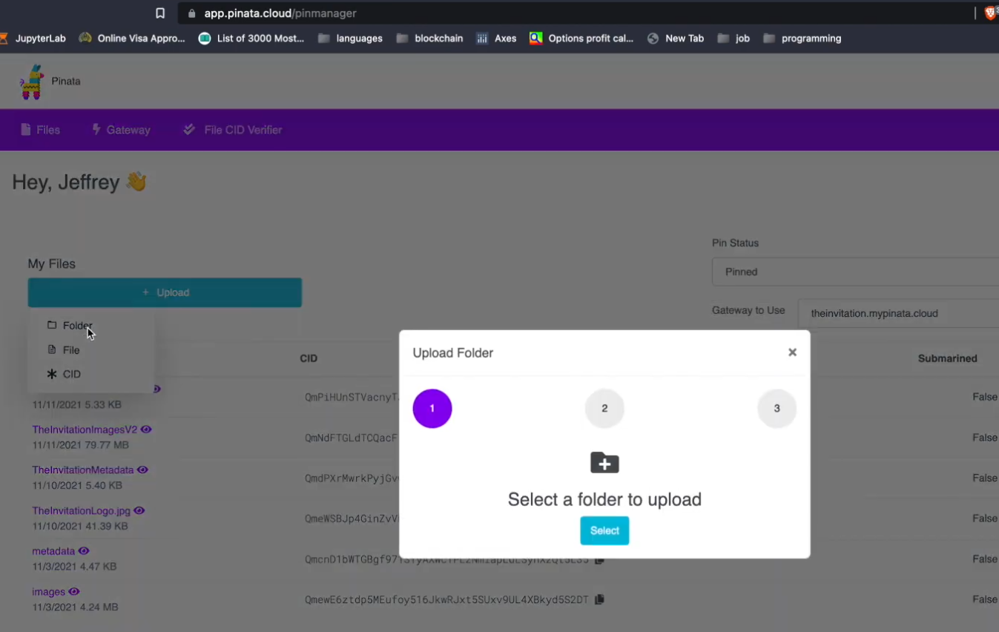

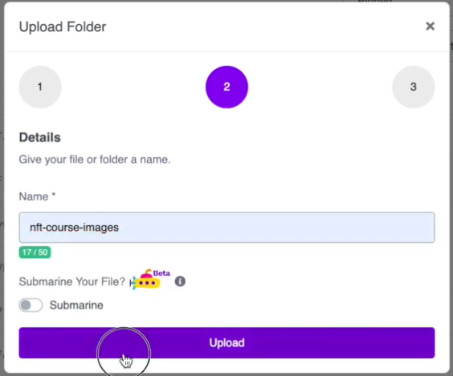

If you go to pinata.cloud and then hit login, it will take you to your dashboard where you can upload your files, so you will hit upload, folder, select, and I already have the path to my images here, so I'm going to hit upload and let's call this nft-course-images and after a while it will show up, there it is.

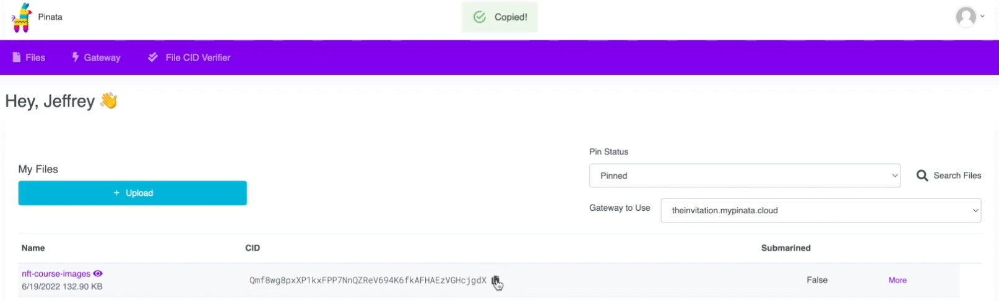

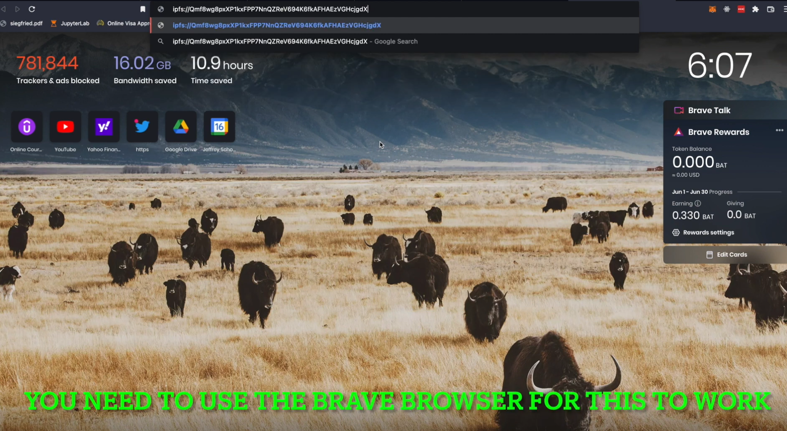

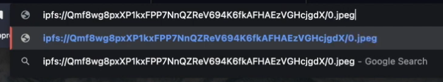

So to actually view this, you can copy this link and if you open another tab, you can go to ipfs:// and then the ipfs path and then the item inside of the folder, so you can do let's say 0.pg. As I mentioned in an earlier video ipfs is slow, so this may take a while to resolve and there's the first one. Let's try another one, let's try 1.jpg, I didn't put the ipfs.

Now you want to be really sure that you're going to be able to reproduce this hash, because that's what gives your nft images some permanence, so another way to double check. It is to download the ipfs desktop client, you can just google search for ipfs.io desktop client and you'll get to this page. I've put the link in the description too. 

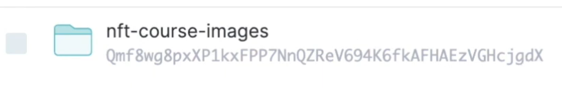

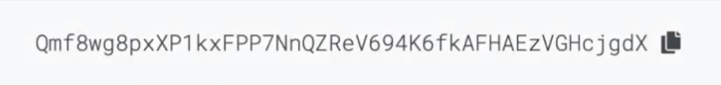

So what that will do is it will give you this dashboard after you set it up, and you can upload it over here and you want to check that the hash being created here is the same that you're getting over here. So this is qmf8wg, qmf8wg, and this makes sure that the .dstore file hasn't popped in after mac puts it in there or whatever else is going on, because you want to be completely sure that this is reproducible.


The final way to store nft files is with aleph.im which is a decentralized hosting service. So in order to use this, you're going to need to have some aleph.m tokens in your wallet and that will give you a quota of how much you are able to upload. So you can get there by going to aleph.im and clicking use cases and scrolling down until you get to this section over here, pin your files, folders and so on. Then you would hit upload and then you're going to have to set it up by connecting your account, and this is the one that you want to use, connect wallet, public upload and I would pick a folder to put in here. You need to keep these tokens in your wallet. Now the nice thing about how it's configured right now is you don't have to actually spend it, but you do have to hold it and not move it out of the wallet, otherwise the nodes might not store your images anymore.

Okay, so that was all pretty simple. Now that we have our hash here, we're ready to create the metadata. A mistake that I see happen a lot is not handling the ipfs url properly. Let me give an example.

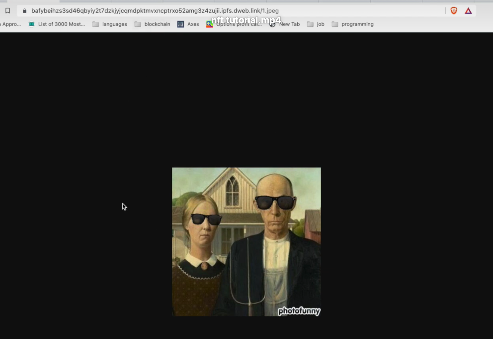

So let's go back looking at an image from earlier and if I were to say, ipfs colon slash this slash, 1.jpg, then, okay, it gives me this that's fantastic, but oftentimes the browser will reformat this to take you to an http gateway.


Now, what's the problem with this well, this, if we have a link to an http gateway, then we're relying on this dns being valid, which is not a good assumption to make, because then that defeats the purpose of using ipfs.

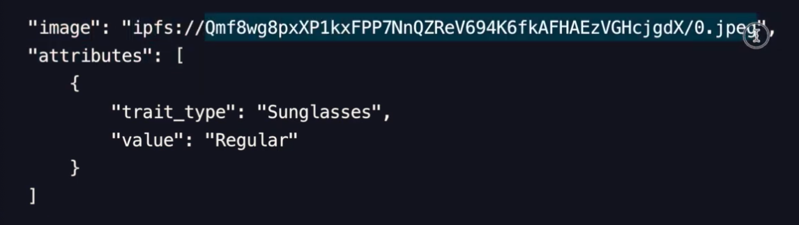

So it's very important that for your image, you have an ipfs protocol, followed by the actual ipfs, and you do not want an https link in there or something that has a traditional domain name and, of course, do not forget this ipfs prefix. Now that we've uploaded the images we are ready to create the metadata file. So, just by way of reminder, the token uri doesn't point directly to the image it will point to a json file which will then point to the image. Let's do that so openc describes what this metadata file or json file should look like, and we can just follow it now. You don't actually need all of these attributes if you don't want to have them at the bare minimum. You just need the image, and this will point you to where the image is in this board ape example. You can actually see that they've only included the image and the attributes key and the rest have been removed. So if you don't include the name then openc will just call your nft number, whichever index it is inside of the collection. Otherwise, you could put the name over here. This description will be associated with this description field over here, but, of course, there's no description, so that is empty, and here are other items that you can include at the very least, you should have the image, and the image, of course, is going to be an ipfs hash just like it is here and that's why we needed to put the images up first, because because we don't know in advance what the image ipfs hash would be.


So let's see what that would look like. So I have already created the json files, for what we've just did this link over here was this link over. Here was one of the images that we had created from earlier, and we can just look at each of these files over here and see that they work as expected. Okay, you get the point now. What I'm going to do next actually is remove the json extension, because this just seems to be the convention with the nft metadata files- and it also is more convenient for creating the smart contract. Now this that's not necessary, but it just seems to be the norm: go to the metadata and just mv 0.json to 0 and v1.json to 1 mv 2.json to 2 mv 3.json to 3 and mv4.json to 4. Now, of course, when you have thousands of images, you need to do this automatically, but that's not a detail. I want to get involved with right now, uh one other thing I would recommend just to make things nice is make sure that you format the json. I'm not sure why sublime didn't store this this way. So if I just do python.m json.tool 0, then it's going to correct the formatting for everything, so you can just do that with all of the with all of the files. The next thing to


do after you've made all of these changes is to upload this file to ipfs, so we are going to do that right now, like this, I already have a file named metadata in here, so I'm just going to rename this to be nft course, metadata and put it in here nft course metadata again make sure that there is no ds file in here, because mac likes to put that in okay, it's been uploaded, so, let's see what it looks like we will copy. Let's we can click in here to see the directory, and here is zero one, two three and four. So let's look at one and here it's pointing us to our other image and we can validate that over here and sure there. It is okay, so dealing with ipfs can be the most annoying part, because there's a lot of moving parts, you definitely have to automate it if you're dealing with a lot of images, but this is good enough to get us back on track for finishing up our nft, alright, congratulations. We are now ready to create a fully functional nft. Now that we have all of our images uploaded to ipfs, we are ready to override the base uri function, which will then make token uri point to the correct location, because we have all of our metadata files being called 0, 1, 2, 3 4. Without any extension, then the way this function works right now will just work because it's going to replace our ipfs url with the particular metadata index that we are interested in. So let's override this, we do and we're going to put in our ipfs url.


So this is the ipfs url we've been using we'll, say, ipfs colon slash this, and then we need to put a slash at the end so that this will be formatted properly.