Today, the internet is such an important tool in our everyday life. We use it to consume media, to communicate with friends and colleagues, to learn, to handle our finances and much more… But the web as we know, it has a problem: the information on it is centralized.

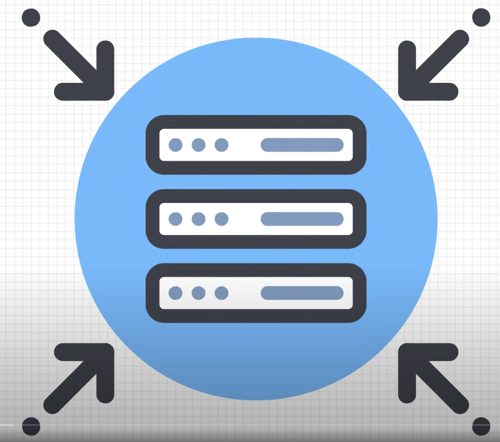

It’s all stored on big server farms like this one and these are usually controlled by a single company. I mean have you ever wondered what would happen if sites like YouTube or Wikipedia would go offline? How would you watch cat videos or spend hours reading one Wikipedia page after the other? This centralization brings another problem with it and that is censorship. Because content is hosted on just a few servers it’s easy for governments to block access to them. In 2017 Turkey ordered internet provides to block access to Wikipedia because the administration called it “a threat to national security”. So you get the idea, centralization of the web isn’t a good thing. But then why do we keep using such a model? Well that’s because we have high expectations when it comes to the web. We want pages, images and videos to load instantly and we want them in high quality. Centralizing servers allows companies to have complete control over how fast it can deliver all of this content. Another reason we use this model is that there just isn’t a good and fast alternative. But that might be about to change!

Meet IPFS, the Interplanetary file system. That’s a fancy name and they have ambitious goals as well. They want to make the web completely distributed by running it on a P2P network that works similarly to how BitTorrent works. Let’s take a look at how IPFS can accomplish these goals but first you have to understand how we access content on the web right now.

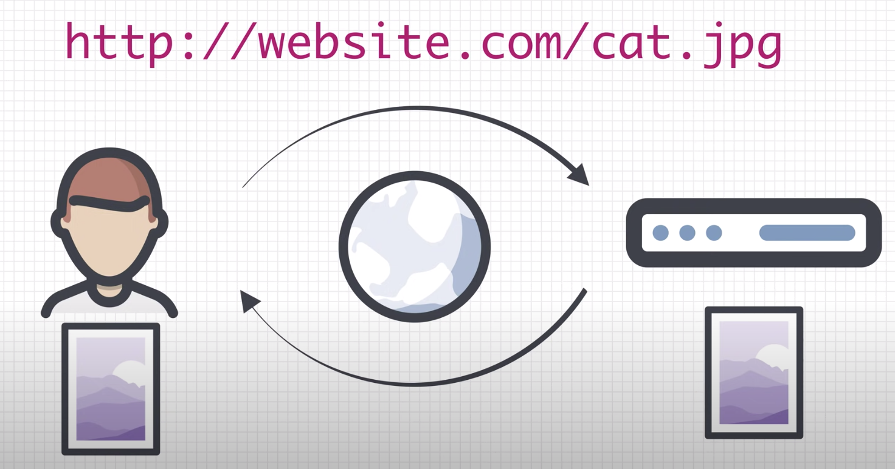

Let’s say you want to download a photo from the internet. When you do that, you tell the computer exactly where to find the photo. In this case the location of the photo is the IP address or the domain name. This is called "Location based addressing". You tell the computer where to get the information but if that location isn’t accessible, in other words the server is down, you won’t get the photo. However there is a high chance that someone else has downloaded that picture before and still has a copy of it and yet your computer won’t be able to grab a copy from that person… To fix this, IPFS moves from "Location based addressing" to "Content based addressing". Instead of saying **where** to find a resource, you just say **what** it is you want.

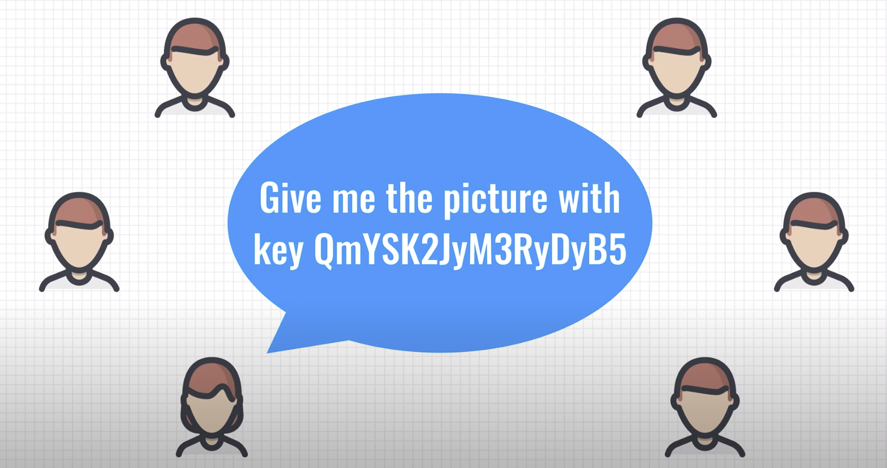

But how this does this work? Well, every file has a unique hash, which can be compared to a fingerprint. 

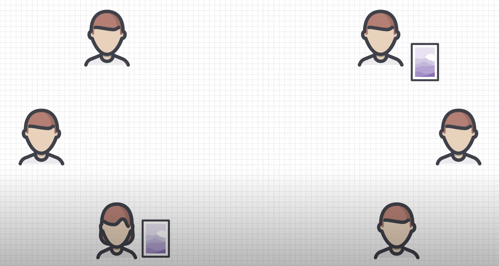

When you want to download a certain file, you ask the network: “who has the file with this hash?” and someone on the IPFS network will provide it to you. Now you might think: hold on a minute, how do I know that that person hasn’t tampered with the file? Well, because you used a hash to request the file, you can verify what you have received. You request the file with a certain hash, so when you receive the file you check if the hash matches with what you have received. Security built-in! Another nice feature of using hashes to address content is deduplication. When multiple people publish the same file on IPFS, it will only be created once and that makes the network very efficient. Alright enough with this high level overview.

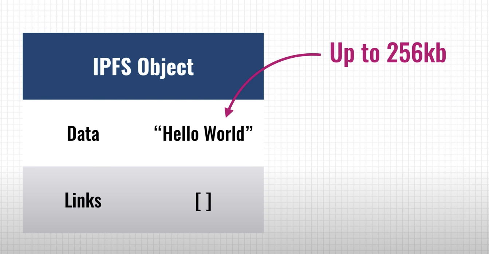

Let’s take a look at how IPFS stores files and makes them accessible to others. Files are stored inside IPFS objects and these objects can store up to 256kb worth of data and they can also contain links to other IPFS objects. A simple “Hello World” text file, which is very small, can be stored in a single IPFS object.

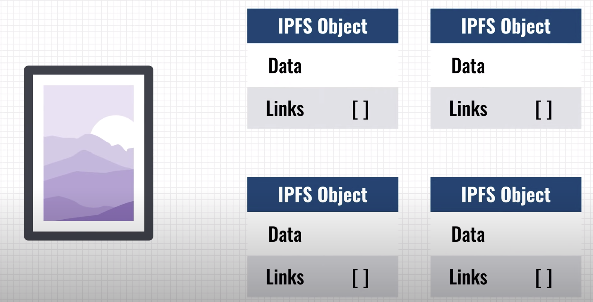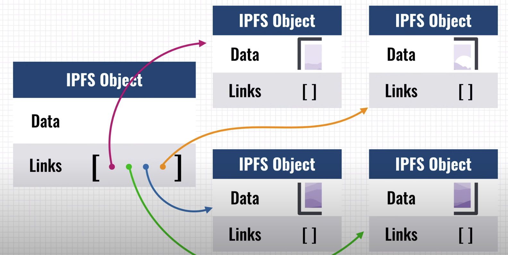

But what about files larger than 256kb? Like an image or video for instance. Well those are split up into multiple IPFS objects that are all 256kb in size and afterwards the system will create an empty IPFS object that links to all the other pieces of the file. The data architecture of IPFS is very simple and yet it can be very powerful. This architecture allows us to really use it like a filesystem.

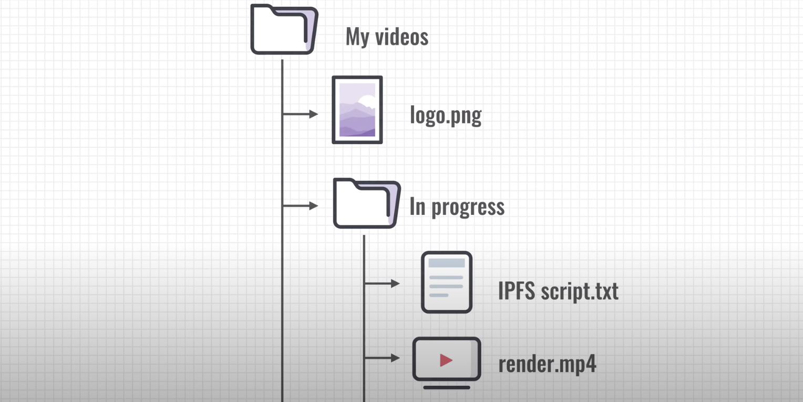

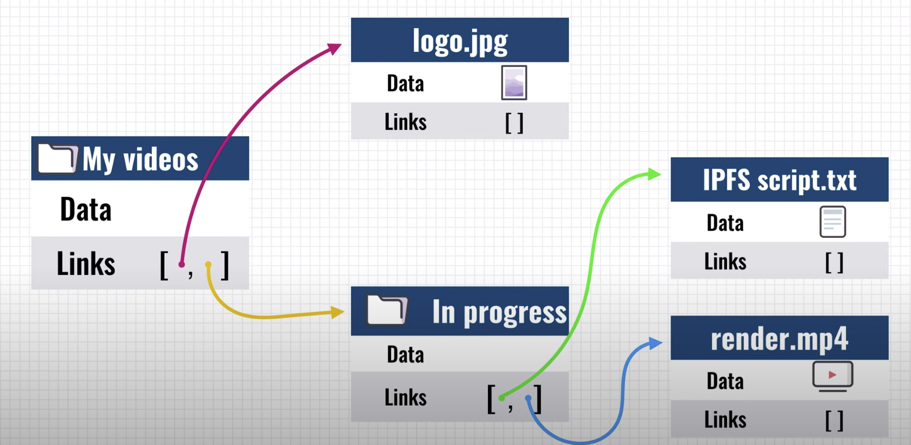

Here’s a simple directory structure with some files in it. We can translate this into IPFS objects as well, creating an object for each file and directory. But that’s not all! You see because IPFS uses content based addressing, once something is added, it cannot be changed anymore. It’s an immutable datastore much like a blockchain.

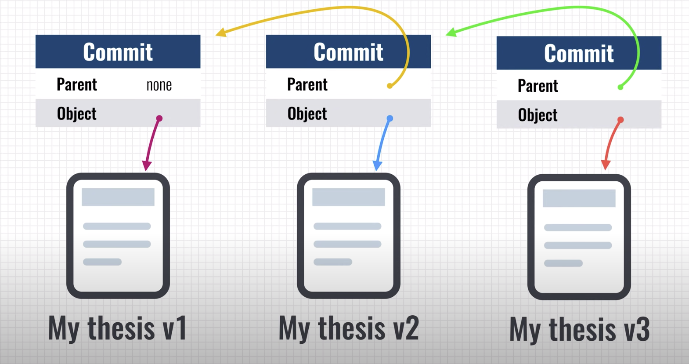

But then how do you change stuff on it? Well IPFS supports versioning of your files. Let’s say you’re working on an important document that you want to share with everyone over IPFS. When you do that, IPFS will create a new “Commit object” for you. This object is really basic, it just tells IPFS which commit went before it and it links to the IPFS object of your file. Now let’s imagine that after a while you want to update this file. Well, you just add your updated file to the IPFS network and the software will create a new commit object for your file. This commit object now links to the previous commit. This process can be repeated endlessly. IPFS will make sure that your file, plus it’s entire history is accessible to the other nodes on the network.

Pretty useful! This all sounds great but it’s not without it’s limitations or drawbacks. The biggest problem that IPFS faces is keeping files available. Every node on the network keeps a cache of the files that it has downloaded and helps to share them if other people need them. But if a specific file is hosted by, let’s say 4 nodes, and those nodes go offline then that file becomes unavailable and no one can grab a copy of it. A bit like BitTorrent swarms without seeders. There are two possible solutions for this problem. Either we incentivize people to store files and make them available or we can proactively distribute files and make sure that there are always a certain number of copies available on the network.

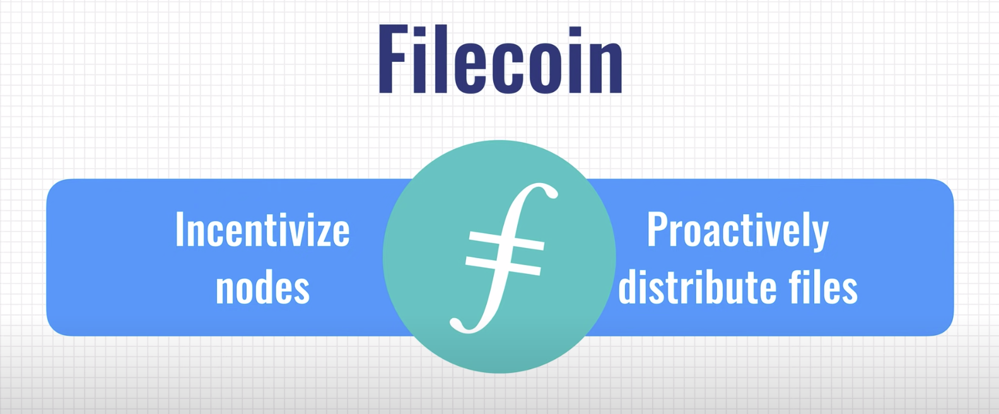

That’s exactly what Filecoin intends to do. Filecoin is created by the same group of people that have created IPFS. It’s basically a blockchain built on top of IPFS that wants to create a decentralized market for storage. If you have some free space on your hard drive, you can rent it out to others and make money of it in the process. Filecoin creates a strong incentive for nodes to keep the files online for as long as possible because otherwise they won’t get rewarded. The system also makes sure that files are replicated on many nodes so they cannot become unavailable. That’s a quick summary of Filecoin and how it intends to built on top of IPFS to solve some of it’s issues.

Leave a comment below if you want to learn more about Filecoin in a future video. Last thing we’re going to take a look at is how IPFS can be used. As I mentioned before, in 2017, the Turkish government decided to block access to Wikipedia. The people behind IPFS responded by taking the Turkish Wikipedia and putting a copy of it on IPFS. Because IPFS is distributed and there are no central servers, the government can’t block it. Another nice application is DTube which is basically a site like YouTube but entirely distributes and hosted on IPFS. Anyone can publish videos and anyone can help to support the network.

Pretty clever! By now you must be wondering: why is IPFS called the Interplanetary filesystem? Is is suited to run across multiple planets? Well let’s assume that we have a base on Mars. Communicating from Mars to Earth is quite difficult. Depending on the position of the two planets, a signal can take somewhere between 4 and 24 minutes to travel between them. Let’s take the best case scenario: you’re on Mars, you open your laptop and request a copy of the Wikipedia page of planet Earth, because you’ve forgotten what it’s like there. The request to Wikipedia travels 4 minutes to earth and when it arrives there, it is send on the internet, to the Wikipedia servers who respond in just a few a milliseconds. That response however still has to travel 4 minutes back to Mars. So on a good day, visiting a single webpage will take you 8 minutes. On a bad day, 48 minutes… With IPFS it’s possible to cache large parts of the internet on Mars. So if someone already requested a page that you want to download, it can come straight from a node on Mars, making that page load just as fast as it would on earth. So, yes, IPFS could be used to distribute parts of the internet across multiple planets. So to summarize: IPFS is a very ambitious project that could lead to a truly decentralized internet and now you know how it works.