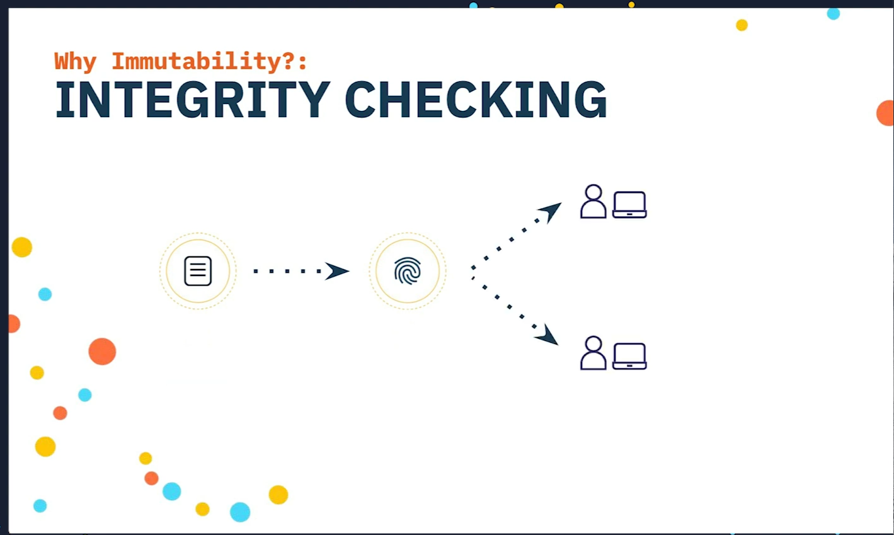
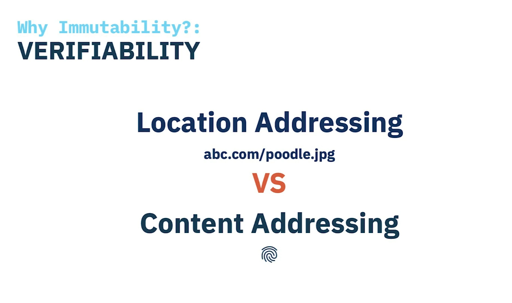

This is the CC, welcome it's very nice to see your faces, I hope you're, not too hungover or tired or whatever and I am Alan, this is Michael and their stephen, in fact, they're and we can talk to you about how ipfs deals with file. Part one of five, it's all right there, exciting I think that's been the feedback so far, all right! First up! Okay, can anyone tell me what the meaning of the word immutable is? Okay, awesome unable to be changed as opposed to mutable, which is liable to be changed. So we're gonna talk about why ipfs has a big focus on immutability and the mutable data in a peer-to-peer network, the one on the right, there's, no central point of authority, no one to implicitly trust, but in the web of today we we implicitly trust kind of things like institutions, so certificate authorities, social media government, but that trust is easily subverted and we can't necessarily rely on the data we receive to be the data we ask for, even though we often do. Resource integrity checking is one way to ensure that data you asked for is the data you've got. The idea is to calculate an identifier for the data from the data itself. The identifier is called a hash and we use cryptography when computing the hash to ensure certain properties like uniqueness and determinism. But we're gonna talk a little bit more about that in the next session.

So once we've got this hash that we can share it with the rest of the world, these two people think they're, and when someone gets hold of that data they also calculate the hash and then they check that they match and if they do then, yes, you've got what the data you are for, win, if someone else gets hold of the data and the hashes don't match, then oh someone's tampered with your data, so the guarantee of integrity checking, integrity checking is that content is immutable. If the data change, the hash I generate no longer matches, so verifiability is one of the main reasons for using immutable data.

In the web of today, I can put my poodle picture up "abc.com/poodle.jpg" and 24 hours later, I can doodle on my poodle, so let's say I add some glasses make him look a little bit more sophisticated, so the the problem is that the content isn't inherently tied to the address. The content can change, but the url doesn't, so depending on when I access this poodle, it could be completely different.

So what we have on the web today is location addressing, it tells us where the data is stored, but not much else. Content interesting, on the other hand, is where we use a hash to access the content, and it allows us to verify the content we receive is the content that we asked for.

Okay, caching and deduping, immutable content completely solves the caching problem like that, since the data is never going to change the cache rules, our cache this forever. So back to our example, if we were using content addressing, uh cute poodle has a specific address derived from its content, the hack and, if I, change, that that poodle 24 hours later the address also changes, but that's okay. It could be verified, cached and fetched by anyone. What, if I, wanted to keep both files? Well, because the content is immutable id fs any read, really needs to store the changes, the differences, the two files that we see actually share many of the same bytes. So if I have one of those files, the amount of data I have to transfer to fetch the other is really minimal. There currently, if I, want to store those two very similar pictures. I need to store both of them in full on my disk and if I want to share them with someone, and you want both and I want them to see. Both of those pictures and I have to transfer them both in full and we'll see more about how ipfs does that magic, deduping stuff later.

Okay effect from anyone. If the content is immutable and I can verify its integrity, I should just be able to get it from anyone, and this suits p2p really really well, but that's not true off the web today. So I have two sites on the on the net hosting the same content. How do I know which of these poodles is the correct poodle? Well, okay, so the answer is that we can't trust that any of these poodles are correct, they are both adorable poodles, but we just can't get it from anyone where it needs to come from a trust trusted source, because I can't verify its integrity all right. So we use content addressing in ipfs and we use a special hash called a cid. Cid stands for content identifier and we're gonna. Take a closer look now in part two of five okay. It all starts with cryptographic, hash, a critic, a fake hash function, maps input of arbitrary size to output of a fixed size, and we want a few properties from that hash. The same data should always produce the same hash, so it's deterministic. It should be impossible to invert we, as in we shouldn't, be able to reconstruct the data from the hash. It should also be unique, so no two different files should produce the same. There are many different hashing algorithms that exist.

Ipfs uses char to 256 by default. That's just some of the some of them that are available in itss that we could use older aggro algorithms like sha-1, are broken, they're proven to not be collision free and if and the problem is that if algorithms can break we're going to want to switch that hash that we use by default in the future, the problem with switching algorithms is that, given a hash, which is just a series of bits, what algorithm did we use to generate that hash? We need a future-proof way of of identifying the hash function used to generate a hash, as well as the hash name say hello to multi hash it'll solve all your problems, so multi hash is, is the hash which is just at the end there. But it's also a prefix, and that prefix is one number now go algorithm and which identifies the hash algorithm that was used to generate the hack and another number, which is the hash length. These two numbers are both variants and virant is just a compact encoding for integers. The algo number is a multi codec, because a is savarin but b it's it's. It's value is a predefined value that we agree on it's in the inner table on the internet, the multi-coated identifier for char two, two five, six is the number eighteen and our hash length is two five six in binary it looks like this you'll see that the hash length is actually two bytes long and that's because the length is over one, two, seven and in far in encoding numbers above 1 to 7 are encoded as 2 bytes.

So you can kind of think of this. As like two times, one two eight is two five six, but that's not really how far in works. That's just a coincidence. Yeah two bites because it's over one to seven. We want to support multiple encoding, dangerous, so you've got a hash that I'm dresses your data. When you get the data back, how do you know how its encoded we might? It might be encoded in c, bohr, concise, binary object, representation. It might be encoded in protocol buffers, it might be encoded as just playing out json. Why do we want this? Well, it might be a particularly compact binary encoding, so really efficient for storage, but it might be, for convenience might be just easy. It might be really quick, but we have this same problem again like when we're looking at some encoded data. How do we know how to decode it same solution more metadata prefix, so this is an ip ld, codec and ipfs at the moment, any any young, any content that you add gets is the codec that used to encode. The data is tagged. I dag pb and it is p. B stands for protocol buffers. So it's just protocol buffers encoded yeah, like I, said it's a compact encoding for the data and we've had some metadata to start after the hash yeah.

There are many ip ld formats that you can use and there are too many alright. So there are two different cid versions, so that's mildly, frustrating, as they often nowadays or going into the future. You will see version 1 as the main version that we're using there is version 0 and version 1, it's just a number prefix and that we add on to the front. So all of you, if you have a use ipfs before you, might be used to seeing c ids like this version. 0 is a this top one and a version. One one is the bottom one, and so the version 0 ones begin with kind of qm, usually version version zero begins with qm version, one begins with baffi or bath case. Sometimes alright. So the thing is see: ids are binary, data's, zeros and ones make for really long strings when they're printed out it doesn't even fit on the saw on the slide.