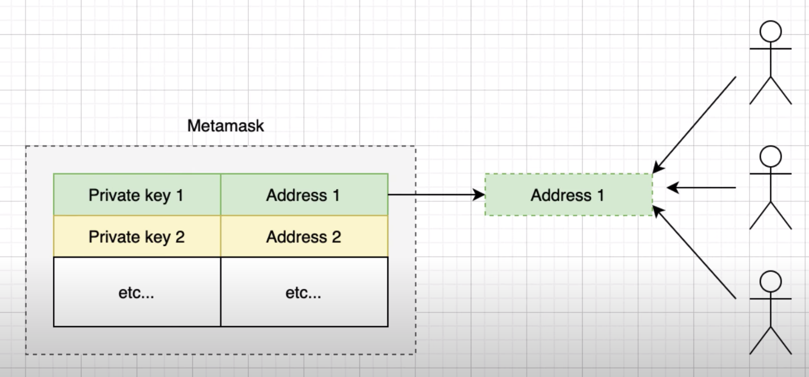
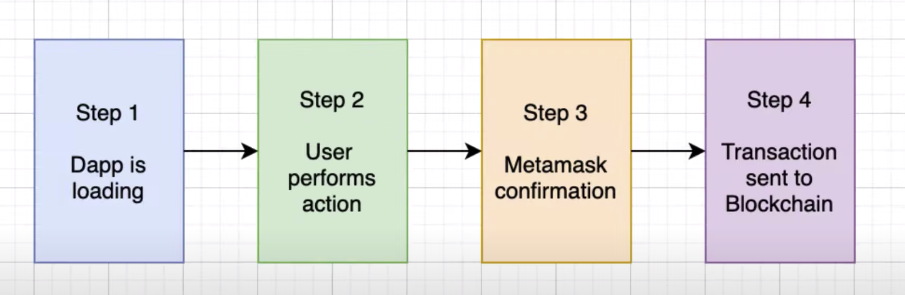
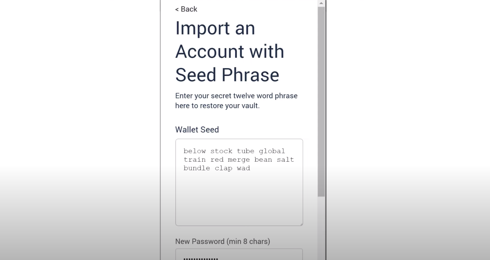
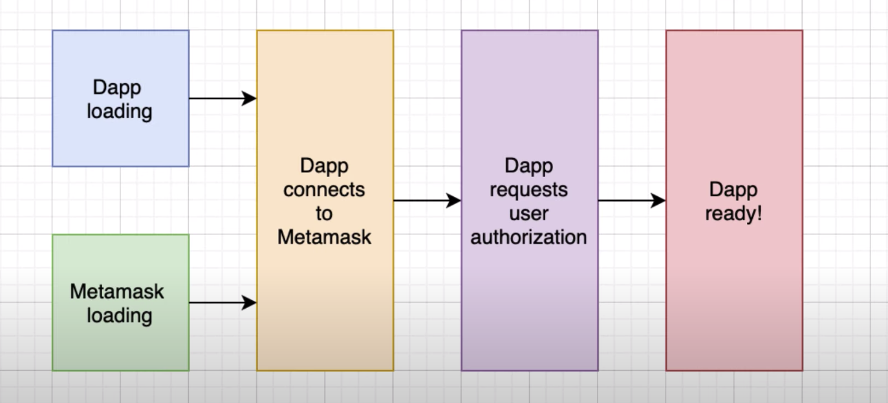
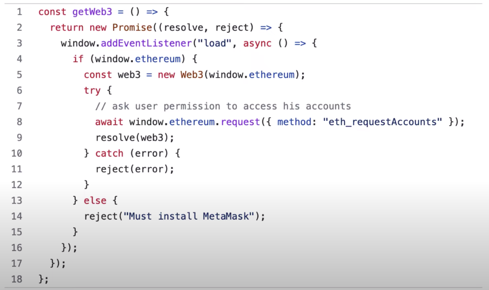

Metamask is the most popular wallet in crypto, but when you are a beginner, metamask is not easy in this video. I will explain what is metamask and how to integrate it with dapp in a simple way. If you are new here, I'm julian and not in the blogs, I teach blockchain development.

Metamask has more than 10 million users, it works on ethereum and old blockchain based on ethereum, like binance machine or polygon.

Metamask stores the private keys of users. Each private key is associated to a public ethereum address. The private key never leaves the wallet and is used to sign transactions. The address identifies an account and can be shown to anyone.

When user uses dapp, first, the html, css and javascript code of the dapp is loaded in the user web browser. Then the user clicks on a button to perform some action. The dapp creates a transaction, then the user confirms the transaction using a meta mask pop-up and the transaction is sent to ethereum by metamask.

To install metamask, go to the google chrome store, search for the metamask extension and install it. After you should see a fox icon in your extension menu when you open it for the first time, it's going to ask you to create a password and a new account, after you finish the setup, you will have a few addresses with their associated private keys.

If you connect metamask to a local development blockchain like ganache, there are a few caveats. First, it can be useful to synchronize the accounts of ganache with metamask. For this you can import the mnemonic phrase of ganache into metamask. Every time you restart ganache make sure to click on reset accounts in the settings menu. If you don't do it, your transactions will fail.

In the javascript code of your dab, you will probably use a library like web3 or ethers to integrate with metamask. These libraries need to wait for metamask to be loaded so that they can connect to the metamask provider.

You can either code the integration from scratch, but it's easy to get it wrong and trigger a risk condition or you can use a library. For example, you can use "@metamask/detect-provider" for something simple or "web3-react" if you need something more powerful.

Now you know what is meta mask and how to integrate it with your dapp.

integration with metamask, you can check out this other video, where I show the full javascript code step by step