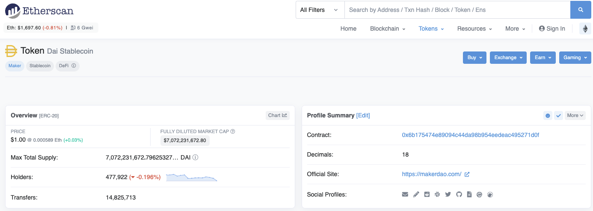

Ethers.js is one of the fastest growing libraries for building unstoppable web 3.0 applications, it's become a strong preference by many experienced developers as their go-to library for building javascript based blockchain applications because it's elegant it's easy to use and you can get up to speed pretty fast.

So in this video i'm going to give you a crash course on etherjs and tell you everything that you need to know so that you can get up to speed and start building your own blockchain applications in no time, but don't worry if you're not an advanced developer and you don't understand that much about blockchain i'm explaining all the essential concepts that you need to know along the way, I'll explain all this as a blockchain developer who works with this technology on a daily basis and also somebody who's helped thousands and thousands of people become real world blockchain developers.

So before we get into that you know if you're around here hey i'm gregory and on this channel i turn you into a blockchain master so if that's something that you're interested in then smash that like button down below for the youtube algorithm and subscribe to this channel and if you want to have a master blockchain step by step start finish then head on over to dappyversion.com forward slash boot camp to get started today.

All right so let's look at the problem that ether.js solves before we can dive into exactly what it is and how to get your hands dirty with it. Okay so let's look at the architecture of a normal website, like so, let's say you're watching this video on youtube.com, you know basically how does that website work from a high level, well, you are watching this probably in your web browser maybe on your phone but let's just say you're using a web browser okay? And that web browser something like chrome safari brave whatever you use and that browser's talking directly to the website all right and that website is youtube.com okay and that website uh is usually written in like html or javascript that's where everything you see is that's called the frontend, okay and then that website talks to a backend all right and that backend typically is on a central server okay it has some sort of api associated with it, if it's, you know, talking to a separate frontend website, it has a database for all the user information, all the video information and things like that are stored, that's the web 2.0 way of doing things where you have a website and the information stored in a central server but let's look at a web 3.0 way of doing things which is a very similar scenario where you have your web browser like chrome safari or brave and then you talk to a front-end website where you might be you know interacting with a decentralized application or dapp okay it's got the same website in html css and javascript and then instead of talking to a backend uh that might talk directly to a blockchain okay so instead of uh you know having a central server here where all the code and the data for the application is on a server it's on a blockchain instead that's replacing the backend in this case so we have blockchain and smart contracts.

And so if you want to learn to create something like this where you want to create a website that actually talks to a blockchain uh then the critical piece to understand is how to get this frontend to talk to this backend, uh you know website, whatever it is uh, to a blockchain so you can interact with smart contracts and also get information to the blockchain itself and write information to the blockchain.

And so let's just take a look at how that works so you know you have a blockchain here okay so what is a blockchain you know it's a a worldwide computer okay it's a peer-to-peer network of nodes that all talk to one another so it's kind of like a web server in the sense that each of the nodes on the network is a computer but each node uh keeps a redundant copy of all the information and all the programs on the blockchain. Okay so if you want to create a website that talks to um you know one of these nodes so that you can interact with smart contracts you know get information from the blockchain uh write new transactions then you need to connect to a node.

 okay and what are you connecting to the node from well you could do it directly from your web browser with a website okay you could do it with a script on your computer okay you could do it with a back end uh server any of these things can can wire up a connection to an individual node on a blockchain to start using it so that it can you know get information about cryptocurrencies, nfts, write new transactions create a website that you know powers a full stack dap that's what you need okay and in this case that's what the client's going to be and so you just need something that connects your whatever client it is to create either browser a script or a backend to one of these nodes so they can start using the full power of the blockchain.

 so that's exactly what ethersjs is, it's a library written in javascript that lets you create any javascript application that talks to the blockchain so you can utilize the full power, you can create full stack decentralized applications, you can create scripts, you can create back-ends all that type of stuff, it's the bridge that essentially uh takes your client whatever it is and allows it to connect to the blockchain.

 okay so you know it lets your website become a blockchain website it lets whatever script that you want to create whether it's a you know a trading bot a defi script or a backend maybe you have a server that scrapes information from the blockchain or post to it you need this bridge in the middle and if any of these things are written in javascript you can use ether.js to do that. one lastly quick example before we get started so it's not totally abstract if you go to uniswop.org this is one most popular decentralized applications out there, connects directly to the ethereum blockchain and a few others okay and click the launch app and you see that this is the cryptocurrency exchange where you can swap you know any cryptocurrency that you want to.

 all right you can actually either click metamask wallet here get the mainnet test network whatever you want to and swap tokens well how does this work well this website doesn't talk to the blockchain directly on the box that's exactly what you need uh some sort of special library for you a few options out there and ether.js is one great example and that's exactly let me show you how to use right now.

https://github.com/dappuniversity/ethers_examples

 all right so let's go ahead and get started i've got a repository for all the coding solutions uh in this tutorial so uh you can check it out on the github here so the link should be down the description below okay you can see that this is uh a list of examples here you can see the different uh scripts that we're going to go over today that show different aspects of ethers js and how to use them and you can see a write up of each description here with a few bullet points.

 okay so if you get stuck in these videos you can go back and check this but go ahead and grab this url okay, open your terminal and let's just see here you git clone all right paste in the url all right so i've already done this it's going to give me an error but you should see success whenever you do this and whenever you clone that go ahead and enter into that newly created directory like this you can do cd ethers examples all right and once you're inside this directory go ahead and install the packages for this project like this npm install all right you need npm installed on your computer you can see a list of basic technologies here inside the repo instructions all right if you need to install node you know how to do it just click this link it'll show you how to do that all right so um 

once you've got the dependencies installed go ahead and open uh this project in your text editor you can use whatever texture you like i'm using sublime text and i have a shortcut on my computer that lets me open uh files from the directory like this okay so inside of here you're going to see the basics of our project all right you're going to see the package.json that has um you know all the uh dependencies in this case we just have one dependency ethers this is the library that we're gonna use and you're gonna see some examples here we're gonna look at the basics of etherjs and how to how to really get into it all right

so we're gonna start with this first example here uh how to you know read information from accounts live from a real blockchain we're actually gonna connect the ethereum blockchain not some like blockchain on our computer we're gonna connect the real live blockchain and show you how to create apps that do that 

so we're gonna do that through a series of scripts and examples so we'll code out each of these scripts here's the solutions here with a few things blank you're gonna see all that in this video okay um so let's go ahead and start with this first one i'm gonna clear this out and the goal of this lesson is going to show you how to actually get ether set up just like a smoke test how can you import ethers into your project okay and how can you uh talk to the blockchain how can you read information from the blockchain and know that it's correct that's step 1 and we're going to get more complex as we go through each of these examples 

okay so one of the things that i'll note here is that we're doing this the script so it's really easy to follow the steps on screen so like i've shown you before um you can you can use ether.js in a variety of environments you can use it on a website to create a full stacked app all right you know uh with with your with your browser it can it can be a website um it can be a script like we're talking about here this should really say a website in our browser but it could be a script all right or it could be a backend it could be lots of different things so we're going to do it in a script in this context this will be like a sandbox so that you can see the fundamentals and then you can take this knowledge and put it into a website right you can put it into a back and you can put wherever you want to but this is going to show you how ether.js works in each aspect of it so that you can start coding your own applications

all right so let's start off with the first lesson so what we're going to do in this lesson is really just show you how to import ethers into your project this is going to be basically the same steps if you're creating a website a script back it doesn't matter um how to connect to the blockchain, the basic concepts on that and then how to just fetch some information like we're going to get an account balance all right and then show you how to put this inside of a script so that you can you know rerun this several times and add your own tasks inside of here you can use this as a template to create your own blockchain scripts whatever it's for defy you know all type stuff

 so um let's just clear out the the content here all right i'm just gonna move this off screen um and let's actually um let's just take this and we'll start from scratch okay so we're not just like doing a coding uh like we're not just gonna copy and paste rushing and code it out so um if you're gonna import ethers in your project first of course you need to install it inside your package.json file if you have a node uh project already you can just do you know uh you can add it from the command line or you can just copy and paste ethers into your dependencies here and once you do you need to run npm install to put it into your project 

okay but then um when you have a javascript file that actually depends upon ether's js then you need to import it at the top okay so um you just do it like this uh you can do require ethers all right so that actually uh pulls it into your file here now we want to store it to a variable though so you do that like this in javascript you go const and then you do ethers all right and you say equals this all right and now you have ethers into your file so that's boom that's how you pull it into a javascript file now whenever you have access into your project, if you want to use it to actually talk to the blockchain then we need to do exactly what i was showing you before in this diagram here about how to get your project or your file your script whatever to actually access an ethereum node.

 so um what we're going to do in this case is actually use somebody else's ethereum node because you could run an ethereum node yourself it's very hard to do because it takes a long time to set up and also take a lot of space to run a lot of resources it's not really practical for a lot of people to do that especially for developers who just want to deploy applications there's lots of reasons why you would run ethereum node but just to get started with blockchain development doesn't make sense.

 so we're going to use somebody else's so we're going to go to infuria for this there's lots of different you know node providers out there you can sign for infurial for free okay what you want to do is actually go inside infura create a free account and you want to um create an app okay and whenever you create an app inside of here you'll create a project excuse me you give it a name and then 

https://infura.io/

![]

you'll see api keys inside of here you'll see your project id, project secret and you'll see this endpoint here that has um you know your entire mainnet.infura.io url so you want to se you know create this and save it and come back to it in a second right that's one piece of information that you need you're gonna see where that goes in a second but go ahead and do that step and it'll make sense momentarily 

all right so now that you have that you technically have this part of the equation all right you have an ethereum node or somebody else's ethereum node you have access to it because you have this url that you just copy and paste your project that's this that's kind of what this url does and you have this client okay that's actually going to talk to this you have most pieces in place all you got to do is put them together 

so let's talk about how we do that so first of all let's talk about the protocol all right so um the protocol um that that blockchains use in this case ethereum nodes um to access information or transmit information is what's called jsonrpc okay so um basically if you're using this website right now like you're you're usually fetching this information over like http that's for you know just web 2.0 communications all right but if you want to know use something called jsonrpc, now the good news is you have a url that supports json rpc protocol right now and all you have to do is inside of ethers actually set up a connection a json rpc connection all right just rpc api is a popular method for interact with ethereum and it's available all major nodes okay these implementations and so ethers tells you right here in your documentation how do you set up a json rpc uh connection you just do ethers.providers.json rpc provider and then you add the url to the thing that actually uh uses json rpc. in this case, ethereum node, in this case the node that we just created or got access to inside of inferior

 okay so basically what you do is you do const or you do like this so we'll just do exactly what the ethers documentation says says ethers providers json rpc provider all right and then you put in you know your inferior url here so basically that's gonna look like this um i'm gonna do backticks here because we're gonna actually insert the variable okay you can do https calling forces four slash mainnet forward slash v3 all right and then uh you can put your api key here abc123 i'm actually going to show mine on screen here um because i want to keep that information private all right um so that that's what you can do so you can just hard code your url inside if you want to and then we can assign it to a variable uh we need to do new here all right new ethers provider

 and then you can just say const provider and then boom you would have your uh connection to blockchain all right now your entire you have ethers inside your project and now you have uh you know a valid connection to the blockchain with this json rpc provider and this is what you know ethers uses to you know talk to blockchain and now the cool thing about javascript is we can store this as a variable so instead of abc123 i'm going to use this dollar sign with the curly braces inside of it we can interpolate a variable inside this javascript string like this we can just create a variable called you know inferior id all right and then we can store that idea right here const you know if your id all right and i'm going to just you know put in a fake inferiority here abc123 and then when we run the example i'll paste mine off screen so that you can't see it and we'll watch it um you know we'll watch it work okay so that's the first thing that you need is you need to just store your infura id here and keep that you know keep that there

 so now we want to do is actually you know test that this works so you know we see that we've got ethers into our project we see that we have uh some sort of you know i we have we have a way to talk to an ethereum node now we want to make sure that it actually works how's we know it's talking to blockchain what's some sort of basic test that we can use and how can we observe some useful functionality of ether's js in the same time like how can we accomplish multiple things at once well let's actually call a piece of functionality from from ethers which is fetching account balances

 all right so with ethers we can use this special function called get balance all right so all we have to do is call this function here or you can see it you can call it on this provider variable so provider get balance and all you have to do is pass in an ethereum address so um you know an ethereum address is for like your username on the network if you have a metamask wallet you know you'll see uh you know your your account your account right here like you just copy this that is your account address okay um so really all we have to do is call this function and pass in an address um on provider

 so we have provider right here we just created it we can say provider dot get balance all right and then pass in uh some sort of address okay so you could copy picture metamask wallet what i'm gonna do is actually find an address live on the mainnet right we're going to look at its balance because we want to actually check that we're talking to the blockchain properly and that you know we can fetch that information and see something cool in real time so um i'm just going to go to etherscan and actually find a really high balance uh wallet so i'm just going to paste this one in here this should be the one that's saved in the coding solution down below and you can see this has like a lot of money okay i think there's over 5 billion almost 6 billion worth of ether so we're going to copy this address all right it should be in your coding solution and we're going to paste it in all right and we can just fetch the balance like this say await and that will show us the balance but let's actually assign it to a variable so let's say a const balance all right and then um that'll work we'll be able to log this balance out to the console and actually see it so how do we do that well we could do console log um and we could just say you know we should put the balance in here and then that would log out the console

 okay um what we want to do is actually be able to use this async await um pattern and in order to do that we actually have to wrap some async functions so what do i mean by that uh well you can't just do this really okay so the asynchronous nature of javascript blockchains are slow we want to make asynchronous calls asynchronous means that you can basically um just make the call and execute the next line of code without having to wait you know wait for this line to finish you know keep executing and you could do like a promise chain here but we actually want to do we we want to in this case wait for the function call to finish uh before we uh get the variable to get the value because if we just you know um if we just took this off and said balance it would just return a promise okay and that wouldn't actually be useful to us um 

okay so we want to just say a wait uh but in order to use away we actually have to use an async function like this we say async all right and then we put in this and then we wrap it here okay and then now we want to do is actually say const main we'll assign this function to a variable i want to call the function here okay and so we can do that we can log the balance but now we want to do is actually add some formatting and so i want to i want to save this to a variable here and say const address equals this okay and i want to actually uh add some better formatting so we'll do it like this so i'll add the address see the balance here and then say each balance of this address is ethers.utils format ether and then basically we're gonna put it out there okay so uh let's go ahead and run this script and we'll explain a couple more of the details and we'll just check that it's working properly

 so what we're gonna do is go to our uh terminal here and we're going to run this script with node.js so the cool thing i noticed as a script runner we could just say node it's going to let us execute any node based script like this so we say node and then pass in the directory we say dot forward slash which is just our current directory and then say examples and then say one underscore accounts all right hit enter and boom there we go so we can see that worked so each balance of this account is this it's a lot of eth okay um so it works

 all right let's explain everything inside here so again we connect we pull ethers in our project we set up the connection like this we store the address we get the balance and then we do console log and console.log is that thing that actually writes this out to the screen okay and um here what we do is we actually format uh the balance um in ether okay so out of the box basically um you know ether is expressed with e from smart contracts in the blockchain they don't store decimal places and so if you were going to see this written out it would look like this okay so basically it would look like you know this let me just pull it out here uh it would look like this okay you can see that there's 18 decimal places after the zero one two three four five six seven eight nine ten eleven twelve thirty four fifteen seven eighteen uh that's because ether um has that many decimals after the zero you can think about like us dollars us dollars has two zeros after the decimal um i think i said decimals after zero i meant zero as a decimal um so basically with uh with with with tokens and ether on on top of the ethereum network the standard is to have 18 zeros after the decimal place after the decimal place just like dollars have uh you know zero two zeros many cryptocurrencies have 18. 

and so or to format that uh you you convert it to the ether value which adds the zero the you know the decimal bumps it over 18 places and shows you uh where it's supposed to be properly okay and that's exactly what this utility is for ethers dot utils format ether and you pass in the balance it converts it from way which is sort of like ethereum's penny um to you know ether the proper formatting all right so that's it that's how you uh connect your project to the blockchain you pull it in here i add the connection here we've talked to the real live blockchain we've got an account we've run the script and we've seen the output into our console so we've come a long way this lesson let's go ahead and move on the next one

 all right in this lesson let's talk about how to interact with smart contracts on the blockchain, so really quickly if you're not familiar what are smart contracts, they are uh programs that run the blockchain uh in this case for ethereum they're written in solidity and other evm compatible chains uh as well okay so smart contracts are just you know code out there that we can connect to with our applications all right we can read information from them we can uh write information to them we can call their functions like anytime you go to an app like uni swap for example like i was showing you at the beginning you know this talks to some smart contracts if you're going to swap ether for a token or any token you know uni swap has smart contracts that power the back end so if you're going to create a decentralized application you have to understand how to interact with smart contracts and if you're going to create a website that does that you need a library and a connection to the blockchain that's what we're doing with etherjs so we're looking multiple aspects of smart contracts uh in this series

 but the first thing that we're going to do is just basically how to just talk to them how to read information from them so we're going to do is actually talk to a real live smart contract okay we're going to look at a a cryptocurrency uh this is the die stable coin okay so DAI is an erc20 token it's powered by a smart contract or it is a smart contractor say it's on top of the main ethereum network so we're gonna you know talk to the blockchain directly look at information about the diet token you can see this contract source code here on ether scan the address for this should be in your coding solution okay so you can copy that address and paste it in here if you wanna look at this information um so here's the smart contract you know you can see um uh all the information about it okay you can see information like uh the read contract the right contract you can browse around see the source code and everything uh what we're gonna do is just look at this read contract tab we can see certain information like the name okay you see this returns a string DAI stable coin it returns a symbol the die symbol total supply of diet tokens all right lots of information you could uh take an address and then um you know find the balance we can just click you know put in an address in here click balance of click query and it'll return the uh token balance, all right so we're gonna do all this stuff inside of our uh ether script so you can see how to do this set of application yourself rather than just from the website which can be a fundamental skill that you need if you're gonna talk to real smart contracts on the blockchain 

so let's go ahead and uh open up this uh this file here we clear all this stuff out um you know except for we'll just clear this out all right we'll keep our main function uh we set all this scenario up in the last uh tutorial so i don't want to just do the same stuff twice but we'll take out the important parts so we'll just start off by importing ethers that's the same as our last lesson we showed you how to do that um we showed you how to create your connection to the blockchain and create a new provider so that's the exact same and then we have a function where we'll actually execute the code uh you know that we'll write in this lesson and then we'll add some more details here about how to actually pull that information in and talk to the smart contract

 all right so in order to talk to a smart contract with ether.js um you have to set up a new contract uh object with ethers okay so you can see that for the documentation like this you can search for contract over here you can find this on the ethers documentation uh you just do new ethers dot contract capital c and then you need three pieces of information the uh address for the smart contract on the blockchain uh the abi of the smart contract i'll tell you what that is in a second and then the signer or provider

 okay so um let's take a look at how that works um so first of all the address for the die token we have that um you can just go find that here from etherscan uh copy that address and save that the next thing is the abi all right so what is the abi? **The abi is it stands for abstract binary interface that just means um a json object okay that that describes how the smart contract works it describes the interface which basically means what functions uh does this smart contract have what are the function arguments what does it respond to if we're trying to read information from it if we're trying to call a function like what functions does it respond to** and we just store it in json that's this big blob here is you can't really make sense of it but we'll see how it um you know we'll see how it makes sense in a second okay and then you need the provider or signer in this case we have provider so provider something ethers it just gives us information uh we've already saved that

 so we can copy the uh dye address like this okay save it to a variable this is the die contract from etherscan and then next thing that we need is the abi so you could look at the die abi here you could copy the entire thing and then paste in your project if you wanted to that's one way to do it all right but this is a big mess all right this is like really long if i unminified it it would just look like this big blob in your project so the cool thing about ethers as opposed to like web3.js or other libraries is ethers lets you uh store abis as an array okay and only pull in the parts that you want to whenever you are um you know whenever you're setting up a smart contract uh object, so you can do this say const erc 20 abi and because because die is a is a erc20 token they all basically have the same interface they have to in order to be erc20 compliant which basically means you know the die token uh in terms of his interface works a lot like the chain link token which is also an erc20 token or the the uni swap token which is also an erc20 so it has it has a name it has a symbol it has a total supply it has a balance of function you know all those uh all those functions that we saw here okay um when we look at the contract now all these functions here are common like balance of uh decimals name total supply symbol those are common and so we don't have to like get that specifically from the diabi we can just add our own uh things here so the claim of ethers is we can take these common functions or any function for that matter that belongs to the abi and put them inside an array like this so we can say you know this api we know it has a name function and that takes no arguments it's a view return string and they're they it basically represents how it looks in the solidity source code which is pretty cool so if you understand the solidity you could grab the solidity source code for the for the interface wrap it in a string and then toss it in the array like this okay and you can only include the functions that you care about so you know dye has a lot of external functions like uh versions and words we don't care about that stuff we don't care about the nonsense we just care about like the name uh the symbol the total supply the balance of

 okay so i'm just gonna grab those toss them into this right here like this okay so we have the name symbols total supply balance of and these are the only functions that we're going to use in this example and so that's the only functions we're going to include inside this array we don't really want to add words version nonces all that type of stuff okay so we take our erc20 api and then we basically do exactly what ethersjs tells us to do which is do new contract address api and then providing all this information

 so let's do that right now uh basically we can do that like this we can just say you know new ethers contract address er20 abi provider and then we can store that to a variable like this a const contract all right and then now we have saved that to a variable and now we have a real smart contract that we can start calling functions on, all right so we talked we've pulled these into our project we've talked to the blockchain and we have created a javascript version of the die contract or at least part of it so we can read information from it right so um let's let's actually get some information okay let's um let's i'm gonna i'm gonna pull this down so i can actually put in my provider here off screen i'm just gonna kind of hide this um so actually let's do it this way i'm going to add some space here so we can not coding best practice but i'll be able to hide my information on screen so i can actually update it in real time so basically let's let's just set it up and make sure that it works okay so let's just read the name so it's really easy to do that with um you know the smart contract now that you have it you can just say uh contract dot name all right and it will return the value so we can say name equals await contract name all right again we're using the async awake pattern so i'm going to say a weight contract name and it will return the name and then we can just say console log and then we'll just say you know name equals uh name all right so let's save this run the script off screen and so when i do node uh dot forward slash uh examples two read smart contracts and hit enter uh okay we have a little error here let me just fix that all right one more time so let's do this and then boom there we go so name is die stablecoin all right so we have successfully uh added our connection to blockchain we know we're talking the die smart contract because we can see the name dial stablecoin logged out of the console here all right so erc20 tokens have lots of other functions that we can just uh you know read easily okay we can say um we could say const symbol equals awaits contract dot symbol all right we can say const total supply equals weight contract total supply all right and then we can basically log all that out of the console here all right let's do some nice formatting so we don't just say you know console.log name because the console.log reading from we can actually provide the address that we added here and we can see the name all right we could see the symbol we can you know put these variables inside of our string here we can see the total supply all right so let's save that go to our terminal here run it again oh sorry i actually already declared that uh i have a issue here sorry contract dot total supply all right there we go awesome so reading from here's the address disable coin symbol die total supply is this all right so similarly we can add our utility to format the tokens like that if we wanted to but now let's um actually call a smart contract function that requires an argument all right so these we're just calling you know functions that have no arguments but this balance of function actually does have an argument okay so we need an address we're going to take the uh balance of a very large die holder you should see that in your coding solution included in the resources here let's uh find this you know address this would be an encoding and you can see um it has quite a few die stable coins all right so 62 uh million dollars worth of die stable coins in uh its wallet so let's uh actually read that balance like this we'll go back into our uh script and we'll say contract dot balance of okay and we're gonna paste in that address like this okay and so similarly we need to do a wait and say const balance and then let's log the balance to the screen oops sorry and let's just say uh we'll say const balance returned all right so let's just run that script again all right just the balance returned uh now let's let's observe what i was talking about in the previous video about formatting the balance with uh ethers so basically you know cryptocurrencies many cryptocurrencies e3 and blockchain you have 18 zeros after the decimal place um you know die is no exception uh ether the actual cryptocurrency itself kind of kind of used that standard in many erc20 tokens like die and others sort of followed that standard so they have 18 zeros after the decimal place so we can you can see that this is a lot of dye but really it's if you move this over 18 decimal places that's how much diet has again we saw it was like 63 million 62.5 almost 63 million right so which the decimal place should be like over here so uh we can observe the difference here um by logging out the formatted balance alright this is the raw balance and here's the formatted balance so balance formatted is ethers.utils format ether pass in the balance all right and then run it again and then boom there we go all right so that's it for this lesson you've seen how to actually uh take ethers put in your project connect to the blockchain and start reading information from smart contracts now we'll see other things about smart contracts in this series about how to put smart contracts into blockchain how to write uh two smart contracts and uh but next we're actually gonna talk about transactions themselves

 all right so now let's talk about how to create transactions with ethers js okay so what do i mean by that well basically let's say that i was gonna send you some cryptocurrency all right let's say that i was going to send you some ethereum cryptocurrency or ether all right that's its actual proper name so um if i were to do that i could go to my uh meta mask wallet here is my blockchain wallet and i could just like open it and see i have some you know test ether inside of here i click send and i can paste in your address all right i can click confirm on meta mask and it would then uh you know send ether from my account to yours so that's an example of a basic transaction on ethereum so ethereum supports lots of different types of transactions it supports basic transactions like that it supports complex transactions like smart contract function calls with lots of instructions but this is really just a transaction um that just says you know take ether out of my account and give it to your account you know so so really everything on top of the blockchain is a transaction anytime you write new information the blockchain is a transaction you know if you look at latest transactions here i'm just going to inspect a random one okay so this is an nft mint all right this is this is the steps inside this transaction it's like you know tokens were transferred from this you know account to this one okay you can see what it is on ether scan um you can look at other types of transactions let's just pull up a random one all right literally just you know whatever this is right it's like look like a contract interaction uh we can see this type of transaction let's see if i can find one that's just an ether transfer um yeah here's an ether transfer so basically this is just from this account to this account so it has basic instructions 0.0054 ethers is 16 and then here's the transaction fee paid in gas okay and then here's the gas price and yeah it's a simple transaction this person sent ether 16 from this account to that one so this is a really basic type of transaction i'm going to show you how to do instead of ethers so that you can understand how to write information to blockchain that's the really critical thing here anytime you're you know doing something on the blockchain in terms of uh activity you're not just consuming information you're writing to the blockchain right like read write uh execute so we read information in the last tutorial about how to you know read information smart contracts now we're going to write to the blockchain in a very basic sense and the very basic way you do that is to create a new transaction and the simplest possible transaction you can create is just a simple cryptocurrency transfer just ether transfers no smart contracts involved you're talking directly to the blockchain just saying send some cryptocurrency some ether from my account to another account so let's look at everything that we need in order to do that

 so let's open this uh lesson number three all right we're gonna just we're gonna take out all the uh code inside of here again we're gonna code this out step by step so we're not just you know running the example we'll explain what you need but that being said i'm going to just uh leave the boilerplate code inside of here um that we looked at in the first lesson so they're not just you know doing everything over and over and over and over again so but i do want to call it some changes so first of all we're going to import ethers into our project all right and we're going to you know keep our inferior id here to talk to the ethereum node but what's going to change is this time we're going to talk to a test network all right so i don't want you to have to spend real money to run this uh particular lesson so we're going to talk to an ethereum test network so if you go to your ethereum wallet of course you need a metamask wall install to do this but you can see that you supports multiple networks you've got the main ethereum network this is where real money exists and then you have all these test networks right like you see the robson test network covant test network ring can be gourly right so i'm going to click covan and in order to do this you need some some test ether in your wallet you need some cryptocurrency in order to do this demonstration so you can go to faucets.chain.link all right copy your address put it inside of your connect your wallet and just click you know send me some link and some ether you don't need the link for this tutorial but hey there you go and say i'm not a robot click request ether and when that's finished you should see some cryptocurrency inside of your wallet okay so once you do that go ahead and copy your account and also before i before you do this use a test account for this demonstration all right we're actually going to export your private key which is like your password to your wallet so do not use a live wallet that you store real cryptocurrency that you could lose for this demonstration okay create a new blank metamask wallet um the best practice for developers is to never ever ever store real money inside of your project wallets so use a project well for this don't use a real wallet all right you can just go inside my mask and generate a new wallet really easily you have to start from scratch but just like you know just click your accounts drop down just click create new account okay um so anyways copy that go back to your project here let's just say um let's um let's just call this const account one all right put your account in here all right and then uh you know we're gonna we're gonna do like i said before and just simulate this type of thing or from account to account all right and uh we're gonna be the sender in this case and we'll just let somebody else be the receiver so that counts so count one which would be the sender and then const account two uh will just be the recipient let me fix the typo there all right so i'm literally just probably going to take this address from ether scan i'm just going to copy it all right and um basically uh that's going to be the sender and the receiver all right and then now what we need to do is actually um take our private key all right from metamask and put it into our project okay so this is where i want to say absolutely absolutely absolutely do not use a real wallet for this because we're going to export your private key it's like your password to your account okay so go to your account uh click account details click export private key all right and then copy that and then put it uh in a safe place because we're going to store it inside our project like this all right again do not use a sensitive private key for this just use a throwaway burner developer private key say const private key one and then just put in your private key right here sender private key all right so i'm not going to put mine in just yet but you actually want to put your private key inside of here just like you have your id i don't put mine in here for this tutorial because i just don't want to reveal them on screen but you actually need your id and you need your private key okay so uh now we're gonna do is actually set up an ether's wallet so that we can send cryptocurrency from this account uh with the private key um in order to uh you know show this example

 all right so we can do this with a new ethers wallet so you can see here we just do ether's wallet we pass in the private key and then the provider okay so we can literally just go back into our uh our code here and then just do uh ether's wallet and then paste in the private key okay one and then provider and then we can save this to a variable like this we could say const wallet all right equals new ether's wallet private key provider and then with this wallet we can do things like sign transactions so let me just explain how that works okay uh before we um you know get into the code so whenever you are sign whenever you go into meta mask and you like you know tell you know say you want to send ether and you paste in the address and it says you want to confirm whenever you click that button you're actually you're saying uh sign the transaction so you know metamask knows about your private key your private keys like your password your wallet and that's why you'll be very careful with it and so if you uh have the private key you can sign in any transaction that you want to so transactions have to be signed in order for them to be valid uh to get included in the blockchain that's how the cryptography works underneath the hood so you know metamask is a wallet you hear about being a wallet and that's what we're creating right here we're creating a wallet that can sign transactions with code where metamask has an interface this doesn't have an interface it's just inside your script here um and you're giving it the private key so it can do meta mask like functions so you could take this code and build your own meta mask if you wanted to right um so that's that's what it is you have to you have a wallet you're creating it here you're putting in your private key it can generate your address from your private key because it like once you have the private keys like the keys the kingdom for that particular account all right and so you have a wallet instance and once you have that wallet instance you can do things like you know send transactions and that's exactly what we're gonna do right now

 all right so you can see inside the ethers documentation they have this function called send transaction so now that we've created a wallet we can just call send transaction on the wallet itself like this okay so inside of our main function here we can just say wallet you know dot send transaction all right so uh this accepts an object and we can tell information like two who's it going to and then how much with value okay so let's start off with two who's it going to well again we want to sign it we're going to go from account one to account two so we're going to say to account two all right it knows that it's coming from account one because we have the private key for account one again you should actually see your private key here um with the wallet all right so wallet knows about the private key that's the default from value so the two value is this account two account that we pasted in here the recipient all right and the value we actually want to put in some ether amount so i'm going to format it like this so you can see see read a little more clearly for value i'm going to say ethers.utils parse ether that's just a helper that lets us a utility helper that lets us convert ether to wave values again you did ethers utils uh format ether but now we want to do ethers utils parse ether and we want to send 0.025 ether in this transaction okay all right and then simultaneously uh we want to say const tx equals a weight again we need to call a weight while it send transactions during the senate async function and want to save the transaction to a variable all right all right so now we want to do is um actually like we could theoretically just run this and it would work okay but we want to actually observe how it works with our script okay so we want to fetch some information and log out to the console so basically we're going to do is actually you know ascend ether this is the that's what the command is to send ether here but now we want to actually see the information about the transaction so uh fetch transaction all right so the first thing we want to inspect is we want to get the details about the transaction right like who is it from like when we see this we want to see some of this information on the screen okay so we can log that out uh like this we can just say uh console log tx all right but in order to do that we want to wait for the transaction to finish all right so what's going to happen is whenever we do a weight transaction here it's going to give us is going to give us the receipt of the transaction but we want to actually wait for the entire transaction to be mined so what does that mean so like if you're going to meta mask you're going to click like send ether you'll get a confirmation back instantly that says like hey yeah your transaction was submitted but then like you have to wait for a little while before you finally see the transaction to be mined on the blockchain and actually included there okay so um there's two steps there's submit the transaction and there's wait for it to be mined so if you want to wait for it to be mined you can say await tx wait and that will actually wait for your transaction to be mined before you get the result and then log the transaction to the console so that's that's what it is all right i'll just say uh wait for transaction to be mined all right and then um we're going to print the print the stuff out of the screen but now we want to do is actually watch the balance change okay so we want to do is show account one balance the for transfer all right and then show account to balance before transfer and then show account on balance after transfer and two so basically we want to see that ether left this account and then went into this account so easter should decrease from this account and increase in this account uh this basically zero probably before here and some after so we can just inspect the balances like this you know we can say a weight provider dot get balance we saw this in the first example right we're taking information from the first tutorial and bringing it in account one const sender balance before all right and then we can also do this for account two so we'll just we'll just refactor this and say center balance for receiver balance before all right send ether wait for transaction and then we can simultaneously uh uh we can also log those values out of the console like this it's a console log center balance before center you know receiver balance before and then we can do the exact same thing after the transaction has been mined and then log those out to the screen like so all right so let's save this uh and go ahead and run it all right so we can run our script like this let's just do node dot forward slash examples and then say three all right send sign transaction all right let's hope it works it might take it a second sometimes these transactions take a second if you mind and boom there we go all right so we can see the sender balance before see the sender balance after and the receiver balance after has also increased all right so it worked and you can also see that the transaction information was logged out of the screen here's like the the type the chain id the nonce all the information that you would need to create a page like this on etherscan is right here inside of your transaction receipt right here

5300 all right so in this lesson i want to show you how to actually write two smart contracts okay so we've seen a lot of different functionality uh for blockchain with ether.js like how to you know just read information from the blockchain really basic information like account balances we've seen how to read information from smart contracts all right so the first two lessons were read right in computer science we have read and write okay we saw the basics of writing information in the last lesson which is how to sign a transaction actually send you know ether from one account to another that's a basic transaction where you write all right now the next thing is let's talk about how to write smart contracts so you know like i said before this is a fundamental skill if you're going to create a dap so if you're going to create a smart if you're going to create a blockchain based application like uni swap for example you know it's got smart contracts in the back end if you're performing swap then basically you know you you'd click you know swap and you would sign the transaction with meta mask but that would actually do a smart contract call so you need to understand how to do smart contract function calls you're signing you're signing a transaction when you do that you're calling a smart contract and so we're going to kind of put together multiple learnings from the previous lessons inside of this one so instead of doing something crazy like trying to swap this hook on an e-swap let's illustrate the concept at a very basic level we're going to actually send a token around so we kind of build the last lesson the last lesson we sent ether around so we said like you know hey we're going to send ether from my account to another we just found a basic transaction on ethereum where we just said oh we saw the toke you know uh sorry ethereum cryptocurrency sent from one account to another so similarly in this lesson we're just going to send cryptocurrency tokens around so that's really important to understand we saw the die token before you know die is a smart contract it's an erc20 token whereas ether is just a cryptocurrency native to ethereum it's not a smart contract okay so last we did we used no smart contracts in the last lesson and this one we're using smart contracts because the tokens built on top of ethereum are powered by smart contracts so we can uh call a smart contract function very in a very easy way but it's sending tokens okay so um uh let's let's actually use we're gonna send some tokens but which token do we wanna use so i wanna save you from having to you know spend any real money on this so we're going to use a test network just like we did in the last one uh with the kovan test network so if you didn't see how to get some test cryptocurrency and set up your wallet definitely check out that last lesson all right but let's actually just use the chain link token on the test network itself so when you requested link tokens from the faucet.link basically you know you could just request 10 link tokens and we'll use those for our example okay and just looking up the uh you know link documentation they show you where the link token is on koban okay so it shows you where the faucets are also shows you the um address so we can copy this you actually go to your metamask wallet and say uh you know import tokens and then put in the smart contractors here all right and it will say link and it will show you add custom token and you can see that i have zero link all right so basically i want to make sure that i get some so let's just request some here i'm going to do test link i'm not a robot all right wait for this to finish all right so here's here's the information so i may have put in the wrong address you can see when you do link let's look at the transaction hash and we can see uh wait for this to finish all right it should go pretty fast because on the test network they don't take as long to mine sorry boom there we go so we got 10 links tokens so we can see here's the contract let's copy this contract make sure it's correct we can go to our metamask here and see that now we actually do in fact have 10 link tokens and that we have the correct smart contract address so here's a transaction where uh tokens were transferred okay in the last lesson we saw where ether was transferred but here we can see the tokens are actually transferred here's the contract that was interacted with okay you can see the link token all right the link token has a contract all right and the contract actually has well you can't see it here but it has a function on it called transfer all erc20 tokens have a transfer function and so we're going to use the erc20 token transfer function in this lesson to send tokens from the account that we just requested tokens from uh to a different account all right so let's go inside of here and um you know clear out all the information okay we're gonna take out the coding lesson okay we're gonna save the boilerplate stuff we'll take out the contract and the address all right take out the erc20 api and then let's save the stuff in the previous lessons because i don't want to just reinvent the wheel here i showed you how to import ethers in the first lesson we showed how to connect to the blockchain make sure you're connected to the kovan version okay um you know save your account 1 and account 2 from the previous lesson save your private key and save your ethers wallet that we set up we don't want to reinvent all that stuff we learned how to do that already okay so um but the first thing we're going to do if we want to you know talk to a smart contract in the first in in lesson two we saw how to read smart contracts uh we saw how to create a javascript version of the contract we're going to use those same learnings to create a javascript version of the chain link token smart contract in the same way all right and then we're just gonna show you how to call a smart contract function on top of that okay so let's go back to ethers and we can see you know how to create a contract again we just need the e new ethers contract pass the address the api uh you know and and that all that information so basically um let's just pull it up here um so we need the we need to start off like that all right we're going to say contract and we say new ethers contract we already saw this before based on the address the erc20 api and the provider now we need to create those that cost address is equal to um you know the address from the chain link transaction okay we saw this here the transaction hash all right okay and uh we can see the chain link uh go to the chantly token and copy the contact address all right put it inside of here and um we want to actually get the erc20 api so in this case we only care about the balance of uh parts and the transfer part so again when you're doing apis inside etherjs you know go check out the second second lesson on how to you know read smart contracts we talked about you talked about abis how do you set up smart contracts if you skip that you need to understand that part um but basically you just do you know function balance of we're gonna use that to read the balance so that we can actually check the balance before the transfer and after just like we did in the previous lesson we're gonna to tokens instead and then we're going to get transfer from to transfer which is how we send tokens from one wallet to another this is the function that we're going to call this is this is the main point of this lesson is to show you how to write smart contracts and actually call the functions okay and pay the gas to do that and create a new transaction on the blockchain so um let's um let's do that all right so the the core of that is really just this okay um we want to say um we're basically just going to say um we're just going to call the transfer function okay that's we're gonna do but what are we gonna call it on so we can't exactly um call it on uh the contract directly okay we actually need to connect to the contract with our wallet so we do that in ethers like this we say contract dot connect and then pay pass in the wallet okay and then we can save that as we just call it contract with wallet for a simple name cut with wallet equals contract connect and then basically we can just say you know contract with wallet transfer so we can't call transfer directly um you know on the contract we actually have to connect the contract to the wallet before we do that so it's two steps to contact the wallet and contract wallet transfer okay and then just like the previous lessons where we want to actually you know send an asynchronous function call to the blockchain we want to use the await keyword here so await contract wallet transfer and then we want to assign the output of that to a variable the transactions we want to see the transaction and make sure that it worked and see all the information about it so say const tx you know a weight contract with wallet transfer i'm gonna give some space we can see this better all right and then just like the last one just like the last lesson where we sent the signed transaction we want to wait uh transaction wait we wait for it to be mined this is basically sending it okay then it you know we'll get a confirmation back that it's sent but then we want to wait for it to be mined in the blockchain and then we want to log out uh the information from the transaction on the screen all right and then just like the last um lesson where we logged the balance before the transfer and after the transfer so we can see the update in real time we want to uh get the balance so in the previous lesson we just got the ether balance directly from the blockchain but this case we can do const balance equals a weight contract balance of and then account one all right so basically um this is contract wallet that we need to sign the transaction but we don't need to we don't need a connected wallet in order to get the balance we just get it with balance of that's why we imported this balance of function right here okay and then um we can log that out the console like this all right we just say console.log reading from this address and here's the balance and then here's the country's wallet and then we just log the balance of the sender and the receiver after it to see to observe the change and see that it actually worked all right so now let's save that and actually run it before you do that you know just make sure in your script that you actually have your private key inside of here i showed you that in the last lesson how to import your account from metamask you can send it to whatever account that you want to i'm just going to use the same settings that are using the exact previous lesson and then watch this happen in our console so we can run it like this say node dot forward slash um four all right and then sorry dot four slash examples uh four all right uh right contracts and hit enter so you can see he's reading this contract that's the balance of the sender all right let's observe with the change it's got 10 link tokens and boom there we go all right here's the uh receipt that we get back here's the balance of the center before and then here's the balance of the receiver all right we sent uh all of our tokens just like that all right so in this lesson i'm going to teach you about how to use ethersjs to look at smart contract events all right so let's first talk about what that is why it's important and then i'll show you how to actually get the events from smart contracts with the code in this lesson okay so um let's go to ether scan okay we'll look at the real live blockchain information we're looking at the die stable coin so you could just search for die up here or you could copy and paste the address and this coding solution for this particular example all right and um you can see um that the the coin tracker has you know the information organized on here okay you can see uh like the transaction uh the recent transfers token transfers okay and you can see the transaction hash for this let's just look at a random transfer for 139 000 all right it's a lot of money um but you can see uh click see more and you can see a lot of information about this okay um let's actually look at a couple different things here actually sorry let's look at this let's look at this this is kind of a complex transaction let's look at something a little simpler so it's easier to see let's just look at a simple one okay two coinbase um all right perfect this is a nice simple transaction so this is a transfer for five thousand die so five thousand dollars it's just a simple thing tokens are transferred but if you look at the logs right here you can see uh this transaction receipt with the event logs you can see this thing says transfer right here okay you can see the index for the topic um the source uh destination wide so basically this is just who sent it and who received it but this what you're looking right here is actually um from an event all right so what does that mean so anytime that you uh call a smart contract function it has the ability to uh create an event all right so i'll show you what that means if you look at the erc20 token standard all right this is the standard that describes how tokens work on top of ethereum and others um it shows you has these functions like uh you know name symbol total supply transfer is the function that gets called whenever you you know send a token from one account to another but uh the erc20 spec also uh specifies that smart contracts must emit a transfer event all right so what does that mean well basically it means um it the the smart contract in the blockchain itself actually emits an event it broadcasts to anybody that this transfer event happened so you know if you're on uh if you're a meta mask and then you know you just click send and you push in the token address and then you know you send tokens and the metamask is a nice little confirmation that pops up that says boom you know your uh tokens were transferred it could do that a couple ways it could like just tell you that the transaction was mined or like you could actually have a website that listens for that event transfer that the actual there's a transfer that took place with your account and it can you know get that message back and it could you know automatically update the website and that's what an event does it like broadcasts information that hey this transfer event on this token took place and you could you have access to all those events so you can listen to them in real time or you can just uh use it to get all the recent token transfers that happen on the blockchain because that's actually kind of a hard thing to do if you were going to go find all the recent transfers on a page like this um you could do a you could you could it would be pretty hard because you know you could take the entire blockchain and you know pull apart each block and then look for each transfer inside of it and find out which ones you know came from the die token that's a really long hard way to do it or you can just look at the die smart contract and look at the all the transfer function calls that ever happened and the way that you do that is because those transfer functions have a transfer event inside of them you couldn't do this for any arbitrary function call that does not have an event inside of it but if it's got an event inside of it and it emits in the blockchain you have access to all those past events and then can therefore see all the transfer events that took place which typically happened inside the transfer function maybe the transfer from different store for different day but the very least we can see all the transfer events for the daitoka in this lesson which is going to show us any time that a die token moved from one account to another whether it was from just you know sending it in their metamask wallet whether it was swapping it on uni swap whether it was depositing it into a defy app withdrawing it doesn't matter anytime a die token moved around we can find that information out by actually fetching all the events from the smart contract and showing those inside of our application that's called the smart contract event log okay and that's exactly gonna show you how to do um and that's why you need to understand it all right so we're gonna open up lesson five inside of here i'm gonna clear all the you know the stuff that we don't want okay we'll keep the stuff we do want so again we're not gonna just set we're not gonna reset up our ethers connection okay that's we've covered that extensively in previous lessons but i want to clear out the main parts okay so we can actually write them out so what do we need well we need access to the die smart contract okay just like we did in some of the previous examples okay so you can copy that uh you know die contract from ether scan right there okay and um we can get the address and put it in here all right and then we want to create a new ethers version of the contract again we did this extensively in previous lessons so i'm not going to repeat everything but basically create a new ethers contract we have the address we have the provider here now in the erc20 api so again we can construct the erc20 api just to get the stuff that we care about all right so you could just take the code from the last lesson and then you know we can add the functions but we can also add the events that we want so this is just how the source code looks inside solidity okay so we just pasted a solidity uh source code inside this you know string here that goes inside the array and this is the event that we're gonna listen to is the transfer uh event and we're gonna you know log those out into our uh script here okay so um how you do this with ethers is um with this um what's this here with this contract query filter all right so you can say contract query filter and then pass in the event it's like this you can say um contract query filter say transfer that's the event you want to listen to and you could say oh wait and say const transfer events and then you could just log out the console all right but there's a real problem with this okay if you do that this is probably going to blow up because if you just called that as is um you're gonna look at every single transfer event that's ever happened on the uh die stable coin and you can see here on ether scan more than 13 million transactions have been found that's selling the last hundred thousand records so uh you're not going to be able to load 13 million transactions very easily all right without probably hitting some rate limits on your inferior account so and also my your your fan on your computer might start spinning so fast and it's just bad things are gonna happen so uh what we're gonna do is actually add a filter so what you can see is um you know um ethers lets us you know the ethers lets us essentially uh say we look at the transfer events we gotta tell what blocks we want to look inside of okay we could say from block or two block so basically um you know if you go to the blockchain inside of uh etherscan let's just look it up hold on i lost my place here everybody sorry um if you look at the transaction hash you can see which block this was included in all right you can see the block number right here all right this is the block all right and you can also see this other uh transaction here like here's another block so we know that we know that there was a transaction inside of here that contained transfers so really quickly what does it mean it's inside a block so the blockchain is contained of bundles of records which are called transactions the transactions are the records themselves and the transactions are are grouped together inside of blocks so we're going to see in the next lesson about like this block has all these transactions inside of it all right you can we can actually explode that this has like a bunch of transactions okay we'll see it later you can see this 214 transactions here's all the transactions that are inside of it i can see these these transfer functions right a bunch of tokens going around um so they're grouped in together into blocks so we can you know tell it hey you know this block we want to look inside this block versus that block so we can literally just copy this block number and say you know from block this uh you know two block uh you know the most recent block where we have a transfer and then you know uh copy this one all right and then save that one all right and you can actually like page through blocks and ether scan which is pretty cool if you're the latest block you can't right that's the latest block all right so you can hard code it like this and see whose latest block is or you can use this thing in ethers that basically does this you can see a provider get block number and it'll tell you what the latest block is you don't have to go copy and paste it from etherscan so instead of just hard coding these in let's just do it like a programmer let's just say um you know await provider get block number oops sorry and let's assign it to a variable all right this will be the latest block all right and then um let's count down we'll say block minus 10 with the latest 10 blocks or something and then we'll do it to the current block all right so look in the last 10 blocks and look at all the transfer events that's what it is from block you know block number -10 to the current block all right and then we just log the transfer events out of the console okay so before we run the script make sure you got your uh private your provider key in there uh but once you do that let's go ahead and save it and we'll run it let's do node uh dot forward slash examples uh five and then contract event streams and there we go boom all right we can see that there were uh two different transfers inside of that and we can see all the information here we can see the block number we see the block transaction hash uh we can see the transaction index all right and we see the topics and actually copy the transaction hash and go to etherscan and um you know look at it in real time here i'll just go to the real ether scan paste it in and boom there you go you can see the die token was transferred inside of there and so that is how you listen to events inside the smart contract how you get all the past events and log them out into your application with ether's js all right so our last lesson here i want to show you how to actually um look at the blockchain and inspect information from blocks themselves okay so what do i mean by that well in the previous lesson we talked a little bit about blocks when we looked at the transactions inside the blocks we looked at from block 2 block okay we can see the block here all right and we talked about how you know the blockchain is basically made up of transactions those are records and all those transactions or records are grouped together into logical groupings called blocks which are changed together to make up the blockchain okay and you can see the latest block here all right you can see um you know who was mined by you can see the the reward um you can see the difficulty uh size the gas used all that type of stuff and we can get all this information inside of our applications we can see how many transactions are inside of it okay so i'm going to show you how to actually fetch this information and pull into your project with ethership yes alright so we can do that inside of ethers with this provider.get block and pass in the block number and it will return all the information we can also see all the transactions that are included inside of it so i'm gonna show you how to do that right now um so go to lesson six right and open uh the code here i'm gonna take out the solution and we're gonna look at it one by one but you want to keep the stuff that isn't you know that we've done a bunch over and over again like keep the ethers required here you know keep your connection to the blockchain we're going to use the main net all right but let's actually look at you know how we would do this with uh ethers so you know we can do a weight just copy it a weight provider get blocked we can pass in a block number um but we saw in the previous lesson how we can get the latest block uh really easily so check out the previous lesson if you're already um with just getting the latest block number okay um that's pretty easy all right so we just do block awaits you know get provider.getblocknumber that's the latest block so that would show us you know this number right here on etherscan okay that's the number that it'll show in here and uh we set it to a variable we can log that blog number out to the console like this all right and then um basically we can you know you get block and then just pass in block instead of that hard coded number okay and then we can save that to a variable with block info say just const block info equals a weight provider get block and then we can log block info to the console all right so let's just go ahead and run that all right before you do it make sure you have your inferior id uh i'm gonna enter mine and off screen here but uh just go ahead and do that you know i don't show them it on screen but make sure you do it before you run the example here and so we can do node dot forward slash examples and then six all right inspect blocks.js and then boom there you go all right we can see all the information about it so we can see um we can see the transaction hash the parent hash the block number right it's the same one on ether scan we can actually just look at ether scan here and see if we're up to date so three two seven and this is three two five a little bit behind ether scan but it's pretty close um we can see the time stamp all right we can see all that information that we would see inside of the ether scan explorer here we can see all that stuff here the gas limit gas use miner data we all see all the transactions okay so now we all see eip 1559 stuff like base fee for gas um but this is just the transaction hashes themselves what if we actually want to pull out the transaction information and dig into them and see the transactions that are associated with the blocks well we can use a different function inside etherjs for that you can look at provider get block with transactions alright so i'll show you that right now so basically what you do is just you do you know a weight provider get block of transactions you put in the same block and then we can actually explode the transactions into a variable like this we just say const and use these prices like this and then say transactions okay and then say uh we can log this to console and for now let's just get the first transaction okay you can get a bunch of different transactions in there you can get the count and play around with that let's just get the first transaction and go to the console and see what it is all right so let's just clear and then say same thing node example 6 blocks.js and then boom there you go here's the first transaction in the block here's the hash here's the type here's the information about it okay you can copy this go to etherscan and you can look at the yeah there you go so this was uh minting of this particular uh nft and you can see everything that happened inside of it all right and you can see um you know all of the information right there all right so now what do you do with this information all right so we just finished the last lesson about how we inspected the blocks we showed you the last transaction so what do you do with this information well you could take this you could uh you know do your own coding exercises with it you could instead of just seeing the first transaction here you could use a for loop all right in javascript and actually loop through all the transactions and show them out on the screen one by one you know you could do some math to say i want to find the tenth transaction and kind of play around if you're new to programming you can play around some programming concepts to try to you know exercise your chops and types the sandbox environment so the next thing that you can also do is take this information and actually put it into a decentralized website okay so you can actually take you know free tutorials on my youtube homepage and then like use ether.js inside of there or you can make a website and then pull ethers into your project you use react.js whatever frame framework you want to and then start actually you know making a website that talks to ethers a really easy way to do that would be to create some really basic ether scan like clone where you just read information from the blockchain maybe you show the latest blocks or something you just like make a web page that just says you know here's the latest blocks you could click through to it and you can see the transactions that's a really simple thing that you could do based on the information you found this tutorial you could find you could make a page especially for the die token that we saw so here's all the latest transfer events from the die token here's the current total supply here's the holders here's all this stuff that's really easy stuff to do based on the information you learned from this okay you can also create a dap that lets you connect the meta mask and uh you know send tokens around like we saw with this you know uh write contracts um lesson or you know send you can create a metamask clone in your browser where you send ether from one account to another right or send tokens from one account to another with all this you have a ton of powerful tools just for this information alone to start building your own projects all right so that's a crash course in ether's js so now you should be able to get up to speed in no time and start taking this knowledge and building your own javascript based decentralized applications so if you like this tutorial and you want to keep going you know just get your hands dirty you can go to my youtube home page you can find my other free tutorials there they're like um courses but they're totally free and if you like those and you might take the next step or hey maybe you'll take a massive shortcut entirely i actually become a blockchain master step by step start to finish over at dap adversity dot com forward slash boot camp you'd have to be an expert to get started today i thought people with zero coding experience become real world blockchain developers in a matter of months so that's all i've got has next time thanks for watching dap diversity