Installation:

```sh
npm i -D hardhat
```

Create project

```shell
npx hardhat
```

可以使用shorthand

https://hardhat.org/hardhat-runner/docs/guides/command-line-completion#shorthand-hh-and-autocomplete

```sh
npm install --global hardhat-shorthand
```

1. After doing this running `hh` will be equivalent to running `npx hardhat`. For example, instead of running `npx hardhat compile` you can run `hh compile`.

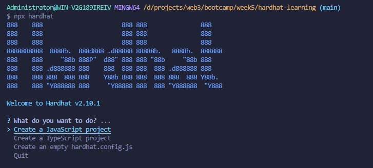


2. You can create your own tasks in your `hardhat.config.js` file. The Config API will be available in the global environment, with functions for defining tasks. You can also import the API with `require("hardhat/config")` if you prefer to keep things explicit, and take advantage of your editor's autocomplete.

   ```js
   // ts写法就要明确地导入task函数
   import { task } from "hardhat/config";
   
   task("accounts", "Prints the list of accounts", async (taskArgs, hre) => {
     const accounts = await hre.ethers.getSigners();
   
     for (const account of accounts) {
       console.log(account.address);
     }
   });
   ```

3. 此时运行 npx hardhat test会报错 (项目用过pnpm安装时候会出现这个，建议npm安装)

   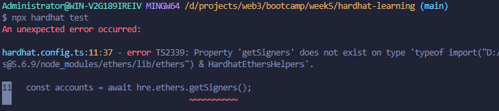

   去官方仓库issues中寻找到这个 https://github.com/NomicFoundation/hardhat/issues/836

   链接中给出解决方案 https://www.npmjs.com/package/@nomiclabs/buidler-ethers#typescript-support

   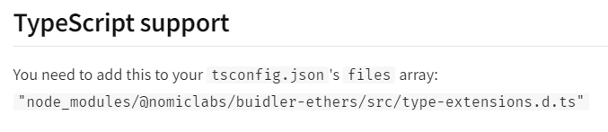

   ```json
   {
     "compilerOptions": {
       "target": "es2020",
       "module": "commonjs",
       "esModuleInterop": true,
       "forceConsistentCasingInFileNames": true,
       "strict": true,
       "skipLibCheck": true
     },
     // 添加下边这行代码
     "files": ["node_modules/@nomiclabs/buidler-ethers/src/type-extensions.d.ts"]
   }
   ```

4. 使用hardhat的forking功能fork mainnet来模拟真实测试，但不会花费real money

   https://hardhat.org/hardhat-network/docs/guides/forking-other-networks#mainnet-forking

   使用dotenv包将配置写到配置文件中，根目录新建 .env 文件
   
   ```properties
   alchemyKey=https://eth-mainnet.g.alchemy.com/v2/OZWyi8vjgLpp4qAl8BC3EEwBLeway5oP
   ```
   
   ```sh
   npm i -S dotenv
   ```
   
   ```js
   import 'dotenv/config
   
   const config: HardhatUserConfig = {
     solidity: "0.8.9",
     // 添加networks字段
     networks: {
       hardhat: {
         forking: {
           // 这里使用自己的alchemy链接
           url: `${process.env.alchemyKey}`,
           blockNumber: 14390000,
         },
       },
     },
   };
   ```
   
   如果不添加 blockNumber字段，运行时会出现fork starting 的提示，说明此时是在forking
   
   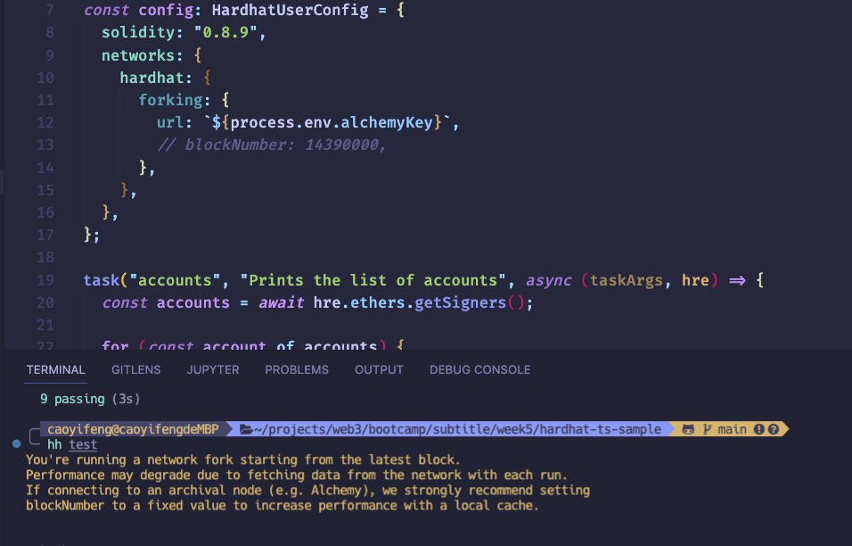


5. 使用console.log

   When running your contracts and tests on Hardhat Network you can print logging messages and contract variables calling `console.log()` from your Solidity code. To use it you have to import `hardhat/console.sol` in your contract code.

   https://hardhat.org/tutorial/debugging-with-hardhat-network#solidity--console.log

   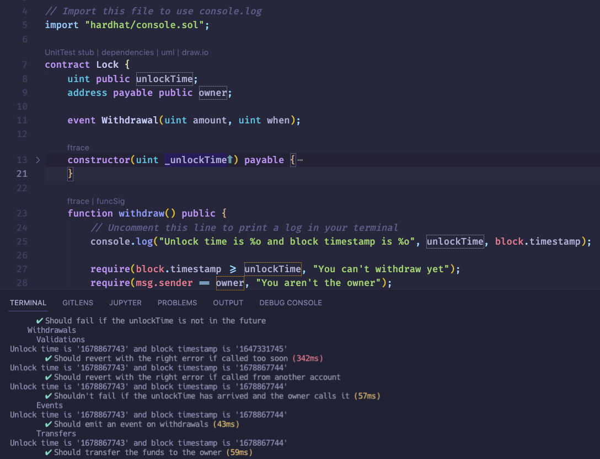

6. 切换主网和其他测试网络 (TODO)

   https://hardhat.org/hardhat-runner/docs/config

   

7. 基础的work flow

   ```solidity
   // SPDX-License-Identifier: UNLICENSED
   pragma solidity ^0.8.9;
   
   // Import this file to use console.log
   import "hardhat/console.sol";
   
   contract Greeter {
       string private greeting;
   
       constructor(string memory _greeting) {
           console.log("Deploying a Greeter with greeting:", _greeting);
           greeting = _greeting;
       }
   
       function greet() public view returns (string memory) {
           return greeting;
       }
   
       function setGreeting(string memory _greeting) public {
           console.log("Changing greeting from '%s' to '%s'", greeting, _greeting);
           greeting = _greeting;
       }
   }
   ```

   ```js
   import { expect } from "chai";
   import { ethers } from "hardhat";
   
   describe("Greeter", function () {
       it.only("Should return the new greeting once it's changed", async function () {
           const Greeter = await ethers.getContractFactory("Greeter");
           const greeter = await Greeter.deploy("Hello, world!");
   
           expect(await greeter.greet()).to.equal("Hello, world!");
   
           const setGreetingTx = await greeter.setGreeting("Hola, mundo!");
   
           // wait until the transaction is mined
           await setGreetingTx.wait();
   
           expect(await greeter.greet()).to.equal("Hola, mundo!");
       });
   });
   ```

   

8. View函数和其他能够改变state的函数的区别

   ```js
           const setGreetingTx = await greeter.setGreeting("Hola, mundo!");
   
           // wait until the transaction is mined
           await setGreetingTx.wait();
   ```

   这里为什么是await两次？可以看Greeter合约，setGreeting是会改变state状态的方法，所以执行setGreeting方法会发送交易，所以需要wait来等待这笔交易被block include.

9. ```js
   it.only("Should return the new greeting once it's changed", async function () {
           const Greeter = await ethers.getContractFactory("Greeter");
           const greeter = await Greeter.deploy("Hello, world!");
           // 查看合约
           console.log(greeter);
   
           expect(await greeter.greet()).to.equal("Hello, world!");
   
           const setGreetingTx = await greeter.setGreeting("你好");
           // 查看交易
           console.log(setGreetingTx);
   
           // wait until the transaction is mined
           await setGreetingTx.wait();
   
           expect(await greeter.greet()).to.equal("你好");
       });
   ```

   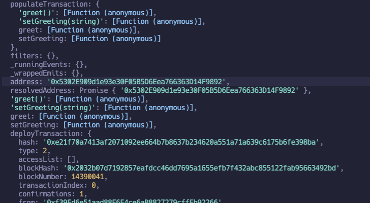

   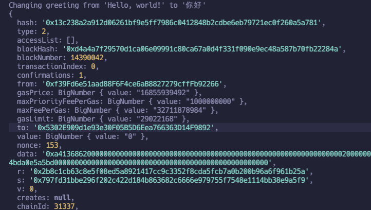

   可以看到，交易中的to的地址就是合约的address

10. 需要注意的是从hardhat中导入的ethers，这样可以获得更多操作blockchain的方法

    ```js
    import { ethers } from "hardhat";
    ```

    使用 npx hardhat typechain 可以为已编写好的合约生成类型文件，所以在test文件中可以更方便使用

    ```js
    import { expect } from "chai";
    import { ethers } from "hardhat";
    import { Greeter } from "../typechain-types";
    
    describe("Greeter", function () {
        let contract: Greeter;
        beforeEach(async function () {
            const ContractFactory = await ethers.getContractFactory("Greeter");
            contract = await ContractFactory.deploy("Hello, world!");
            console.log(contract);
            // https://docs.ethers.io/v5/api/contract/contract-factory/#ContractFactory-deploy
            // ethers官方文档中给出的使用这个api来等待tx被mined
            await contract.deployTransaction.wait();
        });
    
        it.only("Should return the new greeting once it's changed", async function () {
            expect(await contract.greet()).to.equal("Hello, world!");
    
            const setGreetingTx = await contract.setGreeting("你好");
            console.log(setGreetingTx);
    
            // wait until the transaction is mined
            await setGreetingTx.wait();
    
            expect(await contract.greet()).to.equal("你好");
        });
    });
    ```

    

11. 使用BigNumber

    ```solidity
    // SPDX-License-Identifier: UNLICENSED
    pragma solidity ^0.8.9;
    
    // Import this file to use console.log
    import "hardhat/console.sol";
    
    contract BigNumbers {
        uint256 public number;
    
        function setNumber(uint256 newNumber) external {
            number = newNumber;
        }
    
        function setToTheMax() external {
            number = type(uint256).max;
        }
    
        function getNumber() external view returns (uint256) {
            return number;
        }
    }
    ```

    

    ```js
    import { ethers } from "hardhat";
    const { BigNumber } = ethers;
    
    describe("BigNumbers", function () {
        let contract: BigNumbers;
        beforeEach(async function () {
            const BGCF = await ethers.getContractFactory("BigNumbers");
            contract = await BGCF.deploy();
            await contract.deployTransaction.wait();
        });
    
        describe("getNumber", async function () {
            // Bad
            it("should get zero", async function () {
                // 这里是 { BigNumber: 0 }
                console.log(await contract.getNumber());
                expect(await contract.getNumber()).to.be.equal(0);
            });
        });
    
        // Bad
        describe("setToTheMax Bad", async function () {
            it("should set the number to the maximum", async function () {
                const tx = await contract.setToTheMax();
                await tx.wait();
    
                expect(await contract.getNumber()).to.be.equal(
                    115792089237316195423570985008687907853269984665640564039457584007913129639935,
                );
            });
        });
    
        // Good
        describe("setToTheMax Good", async function () {
            it.only("should set the number to the maximum", async function () {
                const tx = await contract.setToTheMax();
                await tx.wait();
    
                expect(await contract.getNumber()).to.be.equal(
                    BigNumber.from(
                        "115792089237316195423570985008687907853269984665640564039457584007913129639935",
                    ),
                );
            });
        });
    });
    ```

    这里要使用BigNumber来进行转换

12. 这个例子是测试当你直接调用transfer会改变state，所以是发送交易，因此需要时间来mining，所以ethers库不支持立即返回数据，所以使用callStatic来假装不会改变state，以达到立即获得返回数据的效果

    https://docs.ethers.io/v5/api/contract/contract/#contract-callStatic 

    *contract*.*callStatic*.**METHOD_NAME**( ...*args* [ , *overrides* ] ) ⇒ *Promise< any >*

    Rather than executing the state-change of a transaction, it is possible to ask a node to *pretend* that a call is not state-changing and return the result.

    This does not actually change any state, but is free. This in some cases can be used to determine if a transaction will fail or succeed.

    This otherwise functions the same as a [Read-Only Method](https://docs.ethers.io/v5/api/contract/contract/#Contract--readonly).

    The *overrides* are identical to the read-only operations above.

    ```solidity
    // SPDX-License-Identifier: UNLICENSED
    pragma solidity ^0.8.9;
    
    // Import this file to use console.log
    import "hardhat/console.sol";
    
    contract ExternalReturn {
        mapping(address => uint256) balances;
    
        function transfer(address _from, address _to) external returns (bool) {
            balances[_to] += 1;
            return true;
        }
    }
    ```

    ```js
    describe("transfer(address,address)", async function () {
            it.only("should return true for non-zero recipient", async function () {
                const tx1 = await contract.transfer(
                    "0xf39Fd6e51aad88F6F4ce6aB8827279cffFb92266",
                    "0x70997970C51812dc3A010C7d01b50e0d17dc79C8",
                );
                console.log(tx1);
    
                const tx = await contract.callStatic.transfer(
                    "0xf39Fd6e51aad88F6F4ce6aB8827279cffFb92266",
                    "0x70997970C51812dc3A010C7d01b50e0d17dc79C8",
                );
                expect(tx).to.be.true;
            });
        });
    ```

    使用console.log打印出来的也并不是返回值，只是交易信息，所以使用callStatic可以立即返回，实际上balances[_to]也并没有加1，只是单纯的返回了true，只是用来测试方法是否执行了而已

13. 硬编码的address不好，可以改为编程式的

    ```solidity
    // SPDX-License-Identifier: UNLICENSED
    pragma solidity ^0.8.9;
    
    // Import this file to use console.log
    import "hardhat/console.sol";
    
    contract Accounts {
        address public admin;
    
        constructor() {
            admin = msg.sender;
        }
    
        modifier onlyAdmin() {
            require(msg.sender == admin, "only admin");
            _;
        }
    
        function changeAdmin(address _admin) external onlyAdmin {
            admin = _admin;
        }
    }
    ```

    默认是使用第一个账号来发送交易，这里可以打印看一下实际上就是hh accounts中的第一个address

    ```js
        beforeEach(async function () {
            const ContractFactory = await ethers.getContractFactory("Accounts");
            accounts = await ethers.getSigners();
            contract = await ContractFactory.deploy();
            await contract.deployTransaction.wait();
    
            // 默认使用第一个账号，这里可以打印看一下
            console.log(await contract.admin());
        });
    
    		it("Should return the new greeting once it's changed", async function () {
            // 注意这里调用 .address 因为 accounts[0]是一个SignerWithAddress对象，并不是地址
            expect(await contract.admin()).to.equal(accounts[0].address);
        });
    ```

    可以使用connect来指定哪个address来making the transaction

    ```js
        const DEPLOYER_ID = 3;
    
        beforeEach(async function () {
            const ContractFactory = await ethers.getContractFactory("Accounts");
    
            accounts = await ethers.getSigners();
            // 这是首先使用了connect来指定发送交易的address
            contract = await ContractFactory.connect(
                // 其次使用了编程式的address，并且注意这里是使用的SignerWithAddress对象
                accounts[DEPLOYER_ID],
            ).deploy();
            await contract.deployTransaction.wait();
    
            // 默认使用第一个账号，这里可以打印看一下
            console.log(await contract.admin());
        });
    ```

    

14. 这里使用了一个revertedWith matcher

    https://ethereum-waffle.readthedocs.io/en/latest/matchers.html#revert-with-message

    ```js
        describe("changeAdmin", async function () {
            // 这里 context 只不过是 describe 的别名
            // https://mochajs.org/#bdd
            context("rejecting the sender", async function () {
                // Safer
                it("should accept admin", async function () {
                    await expect(
                        contract
                            .connect(accounts[ATTACKER_ID])
                            .changeAdmin(accounts[ATTACKER_ID].address),
                    ).to.be.revertedWith("only admin");
                });
            });
        });
    ```

15. 目前为止有三种pattern

    ```js
    // 第一种 view方法不改变state，单纯地await等待返回
    expect(await contract.greet()).to.equal("Hello, world!");
    
    // 第二种 改变state方法，需要调用wait方法等待mining
    const setGreetingTx = await contract.setGreeting("你好");
    // wait until the transaction is mined
    await setGreetingTx.wait();
    expect(await contract.greet()).to.equal("你好");
    
    // 第三种 因为这里如果address不对的话会产生revert，所以需要再expect前加await来等带 副作用 是否发生
    it("should accept sender", async function () {
      await expect(
        contract
        .connect(accounts[DEPLOYER_ID])
        .changeAdmin(accounts[NEW_ADMIN].address),
      ).to.be.not.reverted;
    });
    ```

    

16. 测试接收event

    ```solidity
    // SPDX-License-Identifier: UNLICENSED
    pragma solidity ^0.8.9;
    
    // Import this file to use console.log
    import "hardhat/console.sol";
    
    contract Event {
        event ImportantMessage(address);
        event EmptyMessage();
    
        function emitEventWithAddress() external {
            emit ImportantMessage(msg.sender);
        }
    
        function emitEmptyMessage() external {
            emit EmptyMessage();
        }
    }
    ```

    这里测试了接收带参数和不带参数的事件

    https://ethereum-waffle.readthedocs.io/en/latest/matchers.html#emitting-events

    ```js
    describe("Event", function () {
        let contract: Event;
        let accounts: SignerWithAddress[];
        beforeEach(async function () {
            const factory = await ethers.getContractFactory("Event");
            contract = await factory.deploy();
            await contract.deployTransaction.wait();
    
            accounts = await ethers.getSigners();
        });
    
        describe("emitAddressEvent", async function () {
            it("should emit the msg.sender", async function () {
                await expect(contract.emitEventWithAddress())
                    .to.emit(contract, "ImportantMessage")
                    .withArgs(accounts[0].address);
            });
        });
    
        describe("emitEmpytMessage", async function () {
            it("should emit an argument-less event", async function () {
                await expect(contract.emitEmptyMessage())
                    .to.emit(contract, "EmptyMessage")
                    .withArgs();
            });
        });
    });
    ```

    

17. SimeplTransfer

    ```solidity
    // SPDX-License-Identifier: UNLICENSED
    pragma solidity ^0.8.9;
    
    // Import this file to use console.log
    import "hardhat/console.sol";
    
    contract SimpleTransfer {
        mapping(address => uint256) public accounts;
    
        function deposit() external payable {
            accounts[msg.sender] += msg.value;
        }
    
        function withdraw() external {
            // always update the internal state first before making an external call
            uint256 _balance = accounts[msg.sender];
            delete accounts[msg.sender];
    
            payable(msg.sender).transfer(_balance);
        }
    }
    ```

    这里有几个api

    首先是这个 ethers.provider 返回的是HH内置的JsonRpcProvider，Allows sending raw messages to the provider. This can be used for backend-specific calls, such as for debugging or specific account management.

    https://docs.ethers.io/v5/single-page/#/v5/api/providers/jsonrpc-provider/-%23-JsonRpcProvider-send

    第二是这个 hardhat_setBalance API 可以强制改变某个address的balance

    https://hardhat.org/hardhat-network/docs/reference#hardhat_setbalance

    ```js
        let contract: SimpleTransfer;
        let accounts: SignerWithAddress[];
        let provider: JsonRpcProvider;
        beforeEach(async function () {
            const factory = await ethers.getContractFactory("SimpleTransfer");
            contract = await factory.deploy();
            await contract.deployTransaction.wait();
    
            accounts = await ethers.getSigners();
            // don't do this, it will connect to the mainnet!
            // You could actually get provider via this mechanism, and this is what you might do inside of your web app
            // But if you do this inside of your HRE, it weill connect to the mainnet and your test will not work
            // provider = await ethers.getDefaultProvider();
    
            // provider is what gives you the interface for manipulating the blockchain that we running locally
            provider = await ethers.provider;
            console.log(provider);
            // RPC protocol doesn't allow the leading zeros
            const twentyThousandEtherInHex = utils.hexStripZeros(
                utils.parseEther("20000").toHexString(),
            );
    
            //  注意这里这个api需要hex进制的且没有leading zero的参数
            await provider.send("hardhat_setBalance", [
                accounts[0].address,
                twentyThousandEtherInHex,
            ]);
            
          	context("initial conditions", async function () {
              it("should have zero balance", async function () {
                const balance = await provider.getBalance(contract.address);
                expect(balance).to.be.equal(ethers.BigNumber.from(0));
              });
    
              it("account 0 should have 20,000 ether", async function () {
                const balance = await provider.getBalance(accounts[0].address);
                expect(balance).to.be.equal(
                  ethers.BigNumber.from(utils.parseEther("20000")),
                );
              });
            });
        });
    ```

    ```js
        describe("deposit", async function () {
            // 这里用xit 和 it.skip() 都可以
            xit("should deposit 10,000 ether", async function () {
                const tx = await contract
                    .connect(accounts[0])
                    .deposit({ value: utils.parseEther("10000") });
                await tx.wait();
    
                expect(await provider.getBalance(contract.address)).to.be.equal(
                    ethers.BigNumber.from(utils.parseEther("10000")),
                );
                expect(await provider.getBalance(accounts[0].address)).to.be.equal(
                    ethers.BigNumber.from(utils.parseEther("10000")),
                );
            });
    
            it("should deposit 10,000 ether", async function () {
                const tx = await contract
                    .connect(accounts[0])
                		// 注意这里传递参数的写法
                    .deposit({ value: utils.parseEther("10000") });
                await tx.wait();
    
                expect(await provider.getBalance(contract.address)).to.be.equal(
                    ethers.BigNumber.from(utils.parseEther("10000")),
                );
                expect(await provider.getBalance(accounts[0].address)).to.be.equal(
                    ethers.BigNumber.from(utils.parseEther("10000")),
                );
            });
        });
    ```

    waffle change ether balance

    https://ethereum-waffle.readthedocs.io/en/latest/matchers.html#change-ether-balance

    注意这个写法与solidity的named call传递参数的区分

    Named calls

    https://docs.soliditylang.org/en/latest/control-structures.html#named-calls-and-anonymous-function-parameters

    如果将第一个skip那么会成功，如果第一个不跳过，那么则会失败，因为会花费手续费fee

    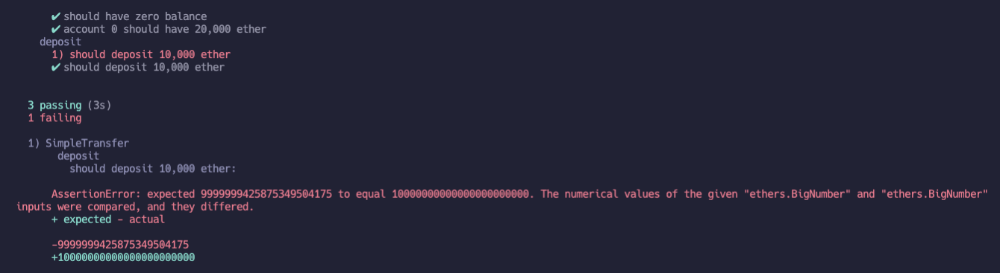

    ```js
    describe("withdraw", async function () {
            it("should deposit 10,000 ether", async function () {
                const tx = await contract
                    .connect(accounts[0])
                    .deposit({ value: utils.parseEther("10000") });
                await tx.wait();
    
                expect(await provider.getBalance(contract.address)).to.be.equal(
                    ethers.BigNumber.from(utils.parseEther("10000")),
                );
    
                const txWithdraw = await contract.connect(accounts[0]).withdraw();
                await txWithdraw.wait();
    
                expect(await provider.getBalance(contract.address)).to.be.equal(
                    ethers.BigNumber.from(0),
                );
    
                expect(
                    await provider.getBalance(accounts[0].address),
                ).to.be.closeTo(
                    ethers.BigNumber.from(utils.parseEther("20000")),
                    ethers.BigNumber.from(utils.parseEther("0.001")),
                );
            });
        });
    ```

    这里有个api closeTo

    https://www.chaijs.com/api/assert/#method_closeto

    因为withdraw会花手续费，所以肯定提现到accounts[0]中的钱是略少于20000的

18. 随意的存取并没有意义，所以这里加上了一个TimeLock例子

    ```solidity
    // SPDX-License-Identifier: UNLICENSED
    pragma solidity ^0.8.9;
    
    import "hardhat/console.sol";
    
    contract TimeLock {
        uint256 public constant DURATION = 1 days;
    
        struct AccountInfo {
            uint256 balance;
            uint256 lastDeposit;
        }
    
        mapping(address => AccountInfo) public accounts;
    
        function deposit() external payable {
            accounts[msg.sender].balance += msg.value;
            //
            accounts[msg.sender].lastDeposit = block.timestamp;
        }
    
        function withdraw() external {
            require(
                block.timestamp - accounts[msg.sender].lastDeposit > DURATION,
                "cannot withdraw yet"
            );
    
            // always update the internal state first before making an external call
            uint256 _balance = accounts[msg.sender].balance;
    
            payable(msg.sender).transfer(_balance);
        }
    }
    ```

    solidity time unit

    https://docs.soliditylang.org/en/latest/units-and-global-variables.html?highlight=block.timestamp#time-units

    ```js
      describe("withdraw", async function() {
        it("should block withdraw before 1 day", async function() {
          const tx = await contract
            .connect(accounts[1])
            .deposit({ value: utils.parseEther("200") });
          await tx.wait();
    
          expect(await provider.getBalance(contract.address)).to.be.equal(
            BigNumber.from(utils.parseEther("200"))
          );
    
          await expect(contract.connect(accounts[1]).withdraw()).to.be.revertedWith(
            "cannot withdraw yet"
          );
        });
    
        it("should allow withdraw after 1 day", async function() {
          const originalBalance = await provider.getBalance(accounts[1].address);
          const tx = await contract
            .connect(accounts[0])
            .deposit({ value: utils.parseEther("300") });
          await tx.wait();
    
          await provider.send("evm_increaseTime", [60 * 60 * 24 + 1]);
    
          expect(await provider.getBalance(contract.address)).to.be.equal(
            BigNumber.from(utils.parseEther("300"))
          );
    
          await expect(contract.connect(accounts[1]).withdraw()).to.not.be.reverted;
    
          const balance = await provider.getBalance(accounts[1].address);
          expect(balance).to.be.closeTo(originalBalance, SMALL_ETHER);
        });
      });
    ```

    注意这里有个 evm_increaseTime 接口，官网文档地址只说了

    https://hardhat.org/hardhat-network/docs/reference#evm_increasetime

    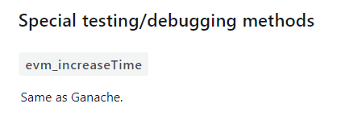

    在GitHub的issues中找到 https://github.com/NomicFoundation/hardhat/issues/1243

    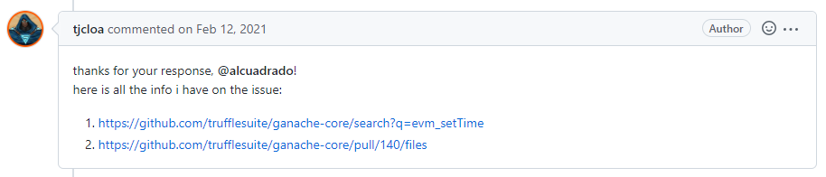

    https://trufflesuite.com/blog/introducing-ganache-7/#6-fast-forward-time

    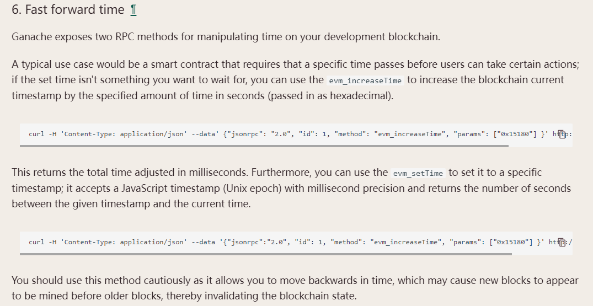

19. 和上一个类似，这个例子来操作block number

    In this video we're going to talk about how to advance the block number. Now, most of the time, you should be using a timestamp rather than a block number, because a timestamp is a much more reliable indicator of how much time has passed instead of a block number, because the time between blocks can vary and when ethereum goes over to proof of stake (POS), it's the block time is going to considerably drop from where it is now. Block numbers are usually appropriate when you're using a commit reveal scheme.

    That is when people make a commitment at an earlier point in time and then have to wait a certain amount of time to make sure that that commitment can't be changed.

    ```solidity
    // SPDX-License-Identifier: UNLICENSED
    pragma solidity ^0.8.9;
    
    import "hardhat/console.sol";
    
    contract BlockNumber {
        uint256 public constant MIN_BLOCKS_AHEAD = 10;
        uint256 public constant MAX_BLOCKS_AHEAD = 110;
    
        mapping(address => uint256) public degenToBlockNumberBet;
    
        function gambleOnTenthBlockNumber() external payable {
            require(msg.value == 1 ether, "not degen enough");
            // 这里是: 只要有人发送了1ETH进来,那么这个require就为true
            // require(address(this).balance >= 1 ether, "can't gamble with you");
            require(
                block.number > degenToBlockNumberBet[msg.sender] + MAX_BLOCKS_AHEAD,
                "wait for cooldown time"
            );
            degenToBlockNumberBet[msg.sender] = block.number + MIN_BLOCKS_AHEAD;
        }
    
        function claimWinnings() external {
            console.log(block.number);
            require(
                block.number > MIN_BLOCKS_AHEAD + degenToBlockNumberBet[msg.sender],
                "too early"
            );
            require(
                block.number <=
                    MAX_BLOCKS_AHEAD + degenToBlockNumberBet[msg.sender],
                "too late"
            );
            if (uint256(blockhash(degenToBlockNumberBet[msg.sender])) % 2 == 0) {
                payable(msg.sender).transfer(1 ether);
            }
        }
    }
    ```

    ```js
            it("should revert if the user bets before cooldown time", async function () {
                await provider.send("hardhat_mine", [utils.hexValue(1000)]);
    
                await contract.gambleOnTenthBlockNumber({
                    value: utils.parseEther("1"),
                });
    
                await provider.send("hardhat_mine", [utils.hexValue(1)]);
    
                await expect(
                    contract.gambleOnTenthBlockNumber({
                        value: utils.parseEther("1"),
                    }),
                ).to.be.revertedWith("wait for cooldown time");
            });
    ```

    