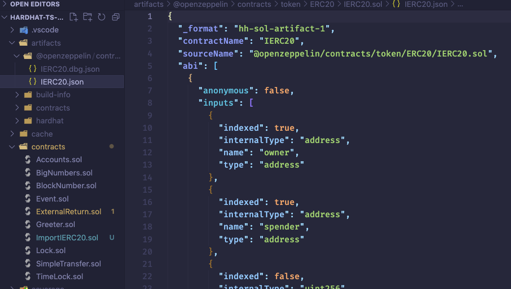

这个视频代码地址

https://github.com/t4sk/defi-by-example/tree/main/uni-v3


这里注意原生ethers中的api

https://docs.ethers.io/v5/api/contract/example/#example-erc-20-contract--connecting-to-a-contract--erc20contract

 和 hardhat-ethers插件api的差别

https://hardhat.org/hardhat-runner/plugins/nomiclabs-hardhat-ethers

一旦你有了主网网络的本地实例，将它们设置在你的测试所需的特定状态下，就可能是下一步要做的。 为了方便，Hardhat Network允许你冒充特定账户和合约地址发送交易。

使用`hardhat_impersonateAccount`RPC方法，传递要冒充的地址作为参数，来冒充一个账户。

https://hardhat.org/hardhat-network/docs/reference#hardhat_impersonateaccount

DAI address 0x6B175474E89094C44Da98b954EedeAC495271d0F

Etherscan中搜DAI来到 DAI的页面


点Holders页签，选择一个holder来unlock


然后点击这个holder的地址进去


从下边页签里没有contract可以确定这个地址是个钱包地址，而不是合约地址

Exchange   0x075e72a5eDf65F0A5f44699c7654C1a76941Ddc8


这里随便写一个合约，重点是其中导入OpenZeppelin的IERC20，这样在编译的时候就会在artifact文件夹中生成IERC20 abi，这样在test中使用 await ethers.getContractAt("IERC20", DAI_ADDR) 才不会报错



```solidity
// SPDX-License-Identifier: UNLICENSED
pragma solidity ^0.8.9;

import "@openzeppelin/contracts/token/ERC20/IERC20.sol";
```

```js
import { expect } from "chai";
import { ethers, network } from "hardhat";
import { SignerWithAddress } from "@nomiclabs/hardhat-ethers/signers";
import { JsonRpcProvider } from "@ethersproject/providers";
import { IERC20 } from "../typechain-types";

const DAI_ADDR = "0x6B175474E89094C44Da98b954EedeAC495271d0F";
const EXG_ADDR = "0x075e72a5eDf65F0A5f44699c7654C1a76941Ddc8";

describe("Unlock", function () {
    let accounts: SignerWithAddress[];
    let exg_account: SignerWithAddress;
    let DAI_Contract: IERC20;
    let provider: JsonRpcProvider;

    beforeEach(async function () {
        provider = await ethers.provider;

        // await network.provider.request({
        //     method: "hardhat_impersonateAccount",
        //     params: [EXG_ADDR],
        // });
        // https://hardhat.org/hardhat-network/docs/guides/forking-other-networks#impersonating-accounts
        // 这里使用了文档中提供的正确的用法
        exg_account = await ethers.getImpersonatedSigner(EXG_ADDR);

        // exg_account = await ethers.getSigner(EXG_ADDR);
        DAI_Contract = await ethers.getContractAt("IERC20", DAI_ADDR);

        accounts = await ethers.getSigners();
    });

    describe("unlock exchange account", async function () {
        it("should unlock the account", async () => {
            // The "n" at the end of an integer literal merely suggests that the value is a bigint primitive.
            // Bigint values (introduced in ES10) are used to represent arbitrarily large integers.
            const amount = 100n * 10n ** 18n;

            console.log(
                "DAI balance of EXG before",
                await DAI_Contract.balanceOf(EXG_ADDR),
            );
            console.log(
                "DAI balance of account 0 before",
                await DAI_Contract.balanceOf(accounts[0].address),
            );

            await DAI_Contract.connect(exg_account).transfer(
                accounts[0].address,
                amount,
            );

            console.log(
                "DAI balance of EXG after",
                await DAI_Contract.balanceOf(EXG_ADDR),
            );
            console.log(
                "DAI balance of account 0 after",
                await DAI_Contract.balanceOf(accounts[0].address),
            );

            expect(
                await DAI_Contract.balanceOf(accounts[0].address),
            ).to.be.equal(amount.toString());
        });
    });
});
```

这里有个想补充的地方

ethers.provider 应该就是ethers原生库里用来调用JsonRpcProvider的

而network.provider 应该就是hardhat自己添加的用来debug用的api