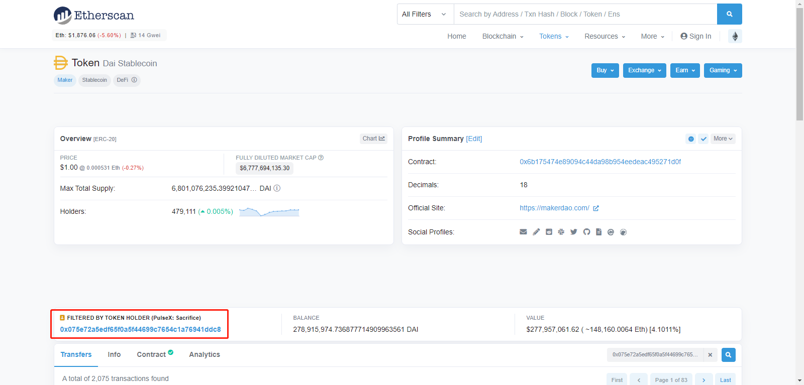

这里注意原生ethers中的api

https://docs.ethers.io/v5/api/contract/example/#example-erc-20-contract--connecting-to-a-contract--erc20contract

 和 hardhat-ethers插件api的差别

https://hardhat.org/hardhat-runner/plugins/nomiclabs-hardhat-ethers

一旦你有了主网网络的本地实例，将它们设置在你的测试所需的特定状态下，就可能是下一步要做的。 为了方便，Hardhat Network允许你冒充特定账户和合约地址发送交易。

使用`hardhat_impersonateAccount`RPC方法，传递要冒充的地址作为参数，来冒充一个账户。

https://hardhat.org/hardhat-network/docs/reference#hardhat_impersonateaccount

DAI address 0x6B175474E89094C44Da98b954EedeAC495271d0F

Etherscan中搜DAI来到 DAI的页面

点Holders页签，选择一个holder来unlock

然后点击这个holder的地址进去

从下边页签里没有contract可以确定这个地址是个钱包地址，而不是合约地址

Exchange   0x075e72a5eDf65F0A5f44699c7654C1a76941Ddc8

