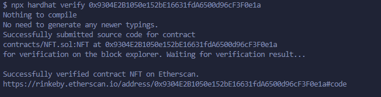
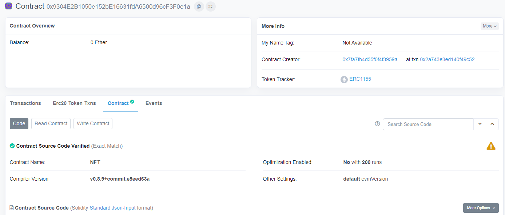
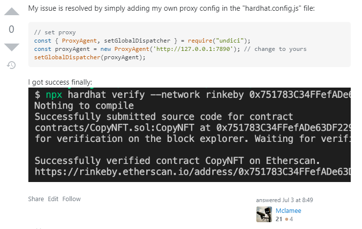

1. 使用hardhat deploy contract的过程可以参考官方文档的教程 

   https://hardhat.org/tutorial/deploying-to-a-live-network#7.-deploying-to-a-live-network


2. What is etherscan api key?   ->   https://info.etherscan.com/api-keys/

   

3. 一个简单的NFT

   ```solidity
   // SPDX-License-Identifier: UNLICENSED
   pragma solidity ^0.8.9;
   
   import "@openzeppelin/contracts/token/ERC1155/ERC1155.sol";
   
   contract NFT is ERC1155 {
       uint256 public constant SWORD = 0;
   
       constructor() ERC1155("https://asdfasdfasdf") {
           _mint(msg.sender, SWORD, 1, "");
       }
   }
   
   ```

   

4. 首先保证安装了 @nomiclabs/hardhat-etherscan 包，之后在hardhat.config.ts中配置etherscan字段的值为

   步骤2中etherscan的apikey，配置方法可参考官方文档的教程

   https://hardhat.org/hardhat-runner/plugins/nomiclabs-hardhat-etherscan#usage

   ```js
   const config: HardhatUserConfig = {
     solidity: "0.8.9",
     defaultNetwork: "rinkeby",
     networks: {
       hardhat: {
         forking: {
           url: `${process.env.ALCHEMY_KEY}`,
           blockNumber: 15352600,
         },
       },
       rinkeby: {
         url: `${process.env.INFURA_KEY}`,
         accounts: [`${process.env.ACCOUNT_4_PK}`, `${process.env.ACCOUNT_3_PK}`],
       },
     },
     etherscan: {
       apiKey: `${process.env.ETHERSCAN_API_KEY}`,
     },
   };
   ```

   

5. 之后参考官方文档，deploy to remote network

   https://hardhat.org/tutorial/deploying-to-a-live-network#deploying-to-remote-networks

   在hardhat.config.ts中配置rinkeby字段，如上边代码所示（这里别忘了去chainlink申请testnet的ether）

   因为这里设置了defaultNetwork字段为rinkeby，所以运行deploy task的时候不用指定network，如果没有

   这个字段则需要指定，如：

   ```bash
   npx hardhat run scripts/deploy.js --network rinkeby
   ```

   这是我自己的部署命令：

   

   ```js
   async function main() {
       const factory = await ethers.getContractFactory("NFT");
       const contract = await factory.deploy();
       await contract.deployed();
   
       console.log("Contract deployed to:", contract.address);
   }
   ```

   因为deploy.ts代码中有console.log打印地址，所以这里deploy成功后会在屏幕上打印部署的地址

   0x9304E2B1050e152bE16631fdA6500d96cF3F0e1a  (verified on windows)

   0x43D22D9f231374FDEa071EEaDd8fa9F13d0Ed906  (verified on mac)

   0xbba21618393505cA660A66A5015809EA4443a2DD  (not verified)

   0x0B8a25D421FAd49042E874d95D021fab2862930C  (not verified)

   

6. 参考官方文档 https://hardhat.org/hardhat-runner/plugins/nomiclabs-hardhat-etherscan#usage

   拿到**address**后执行

   ```bash
   npx hardhat verify --network mainnet DEPLOYED_CONTRACT_ADDRESS "Constructor argument 1"
   ```

   同样，因为配置了defaultNetwork，所以这里不用指定，并且构造函数不需要参数，后边的Constructor argument 1 也可省略，所以我自己的verify命令为：

   

   

   etherscan上的contract也变为verified

   到此整个verify过程完成

   

   

7. 在步骤5和6这两个过程中可能会出现问题，问题的根本原因是etherscan被墙导致的，有个备用方案自己试验不成功，放到文章最后

   

   

   方案1. Stack Overflow上的解决方案完美解决  首先要搞清楚自己的代理是 127.0.0.1:1080

   https://stackoverflow.com/questions/70393986/error-in-plugin-nomiclabs-hardhat-etherscan-the-contract-verification-failed

   安装一个npm包 undici，使verify请求通过proxy来发送

   

   

   方案2.  https://github.com/NomicFoundation/hardhat/issues/2348#issuecomment-1125831361

   

   去查找api-rinkeby.etherscan.io对应的ip再ping

   https://url5.co/?t=1660692040

   

   
