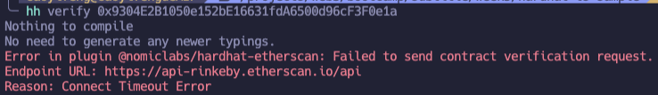
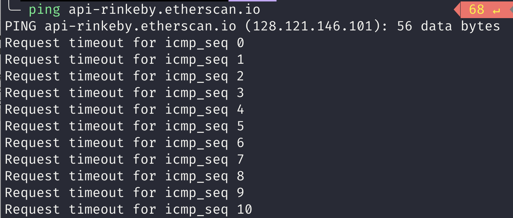
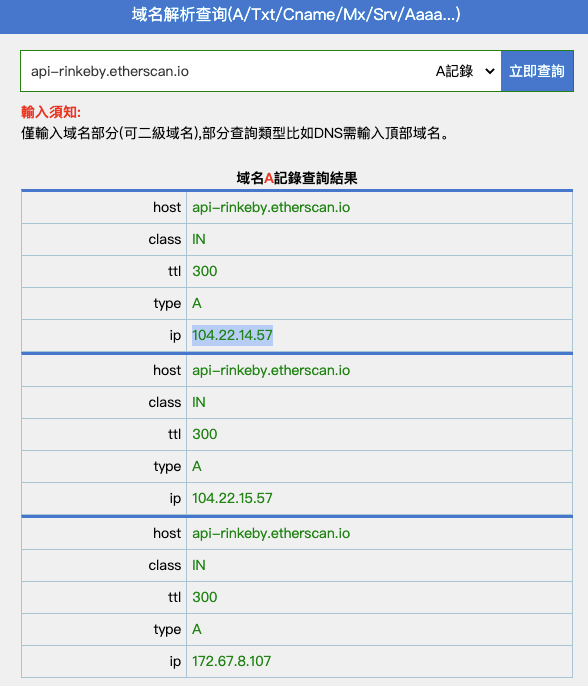
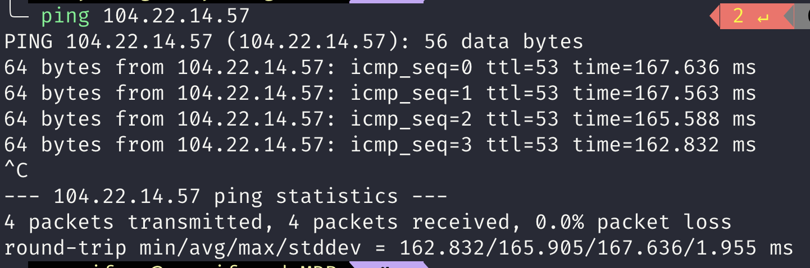

https://hardhat.org/tutorial/deploying-to-a-live-network#7.-deploying-to-a-live-network

What is etherscan api key?

https://info.etherscan.com/api-keys/

address: 0x9304E2B1050e152bE16631fdA6500d96cF3F0e1a

issues中的解决方案 https://github.com/NomicFoundation/hardhat/issues/2348#issuecomment-1125831361

去查找api-rinkeby.etherscan.io对应的ip再ping

https://url5.co/?t=1660692040

