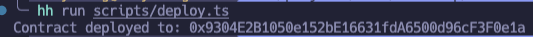

https://hardhat.org/tutorial/deploying-to-a-live-network#7.-deploying-to-a-live-network

What is etherscan api key?

https://info.etherscan.com/api-keys/

address: 0x9304E2B1050e152bE16631fdA6500d96cF3F0e1a ,  0x43D22D9f231374FDEa071EEaDd8fa9F13d0Ed906

issues中的解决方案 https://github.com/NomicFoundation/hardhat/issues/2348#issuecomment-1125831361

这个方案并没有解决问题

去查找api-rinkeby.etherscan.io对应的ip再ping

https://url5.co/?t=1660692040

Stack Overflow上的解决方案完美解决  首先要搞清楚自己的代理是 127.0.0.1:1080

https://stackoverflow.com/questions/70393986/error-in-plugin-nomiclabs-hardhat-etherscan-the-contract-verification-failed

etherscan上的contract也变为verified

