So what is EIP-1559 aka the fee burn proposal, all about? Will it lower ethereum's gas fees and how can it make it deflationary?

Let's start with what EIPs actually are, EIP stands for Ethereum Improvement Proposal and is a common way of requesting changes to the ethereum network. Inspired by Bitcoin Improvement Proposals, Bips. An EIP is a design document covering technical specifications of the proposed change and rational behind it. The majority of EIPs focus on improving technical details of ethereum and they are not widely discussed outside of the core ethereum developers community. EIP-1559 is one of the exceptions. This is because the proposal has some big implications when it comes to the ETH monetary policy and client applications such as wallets.

EIP-1559 describes changes to the ethereum fee model, and it was put forward by Vitalik Buterin in 2019, to understand why we need this proposal in the first place, let's quickly review how the current ethereum fee model works.

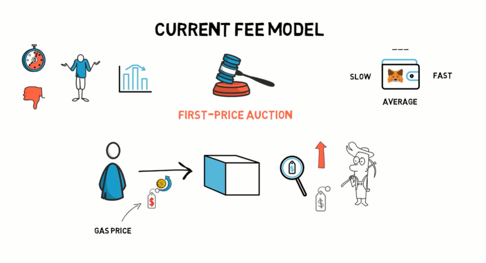

**The current fee model is based on a simple auction mechanism, also known as a first price auction. The users who want to have their transaction picked up by a miner have to essentially bid for their space in a block. This is done by submitting a gas price that they are willing to pay for a particular transaction. The miners are incentivized to pick up transactions by sorting them by the highest gas price and including the most profitable ones first, this can be quite inefficient and usually results in users overpaying for their transactions.** This model is also quite problematic when it comes to the wallets, metamask for example, allows the users to adjust their fee by choosing between slow, average and fast confirmation time or by specifying a gas price manually. Less sophisticated users were unlucky enough to submit their transaction with a default fee just before a spike in a gas fees, may end up waiting for the transaction to be confirmed for a long period of time. This is, of course, not ideal from the user experience point of view.

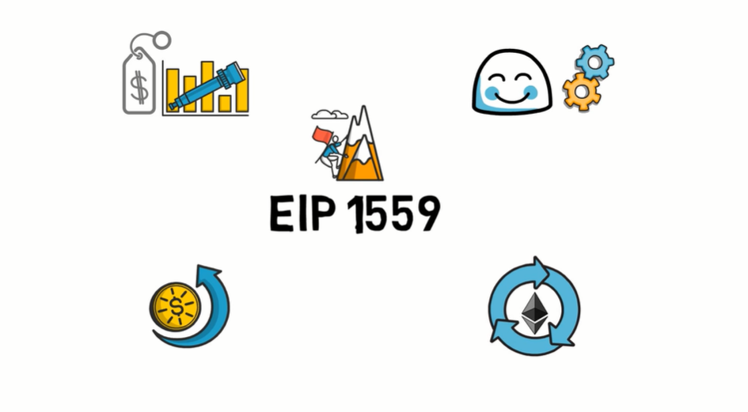

This is also where EIP-1559 comes into play. The proposal was made to accommodate these problems and it aims to achieve the following goals: making transaction fees more predictable, reducing delays in transaction confirmation, improving user experience by automating the fee bidding system, creating a positive feedback loop between network activity and the ETH supply.

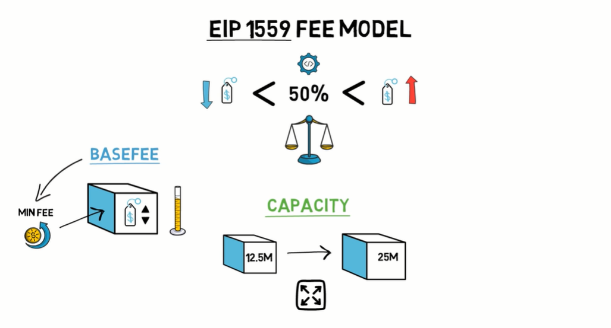

(个人补充，Ethereum官网对BASEFEE的定义https://ethereum.org/en/developers/docs/gas/#post-london Starting with the London network upgrade, every block has a base fee, the minimum price per unit of gas for inclusion in this block, calculated by the network based on demand for block space.)

(个人补充2，Ethereum官网对target的解释https://ethereum.org/en/developers/docs/gas/#block-size The London Upgrade introduced variable-size blocks to Ethereum. Each block has a **target** size of 15 million gas, but the size of blocks will increase or decrease in accordance with network demand, up until the block limit of 30 million gas (2x the target block size). The protocol achieves an equilibrium block size of 15 million on average through the process of *tâtonnement*. )

(个人补充3，EIP-1559的伪代码中关于target，target就是limit的一半，也就是50%，既下文中的 50% utilization中的50%，注意这里的ELASTICITY_MULTIPLIER = 2，简单说就是弹性扩张2倍)

```python
@dataclass
class Block:
	parent_hash: int = 0
	uncle_hashes: Sequence[int] = field(default_factory=list)
	author: int = 0
	state_root: int = 0
	transaction_root: int = 0
	transaction_receipt_root: int = 0
	logs_bloom: int = 0
	difficulty: int = 0
	number: int = 0
    ####################################################################################
	gas_limit: int = 0 # note the gas_limit is the gas_target * ELASTICITY_MULTIPLIER
    ####################################################################################
	gas_used: int = 0
	timestamp: int = 0
	extra_data: bytes = bytes()
	proof_of_work: int = 0
	nonce: int = 0
	base_fee_per_gas: int = 0
    
############################    
ELASTICITY_MULTIPLIER = 2
```


Now, let's see what the proposed change is all about. **EIP-1559 introduces a new concept of a BASEFEE. The BASEFEE represents the minimum fee that has to be paid by a transaction to be included in a block. The BASEFEE is set per block and it can be adjusted up or down depending on how congested the ethereum network is. The next big part of EIP-1559 is an increase in the network capacity achieved by changing the max gas limit per block from 12.5 million to 25 million gas.** Basically, doubling the block size with the BASEFEE and increased network capacity, Eip-1559 can build the following logic: when the network is at more than 50% utilization, the BASEFEE is incremented, when the network is at lower than 50% utilization, the BASEFEE is decremented. This basically means that the network aims at achieving equilibrium at 50 capacity by adjusting fees accordingly to the network utilization.

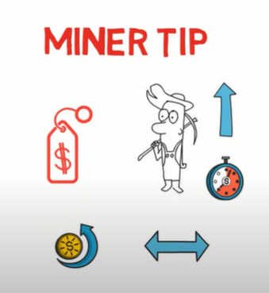

EIP-1559 also introduces a minor tip, a separate fee that can be paid directly to the miner, to incentivize them to prioritize a transaction. This is very similar to the current mechanism where the miners can be incentivized by higher gas fees. This feature is really important for transactions that take advantage of quick confirmation, such as arbitrage transactions.

Now, let's go through a quick example to see how the EIP-1559 fee model compares to the existing model during a period of high network activity. Before we do that, if you made it this far and you enjoy the video hit the like button, so this kind of content can reach a wider audience. 

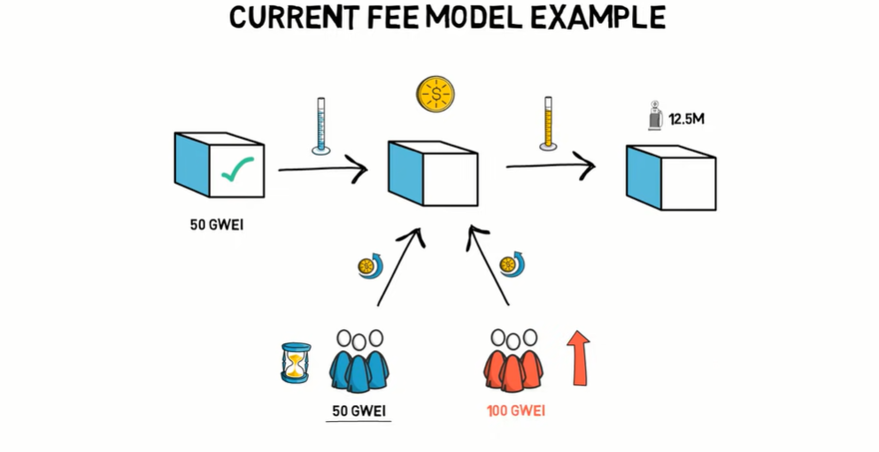

Let's start with the current fee model. Imagine the minimum gas fee to be included in the previous block was 50 gwei. The network activity seems to remain the same, so users start submitting their transactions with 50 gwei, trying to be included in the next block. At the same time, a new highly anticipated token is launched causing users who want to buy it to dramatically increase their bids. Now, to be included in the next block. The minimum required fee is 100 gwei, if the network activity remains high for multiple subsequent blocks. The users who already submitted their transactions with 50 gwei may wait for their confirmations for a very long period of time. In this case, the block size is capped at 12.5 million gas, and the only way to get into a block is to bid higher than the other users.

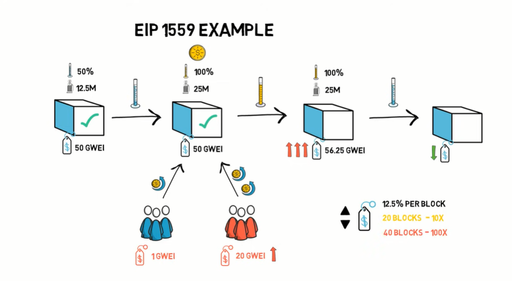

Let's go through the same scenario, this time with EIP-1559 in place. In the previous block. The 50 gwei was the base fee and the network utilization was at 50 percent with most blocks using 12.5 million gas half of the max gas limit. The spike caused by the release of the new token results in users submitting their transactions with a higher miner tip, seeing the high demand for the block space and a lot of transactions with high miner tips. The miners produce a block that is at the max cap limit of 25 million gas. This results in more transactions being included in a block, but it also causes the BASEFEE to be increased in the following block, as the current block is 100% full.

If the network activity and demand for block space remain high, the miners would keep producing full blocks, increasing the BASEFEE with each subsequent block. At some point, the fee would become high enough to drive off some of the users causing the network to start coming back to below 50 network utilization and lowering the fees in the subsequent blocks. The base fee can increase or decrease by a maximum of 12.5% per block, so it would take roughly 20 blocks around 5 minutes for gas prices to 10x and 40 blocks to 100x. In our example, the second block would have a BASEFEE of 56.25 gwei.

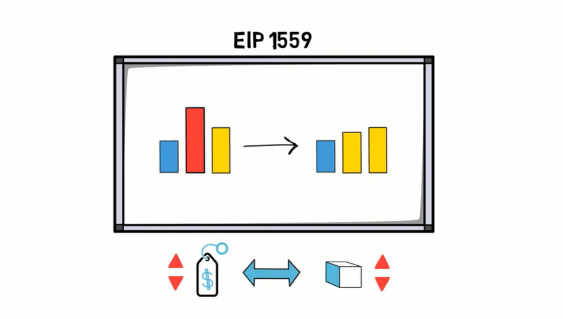

This example demonstrates how spikes in network fees can be smoothed out when EIP-1559 is implemented. Another way of thinking about this model is to imagine that it basically swaps high volatility in the fee prices for volatility in the block size, because the increments and decrements are constrained.

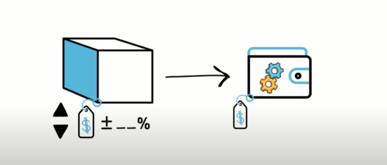

The difference in the BASEFEE from block to block can be easily calculated. This allows wallets to automatically set the BASEFEE based on the information from the previous blocks.

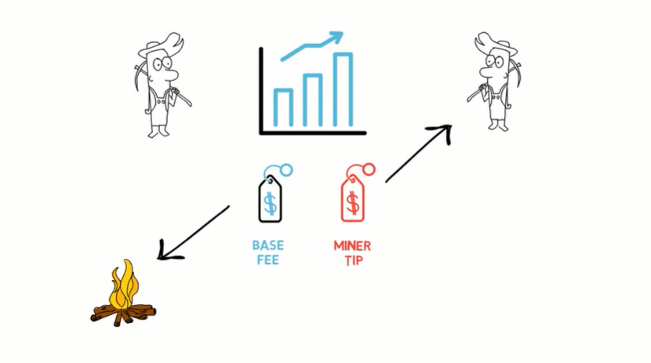

To avoid a situation where miners can collude and artificially inflate the BASEFEE for their own benefit, the entire BASEFEE is burned. Let's repeat this, the BASEFEE is always entirely burned. The miner tip is always entirely received by the miner.

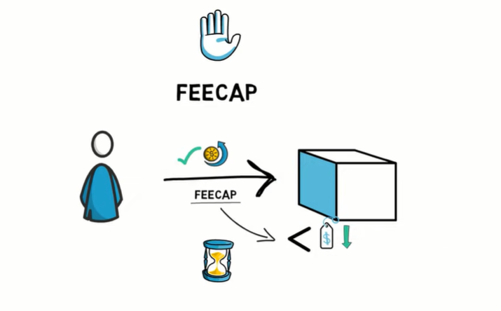

There is also one more important new concept known as a FEECAP. This can be said by users who would like to limit how much they want to pay for a particular transaction instead of just paying the current BASEFEE. Transaction with a FEECAP that is lower than the current BASEFEE would have to wait until the BASEFEE is lower than the max fee set in FEECAP to be included in a block.

The fee changes are also backward compatible. The legacy ethereum transaction would still work under the new fee system, although they would not benefit directly from the new pricing model.

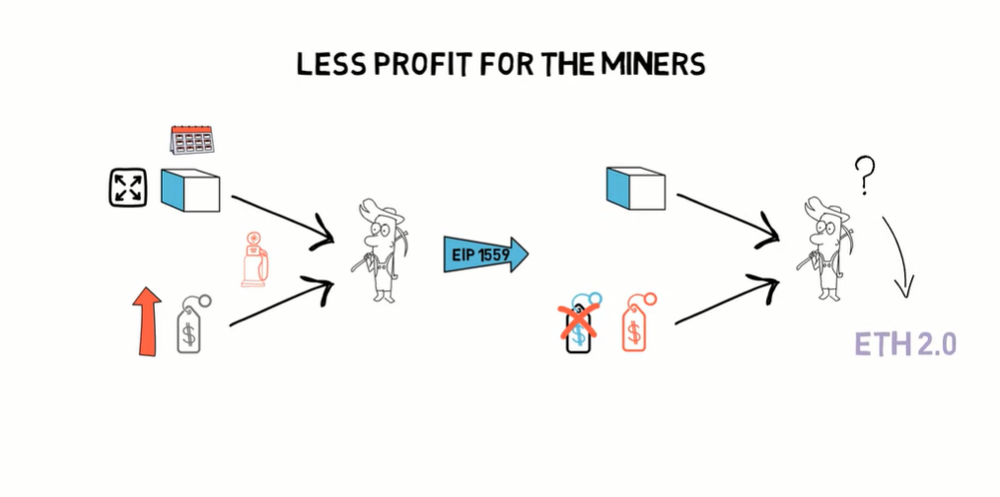

Changes proposed in EIP-1559 have a lot of implications, some of them quite severe, less profit for the miners. The miners in the current fee system receive both the block subsidy reward and the entire gas fee. With the recent high gas prices caused by Defi, miners were able to collect more money from the fees than the actual block rewards. Even though historically block rewards were always much bigger than the extra fees collected from transactions. After the changes in EIP-1559 are implemented, the miners would only receive the block reward plus the miner tip. This is also why most miners are quite reluctant when it comes to implementing the proposal suggesting to push the change to ETH 2.0.

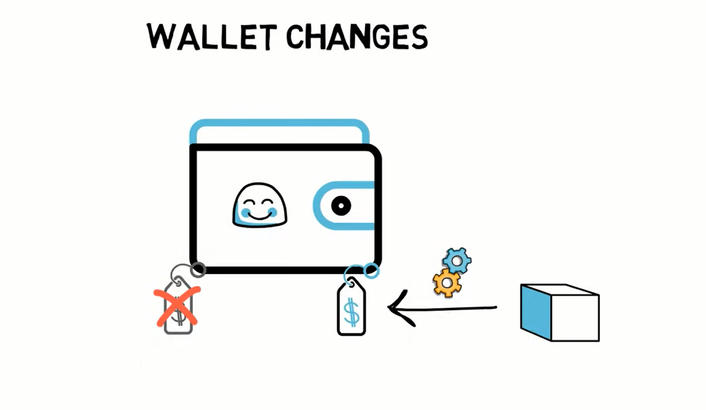

Another major implication is the change required by the wallets, with EIP-1559 in place. Wallets, don't have to estimate the gas fees anymore. They can just set the BASEFEE automatically, based on the information available in the previous block. This should simplify wallet's user interfaces.


The BASEFEE burning also has major implications when it comes to the ETH supply. This is also why EIP-1559 is very often discussed by ETH investors. Burning the base fee creates an interesting feedback loop between the network usage and the ETH supply. More network activity equals more eth burned, equals less east available to be sold on the market by miners, making the already existing eath more valuable. Burning the base fee basically rewards the users of the network by making their ETH more scarce instead of overpaying miners. The fee burning mechanism also sparked a few discussions about it becoming deflationary. This would be possible if the block reward plus minor tip is lower than the base fee burned.

That would be the case, for example, during the recent d5 gas feed craze, where the network was constantly under heavy utilization. One potential drawback when it comes to burning the base fee is the fact of losing control over the long-term monetary policy of heath. With this change, it would end up being sometimes inflationary and sometimes deflationary. This doesn't look like a major problem, as the max inflation would be capped at around 0.5 to 2 percent per year anyway. So will eip 1559 make gas fees much lower? Not really. It will clearly optimize the fee model by smoothing these spikes and limiting the number of overpaid transactions, but the main ways of lowering gas fees are still eth 2.0 and layer. 2 scaling solutions it looks like eip 1559 would be a great change to the ethereum fee system. This also seems to be the consensus within the ethereum community, with the majority of people rooting for the change to be implemented.

There are still few challenges to overcome, especially when it comes to making sure that miners can safely process bigger blocks without making the whole network more prone to denial of service attacks. Eip 1559 belongs to the core category of eips, which means that the change affects the ethereum consensus and requires all the clients to upgrade. At the same time, from the timeline perspective, it looks like eip. 1559 could be implemented in the next hard fork after the berlin hard fork, which is somewhere in 2021.

The team leading the chart received funding from the ethereum foundation and from the eip1559 gitcoin grant. Most of the coordination work is done by thin baker, depending on the timeline. Eip-1559 can be either implemented in both ethereum 1.0 and 2.0, or potentially only in ethereum 2.0. If there are some delays in place. So what do you think about eip-1559? Will it have any impact on the 8th price comment down below and as always.