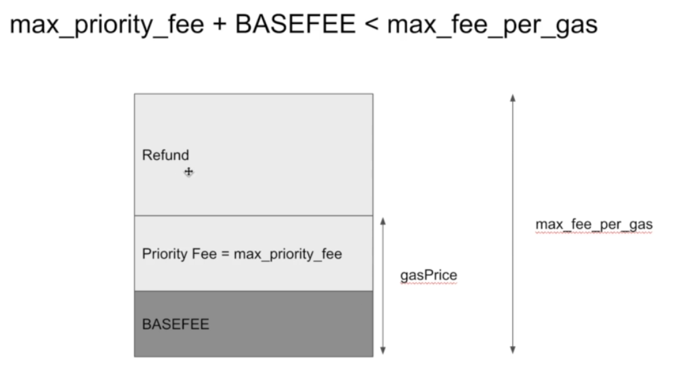
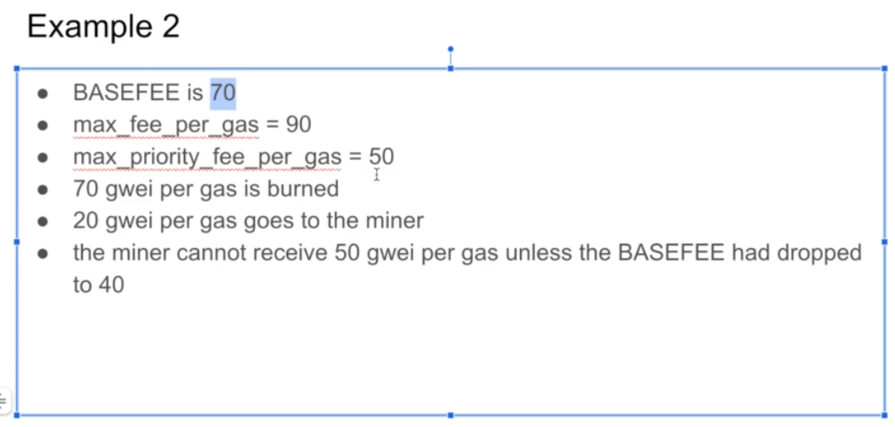

可以点击这里，进入到 Ethereum Gas Tracker


这里可以看到Base fee和Priority fee


先把这个设置打开，然后在钱包里点击send发起一笔交易


先点Market，然后点Advanced，可以在这里修改Max base fee和Priority Fee


```python
@dataclass
class NormalizedTransaction:
	signer_address: int = 0
	signer_nonce: int = 0
  # 上图中的Priority Fee是这里的max_priority_fee_per_gas
  # 上图中是设置一个你能接受的，给miner最高的小费价钱，而不是那个给到miner手里的Priority fee，这个词也可叫miner tip
	max_priority_fee_per_gas: int = 0
  # 这里的max_fee_per_gas就是上图中的Max base fee
	max_fee_per_gas: int = 0
	gas_limit: int = 0
	destination: int = 0
	amount: int = 0
	payload: bytes = bytes()
	access_list: List[Tuple[int, List[int]]] = field(default_factory=list)
```


从这里进入可以查看区块，View Blocks


这里找到一个区块 14526837，可以看到Gas Used是100% Gas Target的状态，Base Fee Per Gas是64.19 Gwei

所以这个区块里的每一笔交易都要burn掉64.19 gwei gas，这里可以点 227 Transactions来查看


随便选择一笔交易，（先点一下Click to see More）点进来可以看到


因为区块14526837是full的，所以下一个区块的base fee会上涨12.5%，这里可以看到下一个区块的base fee就涨到72.21了，这是因为 **<u>64.193 * 1+0.125）= 72.217</u>**


这个14526838这个区块是36% Gas Target，所以下一个区块的gas fee就会降低12.5%，如下图所示

72.2156 *（1-0.125）= 63.18，具体为什么是68.9可能是因为别的原因


这里设置Max base fee为5，Priority Fee为1.5，暂时不管红字部分，MeatMask里叫Priority Fee，实际上在上边的代码部分，这个应该是max_priority_fee_per_gas，你能给miner最高的消费价格


现在会有两种情况：

1. 我们设置了Max Fee为5，network中的BASEFEE是3，所以剩余部分是5-3=2，miner可以根据我们的设置，可以从2中拿掉1.5，所以剩了0.5会回到我们自己的账户里

   

2. 和case1一样，只不过现在network中的BASEFEE涨到了4，那么剩余部分就是5-4=1，因为你设置了1.5，但是这时你只有1，所以miner会拿走所有

   


max_fee_per_gas is most possible going to pay

case1: BASEFEE+max_priority_fee的总和是你实际需要付的gasPrice



case2: 


这里，Priority Fee是不能大于Max base fee的





