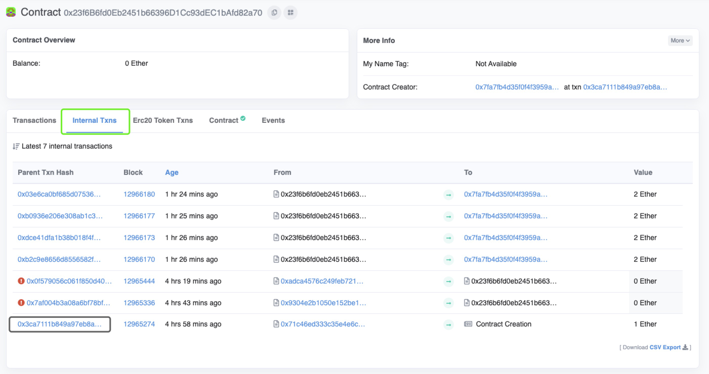
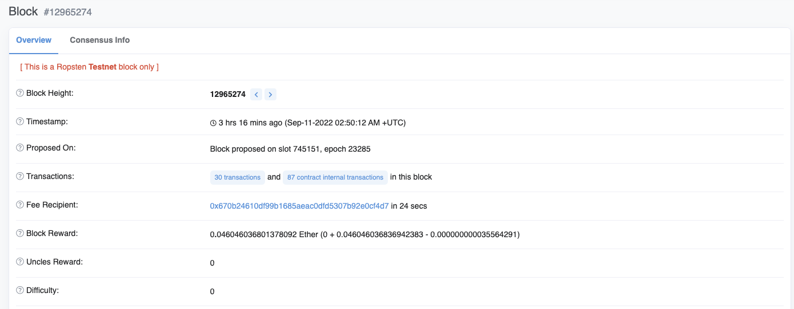
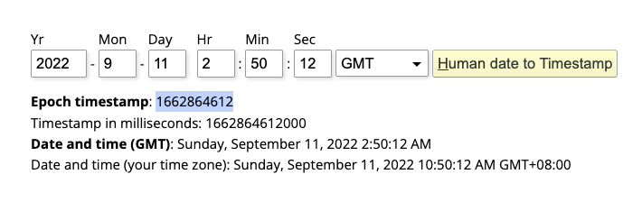
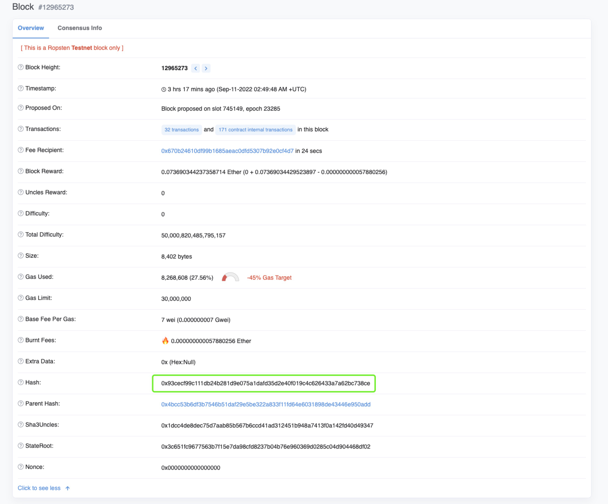
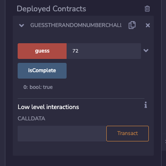

This time the number is generated based on a couple fairly random sources.

```solidity
pragma solidity ^0.4.21;

contract GuessTheRandomNumberChallenge {
    uint8 answer;

    function GuessTheRandomNumberChallenge() public payable {
        require(msg.value == 1 ether);
        answer = uint8(keccak256(block.blockhash(block.number - 1), now));
    }

    function isComplete() public view returns (bool) {
        return address(this).balance == 0;
    }

    function guess(uint8 n) public payable {
        require(msg.value == 1 ether);

        if (n == answer) {
            msg.sender.transfer(2 ether);
        }
    }
}
```


Solution

https://samsclass.info/141/proj/C605.htm

这个puzzle的关键点是，RandomNumber是在合约创建的时候就确定了的，是在构造函数里计算的，那么就要通过页面显示的合约地址找到这个合约，在Internal Txns里可以看到最后一个是Contract Creation，点击进去



可以看到打包了这条创建合约交易的区块是12965274，从这个区块上获得timestamp



可以在这个网址计算timestamp  -> https://www.epochconverter.com/



在这个区块的前一个区块获得blockhash



然后将这两个参数做哈希运算可获得RandomNumber

```solidity
contract Attacker{
    function calculate() external view returns (uint8) {
        uint hash = 0x93cecf99c111db24b281d9e075a1dafd35d2e40f019c4c626433a7a62bc738ce;
        uint timestamp = 1662864612;
        
        return uint8(keccak256(abi.encodePacked(hash, timestamp)));
    }
}
```

输入之后完成puzzle




