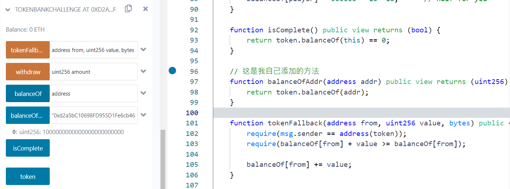
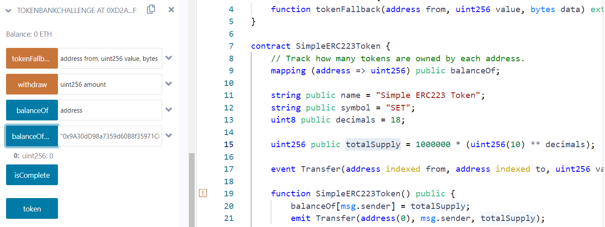
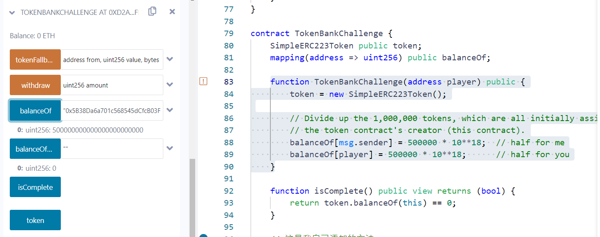
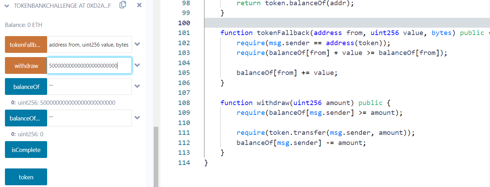
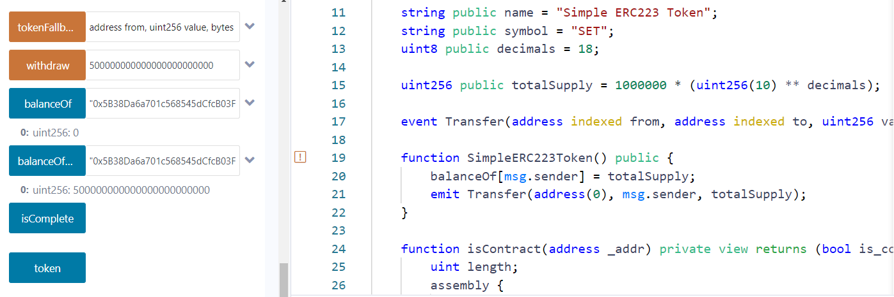
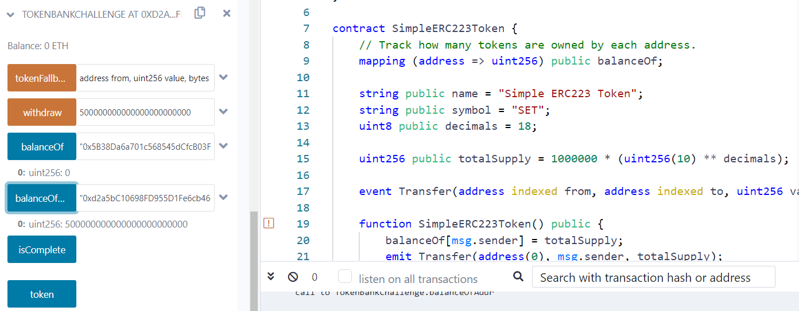

I created a token bank. It allows anyone to deposit tokens by transferring them to the bank and then to withdraw those tokens later. It uses [ERC 223](https://github.com/ethereum/EIPs/issues/223) to accept the incoming tokens.

The bank deploys a token called “Simple ERC223 Token” and assigns half the tokens to me and half to you. You win this challenge if you can empty the bank.

```solidity
pragma solidity ^0.4.21;

interface ITokenReceiver {
    function tokenFallback(address from, uint256 value, bytes data) external;
}

contract SimpleERC223Token {
    // Track how many tokens are owned by each address.
    mapping (address => uint256) public balanceOf;

    string public name = "Simple ERC223 Token";
    string public symbol = "SET";
    uint8 public decimals = 18;

    uint256 public totalSupply = 1000000 * (uint256(10) ** decimals);

    event Transfer(address indexed from, address indexed to, uint256 value);

    function SimpleERC223Token() public {
        balanceOf[msg.sender] = totalSupply;
        emit Transfer(address(0), msg.sender, totalSupply);
    }

    function isContract(address _addr) private view returns (bool is_contract) {
        uint length;
        assembly {
            //retrieve the size of the code on target address, this needs assembly
            length := extcodesize(_addr)
        }
        return length > 0;
    }

    function transfer(address to, uint256 value) public returns (bool success) {
        bytes memory empty;
        return transfer(to, value, empty);
    }

    function transfer(address to, uint256 value, bytes data) public returns (bool) {
        require(balanceOf[msg.sender] >= value);

        balanceOf[msg.sender] -= value;
        balanceOf[to] += value;
        emit Transfer(msg.sender, to, value);

        if (isContract(to)) {
            ITokenReceiver(to).tokenFallback(msg.sender, value, data);
        }
        return true;
    }

    event Approval(address indexed owner, address indexed spender, uint256 value);

    mapping(address => mapping(address => uint256)) public allowance;

    function approve(address spender, uint256 value)
        public
        returns (bool success)
    {
        allowance[msg.sender][spender] = value;
        emit Approval(msg.sender, spender, value);
        return true;
    }

    function transferFrom(address from, address to, uint256 value)
        public
        returns (bool success)
    {
        require(value <= balanceOf[from]);
        require(value <= allowance[from][msg.sender]);

        balanceOf[from] -= value;
        balanceOf[to] += value;
        allowance[from][msg.sender] -= value;
        emit Transfer(from, to, value);
        return true;
    }
}

contract TokenBankChallenge {
    SimpleERC223Token public token;
    mapping(address => uint256) public balanceOf;

    function TokenBankChallenge(address player) public {
        token = new SimpleERC223Token();

        // Divide up the 1,000,000 tokens, which are all initially assigned to
        // the token contract's creator (this contract).
        balanceOf[msg.sender] = 500000 * 10**18;  // half for me
        balanceOf[player] = 500000 * 10**18;      // half for you
    }

    function isComplete() public view returns (bool) {
        return token.balanceOf(this) == 0;
    }
    
    // 这是我自己添加的方法
    function balanceOfAddr(address addr) public view returns (uint256) {
        return token.balanceOf(addr);
    }

    function tokenFallback(address from, uint256 value, bytes) public {
        require(msg.sender == address(token));
        require(balanceOf[from] + value >= balanceOf[from]);

        balanceOf[from] += value;
    }

    function withdraw(uint256 amount) public {
        require(balanceOf[msg.sender] >= amount);

        require(token.transfer(msg.sender, amount));
        balanceOf[msg.sender] -= amount;
    }
}
```


参考链接1：https://cmichel.io/capture-the-ether-solutions/

参考链接2：https://godorz.info/2021/08/capture-the-ether/

参考链接3：https://www.anquanke.com/post/id/154104#h3-9


第一个地址作为msg.sender， 0x9A30dD98a7359d60B8f35971C859ee81E9717F54

第二个地址作为player   0x7FA7fB4D35f0F4F3959A65098D1D9Cf69E49Ac48


这个puzzle理解起来略微复杂，SimpleERC223Token相当于流通的货币，TokenBankChallenge相当于一个银行，

以msg.sender身份在构造函数中传入player地址并部署TokenBankChallenge合约



向我们自己添加的方法balanceOfAddr中传入刚部署的合约的地址并调用之后可以看到值为totalSupply，即10^24这么多货币



传入msg.sender地址并调用balanceOfAddr可以看到值为0，传入player地址的结果也一样

到这里可以打个比方，一个国家刚建立，一共发行了totalSupply这么多的货币，但是这些货币都在银行里存着的，个人的手里是没有，我们继续往下走

```solidity
	function TokenBankChallenge(address player) public {
        token = new SimpleERC223Token();

        // Divide up the 1,000,000 tokens, which are all initially assigned to
        // the token contract's creator (this contract).
        balanceOf[msg.sender] = 500000 * 10**18;  // half for me
        balanceOf[player] = 500000 * 10**18;      // half for you
    }
```

从TokenBankChallenge构造函数可以看出来，相当于msg.sender和player这两个人对国家有非常大的贡献，所以在银行建立之初就将 10^24 的货币平均分为两份，每人各一份



传入msg.sender地址，并调用balanceOf可以看到值为 5 * 10^23 ，传入player的结果也一样，这里可以认为两个人分别有 totalSupply / 2 这么多货币存在银行里



如果我们以msg.sender身份，传入 5 * 10^23 并调用withdraw，就相当于把银行内存的钱取了出来



分别调用balanceOf和balanceOfAddr，并传入相同的msg.sender值，可以看到balanceOf的值为0而balanceOfAddr的值为 5 * 10^23 ，这就相当于在提款了 5 * 10^23 之后，msg.sender这个人在银行里存的余额变为0了，但是兜里的货币余额变为 5 * 10^23 了



我们在此向balanceOfAddr中传入银行合约的地址并调用之后可以看到值为 5 * 10^23 ，这就相当于银行里有一半的货币已经被取出来了，已经不是最初的 10^24 那么多了

所以整体逻辑就是，在withdraw方法中对msg.sender这个人在银行里的余额进行减少操作，在transfer中对银行所持有的货币的余额做减少操作，并对msg.sender这个人的余额进行增加操作，

整个合约大致功能理解之后开始找漏洞，既然要清零我们自然要寻找使得balance减少的地方，在银行合约里显然withdraw函数是切入点，它调用的是token合约的transfer函数，同时我们注意到它是在require里调用的，我想有经验的应该看出来这里存在的问题了，而且在withdraw中是先调用transfer再减少，很明显是有重入bug的

继续将目标转向transfer函数

```solidity
	function withdraw(uint256 amount) public {
        require(balanceOf[msg.sender] >= amount);

        require(token.transfer(msg.sender, amount));
        balanceOf[msg.sender] -= amount;
    }
    
/******************************************************************************************/    
    function transfer(address to, uint256 value, bytes data) public returns (bool) {
        require(balanceOf[msg.sender] >= value);

        balanceOf[msg.sender] -= value;  // line2
        balanceOf[to] += value;			 // line3
        emit Transfer(msg.sender, to, value);

        if (isContract(to)) {
            ITokenReceiver(to).tokenFallback(msg.sender, value, data); // line1
        }
        return true;
    }
```

调用逻辑：bank.withdraw() => token.transfer => msg.sender.tokenFallback()

值得注意的是，在transfer中**msg.sender**是bank合约的地址，**to**是withdraw传进来的msg.sender，而withdraw中的msg.sender则有两种情况，第一种是外部账户，第二种就是合约，line1这行代码就是判断**to**，即**最开始的msg.sender**是不是合约地址，如果是的话则调用合约中的tokenFallback，这里应该是提供一种类似于银行和银行之间的转账交易功能，line2相当于旧bank的余额减少，line3相当于新bank的余额增加，而line1相当于，发现了to这个地址是合约地址，那么说明它是个新bank（姑且这么认为），那么则使新bank内部的货币余额增加

```solidity
	function withdraw(uint256 amount) public {
        require(balanceOf[msg.sender] >= amount);

        require(token.transfer(msg.sender, amount)); // line1
        balanceOf[msg.sender] -= amount;  // line2
    }
```

因为在withdraw内，在require中去执行transfer并且是先transfer再执行减少操作，所以这里如果**to**是一个恶意的合约，在**to**这个地址上的**tokenFallback**中再去调用withdraw，那么就变成了无限循环的重入攻击了

```solidity
```


