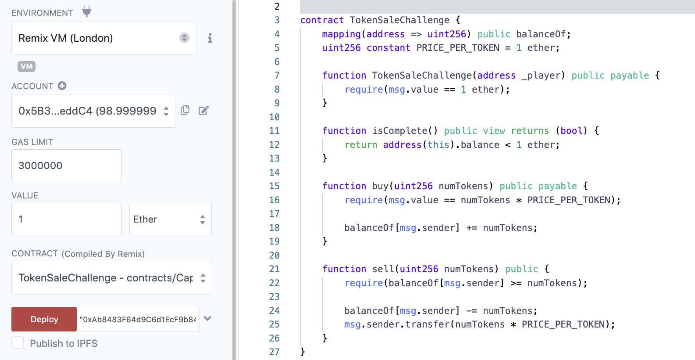
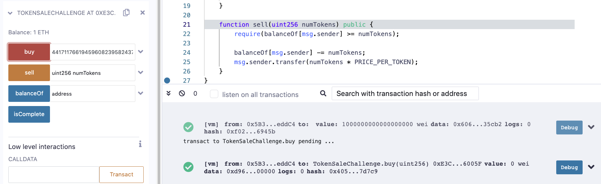
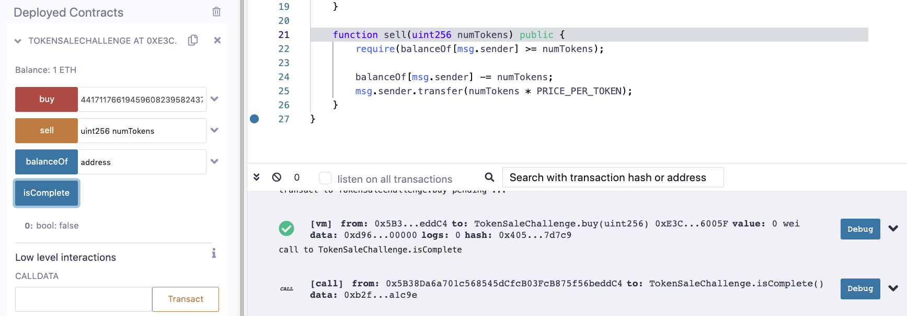
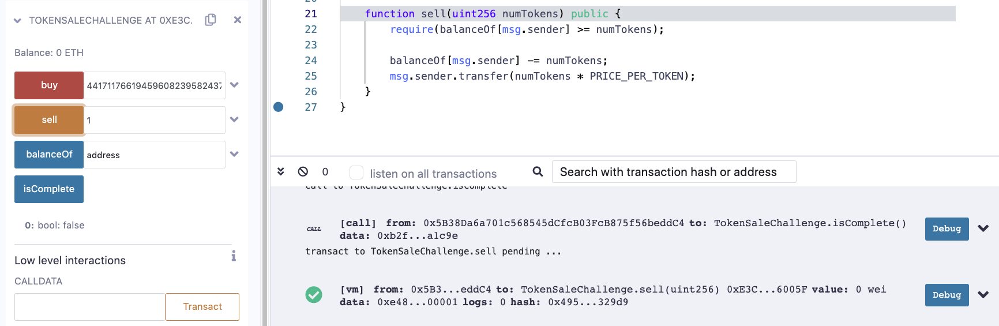

This token contract allows you to buy and sell tokens at an even exchange rate of 1 token per ether.

The contract starts off with a balance of 1 ether. See if you can take some of that away.

```solidity
pragma solidity ^0.4.21;

contract TokenSaleChallenge {
    mapping(address => uint256) public balanceOf;
    uint256 constant PRICE_PER_TOKEN = 1 ether;

    function TokenSaleChallenge(address _player) public payable {
        require(msg.value == 1 ether);
    }

    function isComplete() public view returns (bool) {
        return address(this).balance < 1 ether;
    }

    function buy(uint256 numTokens) public payable {
        require(msg.value == numTokens * PRICE_PER_TOKEN);

        balanceOf[msg.sender] += numTokens;
    }

    function sell(uint256 numTokens) public {
        require(balanceOf[msg.sender] >= numTokens);

        balanceOf[msg.sender] -= numTokens;
        msg.sender.transfer(numTokens * PRICE_PER_TOKEN);
    }
}
```


参考链接：https://cmichel.io/capture-the-ether-solutions/

参考链接：https://ethereum.stackexchange.com/a/131705  如何计算



以第一个地址的身份，传入第二个地址的值部署TokenSaleChallenge合约，记得携带1 ether

这个合约是我们花ether买token，卖token会得到ether，都是1比1的比率，所以想让合约的余额小于1，肯定是我们向合约卖很多token，然后合约返回我们很多ether导致合约自己的余额小于1 ether

```solidity
		uint256 constant PRICE_PER_TOKEN = 1 ether;
		
		function buy(uint256 numTokens) public payable {
        require(msg.value == numTokens * PRICE_PER_TOKEN);  // line1

        balanceOf[msg.sender] += numTokens;
    }
```

[solidity文档](https://docs.soliditylang.org/en/latest/units-and-global-variables.html#units-and-globally-available-variables)对ether的描述，1 ether 只是 10^18 的简写而已，所以line1这里很明显是可以发生溢出的

所以找到一个x满足require中的等式：**x * 10^18 = 0 = 2^256**，即可不花钱获得token

根据链接2中的提示，**x * 10^18** 的结果可以是257位也可以是任意一个多于256位的数字，但是需要低256位都是0

因为10^18 = 5^18 * 2^18，所以10^18后边有18个0，那么x就可以是2^238，因为2^238低位有238个0，它俩相乘低位就会有256个0，然后整个数被截断为256，所以低256位都是0了，这样msg.value是0就可以了，就不需要花钱

所以我们在浏览器的console中使用 **BigInt(2 \*\* 238)** 来计算2^238

结果为：441711766194596082395824375185729628956870974218904739530401550323154944n



然后将得出的数字去掉n传入buy方法，可以看到交易成功执行并没有revert



此时可以看到isComplete是false，并且合约内有1 ETH



此时我们向sell中传入1个并调用，可以看到交易成功执行，合约内的余额也变为0