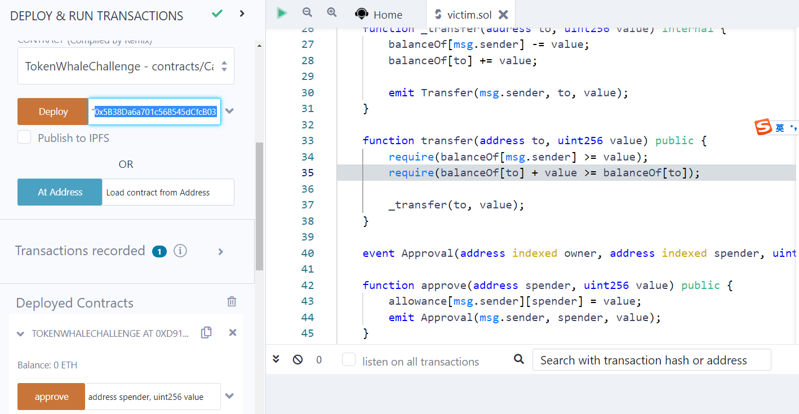
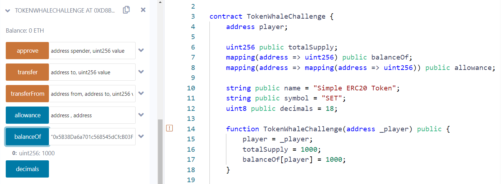
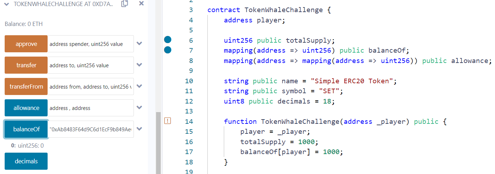
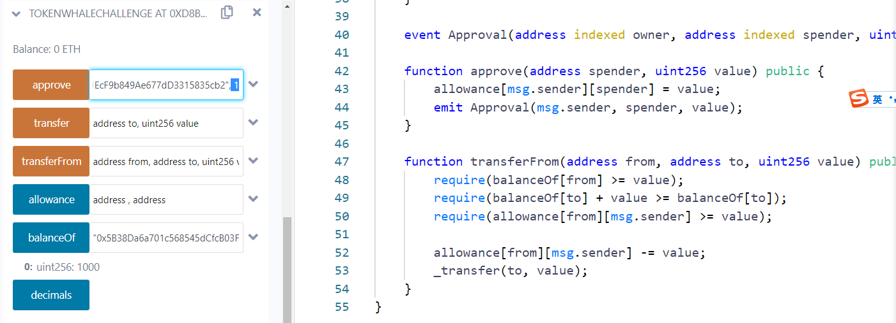
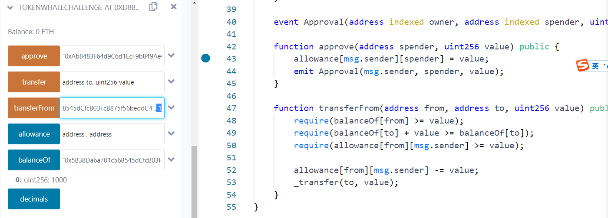
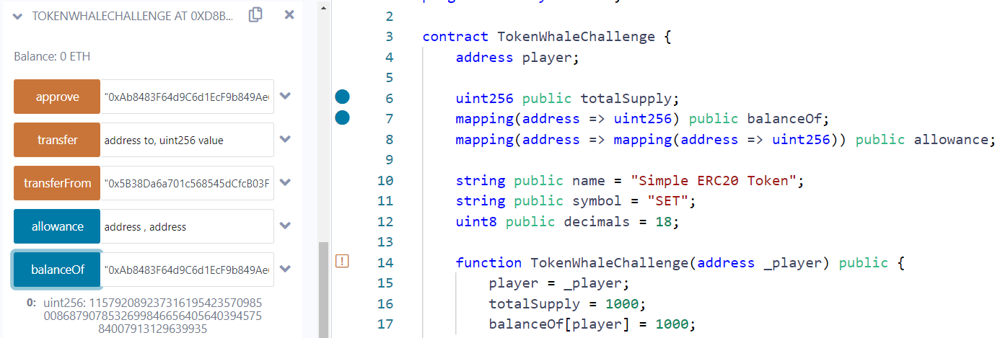

This ERC20-compatible token is hard to acquire. There’s a fixed supply of 1,000 tokens, all of which are yours to start with.

Find a way to accumulate at least 1,000,000 tokens to solve this challenge.

```solidity
pragma solidity ^0.4.21;

contract TokenWhaleChallenge {
    address player;

    uint256 public totalSupply;
    mapping(address => uint256) public balanceOf;
    mapping(address => mapping(address => uint256)) public allowance;

    string public name = "Simple ERC20 Token";
    string public symbol = "SET";
    uint8 public decimals = 18;

    function TokenWhaleChallenge(address _player) public {
        player = _player;
        totalSupply = 1000;
        balanceOf[player] = 1000;
    }

    function isComplete() public view returns (bool) {
        return balanceOf[player] >= 1000000;
    }

    event Transfer(address indexed from, address indexed to, uint256 value);

    function _transfer(address to, uint256 value) internal {
        balanceOf[msg.sender] -= value;
        balanceOf[to] += value;

        emit Transfer(msg.sender, to, value);
    }

    function transfer(address to, uint256 value) public {
        require(balanceOf[msg.sender] >= value);
        require(balanceOf[to] + value >= balanceOf[to]);

        _transfer(to, value);
    }

    event Approval(address indexed owner, address indexed spender, uint256 value);

    function approve(address spender, uint256 value) public {
        allowance[msg.sender][spender] = value;
        emit Approval(msg.sender, spender, value);
    }

    function transferFrom(address from, address to, uint256 value) public {
        require(balanceOf[from] >= value);
        require(balanceOf[to] + value >= balanceOf[to]);
        require(allowance[from][msg.sender] >= value);

        allowance[from][msg.sender] -= value;
        _transfer(to, value);
    }
}
```


参考链接：https://www.anquanke.com/post/id/153375#h3-7

这个puzzle和Ethernaut的5.Token很类似

可以看到**_transfer**中没做任何require检查，所以可以猜测是个overflow或underflow的puzzle，检查一圈发现**transferFrom**中没有对msg.sender的balance做检查，却在其调用的**_transfer**中对msg.sender的balance做减法操作，可以确定是underflow。



先用第一个地址作为player：0x5B38Da6a701c568545dCfcB03FcB875f56beddC4 并部署**TokenWhaleChallenge**合约



查看一下player的余额是1000


我们使用第二个地址作为同谋、accomplice：0xAb8483F64d9C6d1EcF9b849Ae677dD3315835cb2



查看一下accomplice的余额，此时为0

```solidity
	function approve(address spender, uint256 value) public {
		// allowance[player][accomplice] = 1
        allowance[msg.sender][spender] = value;
        emit Approval(msg.sender, spender, value);
    }
```



然后我们以player的身份调用**approve(accomplice, 1)**，来对accomplice进行approval，此时msg.sender = player、spender = accomplice


```solidity
	function transferFrom(address from, address to, uint256 value) public {
        require(balanceOf[from] >= value);
        require(balanceOf[to] + value >= balanceOf[to]);
        // allowance[player][accomplice] >= 1
        require(allowance[from][msg.sender] >= value); // line1

		// allowance[player][accomplice] -= 1
        allowance[from][msg.sender] -= value;
        _transfer(to, value);
    }
```



之后切换为第二个地址以accomplice身份调用**transferFrom(player, player, 1)**，此时msg.sender = accomplice、from = player，可以看到刚好绕过了在line1这行的检查，成功调用了internal方法**_transfer(player, 1)**


```solidity
	function _transfer(address to, uint256 value) internal {
        balanceOf[msg.sender] -= value;
        balanceOf[to] += value;

        emit Transfer(msg.sender, to, value);
    }
```

进入到**_transfer**中之后，因为此时 **balanceOf[accomplice]** 是 **0**，减**1**就会发生underflow



那么我们再查看**accomplice**此时的余额已经变为一个非常巨大的数字了，将其transfer给player就可以完成puzzle了
