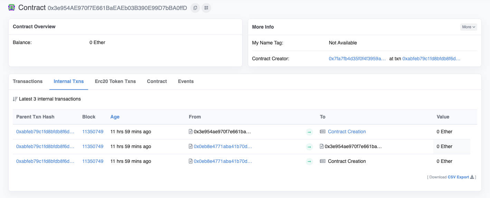
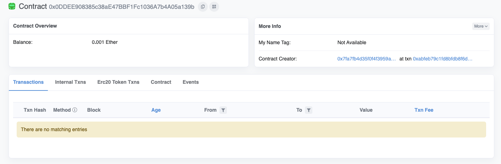
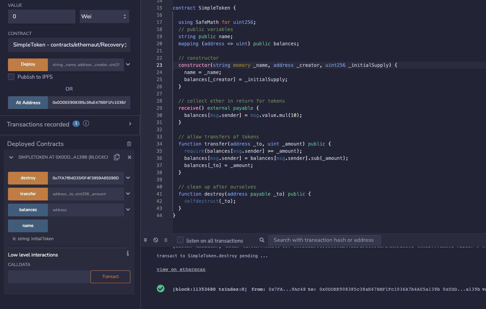

A contract creator has built a very simple token factory contract. Anyone can create new tokens with ease. After deploying the first token contract, the creator sent `0.001` ether to obtain more tokens. They have since lost the contract address.

This level will be completed if you can recover (or remove) the `0.001` ether from the lost contract address.

```solidity
// SPDX-License-Identifier: MIT
pragma solidity ^0.8.0;

import "@openzeppelin/contracts/utils/math/SafeMath.sol";

contract Recovery {

  //generate tokens
  function generateToken(string memory _name, uint256 _initialSupply) public {
    new SimpleToken(_name, msg.sender, _initialSupply);
  
  }
}

contract SimpleToken {

  using SafeMath for uint256;
  // public variables
  string public name;
  mapping (address => uint) public balances;

  // constructor
  constructor(string memory _name, address _creator, uint256 _initialSupply) {
    name = _name;
    balances[_creator] = _initialSupply;
  }

  // collect ether in return for tokens
  receive() external payable {
    balances[msg.sender] = msg.value.mul(10);
  }

  // allow transfers of tokens
  function transfer(address _to, uint _amount) public { 
    require(balances[msg.sender] >= _amount);
    balances[msg.sender] = balances[msg.sender].sub(_amount);
    balances[_to] = _amount;
  }

  // clean up after ourselves
  function destroy(address payable _to) public {
    selfdestruct(_to);
  }
}
```


resolution

https://medium.com/coinmonks/ethernaut-lvl-18-recovery-walkthrough-how-to-retrieve-lost-contract-addresses-in-2-ways-aba54ab167d3

本意应该是用Recovery contract创建了SimpleToken contract，然后创建好的SimpleToken contract地址丢失了，现在要给这个地址找回来，并且再把里边的钱提出来，在页面上点击 Get new instance之后，使用contract.address或instance可以获得Recovery contract的地址，然后拿着这个地址去Etherscan上查询这个地址上的交易，注意这里要注意是Rinkeby Testnet





点Contract Creation可以拿到生成的Simple Token地址，然后在remix里，现在CONTRACT切换为Simple Token然后再在At Address里输入并点击刚刚拿到的地址，在下边Deployed Contracts的destroy里输入player地址，就可以拿回最开始的0.001ETH了

