视频简介部分

This video will explain how the reentrancy exploit works and then explain how to protect your Solidity smart contract from it.

[#Solidity](https://www.youtube.com/hashtag/solidity)  [#Reentrancy](https://www.youtube.com/hashtag/reentrancy) 

Code: https://solidity-by-example.org/hacks/re-entrancy/

References [https://github.com/ethereumbook/ether...](https://www.youtube.com/redirect?event=video_description&redir_token=QUFFLUhqbE5HWEdXYkw1TXdYNURPVUZnQlh0bDFuM0Zsd3xBQ3Jtc0tsMEE1TWR5MFBpbWhBdV9SRXV1aUFnOWtRLUtZTzNtX1NDQTdUUXNnQmJuZG9iS2JldXBkT1R0cjktbmxXMWUtSFVfN3RjN3JIQzFBRDRkNGhNVHlBVEk0Z3VEcXMzdGFOS3MxRm01ejh0cWk4cHp6UQ&q=https%3A%2F%2Fgithub.com%2Fethereumbook%2Fethereumbook%2Fblob%2Fdevelop%2F09smart-contracts-security.asciidoc&v=4Mm3BCyHtDY) [https://solidity-05.ethernaut.openzep...](https://www.youtube.com/redirect?event=video_description&redir_token=QUFFLUhqbGswYm0zT1RCOVhiUy1HMkk2OVhWTG96a3RZd3xBQ3Jtc0trWXV3VFhsSU10NTZqVmt3M04yZk5EVndHNGg4a1RsdzVaTGFqNXNSZ2pzRl9oMV9CR3hQUm1hSTM3S0gwRkxIOVBVSzB4b1RUTzVhbmdhNkt6LXFFcDZ5aVU1SXkxbHVVZkFBZlEtQUs3S1BDMXJTOA&q=https%3A%2F%2Fsolidity-05.ethernaut.openzeppelin.com%2F&v=4Mm3BCyHtDY) 

Join me on Discord: [https://discord.gg/Ny8sPaj](https://www.youtube.com/redirect?event=video_description&redir_token=QUFFLUhqbF9WU2t5azYxUnJiZkxuVUxaTkJneHJRUEJaUXxBQ3Jtc0trWU9zcFBadTI5UElLWm9XY3d1VnNCaFByVHMyU19YS2VwNldabUtwNHM4UTJGLTRrU2hFUml6X1UteGg5aTlyWnQzaEFMS21Ja1RpZkpLVzdnamxVbF8zWHkwYTFPVDBZWFBxU09PcU11eVpfcG85NA&q=https%3A%2F%2Fdiscord.gg%2FNy8sPaj&v=4Mm3BCyHtDY) 

Website: [https://smartcontractprogrammer.com](https://www.youtube.com/redirect?event=video_description&redir_token=QUFFLUhqbDE5SEdDemtpMFR0a3ZNLXN3WlZZWWVUZFhtZ3xBQ3Jtc0tuQ1NRTVNJeUNJY01YVmE5aGVTQi04Z2xfaGNMYnhKLTIyQy1yVHA3bzFQMlZENDNxTnlTeHpfcF9NdDFNZVJhVVhUeFJQWmg2MU03dERNQlc4Q0JMdE10VWVKZ3BmcDFjSWNPalBHa18zajdlYWgybw&q=https%3A%2F%2Fsmartcontractprogrammer.com%2F&v=4Mm3BCyHtDY)


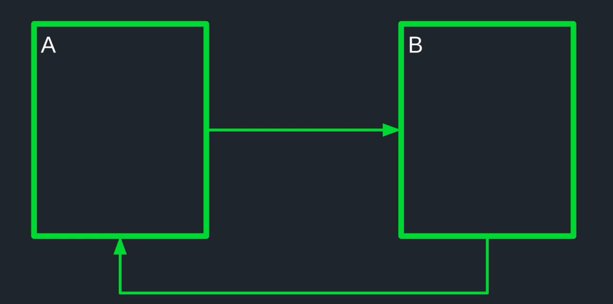

So, first of all, what is a reentrancy attack, over here we have contract A and contract B, and let's say that contract A calls contract B, the very basic idea of the reentrancy is that contract B can call back into contract A while contract A is still executing.

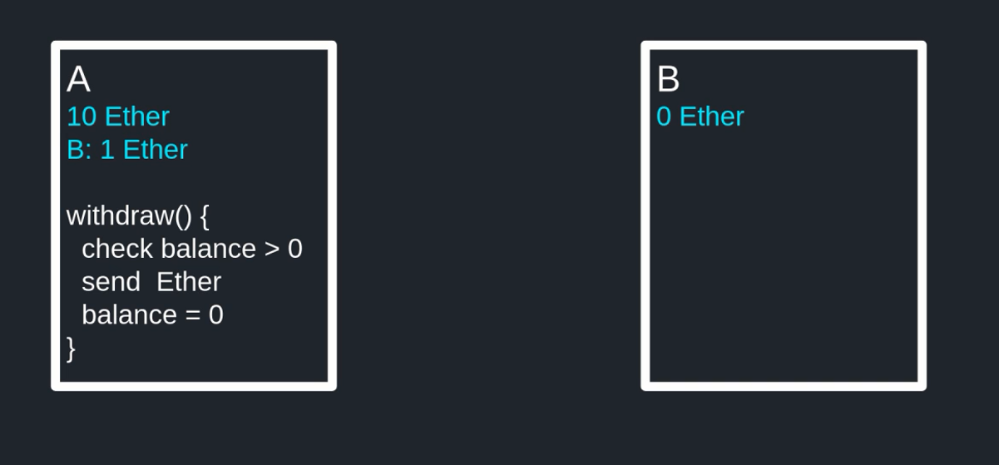

So how can this be exploited? Well, let's say that contract A has 10 ethers and contract B has 0 ethers, inside contract A it keeps a record of how much ether it goes to other contracts and addresses, in here contract A holds 1 ether from contract B. Now let's say that it has a function called **withdraw** where if you have some ether stored in this contract, then here I able withdraw, and the way it works is like this.

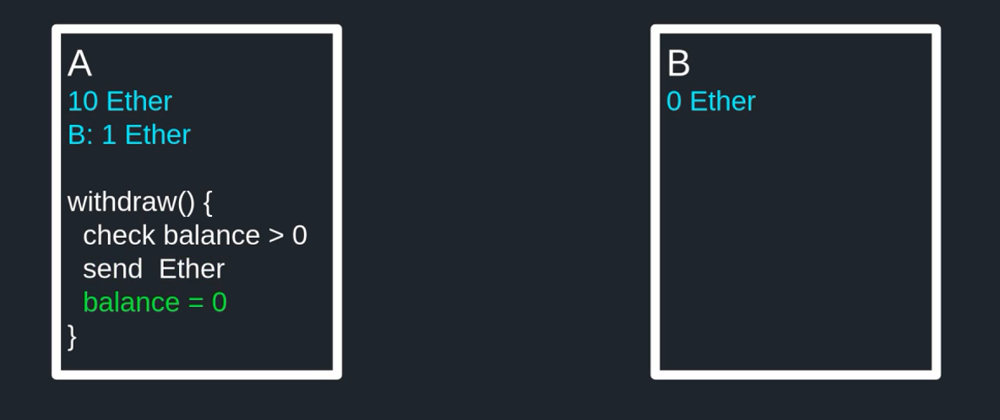

If we first check that you have enough balance and then I will send back to you all of the eather that you've stored in this contract and then after it sends the ether back to you, they will set your balance to 0.

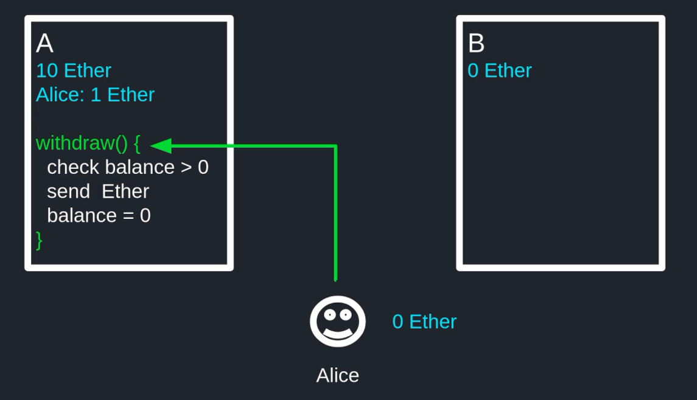

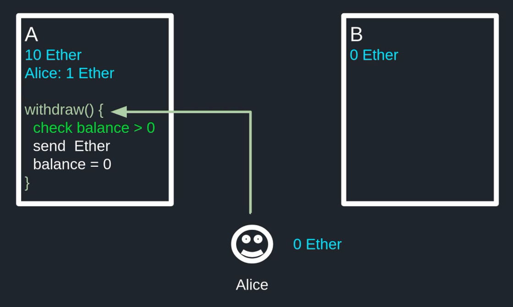

So, for example, let's say that Alice has 1 ether stored in this contract and she withdraws from this contract. It would check Alice's balance, does Alice have ether stored in this contract? Yes, she does. She has 1 ether.

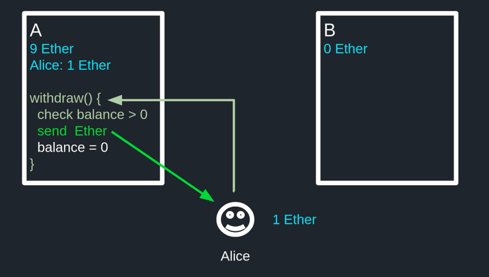

Next, it sends that 1 eater back to Alice, so Alice gets 1 ether and the total ether stored in his contract is 10 minus 1, which is 9 ether.

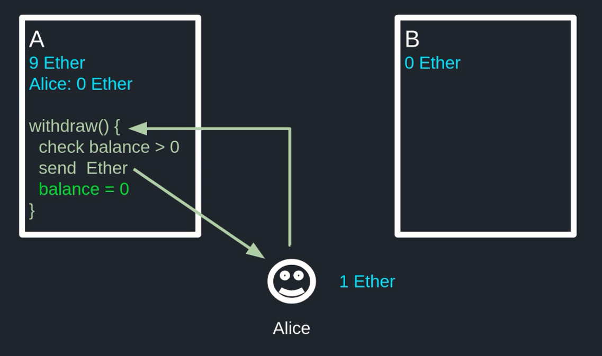

And finally it sets Alice's balance to 0. So that's how the withdrawal function works.

Let's now see how content B can use the reentrancy to exploit the withdraw function. Contract B is going to need two functions: the fallback function and a function named attack, and in both functions, it's going to call the withdraw function inside contract A.

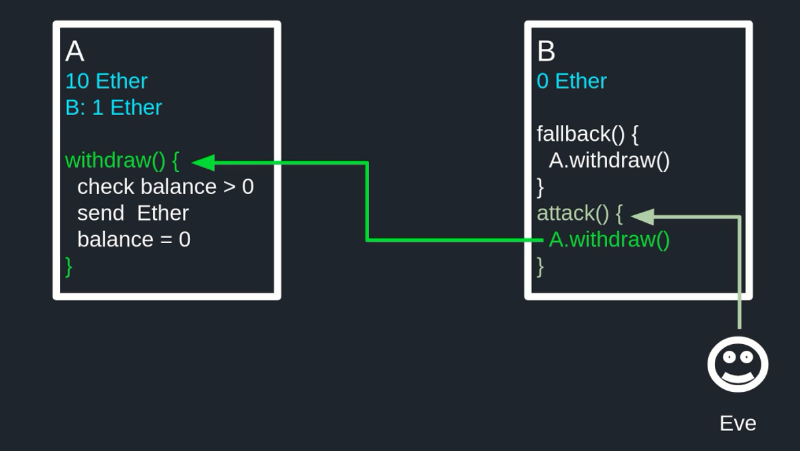

The way reentrancy work is like this, first Eve calls attack function, this will call the withdraw function inside contract A, inside contract A since contract B is the caller, here it checks that the balance of contract B is greater than 0.

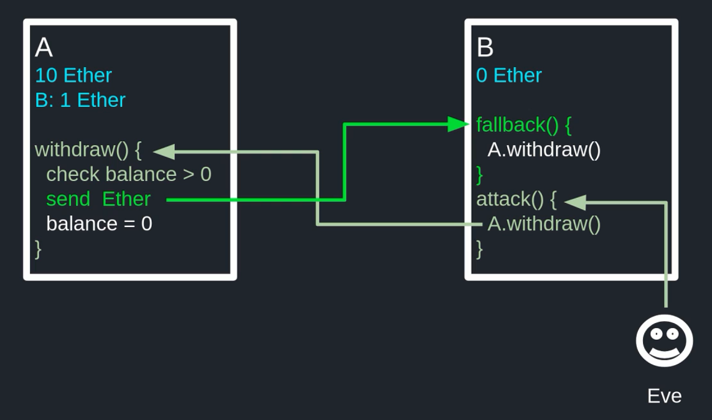

And it is since here contract B has 1 ether, so it sends that 1 either back to contract B.

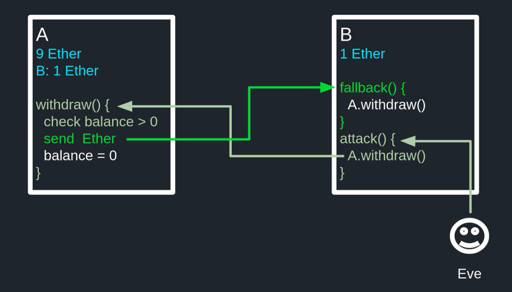

And when it does inside contract B, it triggers the fallback function. So now, contract B has 1 ether and contact A has 9 ether.

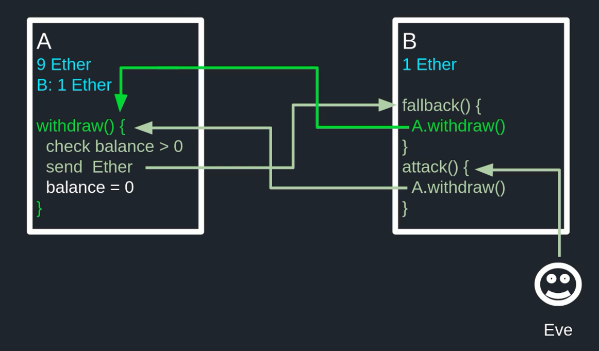

Now the fallback function inside contract B calls back into the withdraw function inside contact A and then it checks the balance of contract B, is the balance of contract B greater than 0? If you look above, you can see that the balance of contract B is still 1 ether, so this check passes and it sends another ether back to contract B which triggers the fallback function.

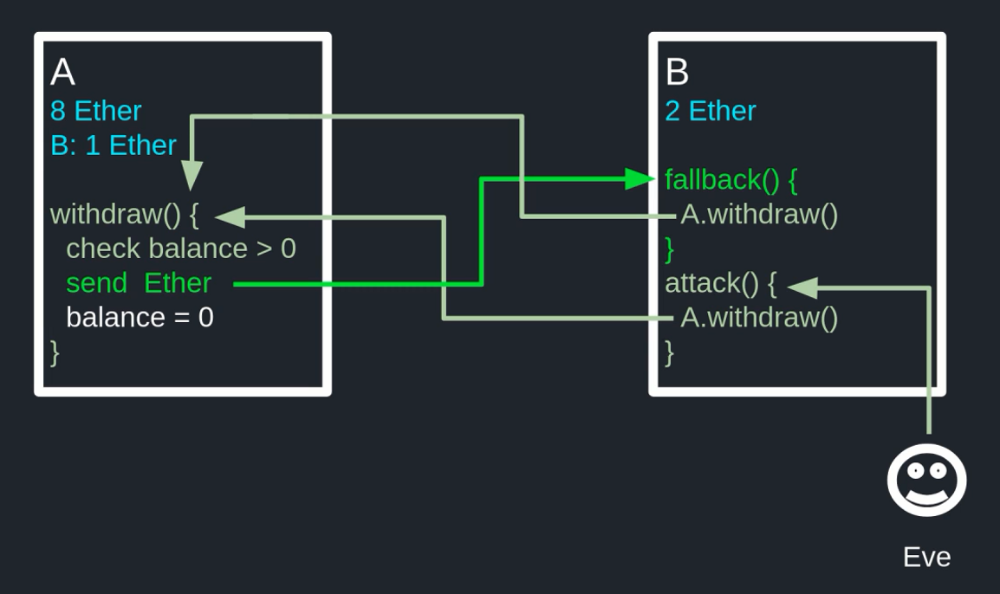

And now contract B has 2 ethers and contract A has 8 ethers, while the balance of contract B inside contract A is still equal to 1 ether, so this means that while the balance of contract B is now updated, it can keep withdrawing ether from contract A.

And this could keep on going since the balance is updated on the last line of the **withdraw** function, but it is not reached since it keeps on looping between the fallback function and the withdraw function, and this is how contract B and keep on withdrawing ether from contract A by calling back into contract A while function inside contract A is still executing.

```solidity
// SPDX-License-Identifier: UNLICENSED
pragma solidity ^0.8.9;

contract EtherStore {
    mapping(address => uint) balances;

    function deposit() public payable {
        balances[msg.sender] += msg.value;
    }

    function withdraw(uint _amount) public {
        require(balances[msg.sender] >= _amount);

        (bool sent, ) = msg.sender.call{value: _amount}("");
        require(sent, "Failed to send Ether");

        balances[msg.sender] -= _amount;
    }

    function getBalance() public view returns (uint) {
        return address(this).balance;
    }
}
```

Let's now see the same code using remix: here we have a contract named EtherStore and you can store your ether in it. You can store your ether by calling the deposit function, and this will update the internal balance which is kept by using the mapping balances. You can also withdraw by calling the withdraw function. It will first check that you have enough ether stored in this contract and then it will send ether to your address, and lastly it will update the balances mapping. And finally we have a helper function called getBalance which will return the total amount of ether stored in this contract.

```solidity
// SPDX-License-Identifier: UNLICENSED
pragma solidity ^0.6.0;

import "./EtherStore.sol";

contract Attack {
    EtherStore public etherStore;

    constructor(address _etherStoreAddress) public {
        etherStore = EtherStore(_etherStoreAddress);
    }

    fallback() external payable {
        if (address(etherStore).balance >= 1 ether) {
            etherStore.withdraw(1 ether);
        }
    }

    function attack() external payable {
        require(msg.value >= 1 ether);
        // 0.5
        // etherStore.deposit.value(1 ether)();
        // 0.6
        etherStore.deposit{value: 1 ether}();
        etherStore.withdraw(1 ether);
    }

    function getBalance() public view returns (uint) {
        return address(this).balance;
    }
}
```

All right. So, let's now write the contract. That's going to use the reentrancy to attack this contract. We will name this contract attack. We will store the target contract to exploit in a state variable called etherStore when we deploy this contract we are passing the address of the etherStore and then we'll set our target by saying **etherStore = EtherStore(_etherStoreAddress)** etherStore equals EtherStore and then passing the address of the etherStore. We'll need two functions to do the reentrancy exploit. We're going to need a fallback function and the function to initiate the attack. And the function that's going to start the reentrancy exploit, here, I named it attack, when we call this function, we're gonna send 1 ether to etherStore, so here that's require that we have enough ether to initiate the attack and we can do that by requiring msg.value is greater than or equal to 1 ether. The first thing that we will do is deposit 1 ether into etherStore, so here we'll say: etherStore dot deposit followed by curly braces and inside the curly braces we say value semicolon 1 ether and we call a function by putting two parenthesis.

```solidity
etherStore.deposit{value: 1 ether}();
```

So the way you send ether to another contract in solidity 0.6 is like this. You need to use the curly braces and then specify the amount that you're going to be sending.

```solidity
etherStore.deposit.value(1 ether)();
```

Now. The way you would do the exact same thing in solidity 0.5 was like this, using dot value and then specifying the amount. So this is 0.5 syntax, and this is 0.6 syntax and we'll be sticking with this syntax. After we send 1 ether to the etherStore contract, we immediately withdraw the 1 ether that we just sent, and we do this by calling etherStore dot withdraw 1 ether, and when we call this function, etherStore we send back to 1 ether that we just deposited, so this would trigger the fallback function above, so inside the fallback function will withdraw again by calling etherStore dot withdraw.

Now we want this reentrancy exploit to stop at some point, so inside the fallback function, we'll say, so we'll say: if address etherStore dot balance is greater than or equal to 1 ether, then we'll call the withdraw function. So here we're saying if etherStore has more than 1 ether, then that's withdraw 1 ether from it.

Just to quickly go over how the code is going to execute. When we call a function attack, it's gonna call etherStore dot withdraw and since etherStore is going to send back 1 ether to this contract, It's gonna execute the fallback function and inside the fallback function we check that etherStore has at least 1 ether and then call withdraw again. Lastly, we'll add a helper function to check the balance stored in this contract, and this will help us see the final amount of ether taken from etherStore. That completes the code to do a reentrancy exploit on etherStore, let's deploy the contracts and see them in action.

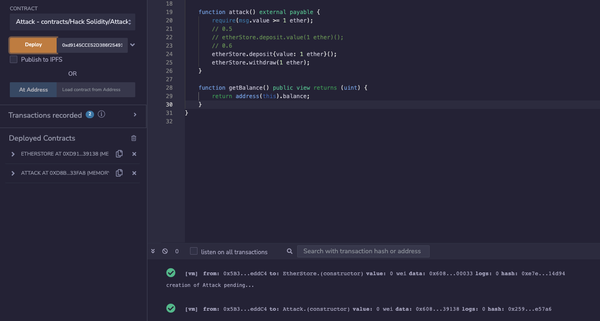

So I deployed to contact etherStore and attack, let's say that account1 is Alice, account2 is Bob and account3 is Eve, and inside etherStore Alice has 1 ether and Bob has also 1 ether.

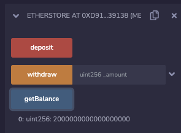

So, in total, this contract has 2 ether stored and we can check it here.

Let's now call this function attack to take the 2 ether stored in etherStore, so first, we will switch over to count to account number 3, which is Eve, and to call the attack function, we're going to need 1 ether, so here we'll send 1 ether when we call the attack function, so Eve execute this attack function, and you can see here that the transaction was successful.

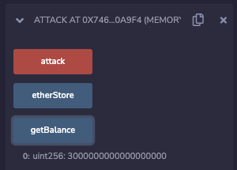

So we were able to steal 2 ethers even though we only deposited 1 ether, and we can confirm that this contract now has 3 ethers by calling getBalance, and we can check here that it has 3 ethers.

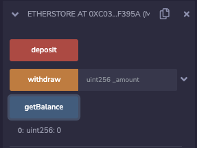

And we can also check that ether store has 0 ethers by calling getBalance and it has 0. Let's see how the code was actually executed by using the debug feature in remix, so here I've set up some breakpoints and you can do it by clicking on the line like this, and this will allow us to pause the code at that break point. We can rerun the transaction that did the reentrancy exploit by going to the actual transaction. Once you find the transaction hit the debug button and you'll see a screen like this on the left, and then you can hit this button here to go to the next breakpoint. So it first calls the deposit function, which updates the balance and then next it calls the withdraw function. It checks that the balance of the attack contract is greater than 1 ether and it is since we just deposited 1 ether, so the ether store contract sends 1 ether back to attack contract, which calls the fallback function and inside the fallback function we checked that ether store has more than 1 ether so that we could call withdraw again. So at this point we deposited 1 ether and withdraw 1 ether, so inside ether store, there's two ethers left.

It calls withdraw on ether store, the balance of attack has not changed since we never hit this line, so over here, we still have 1 ether, so ether store sends another ether to the attack contract. Here ether store had 2 ethers and it just sent 1 to us. So now it has 1 ether left and it calls the withdraw function again. The balance still has not changed for the attack contract, sends another ether, so that's the third time and ether stores started out with 3 ethers. So now it has 0 ether and when we hit the breakpoint, it does not call the withdraw function again and it breaks out of the loop of the reentrancy. And after we withdraw 3 eaters. They finally updates the balance and that completes the code execution of the reentrancy exploit.

So how do you prevent your contract from getting attacked by reentrancy, well, I'm gonna show you 2 techniques.

The first technique is to update your state variables before you make any external calls to other contracts.

```solidity
    function withdraw(uint _amount) public {
        require(balances[msg.sender] >= _amount);
        
        // 从最后拿到call的前边
        balances[msg.sender] -= _amount;
        
        (bool sent, ) = msg.sender.call{value: _amount}("");
        require(sent, "Failed to send Ether fuck");

    }
```

So what you'll have to do here is move this code up over here, you're making changes to the state variable before you make a call to another contract, and you may ask how does this prevent the reentrancy attack?

Well, it works like this. The first call to send will trigger the fallback function. The fallback function will call back into the withdraw function and it will make a check to the balance. But since we updated the balance before we sent the ether. The balance over here will be the updated balance after the withdraw, and if you don't have enough ether in the balance, then this line of code will fail. So that's the first way of preventing reentrancy attack by updating the code before you make any external calls.

```solidity
    bool internal locked;
    
    modifier noReentrant(){
    		require(!locked, "No re-entrancy");
    		locked = true;
    		_;
    		locked = false;
    }
    
    function withdraw(uint _amount) public noReentrant {
        require(balances[msg.sender] >= _amount);

        (bool sent, ) = msg.sender.call{value: _amount}("");
        require(sent, "Failed to send Ether fuck");

        balances[msg.sender] -= _amount;
    }
```

The second way to prevent reentrancy attack is by using a modifier called reentrancy guard. The idea is that you lock the contract while a function is executing so that only a single function can be executed at a time. We all need an internal state variable to lock the contract, inside the modifier noReentrant will first check that state variable locked is not locked and then we'll set locked equal to true, execute the function and then only after the function finishes execution will set locked equal to false. And then lastly, we'll put the noReentrant function modifier to the function withdraw, so here we'll say noReentrant.

And how does this prevent reentrancy attack? Well, let's say that attacker calls withdraw function, this will call the noReentrant function modifier and then set locked equal to true, it will execute the function, so the code inside here will be run and let's say that the attacker is able to call back into the withdraw function. The second time before the first one finishes execution, so noReentrant function modifier will be called again, but this time around, locked is equal to true, and this check will fail, which will fail the transaction and attack fails and that completes the second technique of preventing a reentrancy attack.