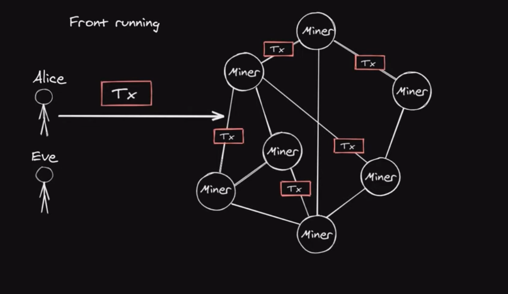
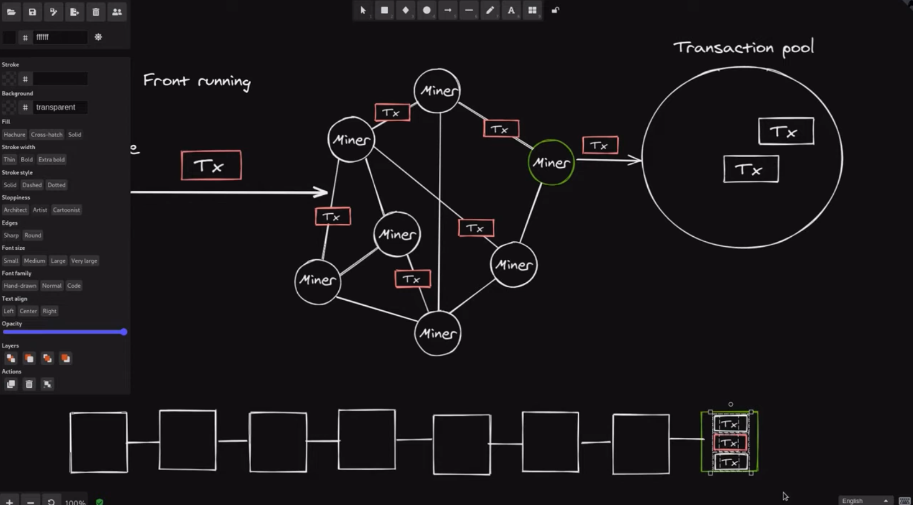
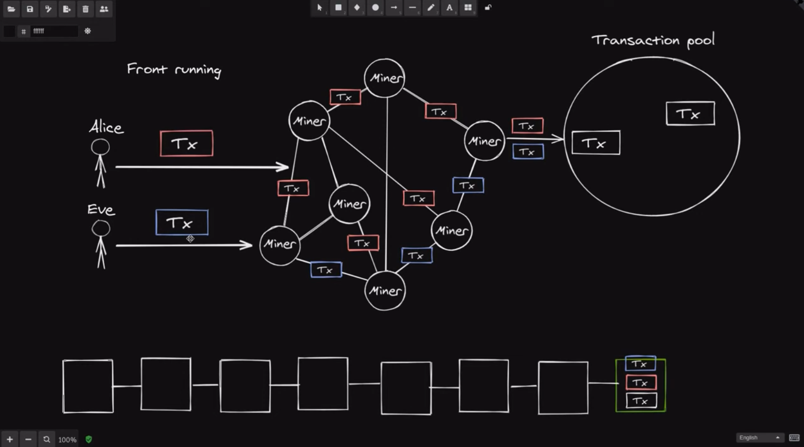

Your smart contract can be bug free but is it vulnerable to front running? Watch to learn what front running is. 

[#Solidity](https://www.youtube.com/hashtag/solidity) [#FrontRunning](https://www.youtube.com/hashtag/frontrunning) [#hack](https://www.youtube.com/hashtag/hack)  

Code: [https://solidity-by-example.org/hacks...](https://www.youtube.com/redirect?event=video_description&redir_token=QUFFLUhqbFVPUFlvT3BNUWZscExKdFVXZ3VodEpkdnkyQXxBQ3Jtc0trYmlqM0xjVG1wengzdk5NOVkwN2dWWXVWN1I1X3d3Z2VoUnh4bnppNUR6MVdNd0poY3pvSDhyVVFIbzc2Y21jYUNKTTk4X3d1S2cwOEMyek9fRnQtRm9aYm1oVHBxbWtBM0pGUFhydTY2Y3Q3cENCYw&q=https%3A%2F%2Fsolidity-by-example.org%2Fhacks%2Ffront-running%2F&v=MN55R440twQ) 

References [https://github.com/ethereumbook/ether...](https://www.youtube.com/redirect?event=video_description&redir_token=QUFFLUhqbE9OUGJDcnJrNzZkaU5hVEEwaWZoRWV6VmdCd3xBQ3Jtc0tsdHJ2STBSMDZrNXU2YWpjdkpCV0MyaG5NMGwtTWY1aFNmeWV3SENUTl9fMDZpU0RKSWJXbGNXcGliYUQzYVI5NGZUSHhpdW8wNzUxZXdnQVRvV0ZTOTlHZy0tc2dQQTZvT0ZiaUlxd1hOaGljM19Kcw&q=https%3A%2F%2Fgithub.com%2Fethereumbook%2Fethereumbook%2Fblob%2Fdevelop%2F09smart-contracts-security.asciidoc&v=MN55R440twQ) [https://solidity-05.ethernaut.openzep...](https://www.youtube.com/redirect?event=video_description&redir_token=QUFFLUhqbnJIUEhrR1hvQ1dndXJmZUU1YWNGbUN4T1IwUXxBQ3Jtc0tsc01sVl82cXBDTHhmSUpEeDlpWVNhZUx6RHFlMmM5bzhqM0xFS3BLT0tZbTJqZlVFVFZSd3pZR3l1a20tTmJ1YlFaZG5ranJPUlZ0RGFTYktTNjVVWW1wV2JiOEhiX2VJVkkzSXJLRFdHcXk3Q3JSRQ&q=https%3A%2F%2Fsolidity-05.ethernaut.openzeppelin.com%2F&v=MN55R440twQ)


Your smart contract can have 0 bugs and it can still be vulnerable to other attacks. One of these attacks is called Front running, so in this video we're going to be looking at Front running, I'll explain what it is and then we'll take a look at a code that is vulnerable to front running.

Alright, so, first of all, what is front running? Before we can understand how front running is executed, let's first take a look at how a transaction is included into a block. 



So let's say that we have Alice and Eve and some miners, Alice sends a transaction to the miners, and then her transaction gets relayed to other miners. Now each miner keeps track of pending transactions in a transaction pool. These transactions in the transaction pool are transaction that are yet to be included in a block, so over here on the right you can see that Alice's transaction is inside a transaction pool of this miner. Each miner will pick some transactions from the transaction pool to be included in the next block. So let's say that this is the next block to be mined, and this miner over here decides to pick this transaction and then Alice's transaction, and then this transaction to include these in the next block.



Now, let's say that this miner over here was successfully able to include these transaction in the next block, and these transactions will be included in the block over here. So that is how Alice's transaction is included into a block.



Let's now look at how front running works, so, let's rerun the time back to where Alice's transaction is still inside the transaction pool. This is how Eve is going to do a front running on Alice's transaction. So first Eve sees that Alice's transaction is inside the transaction pool and she decides to send her transaction which gets relayed through the network and each transaction gets included in the transaction pool of this miner. Now, let's say that this miner decides to include Eve's transaction and Alice's transaction and some other transaction to include in the next block, now notice that, even though Alice sent the transaction first, Eve's transaction will be included into the block before Alice's transaction. Here, let's say that Eve's transaction comes before Alice's transaction because Eve paid a higher gas price than Alice, and this transaction gets included into the block, so the end result is that, although Alice sent the transaction first, because Eve paid a higher gas price, her transaction was included before Alice's transaction.

Now, what are some incentives for Eve to have her transaction included before Alice's transaction? Well, for example, let's say that Alice knows a secret to unlock 10 ethers from a contract and the secret to unlock that 10 ether is included in this transaction (红色的Tx), then after Alice sends her transaction and while it's still in the transaction pool, Eve can look into the transaction pool and see Alice's transaction and also see the secret to unlock that 10 ether.

So Eve will send a similar transaction to unlock that 10 ether and to increase her chance that her transaction will be mine before Alice's, she will set a higher gas price than Alice and, as a result, Eve's transaction will be mine before Alice's, Eve gets to claim that 10 ether, even though Alice found the secret and she was the first one to send the transaction, and that is how Front running works.

```solidity
// SPDX-License-Identifier: UNLICENSED
pragma solidity ^0.6.0;

contract FindThisHash {
    bytes32 public constant hash =
        0x564ccaf7594d66b1eaaea24fe01f0585bf52ee70852af4eac0cc4b04711cd0e2;

    constructor() public payable {}

    function solve(string memory solution) public {
        require(
            hash == keccak256(abi.encodePacked(solution)),
            "Incorrect answer"
        );

        (bool sent, ) = msg.sender.call{value: 10 ether}("");
        require(sent, "Failed to send Ether");
    }
}
```

Let's now examine a code that is vulnerable to front running, over here I have a contract called **FindThisHash** and let's say that this contract stores 10 ethers, and if you can find the string that hashes to this hash, then you are a winner and you will be rewarded with 10 ethers. This contract is vulnerable to front running, how's that so? 

Well, let's imagine that Alice finds a string that hashes to this hash over here, and she sends a transaction, now Eve sees the solution inside the transaction pool and Eve also sends her transaction with higher gas price. Eve gets her transaction mind before Alice and she is the one that is rewarded with the ether stored in this contract. So by the time Alice's transaction is executed in this contract there will be zero ethers in this contract.

That is how this contract is vulnerable to Front running. The takeaway here is that you can have a contract that is bug free, but your contract might be vulnerable to front running if there are some incentives to reorder transaction.