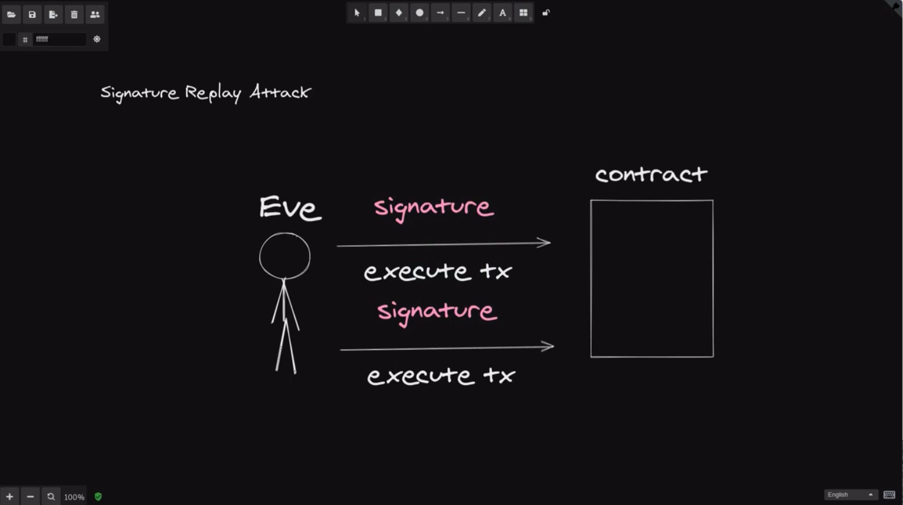
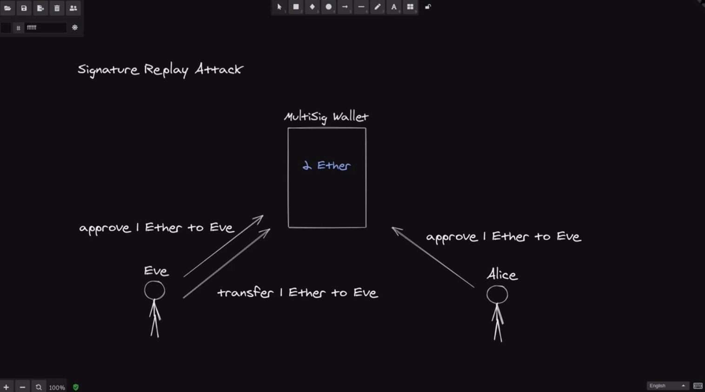
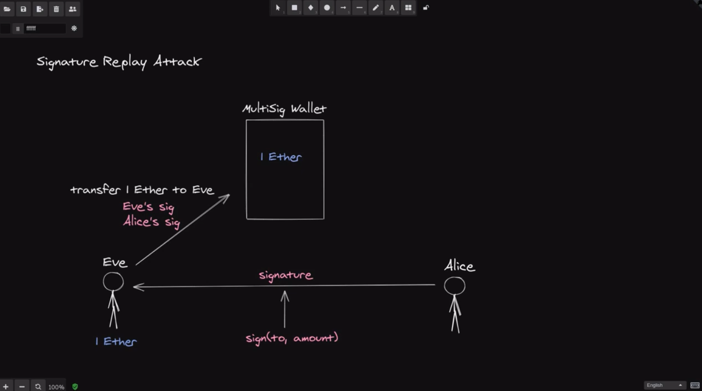
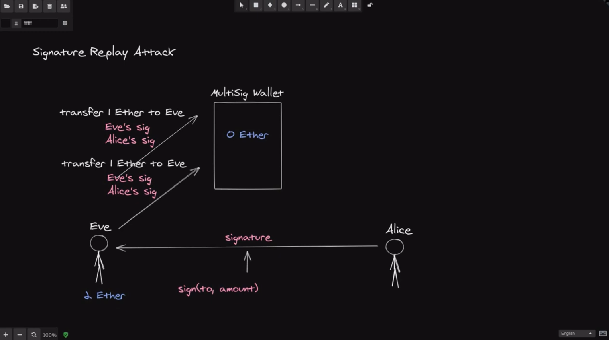
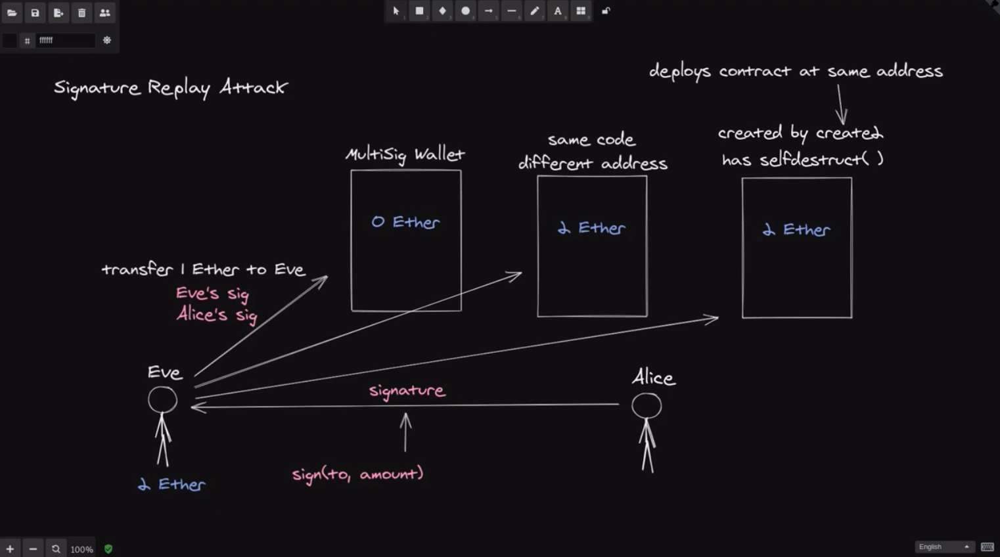
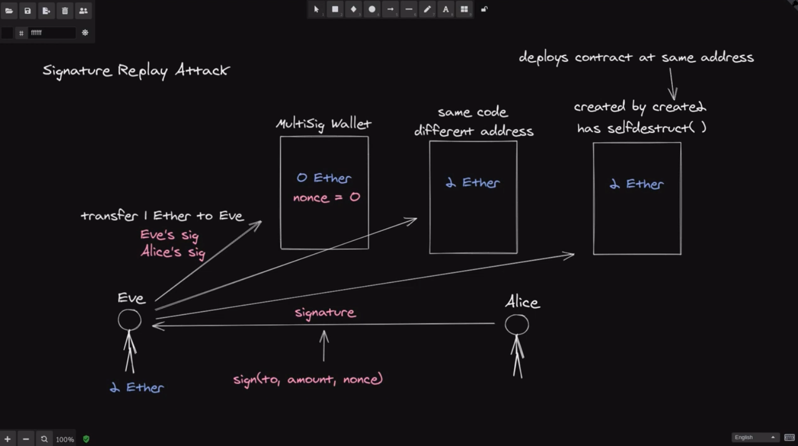
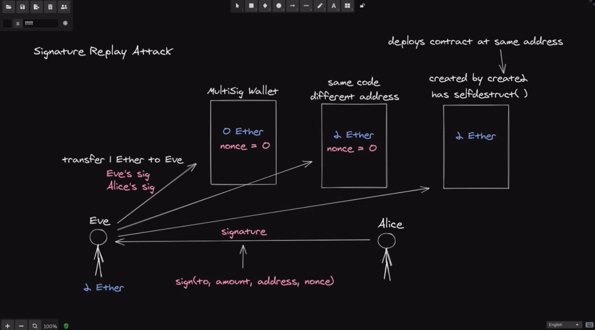
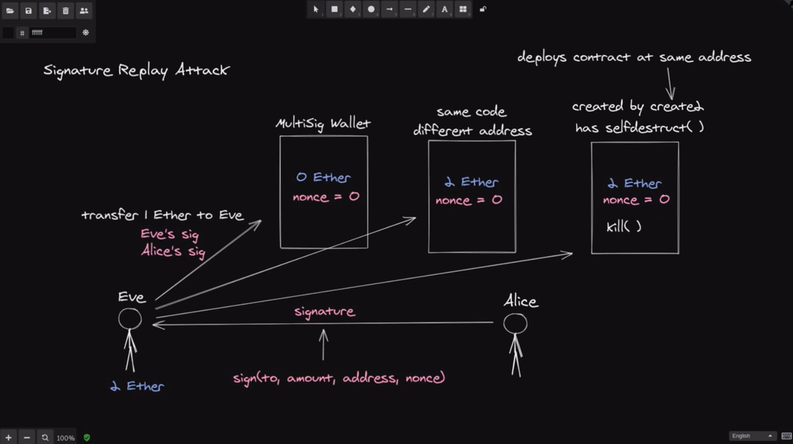

Learn about signature replay attack 

[#Solidity](https://www.youtube.com/hashtag/solidity) [#SignatureReplay](https://www.youtube.com/hashtag/signaturereplay) [#hack](https://www.youtube.com/hashtag/hack)  

Code: [https://solidity-by-example.org/hacks...](https://www.youtube.com/redirect?event=video_description&redir_token=QUFFLUhqbjFRMERxNXV2bjhXUVdxdVRWajYzSnJ1V2xvd3xBQ3Jtc0ttZ3Y0emF6MGpyN0pyR3hoaXBCUnFjREFxak1fNXZGVUhKLVpwMW1UakEzUFcyUzlETTNfZ2NrN0lmcWlHWVRyR1RuUTYwNC11Q3AzUFNWYWk1U2RManNGSzAxMnlPSHh2MUs5UEhHVUI0Vl9GVnB6QQ&q=https%3A%2F%2Fsolidity-by-example.org%2Fhacks%2Fsignature-replay%2F&v=jq1b-ZDRVDc) 

References [https://github.com/ethereumbook/ether...](https://www.youtube.com/redirect?event=video_description&redir_token=QUFFLUhqbmVUV2ZoLXB2M25EOXhnamczX2I3dlVySVZYQXxBQ3Jtc0tuVTd2Qml3NGZyWUpTMnptd21DMVkzUUp5WXlYRlUyLWJWOFdEV3JhMmVPUHJaR2QxVy11NG9FV182WVRyMERQbVhvTm5sdDdyT3YyTWx4SmdhSzc3ckc0OGFsNE5BdlRQaVkySnJUZXNfQmZoQm1SOA&q=https%3A%2F%2Fgithub.com%2Fethereumbook%2Fethereumbook%2Fblob%2Fdevelop%2F09smart-contracts-security.asciidoc&v=jq1b-ZDRVDc) [https://solidity-05.ethernaut.openzep...](https://www.youtube.com/redirect?event=video_description&redir_token=QUFFLUhqa29janljUUM0cjZpR2NuU1FBMnpEblZFcGJuZ3xBQ3Jtc0trS3E0a2Rxa1haaUY1bXdkQjZRaTc3bTladElDRzJwYmE4SU5pU0tXQ292ZGtBcFNqLWk2SnR4cUhKVEhYWTNlTk1wNy1MQThvNE9MdmVUZ19sclRlU3dhby1MMC1aclVaQmg3TDlxaE9GWlNGZU9FOA&q=https%3A%2F%2Fsolidity-05.ethernaut.openzeppelin.com%2F&v=jq1b-ZDRVDc)




In this video, let's take a look at signature replay attack. The basic idea of signature replay attack is that you can use the same signature to execute a transaction multiple times. What does that mean? Let's say that we have Eve and some contract,3 and in order to execute a function inside this contract, you'll need to submit a signature, so Eve can execute a transaction by submitting a signature and then using the same signature again, she can execute the same function inside the contract. So that's the basic idea of signature replay attack. That you can use the same signature to execute a function multiple times.



Now you might be asking questions like: What's the point of submitting a signature to a contract? And what kind of damage can be done when you can execute a transaction multiple times against the same signature? So first, let's go over how submitting a signature can be useful. Imagine that we have a multisig wallet owned by Eve and Alice with 2 ethers, Eve wants to withdraw 1 ether from the contract, so what does she have to do? Well, first, she'll have to send a transaction approving herself to spend 1 ether, likewise Alice will also send the transaction to approve Eve to withdrawal 1 ether and then Eve can finally withdraw the 1 ether inside the multisig wallet. So that's three transactions in total, however, using signatures we can reduce the number of transactions to just one transaction.



Let's see how, again, let's say that Eve wants to withdraw 1 ether. First, Alice would sign a message that says: Eve can withdrawal 1 ether. Next she will give the signature over to Eve and then Eve sends a transaction to withdraw 1 ether sending her signature and Alice's signature. The contract will verify Eve's signature and Alice's signature and then send 1 ether to Eve. In total, that's one transaction, Alice and Eve were able to reduce the number of transactions by exchanging signatures off-chain, and then sending a transaction to a contract that can verify signatures.



Now, let's take a look at how Eve can perform a signature replay attack on a multisig wallet that uses signatures, so like before, Eve can take the signature of Alice and withdraw 1 ether, now using the same signatures, Eve can withdraw another ether from the multisig wallet, even though Alice's intention was to allow Eve to withdraw 1 ether, so that was an example of signature replay attack on a multi-sig wallet. You use the same signatures to execute a function multiple times, in this case Eve was able to withdraw 2 ethers.



Now there are at least three situations where the signature replay attack can be performed. The first situation is, as we discussed, we can perform a signature replay attack on the same contract. Another situation is on the same code different address. So, for example, here we will have the same multisig wallet contract deployed at a different address, and the third situation is on a contract that was deployed using create2 and inside the contract it has a self-destruct function.

Create2 is a function that will deploy a contract always at the same address. So with the combination of create2 and self-destruct, you can deploy a contract at that address and then use self-destruct to delete the contract and then use create2 again to recreate the same contract.

Now, let's examine how we can prevent a signature replay attack on these different situations.



In the first situation we can prevent the replay attack by having a unique signature for every transaction and keeping track of which transaction has been executed inside the contract. And we can accomplish this by including the **nonce** inside the signature and then also keeping track of the nonce inside the contract, so if Eve tries to execute the same transaction twice, the contract will already know that that nonce was already used, so the transaction will fail.



Next, how will we prevent a replay attack on the same code deployed at a different address? Well, we can do that by including the address of the contract inside the signature and to prevent the attack from the first case, here, we'll also have to include a nonce in our contract.



Lastly, how about the case for a contract that's been deployed by create2 and inside the contract it has a self-destruct. How do we prevent the replay attack on this contract? Well, the bad news is that you cannot. The reason is because you can reset the nonce and this is done by deleting the contract by calling self-destruct and then using create2 to deploy a new contract at the same address, and when the new contract is deployed, the nonce is reset back to 0. The nonce is used to keep track of which transaction has been executed, but here by resetting the nonce Eve will be able to do a replay attack. Alright. So that's three situations where a replay attack is possible.

Let's now examine a multi-sig wallet contract that is vulnerable to replay attack, we'll turn that contract into a contract that is guarded against replay attack, and in the process you'll get a better understanding of how the nonce are used and how the contract knows which transaction has been executed.

```solidity
// SPDX-License-Identifier: UNLICENSED
pragma solidity ^0.6.0;
pragma experimental ABIEncoderV2;
import "github.com/OpenZeppelin/openzeppelin-contracts/blob/release-v3.0.0/contracts/utils/cryptography/ECDSA.sol";

contract MultiSigWallet {
    using ECDSA for bytes32;

    address[2] public owners;

    constructor(address[2] memory _owners) public payable {
        owners = _owners;
    }

    function deposit() external payable {}

    function transfer(
        address _to,
        uint _amount,
        bytes[2] memory _sigs
    ) external {
        bytes32 txHash = getTxHash(_to, _amount);
        require(_checkSigs(_sigs, txHash), "invalid sig");

        (bool sent, ) = _to.call{value: _amount}("");
        require(sent, "Failed to send Ether");
    }

    function getTxHash(address _to, uint _amount)
        public
        view
        returns (bytes32)
    {
        return keccak256(abi.encodePacked(_to, _amount));
    }

    function _checkSigs(bytes[2] memory _sigs, bytes32 _txHash)
        private
        view
        returns (bool)
    {
        bytes32 ethSignedHash = _txHash.toEthSignedMessageHash();

        for (uint i = 0; i < _sigs.length; i++) {
            address signer = ethSignedHash.recover(_sigs[i]);
            bool valid = signer == owners[i];

            if (!valid) {
                return false;
            }
        }

        return true;
    }
}
```

Here, we have a multi-sig wallet contract that is vulnerable to replay attack. Let's first take a look at what each function does. First of all, we set owners when the contract is deployed, anyone will be able to send ether into this contract by calling deposit, and to transfer the ether stored in this contract to anyone else then you'll have to call a transfer, to call this function you'll have to send three inputs: the address to send the ether to, the amount and the signatures, here, you'll need to send 2 signatures corresponding to the 2 owners.

Now, let's take a look at how the transfer function works. Well, first, it recreates the hash that was signed from the parameters **_to** and **_amount**, next it checks the 2 signatures against the hash and if the signatures are valid, in other words, if the 2 signatures were signed by the 2 owners, then the ether will be sent to the **_to** address.

The **getTxHash** is a simple function that hashes the **_to** and the **_amount** and **checkSigs** is also a simple function, from the **_txHash**, it recomputes the actual hash double sign by calling **toEthSignMessageHash**. Next, it runs a for loop, and for each signature we recover the signer and then check that the signer is indeed equal to the owner. If the signer and the owners are not equal, then it will return false, otherwise it will return true.

```solidity
    function transfer(
        address _to,
        uint _amount,
        uint _nonce,
        bytes[2] memory _sigs
    ) external {
        bytes32 txHash = getTxHash(_to, _amount, _nonce);
        require(_checkSigs(_sigs, txHash), "invalid sig");

        (bool sent, ) = _to.call{value: _amount}("");
        require(sent, "Failed to send Ether");
    }
    
    function getTxHash(address _to, uint _amount, uint _nonce) public view returns (bytes32) {
        return keccak256(abi.encodePacked(_to, _amount, _nonce));
    }
```

This contract is vulnerable to a replay attack, because once Eve has Alice's signature, she'll be able to call this **transfer** function as many times as she wants, and the signatures will be valid. So we need a way to create a unique signature for each transaction and then once that transaction is executed, we need to mark it as executed, so that Eve won't be able to do a replay attack, and we can create a unique signature for each transaction by creating a unique transaction hash. And we can do that by including a nonce inside the transaction hash. So that is what we'll do so we'll pass a nonce into the **getTxHash** function which will also pass to the **transfer** function and then we'll hash the nonce over here, now we are able to create a unique transaction hash by passing a unique nonce.

```solidity
    mapping(bytes32 => bool) public executed;
    
    function transfer(
        address _to,
        uint _amount,
        uint _nonce,
        bytes[2] memory _sigs
    ) external {
        bytes32 txHash = getTxHash(_to, _amount, _nonce);
        require(!executed[txHash], "tx executed");
        require(_checkSigs(_sigs, txHash), "invalid sig");

        executed[txHash] = true;

        (bool sent, ) = _to.call{value: _amount}("");
        require(sent, "Failed to send Ether");
    }
```

So next we'll need to invalidate this transaction hash when this **transfer** function is successful, so we'll scroll up and create a mapping called called executed that will map from bytes32 to boolean, and we'll, we'll name it execute, it and then we'll require that the transaction hash has not been executed yet, if it is we'll throw an error saying "tx executed", so once we know that the **txHash** has not been executed and we have a valid signature, then we'll mark the **txHash** as executed, and then transfer the ether.

```solidity
    function getTxHash(
        address _to,
        uint _amount,
        uint _nonce
    ) public view returns (bytes32) {
    		//																new
        return keccak256(abi.encodePacked(address(this), _to, _amount, _nonce));
    }
```

So by having a nonce and keeping track of which transaction hash has been executed, this will prevent a replay attack on the same contract. Now you'll need to go one step further and protect this contract from replay attack for the same contract deployed at a different address, and we can do that by including the address of this contract inside the **getTxHash**. So here we'll say address this, so now, when Alice and Eve signs this **txHash**, they are signing a hash that is unique to this contract, and this is because we are hashing the address of this contract.

All right. So now we have a contract that is protected against replay attack, and this was done by including announce and the address of this contract in the hash that we're going to sign and once the transaction corresponding to this hash is executed, we mark it as executed.

So, in summary, we used signatures to reduce the number of transactions and we protect against the replay attack by signing txhash with nonce and the address of this contract.