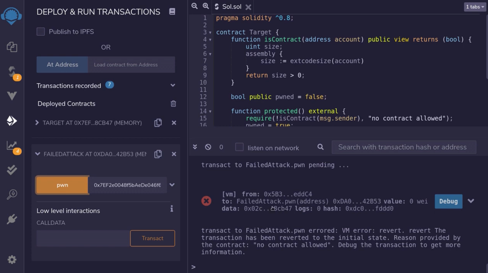
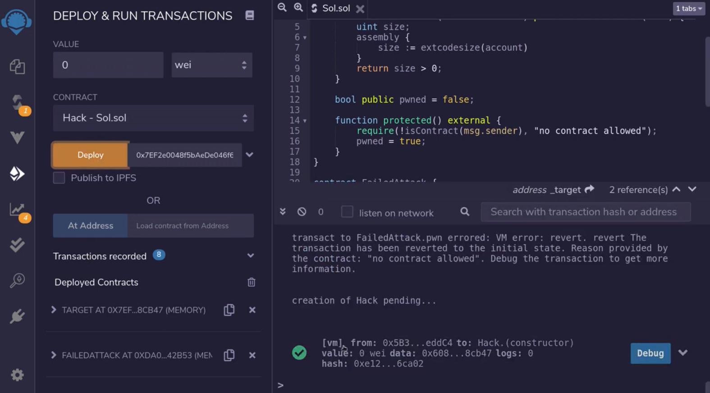

If the size of code stored at an address is zero then it can't be a smart contract right? This video explains how a smart contract protected from other smart contract using this check (checking code size is 0) can be bypassed.  

[#Hack](https://www.youtube.com/hashtag/hack) [#Solidity](https://www.youtube.com/hashtag/solidity) [#SmartContract](https://www.youtube.com/hashtag/smartcontract) [#Ethereum](https://www.youtube.com/hashtag/ethereum)

Code: [https://solidity-by-example.org/hacks...](https://www.youtube.com/redirect?event=video_description&redir_token=QUFFLUhqa0Q2Ym53Z0dBaWZfd1QwUmNPNE9nTUlpQ1FCUXxBQ3Jtc0trVnNwM0V6c2IyeHdCWHp2UGRzbm8yamE4d2RUOHVURlVSd2Vtb0NwVUp4Ukdlb012a3BmOE90R1J4WDNoYXhqVERCamJteGNnMGNxT3hCOGNMcUJpbHJ4QlgwcTdpbnlRNTBDY2JBZEcwdGdnOWxvYw&q=https%3A%2F%2Fsolidity-by-example.org%2Fhacks%2Fcontract-size%2F&v=58Mnru9vRyU) 


```solidity
contract Target {
    function isContract(address account) public view returns (bool) {
        // This method relies on extcodesize, which returns 0 for contracts in
        // construction, since the code is only stored at the end of the
        // constructor execution.
        uint size;
        assembly {
            size := extcodesize(account)
        }
        return size > 0;
    }

    bool public pwned = false;

    function protected() external {
        require(!isContract(msg.sender), "no contract allowed");
        pwned = true;
    }
}
```

Let's say I have a contract and I want this contract to be super secure. One other thing I have done to increase security for this contract is to not allow any other contracts to interact with this contract. Here I have a function called **protected** and it requires that msg.sender is not a contract, in this video, I'm going to show you how to hack this contract, how to bypass this **isContract** function, so that even though this function does not allow any other contracts to call this function, we still bypass this check and pwned the contract.

First of all, let's take a look at this **isContract** function, How does it check whether msg.sender is an externally owned account or whether it is an actual contract? Here the function **isContract**, it takes an address of the account and if the account is in contract then it returns true, otherwise it returns false, the way it checks whether the account is a contract or not is by checking the code size stored at the address of this account, and the size of the code store at this address can be found by using assembly and then calling a function **extcodesize**, this will return the size of the code, and we'll check that the size of the code is greater than zero. If the size of the code is greater than zero, then we know that there's some kind of code stored at this address, otherwise, there's no code, so we safely assume that this address is an externally owned account.

That is how this check works. So if you go back to this function, it will check that the code store at msg.sender is equal to zero, which means that msg.sender is not a contract and if it's not a contract, then we'll set the **pawn** to true.

```solidity
contract FailedAttack {
    // Attempting to call Target.protected will fail,
    // Target block calls from contract
    function pwn(address _target) external {
        // This will fail
        Target(_target).protected();
    }
}
```

To show you that this protection works for existing contract, I've created another contract that will call this function, when we call the function **pwn**, when we call this function, we expect this transaction to fail, because this protection will kick in.



So when I call this pawn function that you see over here and then we check the transaction log, you can see here that this wasn't a failed attack.

So now I'm going to show you how to bypass this check and we'll be able to hack this function (指protected) and this contract (指Target), the way to bypass this check is if the code size at the address is equal to zero, for existing contracts this will return a size that is greater than zero, but there is one exception ***when the contract is being deployed in the exact same transaction, when this function is called, the size will be equal to zero***, and we will be able to bypass this check.

```solidity
contract Hack {
    bool public isContract;
    address public addr;

    // When contract is being created, code size (extcodesize) is 0.
    // This will bypass the isContract() check
    constructor(address _target) {
        isContract = Target(_target).isContract(address(this));
        addr = address(this);
        // This will work
        Target(_target).protected();
    }
}
```

For example, if we call this function inside another constructor of another contract, the size will be equal to zero. Here, I've created a contract to do exactly that. When this contract is deployed, the constructor will be called and we'll call the **protected** function, and to show you that the function **isContract** returns false, we'll store the result in a state variable called ***isContract***.



All right, let's deploy this hack contract, we're going to need the address of the **Target** contract, so I'm going to copy it from here and then paste it here and then deploy the **Hack** contract. Let's check the transaction logs, the transaction was successful, meaning that we were able to deploy the **Hack** contract.

Finally, let's check that we were able to pwned the **Target** contract, so I'm going to open the target contract and then click down pwn and it is equal to true. We also check on this state variable, and check that isContract is equal to false, so I'm going to open the **Hack** contract and click on isContract and it's equal to false.

So, in summary, we were able to call a function that does not allow smart contracts to call it, and the way we were able to do that was by calling this function inside the constructor.

```solidity
    /**
     * @dev Returns true if `account` is a contract.
     *
     * [IMPORTANT]
     * ====
     * It is unsafe to assume that an address for which this function returns
     * false is an externally-owned account (EOA) and not a contract.
     *
     * Among others, `isContract` will return false for the following
     * types of addresses:
     *
     *  - an externally-owned account
     *  - a contract in construction
     *  - an address where a contract will be created
     *  - an address where a contract lived, but was destroyed
     * ====
     *
     * [IMPORTANT]
     * ====
     * You shouldn't rely on `isContract` to protect against flash loan attacks!
     *
     * Preventing calls from contracts is highly discouraged. It breaks composability, breaks support for smart wallets
     * like Gnosis Safe, and does not provide security since it can be circumvented by calling from a contract
     * constructor.
     * ====
     */
    function isContract(address account) internal view returns (bool) {
        // This method relies on extcodesize/address.code.length, which returns 0
        // for contracts in construction, since the code is only stored at the end
        // of the constructor execution.

        return account.code.length > 0;
    }
```

The smart contract library [openzeppelin-contracts](https://github.com/OpenZeppelin/openzeppelin-contracts/blob/master/contracts/utils/Address.sol#L36) has this exact same function, here it is, It is mentioned here that the code size is zero during construction, so the takeaway for this video is that this function can be bypassed under these conditions, and just because you use this function does not protect their contract from other contracts.