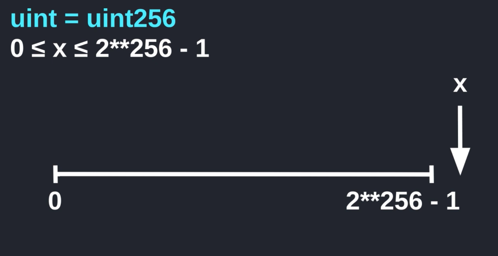

Hey everyone in this video we will learn about overflow and underflow. First of all, I'll explain what it is and then we'll examine a smart contract that is vulnerable to overflow and underflow and that's the I'll show how you can protect your smart contract code from overflow and underflow

Alright, so what are overflow and underflow, overflow occurs when a number is too big. The part that exceeds the maximum range is count from zero again. So you end up with a number that is smaller than what you started with, underflow is similar to overflow and it happens in the opposite direction when a number is smaller than the minimum range, it starts counting back from the maximum number and you end up with a number that is greater than what you started with.



Let's look at an example using uint which stands for unsigned integer. Now the datatype uint is a short name for uint256. And what does this 256 tell us? Well, it means that it can represent 2 to the 256 numbers, ranging from 0 to 2 to the 256 minus 1.


So let's look at overflow. What happens when a number is greater than 2 to the 256 minus 1, so over here on the right we have x, which is beyond the maximum range, how the solidity handle a number that is beyond the range. Well, it wraps around and then starts counting forward from 0. For example, let's say that the number x is 3 greater than the maximum range, and now, let's calculate where this number is going to end up, well 1 beyond the maximum number will get us back to 0, 2 beyond the maximum number will land at 1 and finally 3 beyond the maximum number will land at 2. So if the number is 3 plus the maximum number, then it wraps around and we end up at 2. So this is overflow and when a number overflows solidity does not give you any warnings or errors. It just doesn't care.

Underflow happens in the opposite direction of overflow, so here we have a number that is less than zero, which is the minimum range, in this case what will happen is that the number will be counted backwards from the maximum number. Let's see an example using the number negative two, where would negative two end up on the range between 0 and 2 to the 256 minus 1?


Well, minus 1 will give us the maximum number, which is 2 to the 256 minus 1 and negative 2 will be 1 less than that which is 2 to 256 minus 2. This is on the underflow and again solidity will not give you any warnings or errors. So when you're dealing with numbers and solidity, you gotta be careful of overflow and underflow.

```solidity
// SPDX-License-Identifier: UNLICENSED
pragma solidity ^0.6.0;

/*
Overflow / Underflow
Code & Demo
Priventative techiniques`
*/

contract TimeLock {
    mapping(address => uint) public balances;
    mapping(address => uint) public lockTime;

    function deposit() public payable {
        balances[msg.sender] += msg.value;
        lockTime[msg.sender] += now + 1 weeks;
    }

    function increaseLockTime(uint _secondsToIncrease) public {
        lockTime[msg.sender] += _secondsToIncrease;
    }

    function withdraw() public {
        require(balances[msg.sender] > 0, "Insufficient funds");
        require(now > lockTime[msg.sender], "Lock time not expired");

        uint amount = balances[msg.sender];
        balances[msg.sender] = 0;

        (bool sent, ) = msg.sender.call{value: amount}("");
        require(sent, "Failed to send Ether");
    }
}
```

Let's now examine a contract that is vulnerable to this behavior. TimeLock is a contract where you can deposit ether, and you have to wait at least one week before you can withdraw, the amount of ether that you deposit into this contract is kept in a mapping called balances. The time at which you can withdraw is kept in a mapping called lockTime. We need to dposit either into this contract. It does two things: it first updates your balance and then it updates lockTime to one week from now, so this means that you won't be able to withdraw from this contract for at least one week, and you can see how this mapping is used in the withdraw function.

So, let's take a look, so you deposited some ether into this contract, waited one week and now you want to withdraw from it. The function withdraw will first check that you have some ethers deposited into this contract, and this is done by checking that the balances mapping of your address is greater than 0, next It checks that the current time is greater than the lockTime. So if you try to call this function before one week has passed since you deposited, this check will fail and you won't be able to withdraw, after the two checks above pass, we update the balance and then send the ether back to you. That's how the withdraw function works.

Now, if you want to increased a lot of time, say one month, then you can do that by calling this function increaseLockTime, for the input you passing the secondsToIncreased a lot time by, and then it will add the secondsToIncreased to the current lockTime, so this is how the contract TimeLock works. It allows you to deposit, but you have to wait a minimum of one week before you can withdraw and you can also increase the time lock by calling increaseLockTime. This contract is vulnerable to you and overflow, I'm going to show you how you can withdraw from this contract without waiting one week.

```solidity
contract Attack {
    TimeLock timeLock;

    constructor(TimeLock _timeLock) public {
        timeLock = TimeLock(_timeLock);
    }

    fallback() external payable {}

    function attack() external payable {
        timeLock.deposit{value: msg.value}();
    }
}
```

And the basic idea behind this hack is to update lockTime with a very huge number, the contract that's gona hack the TimeLock contract above will name it attack, will store the contract that's going to be exploited in a state variable called timeLock, and using a constructor we'll set our target. Here we're going to need a payable fallback function so that we can receive the ether withdraw from the TimeLock contract, to initiate the attack will create a function called attack, we're going to be sending some ether to the TimeLock contract. So we'll declare this function as payable and when we call this function will send some ether to this function and then send the ether that is sent to this function to the TimeLock contract, we'll first deposit ether into the TimeLock contract by calling timeLock dot deposit, and this will set the timeLock to one week from now, so that if you try to withdraw immediately, then it will fail.

```solidity
		function attack() external payable {
        timeLock.deposit{value: msg.value}();
        // t == current lock time
        // find x such that
        // x + t = 2**256 = 0
        // x= -t
        timeLock.increaseLockTime(
        	// Some huge number = ?
        );
        timeLock.withdraw();
		}
```

So before we can call the withdraw function, we'll increase the lock time by some huge number which will cause a uint to overflow, and then we can call withdraw. So what's the huge number that we need to pass in here to cause a uint overflow? Well, let's do some math, we'll say that t is a current of time, what we need to do is find x such that x plus t is equal to 2 to the 256, and 2 to the 256 is equal to 0 since the overflow causes the number to wrap back to 0, we do some simple algebra minus same t from both sides of the equation and we get x is equal to minus t. So this means that if we pass minus t to this function here, then this will cause an overflow and the current lock time will equal to 0.

```solidity
		function attack() external payable {
        timeLock.deposit{value: msg.value}();
        // t == current lock time
        // find x such that
        // x + t = 2**256 = 0
        // x= -t
        timeLock.increaseLockTime(
        	// 2**256 - 1
        	uint(-timeLock.lockTime(address(this)))
        );
        timeLock.withdraw();
		}
```

We can get the current lock time by calling timeLock dot lockTime and then pass in the address of this contract and we'll put a negative sign up in front and then cast it into a uint by wrapping it in uint. Now this doesn't look like a big number but it is, over here we're using on the underflow to create a real big number and what this number represents is 2 to the 256 minus t whre t is the current long time. And this completes the function that's going to be able to deposit and then immediately withdraw by exploiting uint overflow.

Let's see this in action, here, I have the TimeLock contract and attack contract deploy. The attack contract was deployed using the address of the TimeLock which was passed in by copying the address of the TimeLock contract and then pasting it in here and then hitting deploy. Let's say that account 1 is Eve and she's going to deposit 1 ether into the TimeLock contract, so you'll call the function deposit with 1 ether, and now, if you try to withdraw, you can see here that the transaction fails with "Lock time not expired".

So you'll have to wait at least one week before you can withdraw from this contract. But using the attack contract that we wrote here, we will be able to deposit and then immediately withdraw, so you'll send 1 ether again and then call attack, and you can see here that the transaction was successful. So we were able to withdraw without waiting one week, and this is because we caused the overflow on the lockTime and we can check that the lockTime did indeed overflow by copying this address and then checking the lockTime of that contract. So over here we are passing the address of the attack contract and then hit lockTime, and you can see here that this is equal to zero. So that's uint overflow.

```solidity
// remix环境中这么写
import "https://github.com/OpenZeppelin/openzeppelin-contracts/blob/master/contracts/utils/math/SafeMath.sol";

// hardhat环境中这么写
import "@openzeppelin/contracts/utils/math/SafeMath.sol";

contract TimeLock {
    using SafeMath for uint;  // myUint.add(123)
}
```

Let's now see how we can prevent this exploit. The way you prevent uint overflow is by using math libraries like SafeMath by openzeppelin, the library works by turing on error when there is an overflow or underflow, we will import the SafeMath library from github, and inside the TimeLock contract you'll say **using SafeMath for uint**.

```solidity
    function increaseLockTime(uint _secondsToIncrease) public {
        // old line
        // lockTime[msg.sender] += _secondsToIncrease;
        // new line
        lockTime[msg.sender] = lockTime[msg.sender].add(_secondsToIncrease);
    }
```

And this will add extra functions to the uint data type, so that you'll be able to do is something like myUint dot add one two three, inside the function iincreaseLockTime, we'll update this line by saying the new lockTime is equal to the current lockTime plus the secondsToIncrease, and this add function over here will take care of uint overflow.

If the addition of these number results in a uint overflow, then this function will turn error and call to this function will fail. So that's how you use SafeMath to prevent uint overflow and underflow. Let's check that this works by using the attack contract again, so I recompile the TimeLock contract and attack contract and then we deploy them here. So you call the attack function so will send 1 ether and then call attack, and you can see here, that the transaction fail with "SafeMath: addition overflow".

So in summary, using SafeMath we were able to prevent attacks from uint overflow and underflow, that's all I got to say for this video I'll put the link to this code here in the descriptions below.