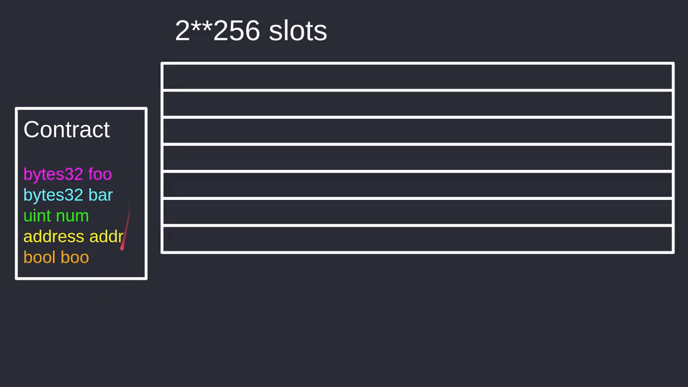
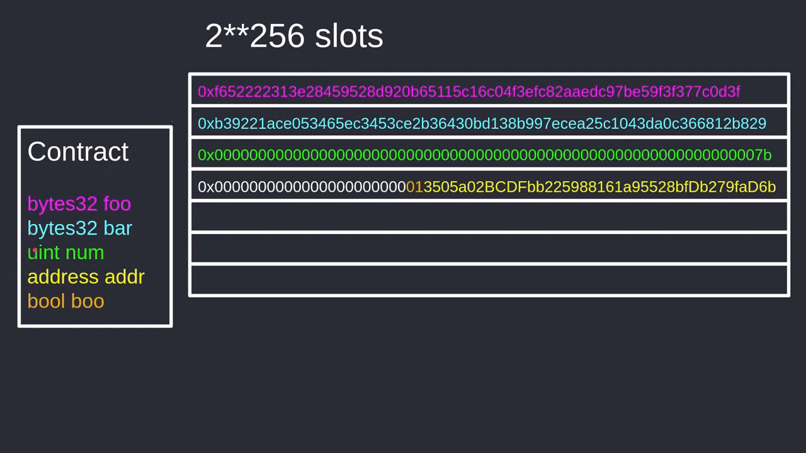
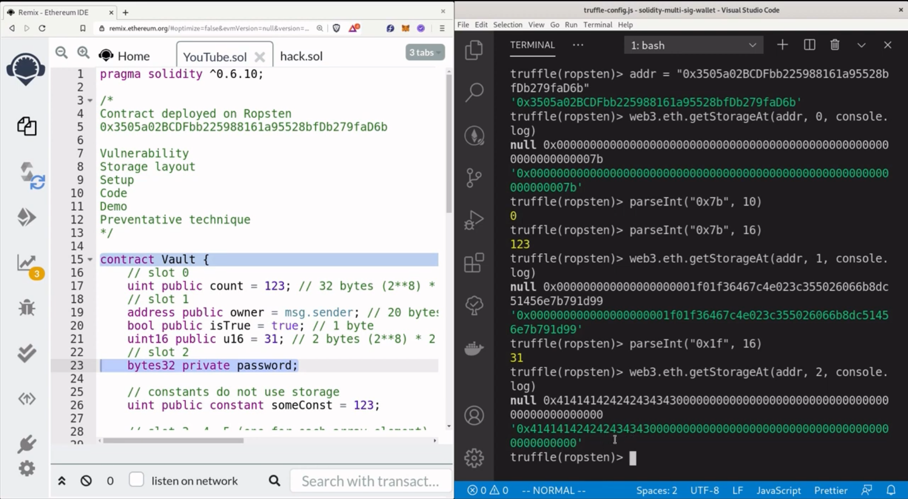
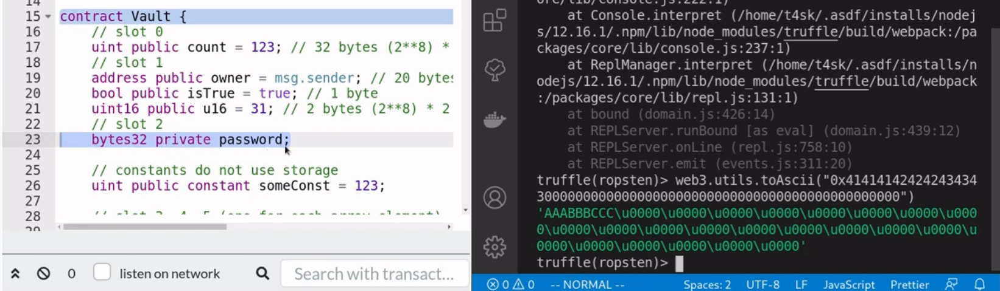
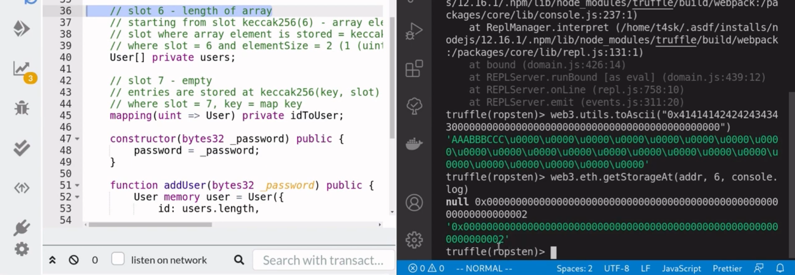
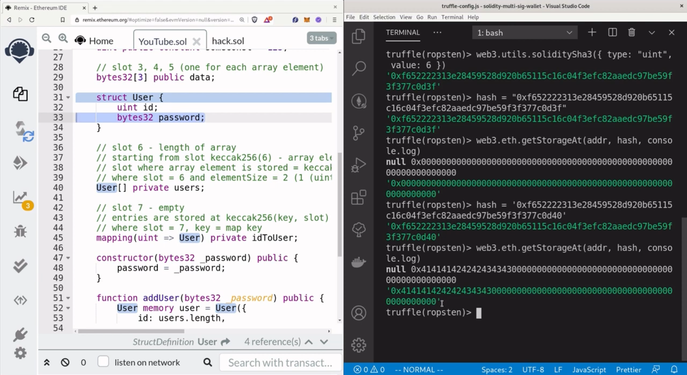
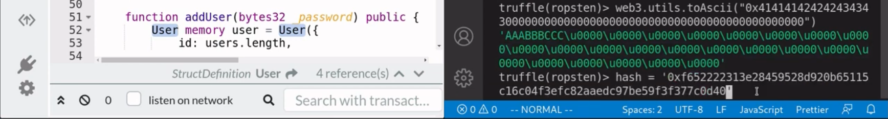
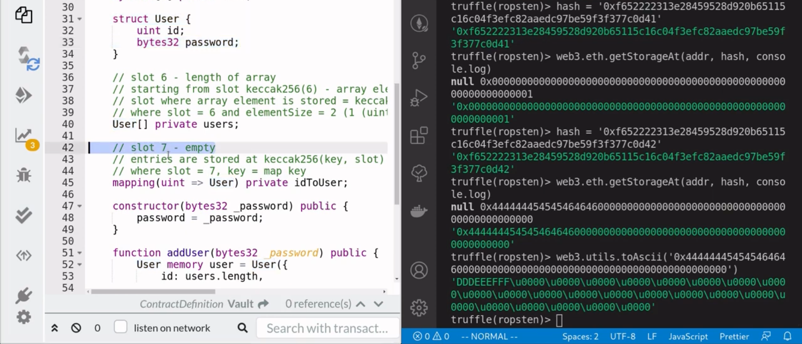
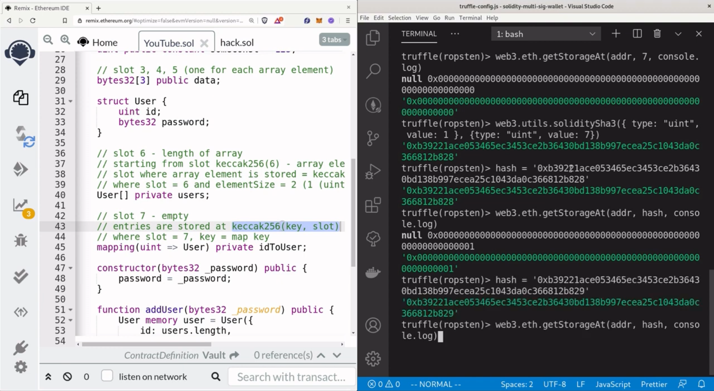
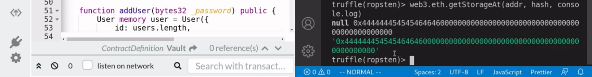

Never store sensitive data in a private state variable. Private state variable are not accessible by other contracts, but since everything on the blockchain is public data, we are available to get that private data. Let's see how. 

[#Solidity](https://www.youtube.com/hashtag/solidity) [#private](https://www.youtube.com/hashtag/private) [#hack](https://www.youtube.com/hashtag/hack) [#EVM](https://www.youtube.com/hashtag/evm) [#storage](https://www.youtube.com/hashtag/storage)-layout 

Code: [https://solidity-by-example.org/hacks...](https://www.youtube.com/redirect?event=video_description&redir_token=QUFFLUhqbXBUbEduM1dMOXgyM3ItM3Q1UkJobHFLZGtZUXxBQ3Jtc0tsM3lIaTJibTNfVkFtR3Q4YzJlRTEzSG03SUdiam9YdjItTDRCazJJWXhaZTlOWmtSRDh1Y25oOXRzLUNLdnlEd0FJaUJHRUhTM0ZYdXZFTU0xaWFZVl9sN05RTDlfSXZqVks3MGJNMmNGb2ljd0VyUQ&q=https%3A%2F%2Fsolidity-by-example.org%2Fhacks%2Faccessing-private-data%2F&v=Gg6nt3YW74o) 

Truffle project used in this video [https://github.com/t4sk/solidity-mult...](https://www.youtube.com/redirect?event=video_description&redir_token=QUFFLUhqbmtWU1BIaXBVOUxnOEN6T2ZVb085N0hnRHgwZ3xBQ3Jtc0tubTRiWk9uekZZWl93RUNHVzB3ZkJWQXZUM0U1akoyXzIwc002b25rd2JuN2loaUNtSGRYa2w3RVVQdE9NSC1DNFAzbkJOT2VtUzQ3Z1dTaXV2eFUxRElfazdydXFCLTBaUm5hUkRpOEZheGNrTUc2SQ&q=https%3A%2F%2Fgithub.com%2Ft4sk%2Fsolidity-multi-sig-wallet&v=Gg6nt3YW74o) 

References [https://github.com/ethereumbook/ether...](https://www.youtube.com/redirect?event=video_description&redir_token=QUFFLUhqbG1LTlVhT1ZNLVctb2JyM3pWM21DQ2ktWkdLUXxBQ3Jtc0tuM0RqNHIxa0lTSnN6UlpEQ2FSeG5Nc3otb3E1dVRRZGdGYmZTcVpOXzNoeHpxNDQyVjBUNEJJRmhCOWZ3SEMxSUxLOFhLZGdIYlZIMjk2eWR0Yzc2UTZkUmJWVE5Ec0NfR211T29tazdIQkpSSTNEUQ&q=https%3A%2F%2Fgithub.com%2Fethereumbook%2Fethereumbook%2Fblob%2Fdevelop%2F09smart-contracts-security.asciidoc&v=Gg6nt3YW74o) [https://solidity-05.ethernaut.openzep...](https://www.youtube.com/redirect?event=video_description&redir_token=QUFFLUhqbTJYMzhzb3FRMDFEamppQTYxVEZpcDZ4a0NDd3xBQ3Jtc0trZERRd3dUQUtxc2F2TlpQRTNpd2NZWGpHdVppU3F3T1Bwa3RQbmp4SWZZVm84bjdGU3o5a3BreElidXJDWF9uU2JnaEthTEc0T1NMNEhLckJIVGh4QXNSa2NnUVA1Yy11UnhaVE1CeERFRloteXlsYw&q=https%3A%2F%2Fsolidity-05.ethernaut.openzeppelin.com%2F&v=Gg6nt3YW74o)


Over here, I have a contract deploied on the ropsten test network at this address, inside the contract it has a private state variable called password, private means that other contracts cannot access the state variable. So if you look over here on the left, you can see that there is no way for us to get the password, but just because you declare a state variable as private, it doesn't mean that we don't have access to this data. So in this video, I'm gonna show you how to get private state variables, even though at first glance it doesn't look like we are able to get the data.

The vulnerability here in this contract is that private state variables can be read, when you declare a state variable as private. That means that other contracts cannot access that data. But since everything on the blockchain is public, declaring the state variable as private is not going to stop us from reading that data. So the lesson to be learned here is to never store sensitive data on the blockchain. In other words, if you don't want the whole world to know then don't publish it on the blockchain, before we can access private data, we first need to understand how EVM stores state variables, so that is what I'm gonna explain first. And then I'll quickly go over the setups that you will need to do if you want to follow along, then I'll give a little explanation about the code and then you'll see a demo where we will retreat private data from the contract below and then. Lastly, we'll talk about preventative techniques.



Okay, first, let's see how the Ethereum Virtual Mchine stores the state variables. So let's say that we have a contract with some state variables. It has a bytes32 state variable called foo and then a bytes32 state variable called bar, next we have a unit called num and then our address type and then lastly we have a boolean state variable. So let's see how these state variables are stored. Inside EVM. The EVM stores these state variable in a huge array with a length of 2 to the 256. So you can imagine that the storage of a contract is an array with 2 to the 256 slots, and each of these rectangles here represents a slot.



Now in each slot you can store up to 32 bytes, and these state variables here will be stored in the order that they are declared in. So, since foo is declared first, it will be stored in the first slot, each slot can't store up to 32 bytes and since foo is 32 bytes, it's going to use all of slot 0. The second state variable bar will be stored in slot 1, and here then the state variable bar has a size of 32 bytes. So it's going to use up all the slot. The third state variable uint will be stored in the third slot and it will be stored in a hexadecimal notation. So, for example, if this num state variable is equal to 123 then in hexadecimal it will equal to 70 and since unit is equal to 2 to the 256, if you do the math, it turns out that it's gonna need 32 bytes. So here again, it's gonna use up all of the capacity of this slot. The 4 state variable address will be stored in the fourth slot, here notice that it didn't use up all of the space since the address type is only 20 bytes. We still have space to put other state variables. So if the next state variable can't fit under here, then solidity will do so. In this case, the next state variable is a boolean type which only needs one byte. So solidity will store this state variable over here, right after the address, so in summary, EVM stores state variables in slots. There are 2 to the 256 slots and each slot can hold up to 32 bytes, state variables are stored in the order of declaration, so the state variable will be stored in slot zero. The second state variable will be stored in slot one. The third state variable will be stored in slot twon and so on. Lastly, if neighboring state variables fit into a single slot, then the EVM will pack these state variables from right to left and that's the basics of how all the state variables are stored.

```solidity
// SPDX-License-Identifier: UNLICENSED
pragma solidity ^0.6.0;

/*

*/

contract Vault {
    // slot 0
    uint public count = 123; // 32 bytes (2**8) * 32
    // slot 1
    address public owner = msg.sender; // 20 bytes (2**8) * 20
    bool public isTrue = true; // 1 byte
    uint16 public u16 = 31; // 2 bytes (2**8) * 2
    // slot 2
    bytes32 private password;

    // constants do not use storage
    uint public constant someConst = 123;

    // slot 3, 4, 5 (one for each array element)
    bytes32[2] public data;

    struct User {
        uint id;
        bytes32 password;
    }

    // slot 6 - length of array
    // starting from slot keccak256(6) - array elements
    // slot where array element is stored = keccak256(slot) + (index * elementSize)
    // where slot = 6 and elementSize = 2 (1 (uint) + 1 (bytes32))
    User[] private users;

    // slot 7 - empty
    // entries are stored at keccak256(key, slot)
    // where slot = 7, key = map key
    mapping(uint => User) private idToUser;
}
```

Let's now jump into some code and see some examples. Here we have a contract called Vault and inside it we have some state variables declared, up at the top we have some primitive data types so calculating the slot for these state variables will be straightforward. Next we have some arrays, struct, dynamic arrays and mappings. There will be some calculations involved in order to find a stop for these state variables, all right. So, first, let's start with the easy ones. The first state variable **count** is a data type of uint and the uint data type will take up 32 bytes, since it's the first state variable that is declared inside this contract, this state variable will be stored and slot 0. Next we have that address data type, this is the second state variable that is declared in this contract, it will be stored in slot 1 and they will use up 20 bytes. So this means that there are still 12 bytes that we can store inside slot 1. The next state variable is of type boolean and it only takes 1 byte since we still have some space inside slot 1. This state variable will be stored after the **owner** state variable. The next state variable is uint16 and the data type uint16 only takes up 2 bytes, now inside slot 1 we can store still 11 bytes and 2 bytes fit inside 11 bytes so this state variable will be stored in slot 1 to the left of the state variable above which is **isTrue**, now the next state variable is of type bytes32, since 32 bytes does not fit inside slot 1, it will be stored in the next slot that is available which is slot 2 and notice that this state variable is declared as private and this means that other contracts will not be able to access this state variable, but for us we know that this state variable is stored in slot 2 and we will later get the state variable.

Now constant variable is not stored inside the storage, this will be hard-coded into the contract byte code, so how about an array of fixed size, here we have a bytes32 array of size 3 and EVM will store these state variables sequentially, so that the first element will be stored in slot 3, the second element will be stored in slot 4 and the third element will be stored in slot 5.

Moving on, let's see how a dynamic array of struct is stored, for dynamic arrays it's gonna store the length of the array in the next slot that is available, so here we used up slot 3, 4 and 5, so the next available slot is slot 6, so this is where the length of the array **users** will be stored, and where is the elements of the array stored? Well, the array elements will be stored starting at the hash of the slot -- **keccak256(6)**, so here the length of the array is stored in slot 6, so if you take the **keccak256** of slot 6, then that is where the array elements are stored, so what the slot work corresponds to the hash of 6 that is where our first user struct is stored, now each user struct is going to take up 2 slots, this is because uint takes up one slot and then bytes32 takes up the next slot, so the first user will be stored at the hash of 6 and the second user will be stored at hash of 6 plus 2, since each user struck takes up 2 slots and the third user will be store that hash of six plus 4 and so on.

How about for mappings, how are the values of mappings stored? Well it turns out that the value of the mapping are stored at the hash of the key and slot, and what does this mean? slot here is equal to 7 since this is the next available slot and the key here is equal to the map key, so if you want to get the slot where the user id is equal to 1, you'll take the hash of 1 and then 7 and that's how you determine where these state variables are stored.

```solidity
    constructor(bytes32 _password) public {
        password = _password;
    }

    function addUser(bytes32 _password) public {
        User memory user = User({id: users.length, password: _password});

        users.push(user);
        idToUser[user.id] = user;
    }

    function getArrayLocation(
        uint slot,
        uint index,
        uint elementSize
    ) public pure returns (uint) {
        return uint(keccak256(abi.encodePacked(slot))) + (index * elementSize);
    }

    function getMapLocation(uint slot, uint key) public pure returns (uint) {
        return uint(keccak256(abi.encodePacked(key, slot)));
    }
```

Let's now actually try to read some private state variables, and here inside the constructor I've set the password and remember that password was a private state variable so we can't simply get it using remix, next I use this function addUser to add some users and since the users array and the mapping are both private, we'll need to compute the slot in order to read these private state variables. And lastly here are some helper functions to compute the slot of a dynamic array element and one for a map value.



To follow along you're gonna need shuffle and you're gonna have to do some setups, so here I'm just gonna use a truffle project from an older video where I showed you how to build a multi save wallet using truffle, inside the terminal I'm gonna type **truffle console --network ropsten** and this will start up truffle console that is connected to the ropsten test network, once you're inside the truffle console, let's now try to get these state variables where this contract is at this address, so I'm gonna copy this address and say address is equal to... here I'm just storing the address in a variable called addr, to get the state variables stored at slot 0, you'll need to call **web3.eth.getStorageAt** and then passing the address of the contract, here we stored it in a variable called addr, next we pass in the slot that we want to access in this case 0 and then we pass in a callback here we'll just console.log it, you can see here that slot 0 stores this data which is in hexadecimal notation and when you convert this 7b from hexadecimal notation to decimal notation we get the number 123 back which is the number here, we can get slot 1 by calling the same function and instead of slot 0 passing in slot 1 and you can see that it stores the address and then the boolean value and then the number 1f converting the number 1f from hex to decimal we get 31 and that is the number that you're seeing here.



And finally we're now ready to access the private state variable called **password** and it is stored in slot 2, so we will call the same function **web3.eth.getStorageAt** and then access slot 2 and that is the password, now we can convert to bytes32 password into alphabet by calling **web3.toAscii** and then passing in the bytes32 value and alphabet that we get back is equal to aaa bbb ccc so that is the password that is stored in here at slot 2.



Moving on, let's try to get the users in the users private array and the mapping idToUser, slot 6 will hold the length of the array, so over here if we get slot 6 you can see here that there array is equal to 2.



Now the user will be stored at the hash of the slot which is equal to six and we can get the hash by calling **web3.utils.soliditySha3** and then passing in the value 6, so that is where the first array element is stored, so I'm gonna store this hash in a variable called hash and we'll get our first user stored in this array by calling **web3.eth.getStorageAt** passing the address and the hash that we just assigned above, and then will print it out, what you're seeing here is the id of the first user, to get the password from the first user struct we'll need to increase this value by 1 and this is because the swap corresponding to this hash stores the first users id so if we increment it by 1 we'll have access to the password, now when we increment this hash by 1 in hex, f will become 0 and the 3 will become 4, we can get the password by calling getStorageAt, and that is the password of the first user in bytes32.



Now if you want to convert this bytes 32 password into the alphabet, you can do that by calling **web3.utilstoAscii** and then passing in the bytes value and what you get is the password AAABBBCCC.



We can get the data for the second user by incrementing this hash by 1 and then calling the getStorageAt and you can see here that it returns the id equal to 1, to get the password for the second user will again implement the hash by 1 and then call getStorageAt, and you can see that that is the password in bytes32, again you can convert this value by calling **web3.utilstoAscii** and you'll get that password for the second user is equal to DDDEEEFFF.



Over here on the left we said that slot 7 is equal to empty, let's just double-check that it is actually empty, so we access slot 7 and we get 0 back, let's try to get user 1 from this mapping, so user 1 will be stored at the hash of 1 where slot is equal to 7, we can compute the hash by calling **web3.utils.soliditySha3** and then passing in the value 1 for the user id equal to 1 and the mapping starts at slot 7 so we'll pass in 7 and that is the hash that we get back, and this is the slot where user 1 will be stored in the mapping, I'll assign this to a variable called hash, and we'll get the value stored at this slot by calling getStorageAt and then passing in the hash for the slot and we get that the id of the user is equal to 1, the password of this user is stored in the next slot, so we'll increment this hash by 1 and then call the getStorageAt function.



And you can see that we get the password of user 1 back, so that was a demonstration of how to get private data, the preventative technique here is to not store sensitive data on the blockchain and I just showed you how easy it was to read private data from a contract, I'll put the links for this code in the descriptions below thanks for watching and I'll see you soon