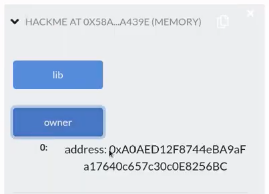
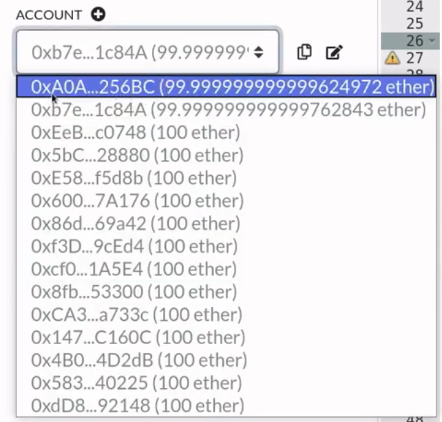
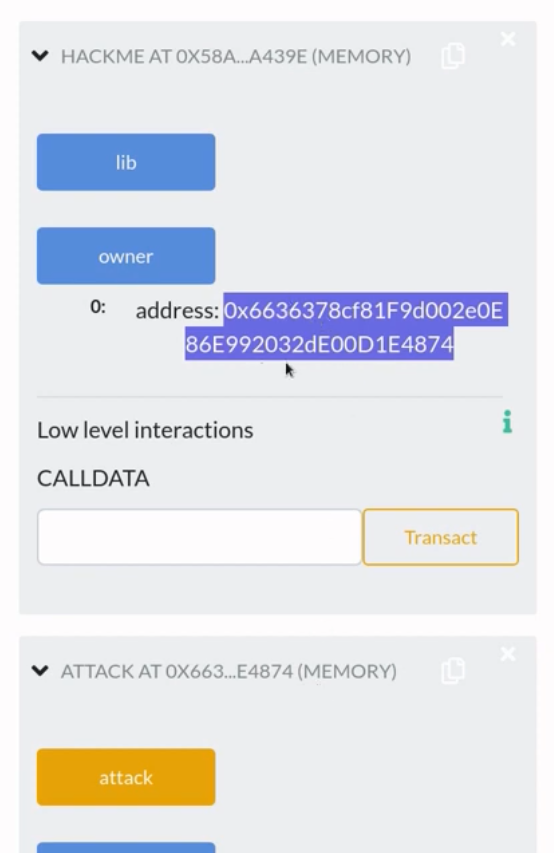

What can go wrong when you forget that delegatecall preserves context? One exploit that is possible from an unsafe delegatecall is to bypass any access control and directly update state variables. In this video I will show you how to update a state variable although the smart contract does not have any function to update it.

[#Solidity](https://www.youtube.com/hashtag/solidity) [#delegatecall](https://www.youtube.com/hashtag/delegatecall) [#hack](https://www.youtube.com/hashtag/hack) 

Code: [https://solidity-by-example.org/hacks...](https://www.youtube.com/redirect?event=video_description&redir_token=QUFFLUhqa2hHSTNRX1BrQmhreEFycWcyclB5MDdpYUhQZ3xBQ3Jtc0tubmtiZEdXY3I0X1lCeFJLdTN1MWllbzdlZF9ReE1FSE91eWdLVWMzQlIyc25MSHpSUjlVejd4ZjQyLUN3VGtUQmp6NHRhVS13Snh0WU5aSVI1SEN0ekE4Mk1aaEdxSEo0X3cxeWtLUzFzamsxYjNwcw&q=https%3A%2F%2Fsolidity-by-example.org%2Fhacks%2Fdelegatecall%2F&v=bqn-HzRclps) 

References [https://github.com/ethereumbook/ether...](https://www.youtube.com/redirect?event=video_description&redir_token=QUFFLUhqa2Z4TWNFVVFyXzRCSHdpbEdlUkxMRzZnWmZYUXxBQ3Jtc0trNGI1Z3JCQmpiX0ZVZXZacFJOMW1kbFNmVXFVQUtLSFNSTHRJbklrMFZUbEFGRkZNaklkWTRGczhSaWdMS1BLbE9aVFFubzZOMGU1RTlSOE01REV2Y2JtQjVER1FHbzdiN0E0RG5iaGl4d1hQeEVaYw&q=https%3A%2F%2Fgithub.com%2Fethereumbook%2Fethereumbook%2Fblob%2Fdevelop%2F09smart-contracts-security.asciidoc&v=bqn-HzRclps) [https://solidity-05.ethernaut.openzep...](https://www.youtube.com/redirect?event=video_description&redir_token=QUFFLUhqbGRBS19sOUVBN0ZYRTg3TzcyNU51b3ZGTGhPd3xBQ3Jtc0trd09Cd1EyTHNqazktTUFwc29fMmd2QXczYnp0dG0wZ2I4U3p0S0l6ampoMnpUbVpmZ1gxd0JQVTNSUDI5Sm81OHR4ck9LTXpBRzBNUThJX25PanZJTkNidWZsQzl0clFBcG42Y2ExR19ZT2J4QjZFOA&q=https%3A%2F%2Fsolidity-05.ethernaut.openzeppelin.com%2F&v=bqn-HzRclps)


I'm going to show you how to misuse delegate call, in other words, I'm going to show you how to shoot yourself in the foot by showing you examples of smart contracts that misuse delegate call. Hopefully, you'll recognize how to use it in a safe way and how to use it in an unsafe way. In this video I'll quickly explain what delegate call is, and then I want to show you two examples over the next two videos. This video is part 1, we'll explore a simple example of unsafe delegate call, in part 2, we'll look at a more sophisticated example.

All right, let's briefly go over what delegate call is, when contract A calls contract B using delegate call, it's basically telling contract B to run your code inside my context, so the code inside contract B will be run using the storage of contract A msg.sender, msg.value, msg.data and etc. This means that when you're using delegate call, there are two things that you should keep in mind: One delegate call preserves contacts which I explained above, and the second thing to keep in mind is that storage layout must be the same for both A and B, what I mean by this is that both contract A and contract B must declare the same state variables in the same exact order. So what can go wrong when we don't keep these two things in mind? Well, that is what we'll be exploring in this, in the next video, and in this video we'll go over example of how to misuse delegate call when we forget that it preserves context.

```solidity
// SPDX-License-Identifier: UNLICENSED
pragma solidity ^0.6.0;

contract HackMe {
    address public owner;
    Lib public lib;

    constructor(Lib _lib) public {
        owner = msg.sender;
        lib = Lib(_lib);
    }

    fallback() external payable {
        address(lib).delegatecall(msg.data);
    }
}

contract Lib {
    address public owner;

    function pwn() public {
        owner = msg.sender;
    }
}
```

Here is a contract called hackme, it has a state variable called owner which is set inside the constructor when this contract is deployed. The challenge is to change the owner, in other words, hijack contract, even though this contract doesn't have any functions to update the owner, so the owner set inside the constructor and the other function that we have here is a fallback function which doesn't look like it updates the owner state variable.

Now, if you look inside the fallback function, it uses the delegate call function. And who does it delegate the call to? Well it delegates the call to the state variable lib which is another contract that is set inside the constructor. So what does the contract Lib do, let's take a look, contract Lib declares a single state variable called owner, and it has a single function called **pwn**, when this function is called it sets the owner state variable to msg.sender.

With these two contracts, how can we change the owner state variable inside the HackMe contract? Go ahead and pause the video, if you want to figure out how to update the owner state variable inside the HackMe contract. I'll give you a hint, delegate call preserves context.

All right, let's walk through how to update the owner state variable inside the HackMe contract, in other words, we're going to be hijacking this contract by updating the owner. Now, the only way to interact with this contract is by invoking the fallback function, and we know that the fallback function is triggered when a function that does not exist inside this contract is called, which means that here we can call this fallback function by calling a function that does not exist inside the HackMe contract, when the fallback function is called, it delegates the call to the Lib contract which forwards msg.data to the Lib contract, inside msg.data we can craft the data so that it will call any function that we want inside the Lib contract.

Inside the Lib contract, the function that we want to call is **pwn** which will set the owner state variable to msg.sender, in this case, msg.sender will be us, the person who is trying to hijack the HackMe contract above. Now, why are we calling the function **pwn** inside the Lib contract update the state variable owner inside the HackMe contract? Well, this is because delegatecall runs the code inside Lib using the storage of HackMe, so here the code that will update the owner state variable (owner = msg.sender) will be executed using the storage of HackMe, and this will update the owner state variable inside HackMe contract.

```solidity
contract Attack {
    address public hackMe;

    constructor(address _hackMe) public {
        hackMe = _hackMe;
    }

    function attack() public {
        hackMe.call(abi.encodeWithSignature("pwn()"));
    }
}
```

Let's write this exploit in code, we'll create a contract called Attack and we'll store the address of the HackMe contract in a state variable called hackMe, now the actual address of the HackMe contract will be set when we deploy this contract, so we'll pass the address of the HackMe contract into the constructor and then set it to the state variable HackMe, we'll create a function called attack and this will be the function that we're going to be calling in order to update the owner state variable inside the HackMe contract.

So what is it that we have to do here? Our goal here is to call the **pwn** function inside the Lib contract, which we can do by calling the fallback function inside the HackMe contract and then passing in the function signature of pwn for msg.data. That is what we'll do inside the attack function. So here we'll say **hackMe.call** and recall that **call** is a low level function where we can pass our msg.data inside here. And the msg.data that we need to pass in here is the function signature of pwn which we can easily create by calling **abi.encodeWithSignature** and the function signature that we want to create here is **pwn**, that completes the code for the function attack.

Let's quickly go over how this attack will work. When we call the attack function, it will call the HackMe contract and the function that it will try to call inside the HackMe contract is **pwn**, but since the function **pwn** does not exist inside the HackMe contract, it will call the fallback function instead, the fallback function will delegatecall to the Lib contract and forward the msg.data, delegatecall calls the Lib contract and since we sent msg.data to match the **pwn** function, the function **pwn** inside Lib contract will be executed which will run the code to update the owner state variable, and since delegatecall runs its code using the storage of HackMe contract, we'll actually update the owner state variable inside the HackMe contract.

Now I want to demonstrate this exploit in remix, we'll say that the first account is Alice and she is going to deploy the HackMe contract. The second account is Eve, and she is the person that is going to deploy the attack contract and call the attack function. Here, I've deployed three contracts. First Alice deployed the Lib contract, next she took the address of the Lib contract and then deployed the HackMe contract and then Eve deployed attack contract with the address of HackMe contract.



First, let's check the owner of the HackMe contract and make sure that it belongs to Alice. So I'm going to click the owner and that is the owner, I'm going to scroll up and make sure that that the owner is Alice. Next Eve is going to call the attack function, so we'll switch account to Eve, scroll down and then call the attack function, and you can see here that the transaction to attack was successful. So, let's check back on the owner of HackMe contract and make sure that the owner is no longer Alice.



So I'm going to click the owner again and you can see here that the owner has changed and who is this owner? Well, it's going to be the person or the contract that called the fallback function inside the HackMe contract, and in this case it was the attack contract. So you can see here that the address of the attack contract is the new owner of the HackMe contract.

So that was an example of what can go around when you forget that delegate call preserves context, in the next video, I'm going to show you what can go around when the storage layout for a contract A and B are different.