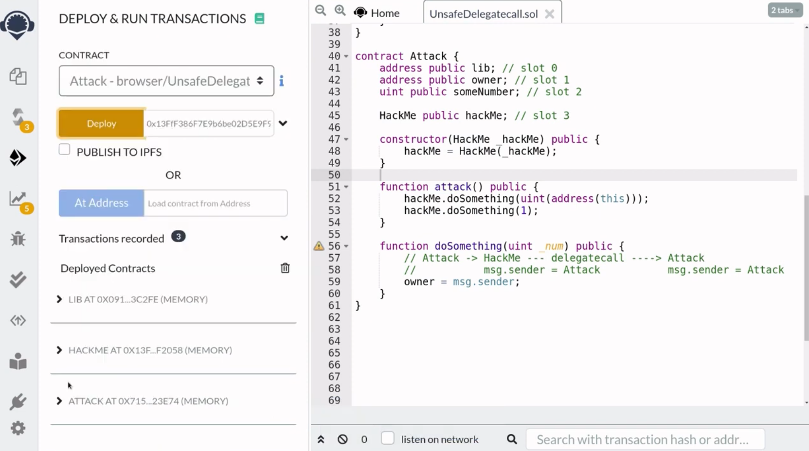
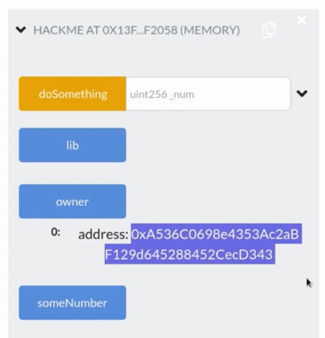
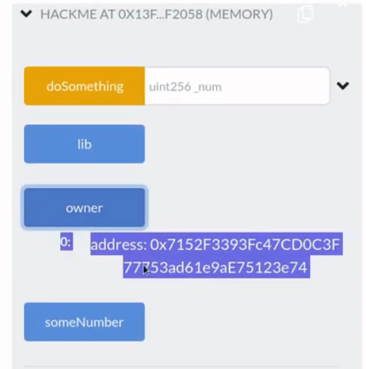

What can go wrong when delegatecall is used to update storage, but the storage layout is not the same between contracts? In this video I will show you an example of a contract vulnerable to unsafe delegatecall.

[#Solidity](https://www.youtube.com/hashtag/solidity) [#delegatecall](https://www.youtube.com/hashtag/delegatecall) [#hack](https://www.youtube.com/hashtag/hack) 

Code: [https://solidity-by-example.org/hacks...](https://www.youtube.com/redirect?event=video_description&redir_token=QUFFLUhqbnh2TVF5cFdPRlZtbWx5cEtNS05NcXpvNHF2UXxBQ3Jtc0ttVUt5dldERWhiam9NRzl2Q3lKbEhia280NnQ2OUJMRGxTX0ZZcTYxbnRNSU9wSEhJU0lseTktb2xOQkFDY3E3Q3E3Z1h0S0ExalhwVnFWNmEwU1RCUU9uSEpFSmVZRGNCNjdXVXlhQ2VsSUJIYm1kaw&q=https%3A%2F%2Fsolidity-by-example.org%2Fhacks%2Fdelegatecall%2F&v=oinniLm5gAM) 

References [https://github.com/ethereumbook/ether...](https://www.youtube.com/redirect?event=video_description&redir_token=QUFFLUhqa3FOenJ4UjBfQTBvam9OTkZMZ09rc1o4SjZ0QXxBQ3Jtc0tuU0l6VFBFdXNYenhKUHBfSngxTXdZUzlFNU9mam9ybzUxYzQtR1ZSa0FUT2dlTFpJNEtJYzZ4UlRNd0R3a3FNSVN2S2FLcnZHTjUxSjRkYVdPWU5yU1cxVlE2Zl9YSjYwcm1abUZ4WDhHeGpqaFFYMA&q=https%3A%2F%2Fgithub.com%2Fethereumbook%2Fethereumbook%2Fblob%2Fdevelop%2F09smart-contracts-security.asciidoc&v=oinniLm5gAM) [https://solidity-05.ethernaut.openzep...](https://www.youtube.com/redirect?event=video_description&redir_token=QUFFLUhqbURkRTJlRmxPS2NIaW1mQlYxbThUZzVTUjFOZ3xBQ3Jtc0tsNE9Lb2VLcXZGSHBEUldGekJZM1JROXZ2T2lULWR1dUFRU3liS0RtU0pZd3FsU3NsVEdrTHA1R1NkS0tKNGhiMThYRUxzY2t6LWQwQ2pRR09xVW44V0o2dkF1QlRQdy1wZW5kUW96c3dEUXVwXzZtaw&q=https%3A%2F%2Fsolidity-05.ethernaut.openzeppelin.com%2F&v=oinniLm5gAM)


In the previous video, I showed you an example of a unsafe delegatecall when you forget that delegatecall preserves context. In this video I want to show you another example of unsafe delegatecall when delegatecall is used to update storage, the same state variables have to be declared in the exact same order, but what happens if the state variables do not line up? For example, you forgot to declare state variable, or you declared it in the wrong order, or you declared the wrong type, in this video, I'm going to show you an example of unsafe delegatecall when contract A delegates call to contract B to update the storage, but the storage layout is different between contract A and contract B.

Let's find out how this can be a dangerous mistake, here we have two contracts: contract lib and contract hackme, let's first take a look at the contract hackme. Up at top, it has some state variables, an address type called lib, another address type called owner and a unit state variable called someNumber. The constructor sets the address for the lib and owner to msg.sender, it has a function called **doSomething** which takes a unit as input and then calls the function delegatecall on the lib address.

Inside the delegatecall it makes a request to call the **doSomething** function, so this line of code will try to call the **doSomething** function at the address of lib, later, when we deploy this contract, we'll pass in the address of the lib contract above into this constructor.

So now, let's take a look at the lib contract. What does it do? The lib contract has a single state variable called someNumber, and then it has a function called **doSomething** that updates the someNumber state variable, now notice that the hackme contract declares three state variables, but the lib contract only declares a single state variable. So I've told you that if you want to update the state variables inside the hackme contract, using delegatecall, then the contract that is receiving the delegate call must also declare the same state variables in the exact same order, and in this case you can see that the state variables in the lib contract and the hackme contract do not line up, so what can go wrong? Well, your challenge here is to update the owner state variable inside the hackme contract. The hint here is that this contract is using delegatecall to update a state variable, it's trying to update the third state variable inside the hackme contract, but the actual state variable that is being updated here is the first state variable which turns out to be the address of the lib contract, go ahead and pause the video here and give it a try, all right let's think through how we can update the owner state variable.

Well, when we call this function doSomething it will call the function doSomething inside the lib contract by using delegatecall and the function doSomething will update the state variable someNumber, now inside this contract someNumber is the first state variable, so when the function doSomething is called using delegatecall, it will update the first state variable, in this case the first state variable inside the contract that is making the delegatecall is an address to the lib. So by calling this function this will update the first state variable, which is the address of the lib, this means that we can update the address of the lib by calling the function doSomething, then we can pass in the address (实际上doSomething函数的参数是_num) to the contract that we want to point the lib state variable to.

Now notice that I said we're going to be passing in an address here, but this function takes in a uint for the input. So here we have to be a little clever and cast the address to uint. Once the address to the lib contract is updated to a contract that we specify, we can call the **doSomething** function again. But since the lib now points to the address that we set, it will delegatecall to the contract that we specify. So when this delegatecall calls the function doSomething inside our contract (这里指HackMe contract), we will be able to update owner state variable, and this is because delegatecall executes the code at the address of Lib using the storage of hackme contract, so we'll be able to update these state variables. That's the basic idea of how we're going to update the owner state variable.

```solidity
contract Attack {
    address public lib; // slot 0
    address public owner; // slot 1
    uint public someNumber; // slot 2

    HackMe public hackMe; // slot 3

    constructor(HackMe _hackMe) public {
        hackMe = _hackMe;
    }

    function attack() public {
        hackMe.doSomething(uint(address(this)));
        hackMe.doSomething(1);
    }
}
```

Let's now put this in code, we'll name this contract attack. The first thing that we'll do is copy the state variables from the hackme contract, so from the hackme contract, I'm going to copy all the state variables and then paste it inside the attack contract. The reason why we're doing this here is so that when we write the code to update the state variable targeted at the hackme contract, this will make sure that we are updating the correct state variable that we want. Next. We'll declare the state variable for the hackme contract and then we'll set the hackme state variable to the hackme contract above when we deploy this contract.

Now earlier, I said that the contract calling delegatecall and the contract being called the state variables have to be the same. So you might have noticed that the state variables in the hackme and the attack contract are now different, here inside the attack contract, we have an extra state variable called hackme, but this won't be a problem here, since all of the state variable that we want access to inside the hackme contract are declared in the same exact order, so this state variable here hackMe will be stored in the storage location, where the original contract hackme above does not have access to.

Just to clarify what I mean here, the first three state variables are stored in slot 0 to slot 2. This is true in both the hackme contract and the attack contract, but the last state variable hacked me is stored in slot 3. Now, if you look inside the hackme contract, you can see that there is no state variable stored in slot 3, so declaring a state variable here will not cause any problems in the original contract. So that was an explanation of why we can have state variables that look a little bit different, as long as the state variables that we are concerned with are the same.

All right, moving on, let's now write the function that will actually hack the hackme contract. The first thing that we'll do is call the **doSomething** function inside the hackme contract, we'll want to pass the address of this contract, but since the function takes in a uint as input here, we'll cast the address as uint, on the next line, we'll call the same function again and then pass in some number, it doesn't really matter here, so I'm just going to pass in 1. When this line of code is executed, it will delegatecall to call the function **doSomething** inside this contract (指 Attack contract，因为此时HackMe contract里的lib已被替换为Attack contract的地址了).

```solidity
```

So let's write the doSomething function inside this contract. The **doSomething** function is the function that will be called when the hackney contract delegates call, first we'll make sure that the **doSomething** function here has the same function signature as the doSomething function above, so the name is the same, and the input is the same and the function visibility is the same.

Now when this function is called, we want to say something like the owner state variable is equal to this contract, but remember that this function will be called using delegatecall, so the context will be preserved to the caller. Okay, so let's figure out which contract is going to be calling this function, so that we'll be able to put the correct value here and update the owner state variable to this contract. Our starting point is line 53 **hacMe.doSomething** which means that this contract, the attack contract, is going to call the hackme contract, the hackme contract will delegatecall to the attack contract, and this function (指Attack中的doSomething) here will be called, this means that inside the hackme contract, msg.sender will be equal to attack and when the hackme contract calls the attack contract using delegatecall, it's going to preserve the context, so msg.sender will still be equal to attack, this means that when this function is called, the address of this contract is equal to msg.sender. So here we can update the owner to this contract by saying **owner = msg.sender**, that completes the code that will update the owner state variable inside the hackme contract.

Let's go over how this exploit works. First, Eve calls the attack function, this will call the doSomething function inside the hackme contract above and we'll pass in the address of this contract cast it into uint. So this line of code will call the function above over. And here _num will be the address of the attack contract, cast it into unit. The function will use delegatecall to call the doSomething function inside the lib contract, which means that this function here will be executed, and it's gonna update the first state variable.

Now, since here we pass the address of the attack contract. This line of code will update the first state variable to the address of the attack contract, back inside the hackme contract, this means that the first state variable which is equal to lib, so this address will be updated to point to the attack contract that completes the execution of line 52.

In line 53, we call the same function again and this time it doesn't really matter what number we pass in, now again, this line of code will call the doSomething function inside the hackme contract, so this will call the doSomething function again inside the heckme contract, and again it uses the delegatecall to call the doSomething function, but now the state variable lib no longer points to the contract above (指Lib contract) since the first call **doSomething** updated the lib state variable here and since it points to the attack contract below, this line of code will call the **doSomething** function inside the attack contract and it will execute this code here which will update the owner state variable.

Now, since all of this runs inside the context of the hackme contract, the owner that's going to be updated is not the state variable here, but the state variable inside the hackme contract and that's how you update this owner state variable by making two delegatecalls, the first one will update the address of the lib contract to point to this contract and the second one will call this function, that's going to update the owner state variable.



Let's now see this in action using remix, we'll say that the first account is Alice and she's going to deploy the hackme and the lib contract. Account 2 is Eve and she's going to deploy the attack contract. So first Alice is going to deploy the lib contract and then copy the address of Lib and then she's going to deploy the hackme contract. Next, switching over to Eve, she's gonna deploy the attack contract with the address of the hackme contract.



All right, so we're now ready to demonstrate the exploit, but first, let's check the owner of the hackme contract that is the address of Alice. Let's now call the attack function. You can see here that the attack was successful, so let's check back on the owner, so I'm going to click owner again and you can see here that the owner has changed.

You can also see here that this address is equal to the address of the attack contract here, so the attack to take over the owner state variable was successful and that completes the demonstration of unsafe delegate call.

So when you're using delegate call you need to keep in mind that delegatecall hands over the control of the storage and the ether of a contract to another contract and if you're updating state variables using delegatecall then make sure that the storage layouts are the same. This video was about what can go wrong using delegatecall when the storage layout are not the same.