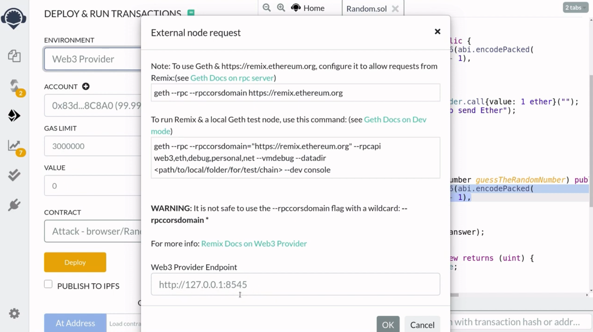

There is no easy way to generate a random number inside Solidity. You might think of using block hash and timestamp for the sources of randomness. But hold on! In this video I will explain how they can easily be computed from other smart contracts.

[#Solidity](https://www.youtube.com/hashtag/solidity) [#randomness](https://www.youtube.com/hashtag/randomness) [#hack](https://www.youtube.com/hashtag/hack) [#blockhash](https://www.youtube.com/hashtag/blockhash) [#blocktimestamp](https://www.youtube.com/hashtag/blocktimestamp) 

Code: [https://solidity-by-example.org/hacks...](https://www.youtube.com/redirect?event=video_description&redir_token=QUFFLUhqa2swN0g0cTFRQXZtMmxQblM3aXoxbmZqLUlad3xBQ3Jtc0tuOGJZMS1ITEgySHF1YWZGWWpfc3ZnVWZyUEYwRFNwWDF1NG1JN1VkQUlyOGQxY29qc1NiRXV4UUZBSTdmb0RLMm13OEh4RGEtUjl3MnU5MG5VeVlXTl9NbVhrQTBISG15d3hSdkRmb05nbzVlMTdRNA&q=https%3A%2F%2Fsolidity-by-example.org%2Fhacks%2Frandomness%2F&v=8FF3IBTMeK0) 

References [https://github.com/ethereumbook/ether...](https://www.youtube.com/redirect?event=video_description&redir_token=QUFFLUhqa2lUdWhMOU5CazY3dkxHU3RTZUdrNFdTckF0QXxBQ3Jtc0tseU0xaldWUjExcnRpQ0pjM3JWR1pGSEZNNy16M2VsQWkyV2l4RUs1M0p5S2lKNFhjanJjejI2Ui1ERW9qVVVETFVETFZ0QWgyREhOYUVvOWNTN2w2UFdFeWFodkE5RmJreDFyVk1qcXZVQzNJSFFwMA&q=https%3A%2F%2Fgithub.com%2Fethereumbook%2Fethereumbook%2Fblob%2Fdevelop%2F09smart-contracts-security.asciidoc&v=8FF3IBTMeK0) [https://solidity-05.ethernaut.openzep...](https://www.youtube.com/redirect?event=video_description&redir_token=QUFFLUhqbXcxdVhlUUdWcmhNc1U2WlBjbWhBa0U3STk2UXxBQ3Jtc0trcHJ1bm9WbVE1Y2VaaTNZSkhfV3F3SDlwOVIxS2FBTXVNNmU4UGVGTEt2clhUNk9iX3pxUDdqc2hXSHdQdlhFdkJyTEU4dV96emQ5ZUc1T0hsZ3l4UUtBdTgzVkN6SU96NnVHRXNobGJDTl84bXd4Zw&q=https%3A%2F%2Fsolidity-05.ethernaut.openzeppelin.com%2F&v=8FF3IBTMeK0)


Let's say that you're building a program that needs an element of randomness, for example, you're programming a lottery and you need a way to pick a winner randomly, using programming language like javascript and python, it is straightforward task to generate a random number, however, generating a secure random number in solidity is extremely difficult.

Now you might think that blockhash and the timestamp at which the block was created is a good source of randomness. So in this video I'm going to explain why blockhash and block.timestamp are not good sources to generate random number. First, we'll walk through a contract that uses block timestamp and blockhash to generate a random number and then I'll explain how we can exploit this contract, after that I'll show you a demonstration in remix.

```solidity
// SPDX-License-Identifier: UNLICENSED
pragma solidity ^0.6.0;

contract GuessTheRandomNumber {
    constructor() public payable {}

    function guess(uint _guess) public {
        uint answer = uint(
            keccak256(
                abi.encodePacked(blockhash(block.number - 1), block.timestamp)
            )
        );

        if (_guess == answer) {
            (bool sent, ) = msg.sender.call{value: 1 ether}("");
            require(sent, "Failed to send Ether");
        }
    }
}
```

**GuessTheRandomNumber** is a contract where if you can guess the correct random number, then you will be rewarded with some ether stored in this contract. How does it generate the random number? Well, let's take a look at the function **guess**, here is the code that generates the random number, it uses the blockhash of the previous block and this can be obtained by calling **blockhash** and then specifying the block number that you want to get the hash for, here we're saying that we want the block hash for the previous block by saying block.number which gives the current block and then minus 1 to get the previous block number.

We're also using block.timestamp for the source of randomness, block.timestamp will give the timestamp at which the current block was created. We use these two inputs as our source of randomness and then hash it, and then convert the hash into uint. So that is how the random number is generated, and if your **_guess** is equal to the random number then you will be rewarded with 1 ether, so that is how this function works.

At first glance, these two variables look like a pretty good source of randomness, block.timestamp is the timestamp at which this transaction will be included in a block. So when we call this function guess a transaction will be sent to the ethereum blockchain to run the code inside guess, so the code inside here will be executed and after the code is executed, it will be included in a block.

Now, this timestamp for the block will be in the future, so we won't know what this value is until this transaction is included in a block. So this makes it look like block.timestamp is a good source of randomness, blockhash is computed by using a hash function, and we know that the outputs of hash function behave like random numbers. This is because the output of a hash function is hard to predict from the input. Therefore, using blockhash as a source of randomness seems like a good idea.

Now the reason why we're using the blockhash of the previous block here is because the blockhash of the current block is not available when we call this function. The reason why the current block hash is not available when we call this function is because the blockhash is calculated by the transactions in that block. When we send the transaction to execute this code, this transaction will be one of the inputs to calculate the current block hash. So the current block hash will be unavailable when this code is executing and they will be available only after this transaction is included in a block. So that is why here we're using the previous block hash instead of the current block hash.

These two variables seem like they're difficult to know in advance, but let's now examine how these two variables are actually easy to know in advance. The key insight here is that these two variables are easily available to smart contracts. So what this means is that to us, humans, these two variables are hard to predict, but we can access them easily by writing another smart contract. So that is what we'll do to correctly guess the random number, calling this function from another smart contract which has access to these two variables.

```solidity
contract Attack {
    function attack(GuessTheRandomNumber guessTheRandomNumber) public {
        uint answer = uint(
            keccak256(
                abi.encodePacked(blockhash(block.number - 1), block.timestamp)
            )
        );

        guessTheRandomNumber.guess(answer);
    }

    function getBalance() public view returns (uint) {
        return address(this).balance;
    }
}
```

The function named attack which is going to call the guess function above, is going to take in a single input. The single input that we're going to pass to this function is the address of the **guessTheRandomNumber** contract above, first we'll compute the correct random number somehow, and then submit our answer to the **guessTheRandomNumber** contract. So the big question is: how do we compute the correct answer? Well, we can simply get the correct answer by copying this code (指18-22行的代码) and then pasting it here.

So how does this hack work? Let's walk through step by step, notice that, when Eve calls this function, the code inside here and the code inside here will be executed in the same block, what this means is that block that timestamp and blockhash over here and the block.timestamp and block hash over here are exactly the same (这里为什么会一样，可以参考末尾的QA) . So when Eve calls this function, the answer that is computed over here and the answer that is computed over here will be exactly the same, and Eve will be able to win the reward every time she plays this game.

Before we deploy this contract, there's one other function that we need to declare inside here, and that is the fallback function so that when this contract sends 1 ether, we need to fall back here in order to receive the ether and, lastly, we'll add a helper function to check the balance of this contract after we win the game, before I show you a demo in remix, we'll need to run a local blockchain using ganache and this is because block hash is not available inside remix, when you try to run these contracts inside remix, you'll get an error like this, so that is why you'll need to run a local blockchain using ganache.

So first of all install ganache-cli by typing **npm i -g ganache-cli**, once that is done, run the local blockchain by typing **ganache-cli**.



Now we have a local blockchain running on localhost port 8545, back inside remix click on the deployment tab over here, and then we'll switch over the blockchain to web3 provider, and notice here that this matches the url where the local blockchain is running, so we'll hit ok, and we're now ready to deploy the contract and play around with them.

First Alice is going to deploy the **GuestTheRandomNumber** contract and for the reward she's going to deploy it with one ether. Next Eve is going to deploy the **Attack** contract and now we're ready to see the contracts in action. Now, normally, if you play this game, you have a 1 in 2 to 256 chance of winning, but using the attack contract, you'll be able to guess the correct number 100% of the time, to call the attack function we'll copy the address of the game contract, paste it in here and then call attack, and you can see here that the attack was successful.

So, let's check the balance of the attack contract and we have 1 ether.

That was a demonstration of what at first glance seems like a good source of randomness can easily be computed by using another smart contract.

So the lesson here is that the source of randomness for a smart contract is difficult to get right


Q: Dont they have different block number? If you are deploying it at different instances of time, they must be included in different blocks of Local Blockchain. How is this possible?

A: They are deployed at different times. But the block at which the two functions (attack and guess) are called are on the same block. blockhash, block.number and block.timestamp are values when those functions are called, not  when the contract was deployed.

个人理解，attack和guess任何时候被调用，其中的参数都是最新区块的前一个区块，并不是当时被创建的区块