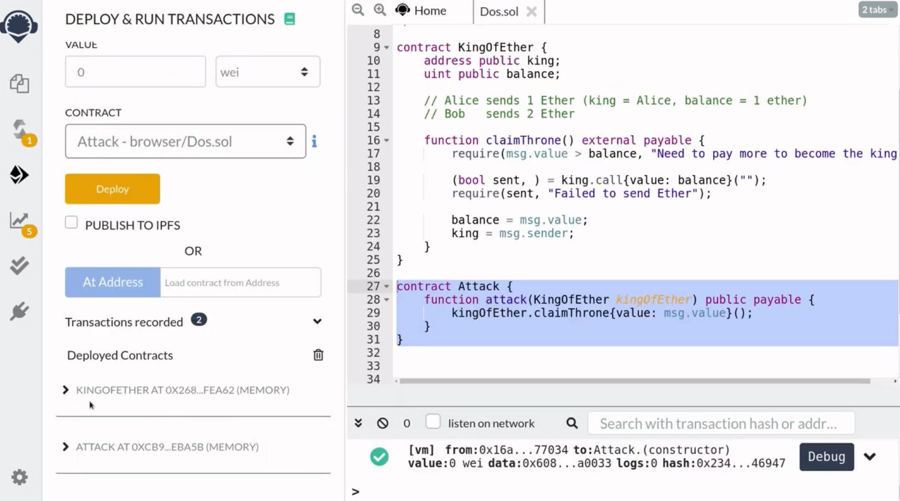

Many Solidity smart contracts allows the caller to withdraw Ether instead of having the smart contract send Ether to the caller. This is called Push vs Pull in smart contract designs. By designing your smart contract to use the pull pattern, you avoid a denial of service attack that is possible on contracts that push Ether. In this video I will explain how a contract that sends Ether can be vulnerable to denial of service.

[#Solidity](https://www.youtube.com/hashtag/solidity) [#denialOfService](https://www.youtube.com/hashtag/denialofservice) [#DOS](https://www.youtube.com/hashtag/dos) [#hack](https://www.youtube.com/hashtag/hack) [#PushVsPull](https://www.youtube.com/hashtag/pushvspull) 

Code: [https://solidity-by-example.org/hacks...](https://www.youtube.com/redirect?event=video_description&redir_token=QUFFLUhqbFdqZ3pCVjdvSnQ1WnpnZXc0TEd5WmxqbHF0UXxBQ3Jtc0tuclFpX0hjZUhGNkFhbWt0MERMc2dqempMTXhELTF6SW5DM0JUUHRsZERGV2ptLVdmVGhSNVhRWjRuU25SYXprRFE1cG5sQzNmNkdBTW5TcktSaHFwZ0xlMDhWNWNybEVxUjE1TlNnUFJTYmNJd3Q0RQ&q=https%3A%2F%2Fsolidity-by-example.org%2Fhacks%2Fdenial-of-service%2F&v=qtLI7K1L1bg) 

References [https://github.com/ethereumbook/ether...](https://www.youtube.com/redirect?event=video_description&redir_token=QUFFLUhqbVViY3hvTTlGbnJrRTBDU3ZDQjlBQlBTWHpjQXxBQ3Jtc0tsaHJSUDVOTkVDSm9NcEFicF9nZWdVdDE2TkxZWFNiWEplWmhPeTd0by1ER0lIYWJkWHRVTVZScnQ5WHVxTmxIMVoyVi0yUUZVcE85azVGcnVic3BxRWpINlk3cFU1NGxaazhNOFI5dHNBb1Bwd1lZbw&q=https%3A%2F%2Fgithub.com%2Fethereumbook%2Fethereumbook%2Fblob%2Fdevelop%2F09smart-contracts-security.asciidoc&v=qtLI7K1L1bg) [https://solidity-05.ethernaut.openzep...](https://www.youtube.com/redirect?event=video_description&redir_token=QUFFLUhqa2FyZV9SRUt4dXVKc0pjcTFnb2xYaGVaTkg4UXxBQ3Jtc0tuVVFPRWlGZkJNY0pwNHZtVDlrOWFISGJYYlJrS1BMOHhQZ2lvVkZJMVJ5SnBNLXFsVUV6Xy1YMGV5M1VuMnNfV1BqZHlJM1pUMmJya1VvRGQyMjBncE5BRllfSVl1b0tFNHlVbHZEZ2JSSVRiU182WQ&q=https%3A%2F%2Fsolidity-05.ethernaut.openzeppelin.com%2F&v=qtLI7K1L1bg)


Hey everyone, how's it going, in this video, we'll take a look at a contract that is vulnerable to Denial of Service. In particular, we'll look at an example of denial of service by a contract that rejects to accept ether and then we'll write some code and then a demo. Lastly, we'll see how to turn a contract that is vulnerable to this denial of service into a contract that is not, and in the process, we'll touch on a design principle called push versus pull.

```solidity
// SPDX-License-Identifier: UNLICENSED
pragma solidity ^0.6.0;

contract A {
    function foo() public {
        (bool sent, ) = msg.sender.call{value: 1 ether}("");
        require(sent, "Failed to send Ether");
        // do something else
    }
}

contract B {
    function callFoo(A a) public {
        a.foo();
    }
}
```

All right, let's jump in. First of all, let's go over what I mean by denial of service by rejecting to accept ether. Let's say that there's some contract and when you call this function foo inside it. First of all, it will send 1 ether back to you and it will make sure that that 1 ether was sent to you. So if it fails to send 1 ether back to you, then this whole function fails, after it sends 1 ether, it does something else.

Below contract A, let's say that we have another contract called contract B and what it does is when you call this function **callFoo**, it will call the **foo** function inside contract A, now contract A would try to send 1 ether back to contract B, but notice that since contract B does not have any fallback function, it won't be able to accept any ether sent to this contract. So what this means here is that this function over here inside **foo** will fail and the code after it will not be executed. So this is a rough idea of denial service by refusing to accept either.

In this case, contract B is performing a denial service on contract A by refusing to accept the ether that is sent from contract A and so that the rest of the code inside contract A cannot execute, so how can this cause a problem? Well, let's take a look at another contract and this attack will become more clear to you.

```solidity
// SPDX-License-Identifier: UNLICENSED
pragma solidity ^0.6.0;

contract KingOfEther {
    address public king;
    uint public balance;

    // Alice sends 1 ether (King = Alice, balance = 1 ether)
    // Bob   sends 2 ether

    function claimThrone() external payable {
        require(msg.value > balance, "Need to pay more to become the king");

        (bool sent, ) = king.call{value: balance}("");
        require(sent, "Failed to send Ether");

        balance = msg.value;
        king = msg.sender;
    }
}
```

KingOfEther is a contract where you can become the king of this contract by sending more ether to this contract than the previous amount. And how do you become the king? Well, you can do that by calling this function **claimThrown**. So, let's take a look at what this function does, first it checks that the amount of ether that was sent is greater than the previous amount, and this is done by checking msg.value is greater than balance where balance will store the amount of ether that was sent by the current king. If the amount of ether that was sent to this contract is greater than the previous amount then we move on to the next line where the current king gets a refund of amount of ether that he sent, it checks that the ether was sent to the current king and finally it updates the balance to the amount of ether that was sent and the king to the caller of this function.

For example, let's say that Alice sends 1 ether become the king, so the king state variable will be equal to Alice and the balance will be equal to 1 ether. Now Bob wants to become the new king, so he'll have to send more than 1 ether, in this case, he'll send 2 ethers, so on line 17 msg.value will be equal to 2 ether, balance will equal to 1 ether, this is the amount that was sent by Alice and we can see that 2 ether is greater than 1 ether, so this check will pass, on the next line, the current king is equal to Alice, so it will send 1 ether back to Alice, check that the transfer of 1 ether to Alice was successful, and we update the balance to msg.value, in this case, it will be 2 ethers and finally we update the new king to Bob.

So if someone else wants to become the king after Bob then that person will have to send more than 2 ethers. This is how this **KingOfEther** contract works. Let's now examine how we can perform a denial of service on these two lines (20,21) so that the code after it will not execute, what this means is that if we can perform a denial service here then this code here (20,21两行之后的代码) can never execute. So the new king can never be set, we can perform a denial service to this contract by simply having a contract that does not have any fallback function and then have that function call this function **claimThrow**.

```solidity
contract Attack {
    function attack(KingOfEther kingOfEther) public payable {
        kingOfEther.claimThrone{value: msg.value}();
    }
}
```

Let's put this idea into code, our starting point is a function called attack and it's going to take in a single input, The input will be the address of the **KingOfEther** contract above. In order to claim the throne you'll need to send ether to the function **claimThrone**, so here we'll declare this function as payable, and when we call this function, we'll send some ether, this contract will become the new king by calling **claimThrown** and then sending some ether, when we call this function we'll have to make sure that the amount of ether that is sent to this function is greater than the amount of ether that is stored over here inside balance. So if the balance is equal to 1 ether, then we'll have to sand more than 1 ether. That is all the code that we have to write here in order to perform a denial service on the **KingOfEther** contract.



Let's now walk through how this attack can make **KingOfEther** contract above unusable. Here, I've deployed 2 contracts: KingOfEther and Attack contract. First Alice sends 1 ether to become the king by calling **claimThrone**. 


We can check that Alice is the king and in order to become the new king the sender will have to send more than one ether, so let's say that Eve is going to perform a denial service on the **KingOfEther** contract. So she'll have to send more than 1 ether, so we'll send 2 ether and then she's gonna call the attack function, so we'll copy the address of **KingOfEther**, paste it here and then call the attack function. We can check back at the new king and you can see here that this address is equal to the address of the Eve.


Now, let's say that Bob wants to become the new king of **KingOfEther** contract, so he'll have to send more than 2 ethers, but let's now see how Bob cannot become the new king even though he sends more than two ethers, so Bob is gonna send 3 ether and then call the function **claimThrown** and you can see here that the transaction failed, so the attack to make this contract (指KingOfEther contract) unusable was successful.

How does it work? Let's walk through how this contract is performing a denial service on this contract, we know that the king is equal to the attack contract and the amount of ether that needs to be sent to become the new king is greater than two ethers. So when Bob sends three ethers, it passes this check and then it sends 2 ethers back to the current king which is the attack contract. But since the attack contract does not have any fallback function, it cannot receive ether. So what this means here is that this transfer will fail and this whole transaction will fail. So Bob cannot become the new king even though he sent more ether than the previous king. That is how this contract attack performs a denial service on the contract **KingOfEther**.

Let's now examine how this contract **KingOfEther** can avoid denial service. The simple strategy here is, instead of sending ether we'll let the caller withdraw ether from this contract, and this is called push versus pull in smart contract designs. When a contract sends a ether, it's pushing the ether to another address, on the other hand, when we allow a caller to withdraw from the contract, then we are asking the caller to pull ether from the contract, so that is push versus pull, and here we will remove the denial of service by instead of pushing ether, requiring the caller to pull ether from this contract.

```solidity
	mapping(address => uint) public balances;

  function claimThrone() external payable {
    require(msg.value > balance, "Need to pay more to become the king");

    // old
    // (bool sent, ) = king.call{value: balance}("");
    // require(sent, "Failed to send Ether");
    // new
    balances[king] += balance;

    balance = msg.value;
    king = msg.sender;
  }
  
  function withdraw() public {
    require(msg.sender != king, "Current king kannot withdraw");

    uint amount = balances[msg.sender];
    balances[msg.sender] = 0;

    (bool sent, ) = msg.sender.call{value: amount}("");
    require(sent, "Failed to send Ether");
	}
```

Since we're going to require the caller to withdraw from this contract, we'll need to keep track of how much ether that a caller has sent, so we'll store this amount for each caller in a mapping from address to uint and then name it balances. Next, we'll remove the code that sends the ether and then replace it with this code. So here, instead of sending the previous balance to the king, we're saying that the king will be able to withdraw the amount stored in this balance plus the amount that we were going to send. Once you are no longer the king, you can call the function **withdraw** to withdraw ether, so we'll require that msg.sender is not equal to the current king.

Store the current amount repeater that msg.sender can withdraw in a variable called amount and then we'll set the amount that msg.sender can withdraw from this contract to zero and then send the ether to msg.sender, ***the reason why we're setting the balance equal to zero before we send the ether is to protect against re-entrancy.***

Although this line of code is sending ether we don't have to worry about denial service here since the only person that will be affected by performing a denial service here is msg.sender, in other words by performing a denial service here, this will have no effect on the rest of the code above here (指claimThrone方法中的逻辑) , so while you can perform a denial service to yourself, everyone else can keep on playing the game, that is how you protect against this type of denial service by using a smart contract design of pulling instead of pushing.

Push versus Pull is a really important smart contract design that you see often in solidity, I hope the example below help you understand push versus pull.