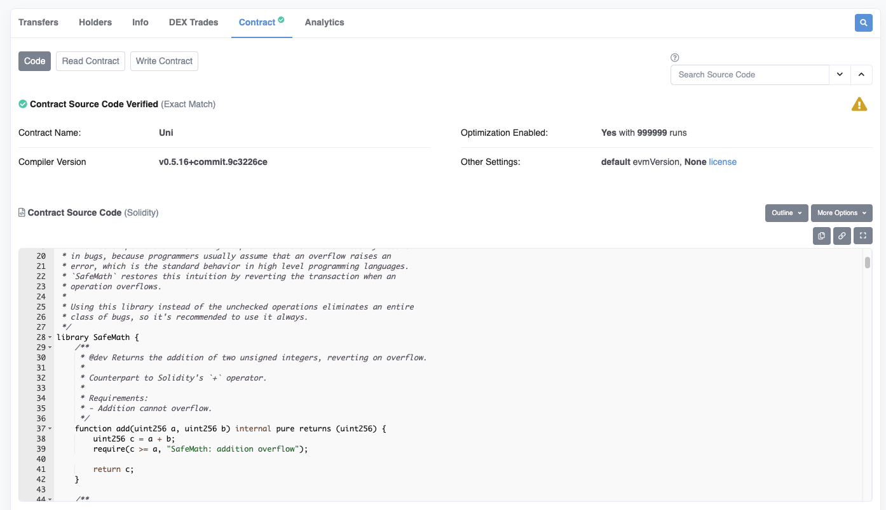

Contracts deployed on the blockchain are bytecode, difficult for us to read. On etherscan.io, you can verify that a source code compiles to the bytecode that was deploy. So you can review the code. However there is a way to have a code verified on etherscan.io and hide a malicious code. In this video I will show you how

[#Solidity](https://www.youtube.com/hashtag/solidity) [#hidingMaliciousCode](https://www.youtube.com/hashtag/hidingmaliciouscode) [#hack](https://www.youtube.com/hashtag/hack) [#txorigin](https://www.youtube.com/hashtag/txorigin) 

Code: [https://solidity-by-example.org/hacks...](https://www.youtube.com/redirect?event=video_description&redir_token=QUFFLUhqa1c3dU1aYXFlUDFlalpndEdRUmV6TmtWRlZnd3xBQ3Jtc0tsR0MzN19ETFFtTHpINmtwVUZyclpMeDdoNVlmVXd5dUdGcUlmQXozTHkzbndoUVdTY2NMVlFDVXFEWExTRDg2Y3RzSVI1N0tweFJQLWJDZ2l5bE1pZmV1ZzNWTHpQM1hMenZiZkd0VnBWbkotR2RnUQ&q=https%3A%2F%2Fsolidity-by-example.org%2Fhacks%2Fhiding-malicious-code-with-external-contract%2F&v=qDYlauM00lY) 

References [https://github.com/ethereumbook/ether...](https://www.youtube.com/redirect?event=video_description&redir_token=QUFFLUhqbDZyLXFrdldjSWEtVlRfSC1JQldIUGhlanZYd3xBQ3Jtc0tsOWdzNEF3clEweVFLalZHRS11R2o1ZmFMbUMzeTBMREhNS2E3TjE2blZSOXZRaU5sWllxVXpIOXRvbkVTY3RVOGYxSklsY0VBejZtR2VzclZBTklFU2UwSXVTWXlJV0JiSEZ6OGlqOC0zY3hMRUU5TQ&q=https%3A%2F%2Fgithub.com%2Fethereumbook%2Fethereumbook%2Fblob%2Fdevelop%2F09smart-contracts-security.asciidoc&v=qDYlauM00lY) [https://solidity-05.ethernaut.openzep...](https://www.youtube.com/redirect?event=video_description&redir_token=QUFFLUhqa3ZvUmkzNGRObERPWWd4Z3ByNC01UXZTcEg2d3xBQ3Jtc0ttcTEyZlNxS0p5N0VSUWdaWm1HUWNZWGVMeDRYc2xRMzBQM0tlc09hYVFOaGhxOURkbXhGR0EwZzQwbEVUa1RveVFFUFNOQWlzaTc4aFgtRlVpSy1DUHlkYlp2M21IeVlVTjktM1NETGFKODhiOXdBZw&q=https%3A%2F%2Fsolidity-05.ethernaut.openzeppelin.com%2F&v=qDYlauM00lY)


https://cn.etherscan.com/token/0x1f9840a85d5af5bf1d1762f925bdaddc4201f984#code



You can verify the code for a contract that's been deployed on the blockchain using a block explorer, here I have a block explorer called Etherscan open and what you're looking at here is a contract by Uniswap, if I scroll down, you can see all of the code that was deployed and you can see here that the contract has been verified, so what this means is that the code at this address is the code what you're seeing here, and this will allow you to check that the code over here is not doing anything malicious.

```solidity
// SPDX-License-Identifier: UNLICENSED
pragma solidity ^0.6.0;

contract Bar {
    event Log(string message);

    function log() public {
        emit Log("Bar was called");
    }
}

contract Foo {
    Bar bar;

    constructor(address _bar) public {
        bar = Bar(_bar);
    }

    function callBar() public {
        bar.log();
    }
}
```

However, there's a way to hide code. So that the code that you see on Etherscan is not the actual code that is executing, so in this video, I'm going to show you how a smart contract can hide malicious code. Here we have a contract called bar and anyone can call this function called log which will emit an event called log with the message "Bar was called". Next, we have a contract called foo and when this contract is deployed, it takes in the address of bar, we initialize the bar contract above, with the address of bar and then save it to a state variable called bar, so that when anyone calls the function **callBar** it would call the log function inside the bar contract. So when someone calls this function **callBar**, it should emit an event called "Bar was called".

Now, let's say that you deploy this contract Foo and then publishes the code on Etherscan. So the user will see that these two codes are verified and they would think that when they call the function **callBar**, it would call this function log inside contract Bar, and there's nothing harmful about calling the function log.

Now I'm going to show you how to hide code so that when a user calls this function, the code that will be executed is not this function over here. So let's say that Eve publishes these two code on Etherscan. How is she gonna hide the malicious code that will be executed when a user calls the function **callBar**?. So here's what Eve will do.

```solidity
// In a separate file
contract Mal {
    event Log(string message);

    function log() public {
        emit Log("Bar was called");
    }
}
```

In a separate file, she'll create a contract with the malicious code, we'll say that the name of the contract is Mal, so imagine that this contract Mal will be in a separate file from the contracts above Foo and Bar, and inside the contract Mal she'll put her malicious code, when an innocent user calls the function callBar, the function will call the log function inside bar, but instead of calling the log function inside the bar contract, we want this to call a function inside the Mal contract below, so inside the Mal contract we'll copy the function signature of **log** from contract Bar paste it in here and our malicious code will go inside here, now for simplicity, we'll just log event called "Mal was called", but if this contract actually had malicious intent, then we'll be writing our malicious code here, and that completes the code for the malicious contract that we're going to be using for this example.

Now, how are we going to actually execute this code (code inside Mal) instead of this code inside the bar contract? So this is what Eve will do. She'll first deploy the Mal contract and then she'll deploy the Foo contract, for the address of the Bar, instead of giving the address of the Bar contract above, over here Eve will put in the address of the Mal contract, so that when the user calls the **callbar** function, it would call this function instead of this function.

This is surprising since if you look at these two code, then it looks like calling this function, we'll call this function, but by deploying this contract with the address of the Mal contract, the code that's going to be actually executing here is this code here. This is possible since solidity calls other contracts using the call method. So what this code is doing here does not promise that the function log inside contract bar will be called. What solidity does instead is try to call the function log at the address bar. So, as you can see, there's no guarantee that this code will be executed.

All right. So that's the exploit. Let's now see a demo in remix, so Eve is going to deploy first of all the Mal contract and then she's going to deploy the Foo contract with the address of Mal, and then let's imagine that Eve publishes this code on etherscan. So now Alice sees these code on etherscan and she can review that there is no malicious code over here, so she's going to decide to call the function **callBar**, so we're going to switch account to Alice and then she's going to call the function **callBar**.

Let's now check the transaction logs and you can see here that it logged "Mal was called". In other words, this code was executed instead of this code over here, so that was a demonstration of how to hide malicious code.

Let's now talk about how you can protect yourself from a contract that is hiding malicious code and the one signal that should raise a red flag for you is that a contract is using unverified address.

For example, in the case of contract Foo, this contract is using an unverified address of Bar. So, in order for you to fully trust this contract, you'll have to look at the code that is deployed at the address of Bar and make sure that it matches the code of contract Bar and if it doesn't then that might mean that there is something fishy going on.

The key takeaway here is that you should never trust an external address and if a contract is being initialized by your external address, then make sure to verify the code at that address.