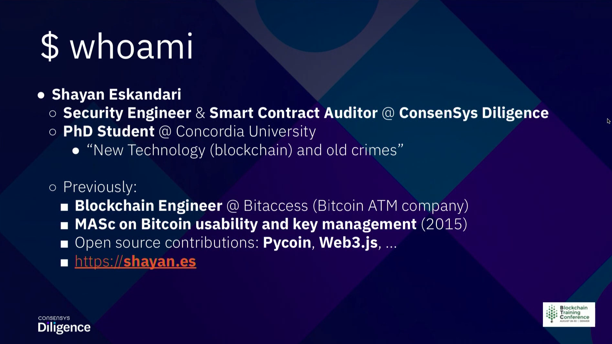
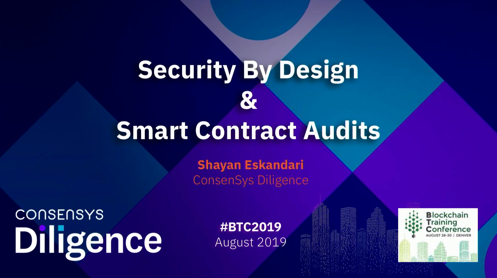
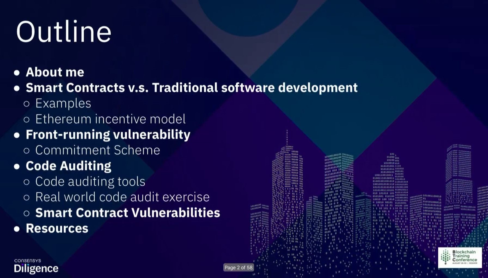
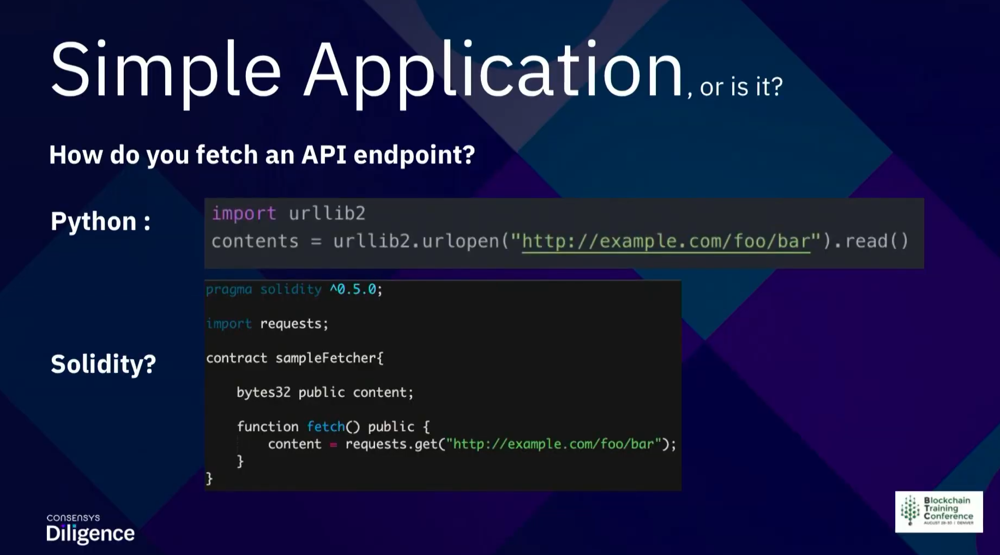
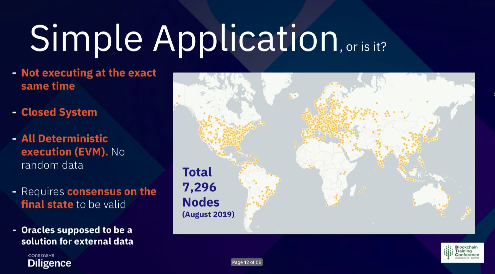
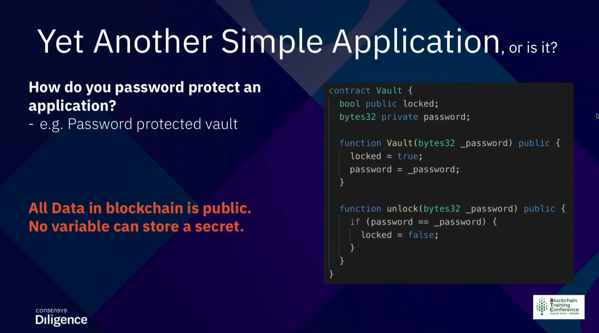
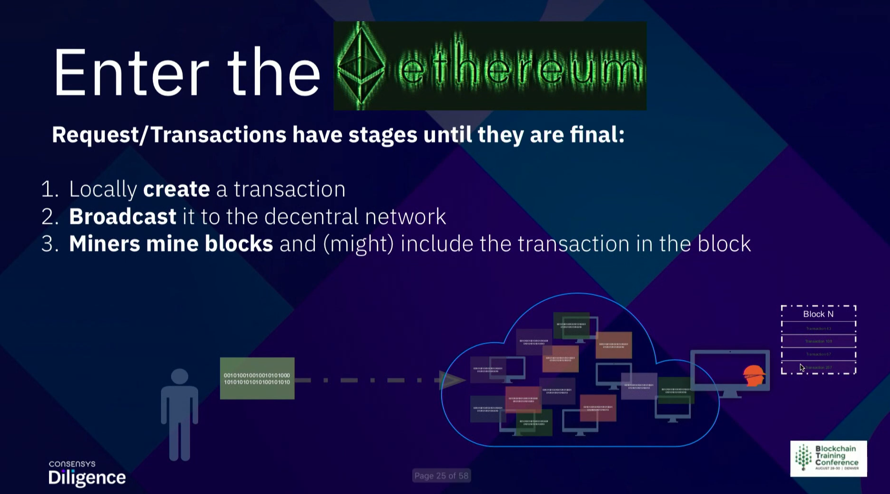
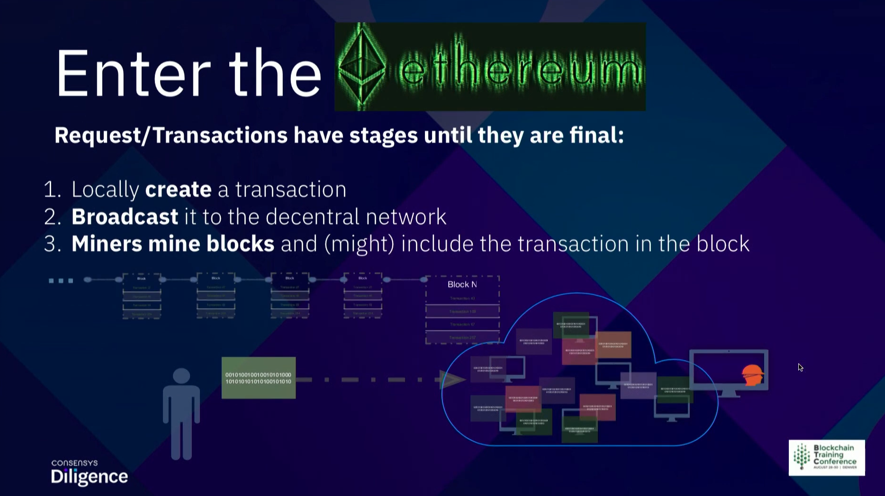
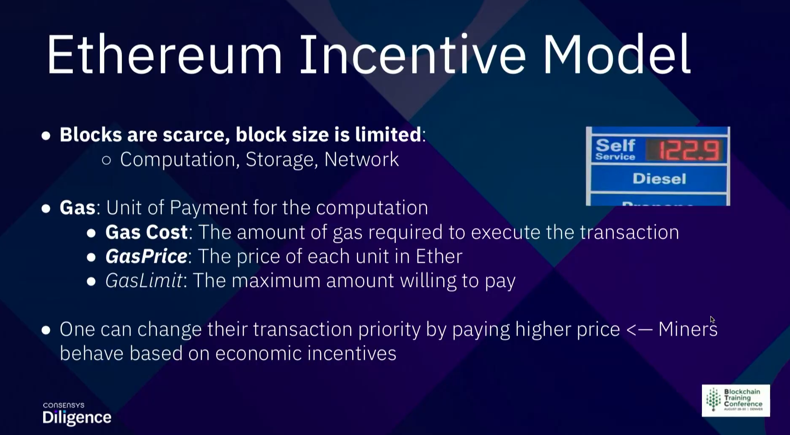
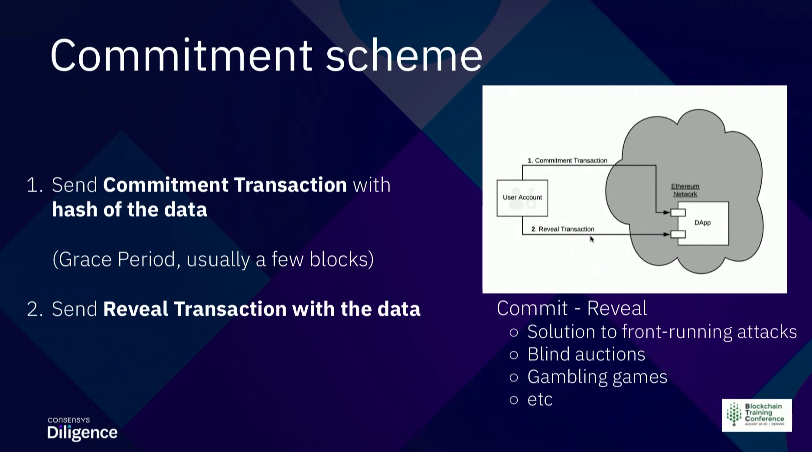

Our next speaker originally from Iran who now currently lives in Montreal. He is a security engineer and smart contract auditor at Consensys Diligence, he's a current PhD student at Concordia University, and previously he was a blockchain engineer at bitaccess, pleased to introduce Shayan Eskandari.

Thank you, so yeah this, this talk is more on the security and the differences of smart contractors as traditional software development. I just want know how many of you have attended the Andrew's talk yesterday might fundamental of smart contracts, no one?

How I hope you're familiar with solidity syntax, because that's one of their requirements here, so I'm not going to spend that much time on this, this is just to give you an idea of what we're gonna talk about. We're gonna go to some of the polarities and then do actual hands-on code editing.

So thanks Angela does introduce me. I don't have to like talk about myself so, as we say, like smart contracts are a new paradigm of software development. That means that, if you it's interesting that you know, if you're, if you code it before, it might be harder for you to do solidity coding right now, compared to like people that have not code it at all.

So what I'm talking about here, so let's say a simple application, I'm going to go through some of the examples. Let's say if you want to fetch an api, if you want to check whether come for Denver's weather, like you, can use apis into your software to call and get this information or you want to get apple stock price. So, let's say in a traditional programming, this is python a scripting language, I feel like there's an echo, python the scripting language. It's just two lines will download, import the library, you call that url and you get this information. That's all you need to use that information in your software.

And now for solidity, for small contracts, do you think something like this would work? You just import that and call that url? Do you, any ideas that this would work or not or why yeah? Why is that? So that's a good point, it's external to shane! So there are some other reasons for that too. So, first of all, who is calling this? So this is a screenshot of two days ago from Ethereum nodes, there are like around seven thousand nodes running Ethereum blockchain, so not all of them are executing this at the same time. So if let's say you want to get like google stock price, they might get the different times and different prices and, as you said, it's a closed system. Blockchains are running on internet, but they don't have access to internet, they just have access to all the information within that blockchain, so in this case, Ethereum just can't see any other Ethereum transactions, and this is also all the humanistic execution. So if there is a difference in the information they get and there's some randomness, it doesn't work that way, it should be deterministic, and also all of these nodes should have a consensus on a final state to be valid.

During some projects, it's usually called oracle's that supposed to be a solution for this external data, but this is not within the scope of what we're going to talk about here. So one of the examples is here you don't have access to the api, it's the same as that traditional software development you have, just one thing timer is not going if I don't know what time, so and let's do another simple application.

How do you password protect an application like the password protected vault? So in traditional software development, usually you store the password in a database, check the input of the user to see if it's matches that and then open the application right? So in solidly syntax, and that would be something like that, I hope, the back, background is okay. For you to see, so someone can call vault function with the password, it locks it, it saves the password in the variable called password and then later on, someone can come and call unlock with the right password. If the password matches the stored password, it unlocked a vault. So what is wrong here? Why this should would not work in Solidity, yeah, exactly, like yeah, it's like so, other than the transaction sending to vault for password a data stored and the data is stored on the blockchain are all public and there is no secret you can save on any of the variables, even though variables private, that's one of the common mistakes early on that people were making.

So let's say if you want to use the traditional best software development best practice, which is store the hash of the password rather than the actual password. So, in this case, Ethereum has this built in like solidity has built-in secured hash function called kecceck256 which is almost sha-3. It's a secure one. That's all you need to know, so in this case you can store, you can lock the vault with the hash of your password and store that hash, and when you want to unlock it, you just pass the actual password, solidity checks if that hashes to this hash and unlocks it, it seems like okay implementation right, but you would ask yourself like so the same. If someone calls unlock everyone will see that password and what is the point of this application? There is no point in that: locking unlock, so make it. Let's make it more exciting. This password protect world would pay 100 ether. If you can send it with a password, so the only line that is change here is this line, that is messages and their transfer 100 ether. That means, if anyone unlocks this vault would receive 100 either. Do you see anything that, is this a good code, or is this also vulnerable to kind, any kind of attack, seems like a good one right so, but then the transfer is already done for the first transaction right.

There is no balance anymore, okay, so this is why this kind of, this code seems okay, but there is a fundamental difference in Ethereum smart contracts that makes its code Vuln. We should we gonna talk about and now I'm gonna jump in to enter the matrix or enter enter the ethereum. That was a security of matrix workshop and the best joke is the one that no one laughs but so yeah Ethereum is essential public permissionless blockchain. So it's technically different than any cloud or online services. What do I mean by that, I mean that transactions or requests or any transaction that changes state has stages, they're not final right away. It's unlike api call or a server call that you change a state by just calling a function, so these stages are, user creates this transaction locally on their node.

Then they broadcast it to the network, which is Ethereum networking here, and you should consider that, like everyone else is doing the same, it was generating these transactions locally, sending it to the network and all these nodes have this memory called mempool which just store these recent transactions, so these are not finalized transactions. There's a recent transaction that was stored in the memory and then miners would mine a block and might include that transaction.

They they get a bunch of those transactions from that network. They store it in a block, solves the proof-of-work puzzle and add it to the blockchain.

So when the transaction is added to blockchain, you could consider that state change. Then then that function is actually called. So one point was that transaction of stages, the other one is the Ethereum Incentive Model. Basically how a miners behave. So you should know that blocks are scarce and block size is limited. So there is a market there for people to get in, this is because the computation, storage, network are the reasons and Ethereum in order to solve this, and introduce this concept gas, which is similar to mining fee in bitcoin, but a bit different. So if you want to define it, it's a unit of payment for the computation, so basically you paying for how much you want to compute. So this is this can be just sending your transaction, which is that really cheap or calling a function that does some calculation and it has a gas cost like how much gas it requires for that transaction to be executed. So miners require a minimum of the number of gas in either to run that function. Now you can define a gas price is how much you're willing to pay per unit? It's really similar to when you get gas for the car, that ha the price you pay is different per liter. It depends on where you go and also a gas limit, which is the maximum. What you're willing to pay. You should consider that there is also a block gas limit, which every block can have a maximum gas limit, that means that you cannot do any complicated computation in one transaction. There's a limit to that and how much complicated you can have a small contracts, and the other thing is so anyone can change the transaction priority by paying higher gas. So this is because miners behave on economic, economic, incentives. If you pay a lot of money to miners, they would mind your transaction first, so these concepts come come in handy a lot if you have to have them in mind, especially with writing small contracts, you have to consider how much gas you using optimizing it and also the gas price that people can prioritize the transactions with.

So now. There's another concept I want to talk to you about, which is an old concept called front-running. Is it's been around since 70s in traditional stock markets and it's basically, if you have a prior information of the market, you can do some action and profit from it. So the definition is the course of action where an entity benefits from early access to market information about upcoming transaction and trades. So in all the times it was mainly someone would hear someone wanting to buy an order, they would run in front of them to buy that order first, and that's because, like the price would change after this other order comes in. So this is money because, after you're privileged position along the time of data, you could be the broker that buys that, and this is considered illegal in the stock markets.

So now in blockchains everyone, every full note is in this privileged position. All of them are seeing the recent transaction they are not finalized. Yet so anyone can use this information to profit. Also, minors are a more privileged position. They can decide the order of transactions in the in the blocks in mind, so they can move transactions around and also, as we said, minors can be bribed by transaction fee that if someone can pay them a lot more money to get a transaction mind first, in order to visualize that so on top you can see, we see all the blocks in the blockchain. The red ones are uncle blocks, they're not really important for this talk, but you can see all those confirmed transactions and all these down here are basically pending transactions, the recent transactions and are in the main pool.

So miners would take some of the transactions of here patch them in a block and put them on a block in the blockchain append them to the blockchain. So a bit more visualization, you can translate these as blocks in a blockchain. This is mempool. Front-running is incentive transaction here, like anywhere you want, especially in the front of all that other transactions were paying a lot of fees. So getting back to this example, if I call unlock with the right password to get 100 ether, what can go wrong, so someone can front on me. Someone can see that transaction, send this transaction with higher fees and get 100 ether before my transaction gets through. So this is a fundamental difference with other software development, so everything seems fine here even the hash is fine, but if I send a transaction, any other node can see that send the same transaction with higher fee and bribe the miners to mind the transaction before mine. So they would get 100 ether and on my transaction would just fail, it would, but it would not fail, but there's no hundred either to send to me so so that was like one of the and crunch any attacks on. If it was a simple one, so yeah, as I said, anyone can run on this transaction, but higher fees and get one hundred ether. 

So one of the ways to solve this front running there is security by design sometimes means that, let's just remove this time sensitive or order in your applications, sometimes it's not possible. So one of the solutions is this commitment scheme or also commit and reveal, which means you have to break down your request into two two: two: two transactions: one is the commitment transaction, which you would hatch your information and send the transaction called commitment, transaction and wait for a few blogs and then sender we will reveal transaction with the actual data. So there's more contract can get the data hash it to see if it was before committed before before that time, and then, when you run your code, so it can be used to prevent from running to poor blind auctions for gambling games and a lot of other things so now the exciting part starts.

So coding auditing, have you guys done code review or code auditing before on any kind of code? Was that like a nonce small contracts right alright? So you may know that, like coda, I think it's not necessary writing tools. It requires a manual code review and in-depth understanding of the system is documentation to figure out. If it's act the code is actually doing what it says in documentation. There are security tools in the traditional software development are way more security tools, but in smart contract. There are few that help. You find common misuse patterns and we're to look at, but still you need to do manual reviews and after a lot of hacks for good or bad. Now it's becoming industry standard to hire external code auditors. That means there's gonna, be a lot of like jobs. Coming up in this field, and but it requires a lot of expertise so for the hands-on coder I think I want to do a real-world application. This is an basically the audit that we did around six months ago and walks you walk you through one of the four empties you found. So if your name service is one of my favorites services on horse taps on a theorem which is similar to dns, meaning that it's human, readable names to identify addresses for an ethereal network.

So let's say for dns your computer: you want to go to google.com it basically, talks to dns server gets the ip address and connects google server now for ens it handles that eath domains. So, instead of giving someone your address as 0 x 6 9 1 3, like all that hash, we can just say, send your ether to google that if and that's my address wallets can resolve that and in order to buy these domains, it's on chain transactions. You have to send a transaction to a smart contract, aetherium control, ens controller, to purchase a domain, and you used to be blowing auctions. You would come in to some value two days after you would reveal it and buy that domain. Now they on 4th of july. They switch this instant domain purchase with rent basic similar to how domains work right now, but this on chain is all on a smart contract, so there are a few points one. That's my contract hold funds like all these rents in that smart contract. No one else has control over that, and also because it's domain purchase unchain. It requires this coming to reveal scheme to prevent front-running and, or else everyone can just buy the domain you want to buy and then sell it at higher price to you.

This has been around on domain names in early 2000s and it's considered illegal right now. All right so so commit evil. Is this that we talked about that you commit to the hash of that of the data you want to buy and then send it on a transaction to reveal that so the smoker can check that you were there first yeah, so I hope you install this and visual studio code and these extensions, the lighting- is really bad, but if, if not I'm gonna walk you through here, but it's really cool to have them installed for later on. If you want to look at the codes, so if you have that installed, please go to this url, it's the source code for ens, but, as I said, I'm gonna do this on here too, but it would be cool to participate in this all of them. So if you go to this url, it goes to the ens github diversion for january 2019, and you can download the code open the zip file and open it with vs code. Then just is it better yeah.

So just to know is anyone doing this at the same time or should I just go so I hope like I know, austen's talk was talking about like the packages that you can use for small contracts, so you don't really have to not look at the other files, these are like truffle package, so it's like how we can deploy a small contract with test and other things, but all the contracts are releasing in this folder contracts and for now we go to just on them main contract. That is, it register controller. So I just opened this up. I want to show you some of the tools that is vs code. Extensions offer you that are really. It can really help you to understand the system and you open them so on up up here, you see some of the some additional functions here. You can call. One is inheritance which, when you run when you open a file like if they can inherit other small contracts, and it might not be visible when you look at the code, but when you click on this, it shows you how a small contracts are connected to each other I can see iii.

Just a controller is inheriting from ownable, which you can commit read on the code here, but it might, as in a complicated small contract, might not be disabled, so this could be really useful. The other one is this graph. You can graph the whole system or graph just this smart contract, which in this case, you would see how functions are calling each other. This again could be really useful when you want to look at the big system to see how functions are looking at each other. So let's say for register: we can see what functions register calls how they related to each other, if it's external call internal call. So in this case it's not that much input I just want to show you this, because if you get time we can use these and to find some of the vulnerabilities. So one of the first thing it depends on the audit or everyone can look at the codes differently. Some likes to like to do top-down view of the code I personally, really like to start with access, control and transfers to see those are critical and I want to see what how handle that with that.

I can see how what the code code quality is. So there are somewhat modifiers that, like let's say only owner is owner that just checks, if the only owner of that contract can call and also address a transfer at the transfers. So in here is it so in here there are some functions like let's say this function, it's called withdraw, which only owner can call, and it transfers all the balance of this. All the balance of this smoke contract to them color means the owner. So this seems fine, but as the auditor, this is a security consideration that anyone using this no country should know that own owner can withdraw all the funds out of that out of this small contract and that's something that should be in the audit report, so ok, let's go on this alright, so I just want to show you like. These are the things you should look at, but they're not really exciting. At this moment the other thing is so yeah, so, as I said, prevent front-running it's using a commit revealed scheme which the description based on the documentation is this, so you generate a commitment hash from the name.

You want to register from the domain. You want to register and a secret. This secret could be a random number or restricted you generate. Then you submit this commerce commitment value to the controller to the smart contract. You wait for one minute or less than 24 hours. That's what small contracts checking and then submit your registration request for the name and the secret. So if you have the code open in front of you, these are the functions. Basically, that does all these lines so make commitment is a function. That is just view only like it's pure, so it doesn't. You don't have to send a transaction, you can make the hash by calling this function, then you send a transaction to commit to commit to that value and you wait. There's no function for that and then you register with name owner duration and secret. So in register you revealed your secret and the name before that the name does not touch this, the blockchain at all, so just to show you the piece in the code. So this is my commitment that all it does is gets a name and secret, and this is pure. So that means it doesn't change any state. It's not a transaction that people can see on the blockchain. It just returns the hash of these two, so just to make sure the front-end doesn't screw it up it's in this more contract, so this would become. It would be the first transaction that the user calls with the commitment, and all it does is checks if the time, if it's not being committed before, if it's not it just adds it to the commitment list, it has so I'm not going to go through all the code here I'm just going to show you like some of the main important parts, one is here that so you call the register with name owner, deviation and secret and checks the commitment for name and secret right then again, checks.

If it's not expired. If it's expired, it would return the value to the user. It checks the rent, the price. If they, you send enough to cover the cost, it checks the label, and this is an interesting line, because this line is where it registers that label or that name for the owner. An owner was an argument to this function. Right and then it returns. The rest of the user so to simplify this. This is what happens, make you can't make committin with a name as secret. You commit to that value, the output of that, and then you register your domain with name owner. The original really doesn't matter here, a secret which you're revealing what we just said to us. It checks the commitment with name and secret and then register the domain for that owner that you passed. Can you spot anything wrong with this process seems that is a good commitment reveal scheme, but that's kind of thing owner does not exist in the commitment, so you commit into the name but you're not committing to the owner the who owns that domain.

So if you commit anyway anyone and it then call the register and reveal your secret. Anyone else can front on you and register and purchase that domain under their own name. So, in order to understand this better, as I said, this register is vulnerable to fund training and that's because the commitment is not tied down to the specific owner. So for audit reports, the best case is to say this is the part. This is the venality and then come up with this attack scenario of like how this is. This can be attacked mainly because, while you trying to do this, you either find more polarities or you realize that you're making a mistake, and it's not really one lever and there's also severe disability of that and priority of that comes in so here alice wants to buy a domain called my domain, so calls commit with the hash value of the make commitment with my domain and her secret. Then alice wins race for ten minutes and send the transaction to register my domain for her for alice address and reveals the secret now he's looking at the memo and if sees that this transaction happening on the memo. So now, if sovereignty transaction, which register my domain, her own address, not alice address and the secret that alice revealed with the higher gas price and she can win the race because it's paying high gas price and miners would prefer to avoid in this transaction rather than alice's, this would be a tech scenario. Do you know how to fix this, like? What is the fix here?

It's just yeah just exactly the commits to the owner in the coming three phase, and that was a simple fix and, as you could see like I'm, if you have to look at the code more but ens team, we are really good developers and this code was a good code they

considered having front-running pervenche like having committed, reveal to the force of front-running and they try to prevent that, but it was gonna miss there, and this is a bug that you cannot find with any tools you have to read the specification, know the system and know how that it that is working any questions so far about ns. Is it interesting just to know so yeah, that's one of the things that you have to like to read the code really understand the system. To be honest, figure it out, so there are like a lot of small country on every t's in the last two years that we found out. This is that's really a nice categorization chart that I found from that paper. A survey on etherium system systems, security I. Don't know the authors, but I found the paper really interesting, so there are so many traditional common burner. It is done small contracts, the under flows over flows that we've seen a lot of tokens, the race condition conditions which also trans, it's called transaction ordering on a small contracts to when you design a system and imagine that user called the first one of the function. A first and then function b, but anyone can call function b first, like you, do not really in control of that daanish uninitialized storage and functions which, if you have heard of piety frozen attack, as was basically that they had this multi-sig wallet, which used this library for their multi sake, and there was a around I forgot.

How much way around 160 million dollars worth of iii stored in there and the library was not initialized. So someone called him initialized and got to be the owner and then killed that contract and all that money is just frozen on ethereum for now forever. But there are like some other small contracts, special specific vulnerabilities that have not been around that much one is renton. C, which, if you have heard of dow hack, was that that you could call a function outside another, a smart contract going on the address and that come that that's my country, I, can bring back the work flow to this moment to euro smoking and does some say changes so the dow hack, which results in 160 million dollars were hack, was just two lines of code. They had to be. The other way around was like change. The change, the balance first and then send the transfer other than transfer engine change. The balance that was the fix facing front running, as we saw like front running is something that you don't look at when you're, not writing the code. We have something in mind, but you don't see that what you're revealing what you're exposing to the system? There are trusted actors like, as we saw in the video transaction. There are actors in the system that are trusted, the keys could be compromised and that could change the whole dynamic of the system. So these are the things that you should consider, especially if you want to do auditing.

These are the things that should be on the auditing for report, upgrade ability as another thing small contracts, as we know, they're immutable that you can not change them. Learn new patterns of upgrade ability which we can have proxy contracts and then that address is the same, but you can update the transaction. They small contracts that are underneath that by itself is a security concerned because it can change the behavior of the system without users. Not noticing that or frozen ether with tokens, let's say you have this small contract. That is a game you consider it does not accept payments, but what, if someone sends payments to it, then you need a function there to be able to review all these tokens. Withdraw this aether. If you don't have that those ethers are lost forever, they're, just stuck in that small contract. We have a lot of these ether and tokens stuck in different small contracts that cannot be withdrawn and also the main one of the main things is. There are no randomness. As we said, this is a deterministic system and there is no randomness within small contracts. We can really do gambling based on randomness. There are new ways that are like if 2.0 is doing this, we can chain that helps with the randomness. But as of now, we don't have any van.

Mr so yeah stefan berry would talk about more vanities in the next session, I'm not going to go into details of them anymore, and there are resources that you can use to help you on either development or auditing. There are some goodly in terms there. If flint is one of my favorites, it's really good.

There's no contract code analysis tools mythix or slither mythix is by my team. Asleep. There is another team, also, as you have tested with truffle shuffle is really good package for writing writing tests, but you have to write the test and also write the test for your tests and it gets really test all the way down there is this other ethier small contract security, best practices that it's open source and everyone can contribute to that. It's a really good start pack, if you want to consider security and small contract and how what patterns to use what patterns not to use, and if you considering auditing small contract auditing I, would really suggest reading audit reports that are out there. This is its know. If it's really visible, but this url has like most of the concert- diligence like my team's reports, they will try to like pub make them all public there are. Other teams are have reports out there read them. We can see the patterns that people have the sections that use. There are a lot of comment commonalities in there like what bugs are common there, and this could be really interesting if you're interested in like hacking or red teaming, as in security coming to say- and there are like these captured, the flags challenges that are really interesting- there are on test net, you can just get coins capture, the ether is one.

If they're, not what by open setting has another one, so you can technically hack smart contracts, get funds out, get to be an owner of that. It's really fun. I would suggest doing that and it gets really challenging to and with that, I would just like to thank everyone, btc 2019, and if your there's any questions, I think we have eight more minutes or maybe more yeah, that's so the question is for big small contracts or b systems, what is the very best way to split this more contract and auditing right did I hear it right. So a lot of so now we're seeing with especially 0ex polymath, they are getting huge they're like aragon, is one of the biggest ones. So every team are doing different method like argon is separating like access controls with like walls with applications, but as we've seen like it opens a plane packages. There are a lot it's really good to have these smaller modules and get them audited and then use them in different systems. But then, as the more you use, the more complicated system becomes and the more unpredictable it becomes that you might call like. Let's say for aragon and all the calls are basically proxy and if you know how the system works, you know, if you don't, it's really complicated to start auditing at recent aragon project, but it's gonna be interesting to see how this goes but the way right now. It's getting, people are getting more specialized in different projects, and they can only focus on that path. That becomes like the big guy for our to audit. Like let's say our garlic. That's the only way. I know that knows how the system has evolved yeah, but using the audited. All the modules like opens up link tokens that that's a good solution to like simplify your audit. 