Let's jump right into it, so we're going to be talking about evm opcodes for gas optimizations here, 

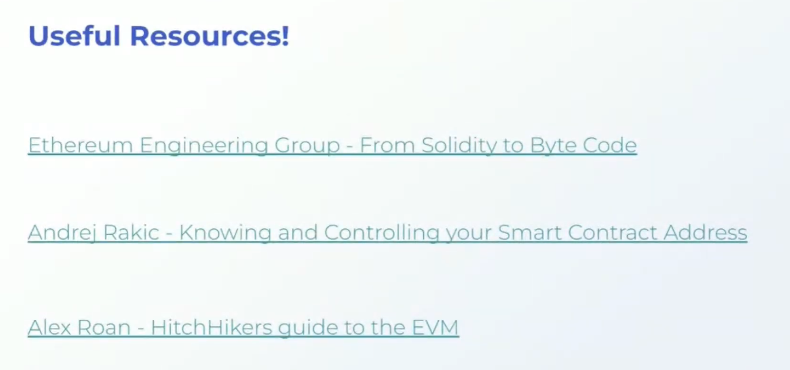

https://www.youtube.com/watch?v=RxL_1AfV7N4&ab_channel=EthereumEngineeringGroup

https://www.youtube.com/watch?v=56K0FdosZ8g&ab_channel=Chainlink

https://www.youtube.com/watch?v=zgukojxyHKc&ab_channel=Chainlink

And there's a couple, a bunch of different, useful resources here, and I actually can share this, these slides in the chat here uh anybody who wants to follow along, wants to check out some of those resources, feel free to check them out and, of course, actually before we finish. This uh grab that qr code I'll leave it up for the first couple, slides. So that, later on, once this is over, you can grab the qr code and you can give us some feedback on this session. Let us know if you liked it hated it loved. It want to see more want to see less lets us know what people liked and what they did not like.

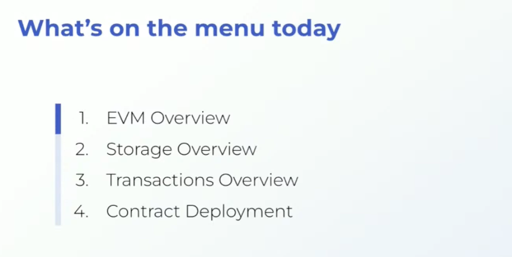

So, what's on the menu today, here's what we're going to be talking about we're talking about evm's overview storage, overview transactions, overview and a little bit about contract deployment. So we can make more efficient, more gas, efficient choices with our solidity code.

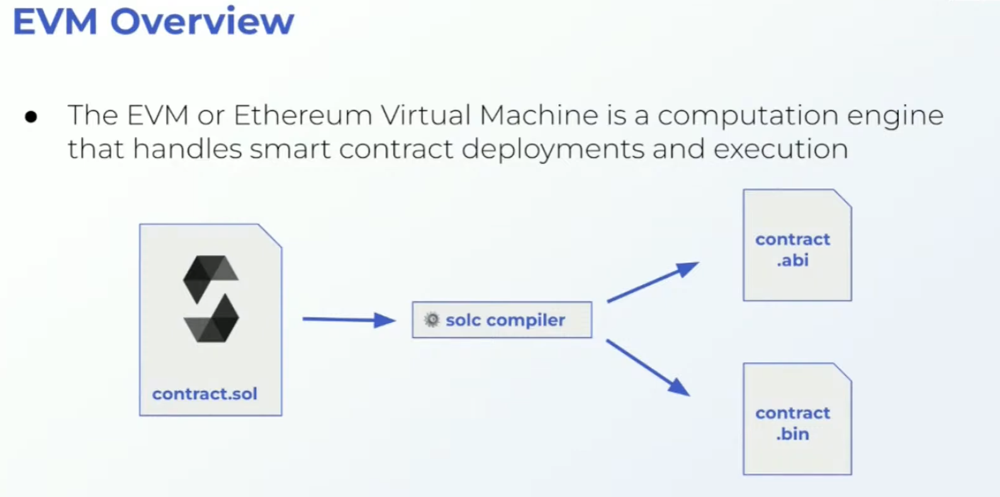

Now the first thing to keep in mind is that whenever we compile our contracts, we get we get two files. Essentially, we get a contract.abi and a contract dot bin, **the evm or ethereum virtual machine is a computation engine that handles smart contract deployments and execution** that dot bin file that dot bin file is going to be your binary file and then the dot abi is going to be our, you know our application binary interface, it's going to be how we can interact with our code.

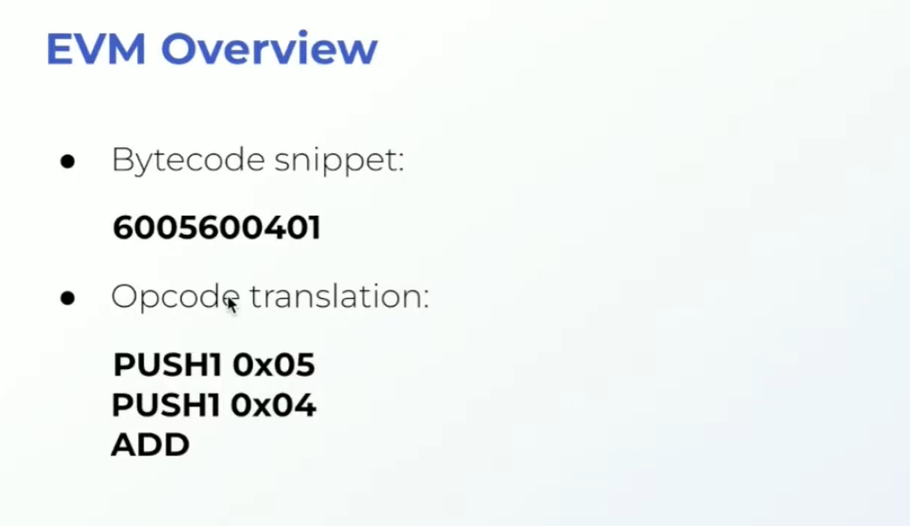

And, if you're, on remix, for example, if you look at the bottom, there are these two things that end up being down there: one's abi one's bytecode. If you copy those and you paste them into file, you'll get exactly that you'll get the abis and you'll get all the low-level bytecode stuff. Now, when we compile this down, we get um. We get we get these bytecodes right, we get these very small, these minimalistic jumble of letters and numbers and stuff- and you might have seen this before- and here's a bytecode snippet of this and to humans. Oh snap, I did forget to put this on the discord. Sorry, thank you good call. Let me do that right now appreciate your uh appreciate the shout out freddie. Let's do that. Let's go to discord! Thank you for that.

All right cool sent all right. Let's go back, so here's like a little byte code snippet now. This is uh, basically, a contract compiled down to the machine instructions or the machine level instruction which, to a human means, absolutely nothing right. This is a garble of numbers and doesn't make any sense here, and this actually gets compiled down to what's called these op codes or the the machine readable instructions. This jarble of numbers here gets compiled down to the really low level machine instructions. So we're literally telling our computers exactly what to do. What transistors to flip, where to stick some memory stuff, we're being very, very specific, and this gets translated into this exact bytecode gets translated translated exactly into these uh, what's called opcodes and it's these op codes that are the low level binary the low level code that our solidity compilers and our and our evms run to actually do stuff to do stuff with our solidity code.

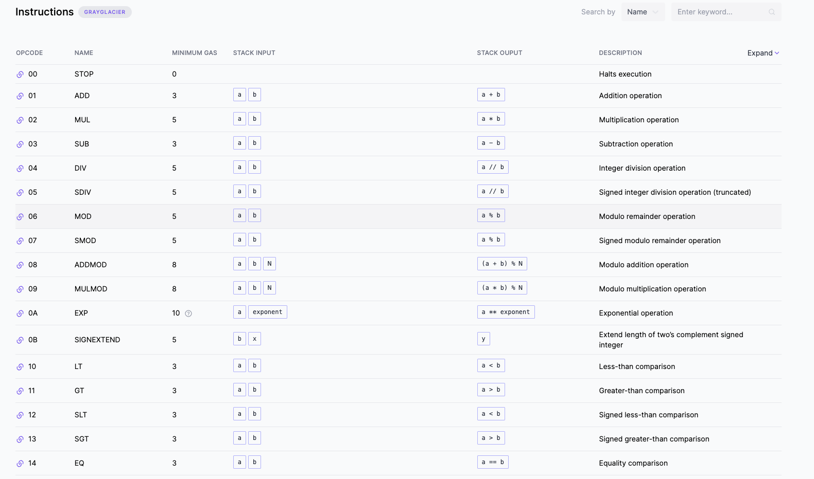

Now these evm, so so we're seeing in here we can read this as that: 60 stands for the push op code, so we're saying we wanna push 05. So that's what these first four are doing. We're saying: okay, push 05! This next group of four, so the first two is the op code. Saying 60 is push 04, so we're pushing o4 and then we're adding the two of these together. That's exactly what this op code stands for, 

And you can see kind of a list of all these evm up codes. If you go to [evm.codes](https://www.evm.codes) and you can see a list of all these- these op codes here, you can see you know what heir names are. What the ~~bytecode~~ excuse me, what the opcode is, what the two like digits to that represent: that is what the inputs are, what the outputs are- and you see this really interesting- one here called minimum gas and that's going to be one of the important pieces of what we're focusing on for this video. So each one of these op opcodes costs a different amount of gas to do so. If you want to add two numbers: you're spending, a minimum of three gas. If you want to multiply you're spending, five gas subtract three guests, and we have all these different op codes in here that do all these different things and we'll come back to that. 

So when we um in this specific example that we have here, this push push ad, we end up pushing data onto what's something called the stack. So **ethereum is a single stack based machine**. If you're familiar with like registers, **it doesn't have any registers**, it's purely stack base. So whenever we do anything whenever we do some computation, it puts all this stuff on, what's called like the stack. So it's this different data structure that it works with called the stack for doing all of our computations 

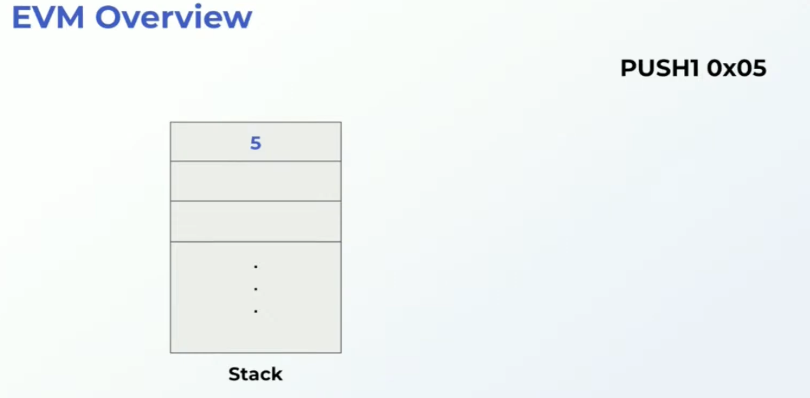

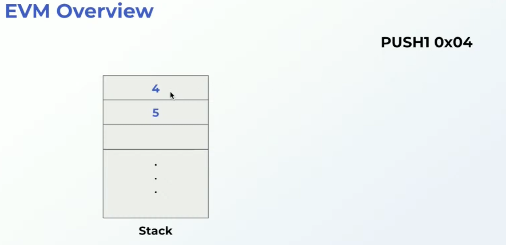

so this is kind of an example of we're just adding two numbers right and the way that it's literally going to add the two numbers is first we're going to push 0x05 onto the stack right here. So we push that number onto the stack. Then we push 0x04 onto the stack, so with the stack is a is literally. What is it a last in first out hold on yep a last in first out data structure, meaning um uh like the first. The first thing that went on this data structure is going to be now at the bottom right. So if we pushed a ton more stuff on the stack, this five would always be on the bottom. So now we pushed 0x04 into the stack. 

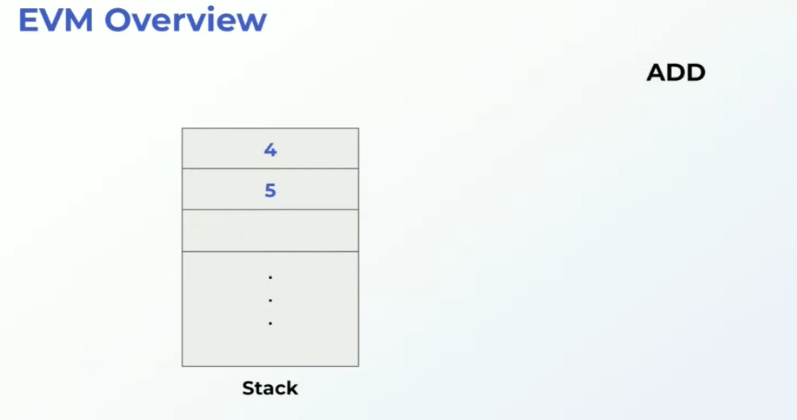

Now we have a 4 and a 5 on our stack here and then we call this add op code and then we can even look in evm.code to see exactly what it does and it's this uh stack input is going to be a and b. So it's going to be those the **first two positions of the stack** and it's going to just literally, add the two of them together, 

so we're going to call this add op code, we're going to say: okay, we're going to um pop this four off the stack, we're saying: okay, goodbye, four we're also going to pop five off the stack and we're gonna.

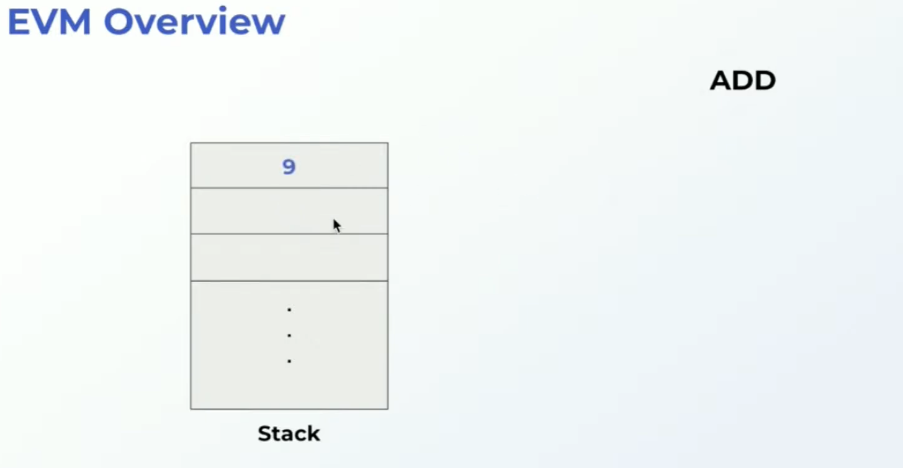

Add the two of them together and then we're gonna stick that back onto the top of the stack. So we have four five. Then we ran this op code. Add solidity said: okay, cool, I'm gonna, take those last two pull them off. The stack combine them together and then stick back whatever's left and then we get nine here, and so we could even like kind of calculate, very roughly kind of the gas of those three up codes. So we had add which was three. We had push1 which was three: we had push1 which was three so in total, just those three operations, cost 9 gas right so now you're starting to see oh okay, if we understand exactly what's going on in the byte code, we can really start to understand. What's going on with how much gas we're spending

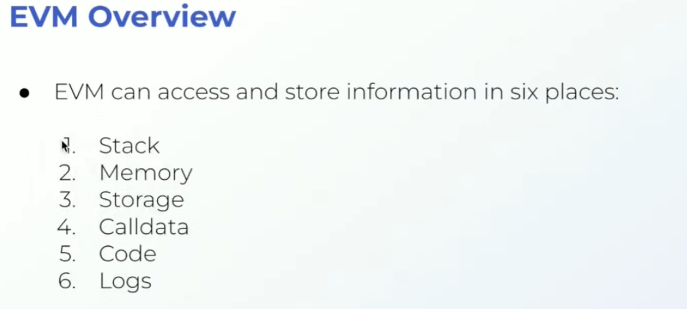

Now the evm can access and store information in six different places. **The first place is this stack that we just talked about and that's where it does some of this computational stuff.** **Another one is memory which is where um everything in memory is this temporary location that just gets wiped and deleted after a transaction finishes**, **storage**, which is one we're going to be focusing on today, which is a place, which is a place, **a data structure in our smart contracts that is persistent** and you'll, hear storage used a lot a lot a lot. **We have call data which is um a special data type for uh input parameters to functions.** We have code, which is literally like the byte code of our contracts, and then we have logs, which is whenever we omit an event. It gets. Data gets pushed to this location, so these are the six spots that um information is accessed and stored at all times. Right so anytime, you're reading data anytime you're writing data. It's gonna be one of these six places and understanding which of these six places we're reading or writing the data from is going to be paramount to making gas optimizations, because each one of these has very different. Gas has very different gas consumption rules and in combination with our opcodes and uh that'll, make sense in a second. So now that we've kind of talked about this, we talked about pushing stacks op codes, all the weird stuff.

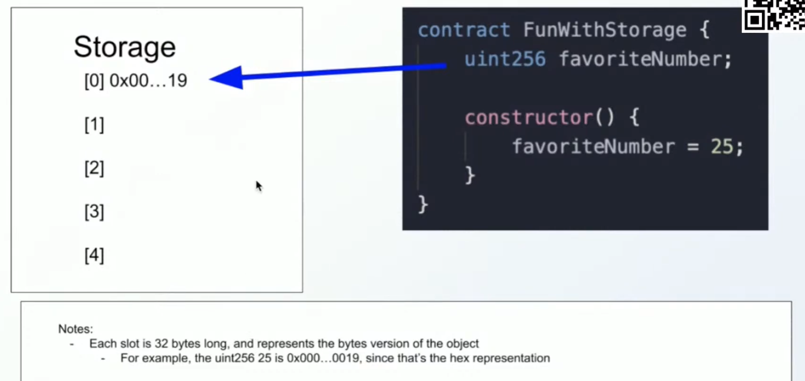

Let's talk about storage, so in solidity one of these data structures that we use is this data structure called storage right. It's one of these one of these six places right and here's kind of the layout of how storage actually works. So whenever we have kind of a global variable right or one of these variables in um or one of these variables, that's that's kind of **outside of a function** right. It gets stuck in storage. That's because it's going to be persistent right. If this was if a favorite number was a public variable, we would have that read. Favorite number excuse me. We would have a view function right, called favorite number that we could call and we could view this storage spot at location zero. We can read exactly what's going on here right? **So when we do this un256 favorite number at the top of this exact contract, it gets stuck in the zero width slot of storage.** Here right, each slot is gonna, be **32. Bytes** long represents the bytes version of an object right. The unit 256 version of 25 right here, so we're sticking favorite number equals 25 into storage, is going to be zero x, zero, zero, zero, zero, zero, zero, zero, zero uh 19.. 

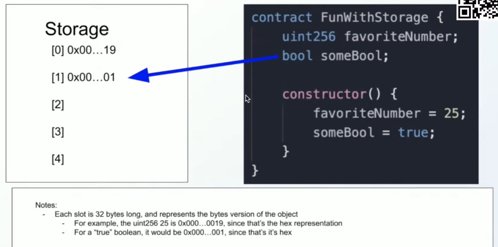

If we have a boolean, we do the same thing right and since this variable is underneath, this favorite number (slot0) solidity just sticks it in the first storage slot (slot1) here so now we have two persistent variables: two variables that are going to go in stores two variables that even after functions, uh go through they're gonna stay, it gets stuck in this first storage slot and for uh booleans, a true boolean would be 0x000000001, since the hex version of true is 0x00001, which is kind of interesting. True, the boolean of true has the exact same bytes uh as the number one and the boolean false has the exact same bytes as the number zero kind of interesting how that kind of hex conversion works.

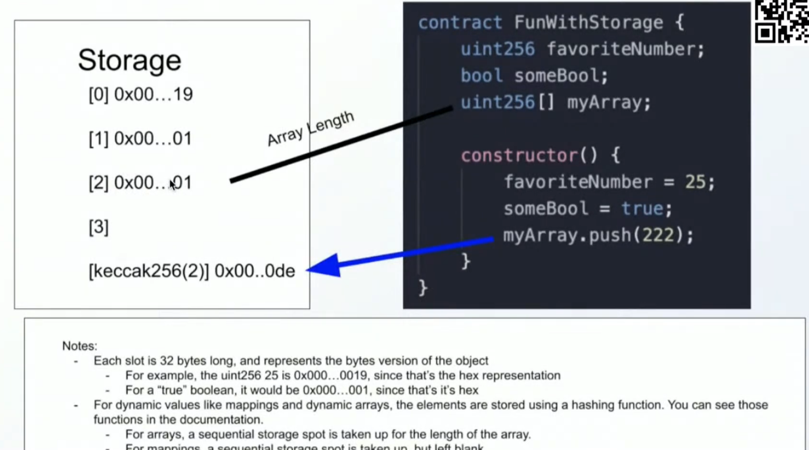

Now, if we have an array, arrays and mappings are a little bit different in specific, dynamic, arrays and dynamic mappings, they're kind of interesting so for dynamic values like mappings and arrays. The elements are stored using a hashing function, so we do hold up a slot here right when we add un256 my array. We do add it to kind of this sequential storage thing, but when we push a number like 222, we do some weird hashing function and pick some crazy spot in storage to store the the data so 222. The hex of that is, like 0x00000000, a whole bunch of 0s 0de, and we stick that um. We stick the 222 version at this kind of crazy location. That's based off of um, some weird hashing function for arrays. Now at the store. That's that sequential storage slot right, so zero is favorite number one is someBool. 

这里需要注意的是，myArray是在slot2的位置，所以是keccak256(2)开始存elements

Two is myArray at this spot here we **just have the length of the array** so that we know how long the array is and then all the elements inside the array are at these weird locations in storage and there's a ton of spots and storage? So hopefully we don't uh. We don't clash with anything, but that's kind of another. Conversation for mappings mappings also take up a storage slot, but they don't have like a length of the map or anything like that. So it's a **for mappings. this is just kept blank**, just to say, hey. We have a mapping in here, but we're just going to leave it blank for now.

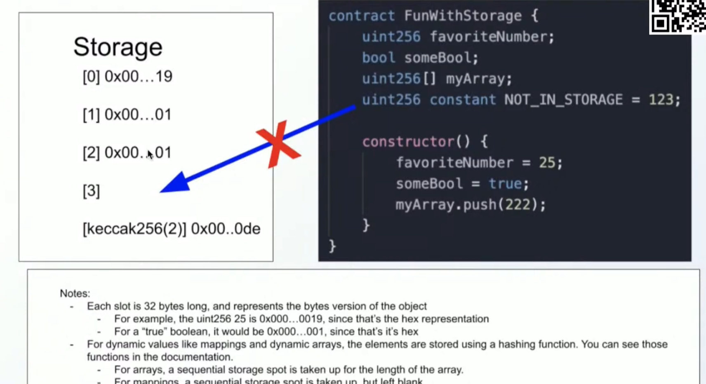

Now, interestingly enough, **constants and immutable variables are not stored in storage**, constants and immutables are not stored in storage. They don't take up a slot in this data structure. Now you might be thinking well, how is that possible? Well, we know constants and immutables can't change right, so we don't need to stick them in a storage slot right, because the reason we have this storage data structure is so we can say hey. I need to update, what's at the zero slot, hey, I need to update what what's at the first slot, I need to update, what's at the second slot, etc, constant variables, never change. So we never need to update them so, instead of storing them in storage, where do you think stored? Where do you think we're starting? Let me see in the comments here: **where do you think constant variables are stored** if they are not in storage, if they're not stored in storage, where could they be, and here are the six places they could be stored? It's going to be stack memory. I just said it's non-storage, so not storage call data code or logs. Where do we think? Where would we guess and if you saw that slide um you would you there was a hint in there slash. The answer was in there, but don't don't rewind guess where do you think this sword? Where do you think constant variables are stored? What do we think? Okay, we got some guesses here. We have code memory code, stack memory logs, probably memory whatever you think code stack. These are all great guesses, so I'm going to tell you the answer now, so **it's actually stored directly in the code** so or the byte code of of the actual code. So it's not stored in memory, because memory is and- and I know I didn't really tell you a lot about- you- know these different types of storage- it's not stored in memory, because memory is deleted after a transaction finishes, it's not in the stack it's on storage. Like I said it's not called date. It's not a parameter and smart **contracts actually can't read from logs** once you omit a log. A smart contract can never read that again, so it's stored directly in the bytecode, so the way that this works, the way that this works in solidity is solidity goes. Oh okay, well, this this anytime! I see this NOT_IN_STORAGE variable in your code, I'm just going to swap out with the number 123, so it literally like inside that code data structure. It doesn't recognize not in storage as a variable. It recognizes not in storage as the number 123 it literally just goes. It just goes through the code says: okay anytime, I see non-storage, that's going to be 123. Devastated

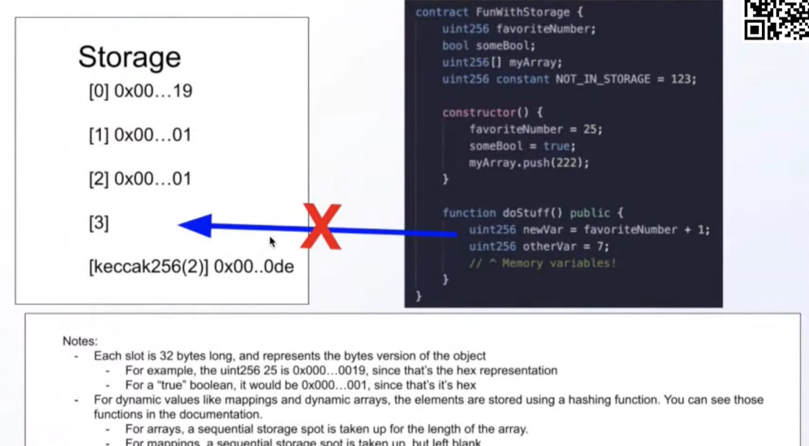

So and additionally, these functions down here. If we have like this function, do stuff, like you and 256 **newVar** unit, 257 other var, these two variables nuvar and **otherVar** **they also don't go in storage** right **when we call these functions. These are going to be memory variables.** These two functions only exist for the duration of do stuff. **When we call this doStuff function, we get a newVar in memory, anotherVar in memory, and then, when this function completes once it hits that end bracket, it goes.** Okay, uh everything we just created in here acts it delete it. It's gone. So in these functions this is this: is memory stuff now memory variables are much cheaper to read and write from. They are much cheaper to read and write from and we'll talk about exactly why uh here so instead of me kind of rehashing what alex has already said, I wanted to show you this video uh alex rohn's uh hitchhiker's, guide, um hitchhiker's guide to the evm, so we're gonna watch this real quick. Let me remove the brand um and then we'll keep going uh. He he does just does such an amazing job, giving tips and everything that figured it would just be better to watch him. Let me share screen here kind of confusing here let me do um, oh well, alex will be in the box here.

So thank you. Alex uh test, yeah alex will be in the box here, but he won't be talking. So I will be talking so now. The question then becomes is okay, so patrick it sounds like storage. Is, is crazy, expensive? Why is it so expensive in the blockchain? Well, if we look at the centralized world in the centralized world, storage is pretty pretty easy right. If I storing some data on my centralized server, I have a single disk, uh low overall cost. It's gonna be easily scaled right, I'm storing it to my centralized storage. So it's it's really cheap for me to store stuff uh just on one machine now in the decentralized world. Guess what you have a ton of nodes that you need to store the data on your tens of thousands of disks. You have so many more machines that you need to save your data on, so it's way more expensive to store data, because you're literally doing it on thousands of machines. 

Now the to evm op codes that are in charge of reading and writing to this storage location is going to be s-store and s-load, s-store being the storage uh opco, where it stores that data anytime, you store data in one of those storage variables, it does s-store and then s-load it's going to be reading from one of those data locations, so that's going to be the s load operation and it's the two of these combined that makes, for you know, for lack of a better term. Incredibly expensive, uh, incredibly expensive our codes here now. What what can we do about? I'm just going to pause and talk on my own speed, **so there's six things: um, there's six things that we can kind of keep in mind when it comes to these uh comes the storage to make our code more gas friendly**.

We can. We want to not store in storage if we don't have to, use constants when we can, we want to make it painfully obvious. We don't want to read and write too often and then also we want to pack our structs, 

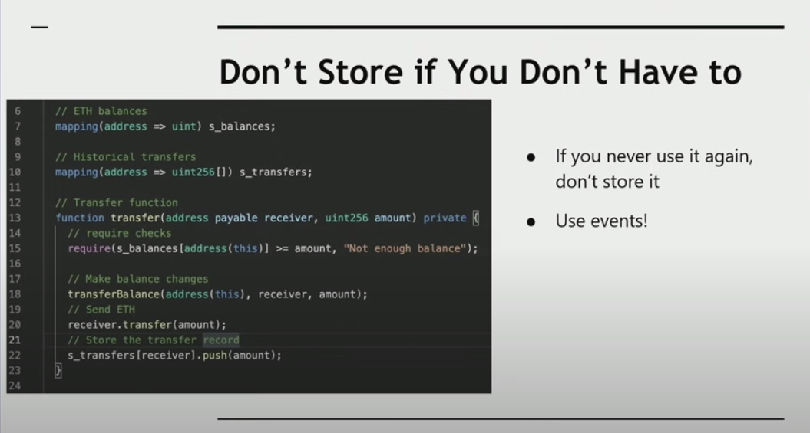

so the first one don't store. If you have to if you never use a storage variable again, don't store it right. Use events instead, there's a reason that um these events are an incredibly powerful uh tool that we can use to index things off chain right. So if we never use a variable, if we never store a variable, don't just don't right, um yeah! If you don't need to store something, don't store it right. Use events emitted events instead, 

if we have uh, if you want to keep track of all the transfers, for example in erc20, that might be cool. That might be good for uh, for you know having somebody query your stuff, but having this mapping of all the transfers, an erc20 token has ever done, is going to be incredibly gas and efficient right, because every single time somebody does a transfer, they got to pay. This extra gas, this insane amount of gas to store that transfer data in this, this transfer mapping.

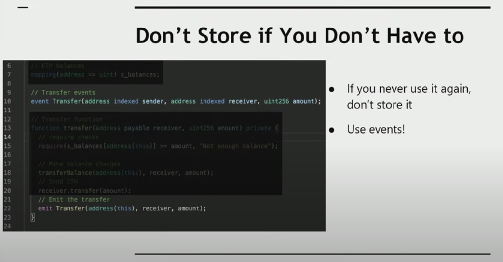

So we don't want to do that if we don't have to, so what we, what we can do instead is we can use a transfer. Excuse me, we can Emit one of these events that I talked about uh instead, now events are going to be. Oh, where did I put? **The events are going to be in this Logs data location**. **So anytime, you emit an event. It gets stored in this logs data structure and storing data to logs is much much cheaper because it allow, because it doesn't allow for contracts to read and write.** Excuse me read from that that logs place you stick in the logs data structure and boom. That's it

so if we do want to get this historical data, sorry too fast, but if we do want to get historical data uh and we do want to keep track of all the the transfers and stuff. That's happened and I know it's kind of fuzzy right now. Sorry uh. We want to emit these transfer events and then just say hey. **If you want to get all the historical information you can index all these transfer events yourself.** So that's one incredibly powerful gas. Optimization 

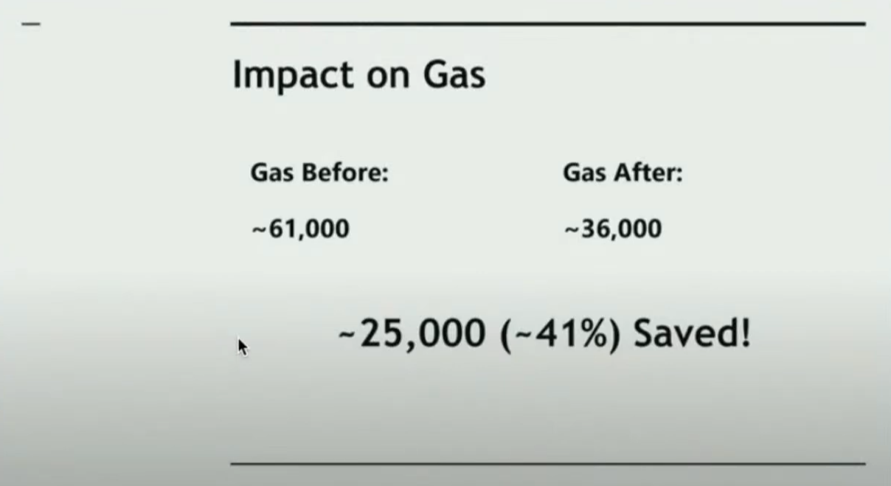

now the impact on gas here on just switching from saving in storage to to emitting as a log is going to be nearly 50 percent, so that transfer uh. That transfer function goes from 61 000 gas to 36 000 gas, literally cutting almost in half how expensive it is for your erc20 token to do a transfer which is incredibly powerful.s

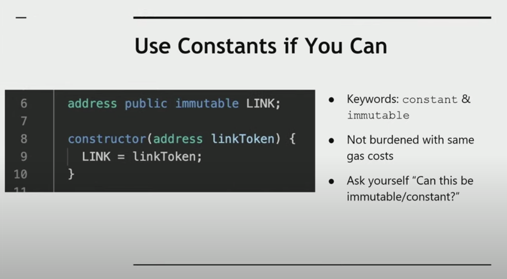

Next one use constants when you can, keywords constants and immutable uh like I was saying before, those get stored in the code as opposed to being stored in storage. So you need to constantly be asking yourself: hey. Can this be stored in? Can this be an immutable/constant, for example, if you're, using with the link token that link token address is never going to change, so great. Make that an immutable or a constant. So a **an immutable variable is a variable that can be set in the constructor and then a constant is one that has to be set outside the constructor in that kind of global scope**. So if you can make your code immutable or if you can make your variables immutable or constant you're, going to save yourself a ton of gas as well 

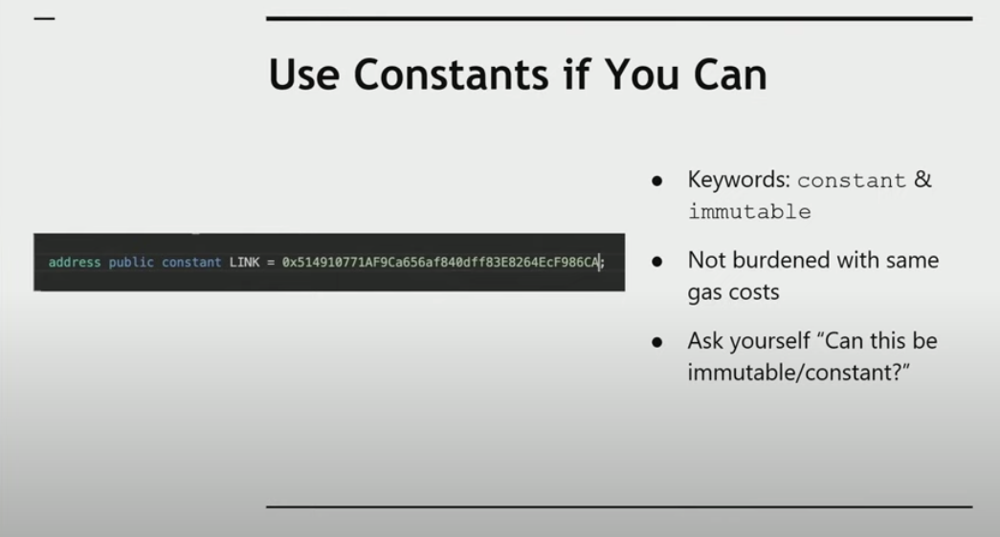

constant will save yourself even more gas. It would look something like this address public constant link, **but you just can't save it in the constructor** 

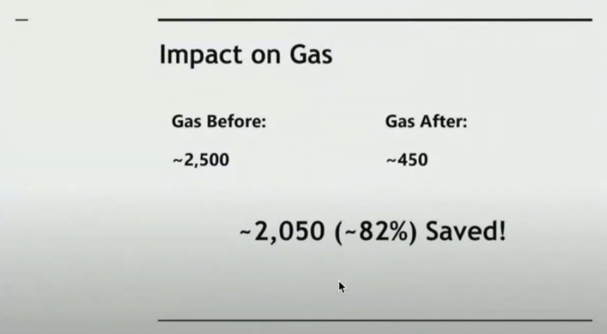

the impact on gas here is going to be an absolute insane amount right, so saving that that address of the link token from being a regular variable to a constant you're saving, nearly 82 percent gas by changing the data location, so you're absolutely saving an absolute ton of gas here 

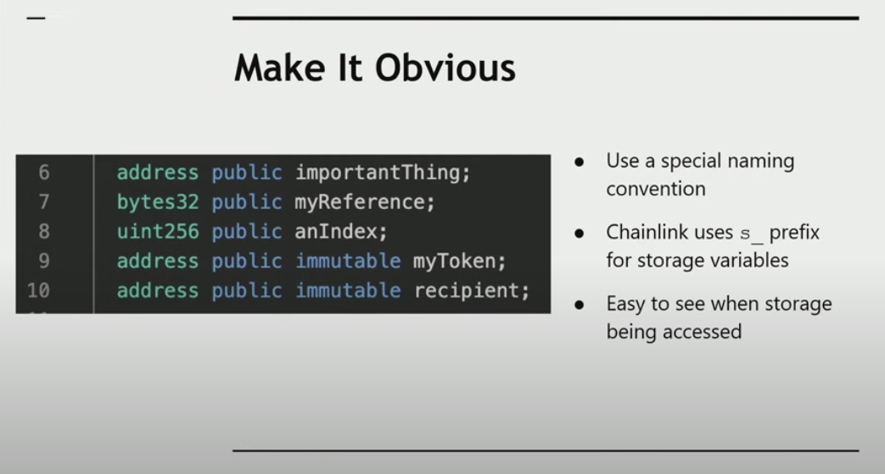

uh one of the other important things, and this is something that we do at chain link labs is we use a special naming convention uh? We use an s underscore prefix and you've probably seen this before for storage variables. This way as developers we can easily say. Oh, oh, this is a storage variable. This is probably going to be really expensive for me to use. 

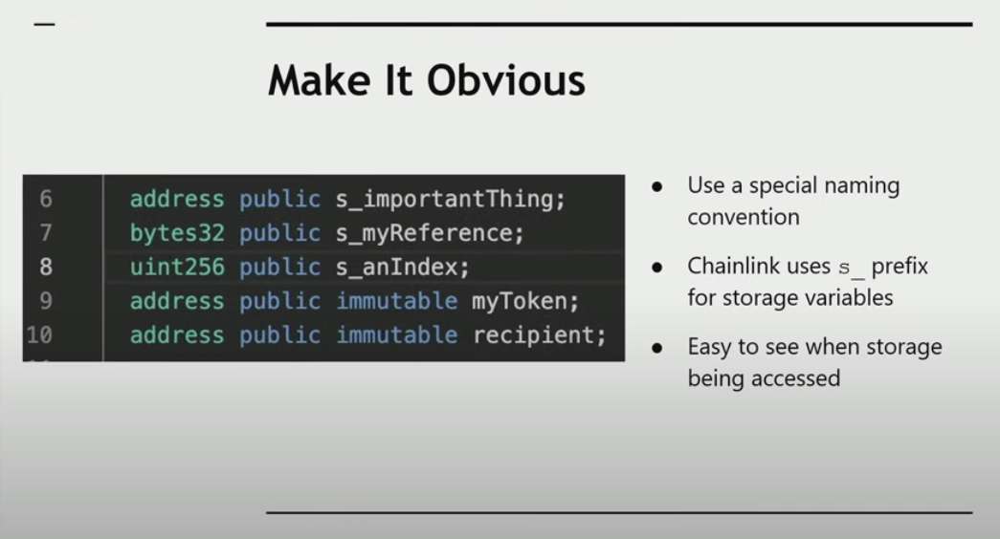

So, instead of going, you know important thing, my reference and index. We do a little s underscore so that we, when we're coding, we go oh right. This is a storage variable. We should probably not read and write to it all the time, 

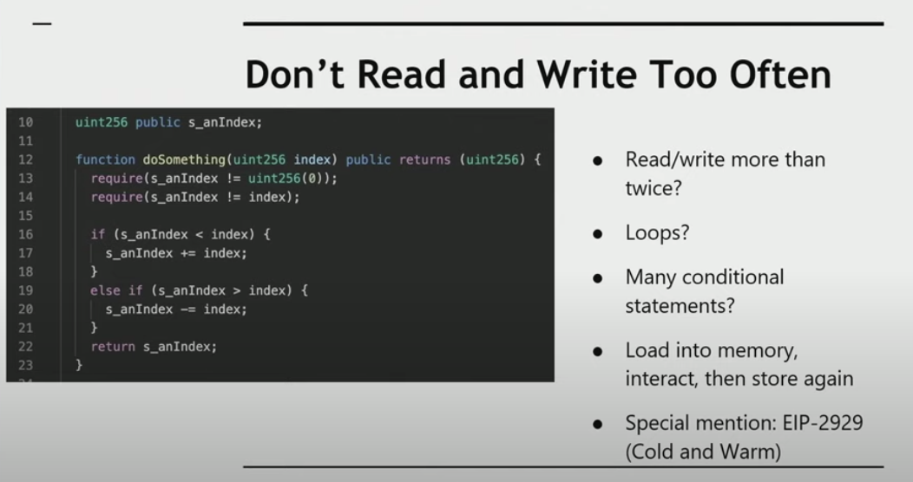

so we're going to read and writing too often you don't want to read and write too often right, reading and writing more than twice loops. Many conditional statements so right here we're reading from storage by saying require s and index does not equal we're reading from storage again require s and index we're saying if s in index is less than x, we're reading from storage again by saying, if s and index right here s in index plus equals index else, if s underscore and index is great we're reading from storage again here we're reading from storage again here we're reading from storage again here anytime, you see this s underscore, and this is why having this convention is really good and every single one of these lines, you should go.

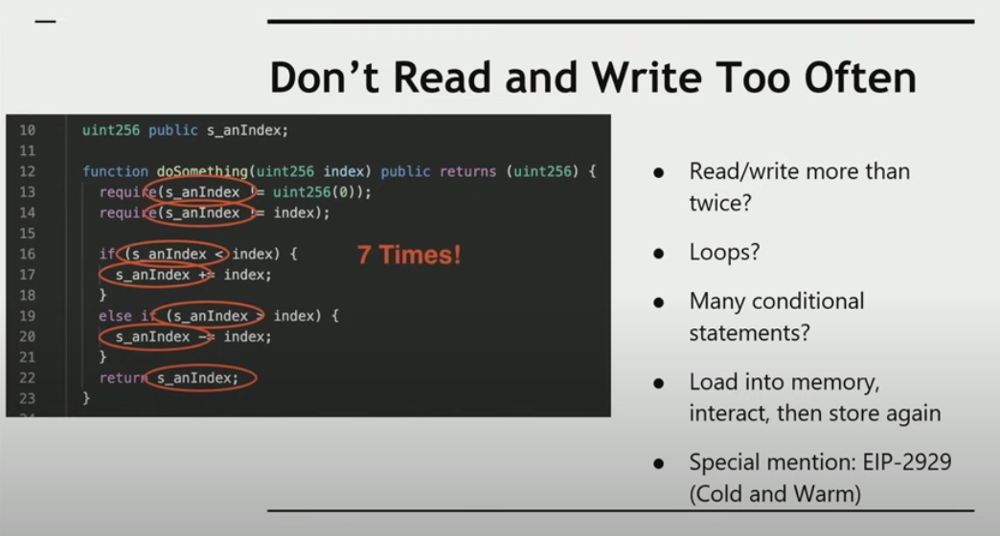

Oh, my goodness. We just we just read from storage, one two, three four: five: six seven times: seven seven times. So what can we do? Instead? What do we want to do instead of doing that? Well, what we oh yeah, seven times, crazy! That's a lot so many times that we're reading,

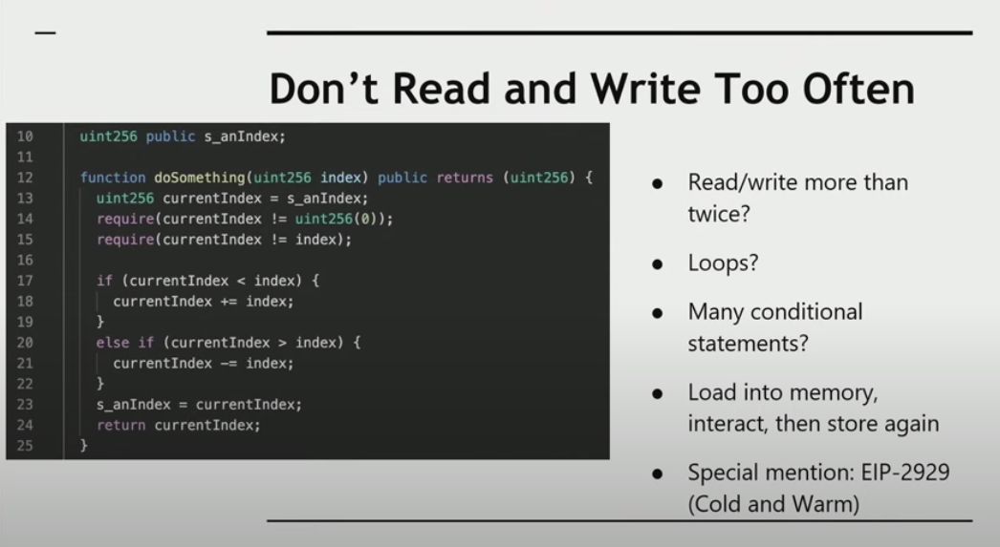

so what we can do instead, as we read from storage one time right at the top like that, we read and store. Excuse me, **we read from storage once, we read it into memory and then we read from memory our memory variable instead, memory variable reads are much cheaper**, so we say: okay, great, we'll read into memory and now we'll read into memory for the rest of this uh excuse me: we read into um and then we set it once down here. So we we go from seven to two and we end up saving a ton of gas

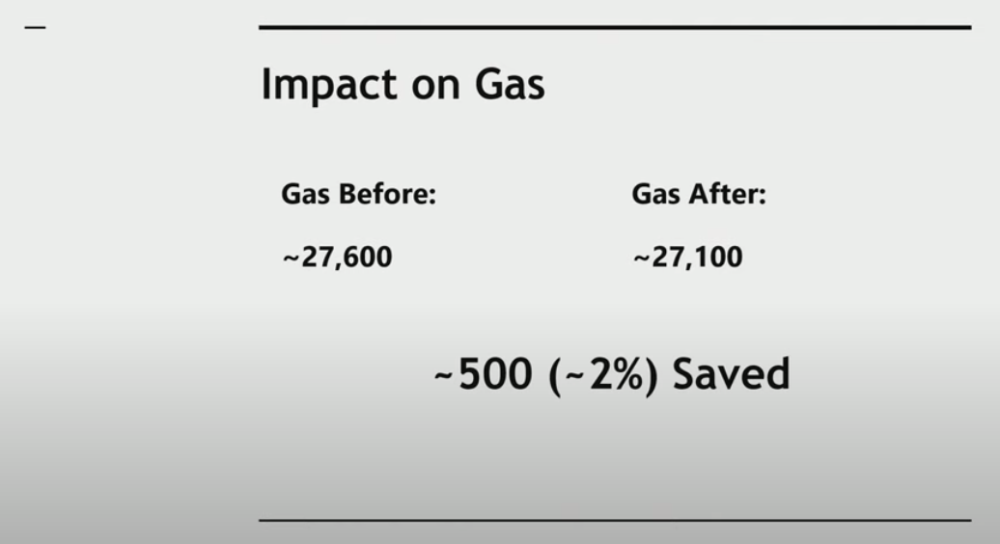

Doing something like that is going to save, not a whole lot of gas, but it will save gas right so about 2 percent gas here. But you can imagine if you have a massive for loop, where you're looping around you know 100 variables, if you've read it into memory, you're going to be a lot more you're going to be a lot more gas efficient. So and the answer is 42: it's a joke because of the hitchhiker's guide, which is kind of funny, but excuse me uh. It's actually going to be 32 for evm. The answer to everything is going to be 32. That's alex's, joke which I thought was very funny. Um he talks a little bit about structs here and packing them so uh, I'm not going to go into packing the structs here because then I gotta talk about structs and stuff and we're already half half an hour in.

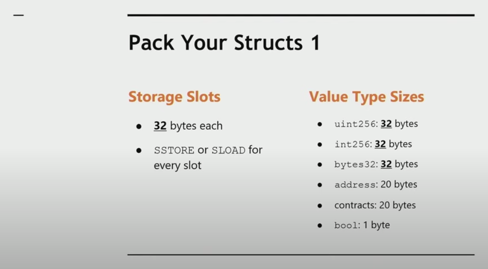

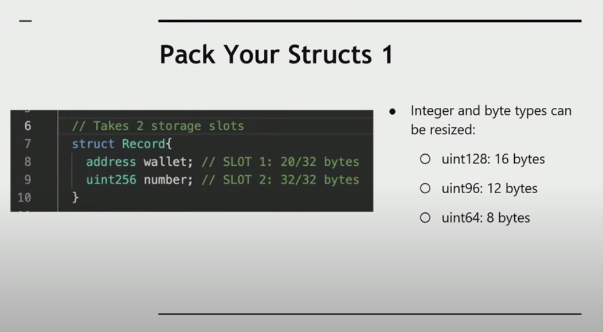

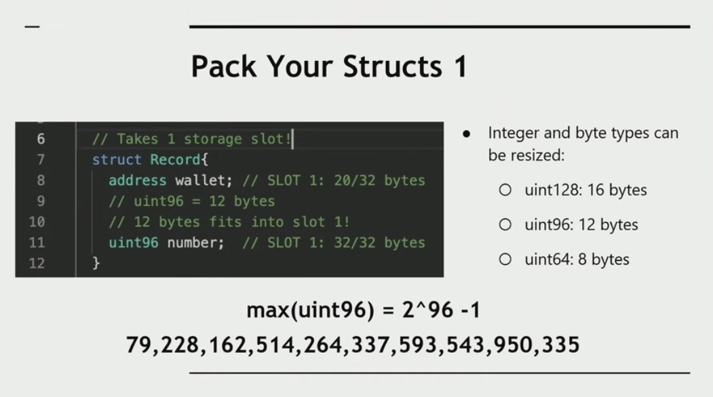

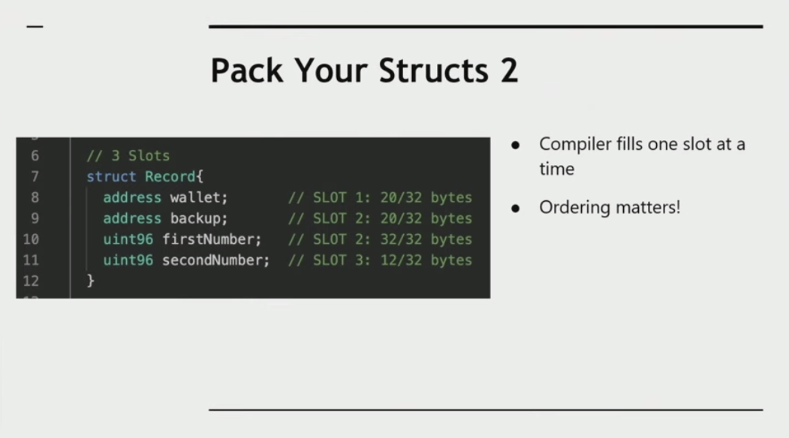

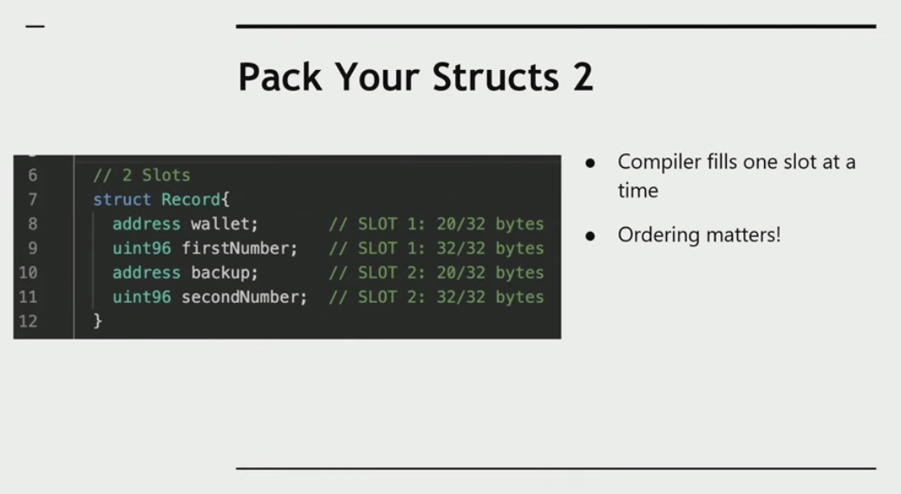

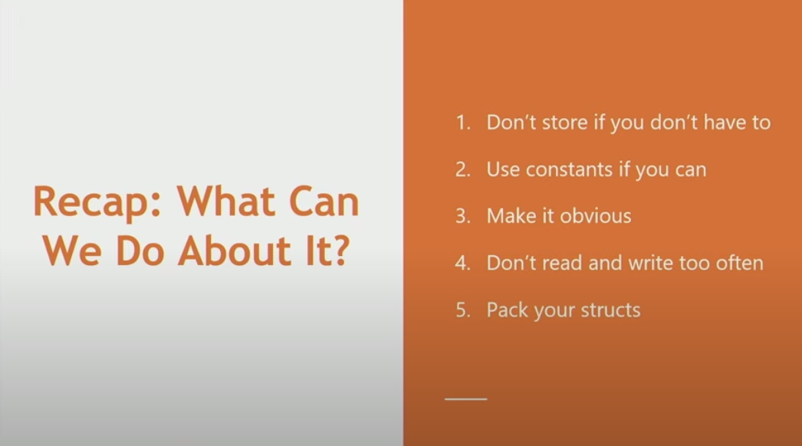

But if you want to learn more about packing, your structs definitely go. Watch the rest of this video listen to alex's wizardry because he gives some more tips about working with structs here, but in any case recap don't store when you don't have to use constants. If you can make it obvious with that s underscore, don't read and write too often and then pack your structs and then come back to this video so that you can learn about packing your strucks

 so uh with that being said, what are the questions so far? Uh, let me scroll up. I think there are a couple questions here: okay, quick question and let me let me switch back over hello, quick question in this code. Event address index underscore name. **What does the index keyword do? I get confused**. Ah, okay, yeah. So in an init **in an event when you index a keyword, you add it as a topic, so it is a little bit more gas expensive, but it is easier uh. It is easier for indexers to read out of the events log**, that's that's! Basically it that's what the index keyword does. So if you look at a um, if we look at a transaction, you probably find a transaction pretty quick right. Hopefully this they emit an event here. No, this one didn't, let's just pick random transactions, hopefully they emitted events. No, I don't know, looks like a lot of these did not emit events state. That's because all these are just sends. Instead, what for uniswap new swap here we go here we go, transaction logs. Okay, so this is a this is um. 

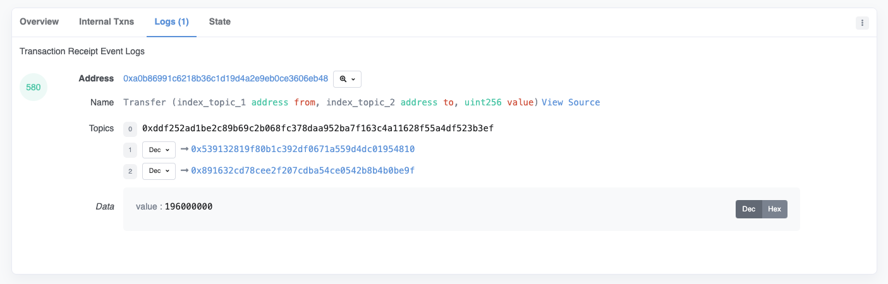

This is an example of an event: that's emitted, so they omitted this approval. Oh I'm not sharing my screen. Let me let me switch over sorry. This is an example of approval event that was submitted. Now you see index_topic_1, index_topic_2 and then address and spender, so index topic one and two, so um when you index an event. You add it to these. This topic, part of your events, uh or your logs data structure, so they're a lot easier to read because we're saying at index zero we have address owner at index, 1, we have address spender index. 2. Excuse me, excuse me at index 0 we have the the hash of the entire event and index 1. We have owner at index two. We have suspender index topic two and then at the end we have this um 256 value, so anything outside of the index topics gets just kind of added to this. This data structure and they all get kind of almost jarbled together. If you will, let me see, if there's an example where so here's kind of an example of an event. Maybe this is a couple of data structures combined together, but yeah basically uh. It just makes it easier to read your events. Hopefully that made sense. 

So functions default to memory. I thought you needed to specify memory in the function declaration or do we need to just specify storage when needed, good, really, good question. So this is that's kind of for special uh special types like bytes and um like bytes and strings. So when we use bytes and strings, we do need to say hey. This is this: byte is in memory or this string isn't asking me this byte to raise and memory or the string, arrays and memory, but if we do it, **if we declare like a variable outside of a function, it defaults to storage, so the variables inside of a function default to memory. Yes**, except for strings and and bytes, which we just we always need to declare. 

**We always need it to be explicit there, because, like I, was showing you before um arrays and mappings have kind of this really weird way that they store data. So we just need to tell solidity hey: this is going to be in memory or this is going to be in storage because it needs to know what to do with this weird uh mapping thing** okay is, am I gonna, do this in storage, or am I gonna do this in memory, and it just wants you to be explicit, which I really like it just forces you to be explicit with expensive stuff like strings and bytes good question.

Okay, what else? What are the questions are in here? Is it okay to think uh? Uh of this type of memory as ram vs rom uh, what is rom? What is rom computer read-only memory? Oh okay, cool um, I'm not sure what uh you're, referring to when you said: rom, uh, immutables and um. Well, they're, not memory! They're read only storage um! If you're talking about like immutables and constants uh, yes, immutables and constants are read-only. So if that's the analogy, you want to do great, but I think I think ram and rom isn't great, because they're those are memory and we're talking about storage hitchhiker's guide to the evm is a reference to a famous encyclopedia about travel, randomness and towels in the galaxy, yes, thank you. What about s store? Two? What about store? Two uh!

I don't think that's an op code. I think that there's um yeah, I remember reading something about store too. I think it's like it's it's a it's a library somebody uses um. I forget uh, but if there are such ways to optimize gas, why wouldn't this be done in a compiler level, uh kind of a funny story here? Well um, so it depends right you we want the uh. We want to be able to be very precise with how we code stuff right. If we start optimizing, if the compiler is too abstracting, then it can be harder to do exactly what we wanted to do. Um uh, like let's say it just always picked memory or storage for us, then maybe that would kind of stink um. The other kind of humorous thing is that um, a lot of people who are gas golfers complain about the compiler all the time, um uh.

I I don't um uh because, like a lot of the stuff that it does, that may be more gas, um gas ineffective. You know uh save and give safeguards otherwise. So, like a big one for a while was um, solidity consistently was what's called unchecked uh with its overflows, so you could have like a unit eight of size, uh a unit 8 that was number 255 and that's the maximum size you can have for you an eight, and if you added one to it, it would reset to zero uh, which is very bad for math. But it's very good for gas they changed that recently to have this thing called safe, math built in where it will prevent those overflows and underflows, and that's good for like kind of a developer experience, it's not so good for gas. So there kind of comes this um this uh, like okay. What are you optimizing? The compiler for so there's a lot of kind of design, choices that need to be done, um, but there's always going to be ways to optimize gas and- and these are and understanding what's happening on the back end is important, so you can do that are logs. Still secure um, were they ever not from danger? I I think they're good s underscores the important cost of storages.

Yes, is there a cheat sheet for gas, optimization um uh? That kind of overview that alex gave was very good. You know, don't don't read and write to storage if you don't have to that's going to be a big one, but there's there's always going to be different gas optimizations that you can do um. I I don't know of like a specific cheat sheet, but I would love to see some c1 actually, that would be really cool to see uh gas optimization cheat sheet. So when we declare a global variable and then call it in a function, it gets saved to storage. Does it get overwritten or saves another value in different place? Does it get overwritten or saves another value in different place? They call it in a function. It gets saved to storage. Does it get overwritten or saves another value in a different place? I'm not totally sure I follow the question so when we declare a global variable and then call it a function and get saved to storage, does it get overridden or saves another value in different place? I'm not sorry, I'm not following your question. All right cool!

No! More questions here, awesome back to, but yeah feel free to ask more questions as we continue um cool, oh one, more question these evm optimizations valid for all evm compatible or just ethers. It's all of them all evm compatible. I think he's asking the variables saved in the same location: uh. Yes, so if you, if you um in your function, yeah, okay, okay, I see what you're saying so. If you're accessing a storage variable in a function and you save it right or you update it, you're saving it in to storage, great question. Okay, I I think that yeah, that makes sense, so those are some of the things to think about when it comes to gas codes and actually, if we look at evm.

os, we see all these gas costs like 333 cool. Let's look at look down here, so logs are going to cost a lot more gas right. We can see how expensive logs can get, but it doesn't even compare to the create op code, which is for creating a contract. We see the call op code, the call code for calling different uh, calling functions or or or sending messages. Um delegate calls expensive crate two for creating uh for creating contracts as well revert self-destruct and then s store. If we look for s, store, store and s load

have a minimum of 100 guests as well right, so these are going to be very expensive here way more expensive than all this all these stuff, one way cheaper than like an m load, a load word from memory or an m store, save word to memory right, so three, gas versus 100 gas for saving the memory and then three gas versus 100 gas for loading to memory way cheaper working with memory than working with storage.

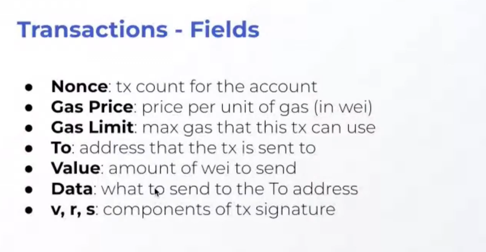

 So now, let's talk about transactions, so here's kind of a transaction- here's here are the different fields of a transaction. We have the nonce with the tx uh count for the account we have gas price gas limit, two value data and then vr and s- and these are the components of your transaction signature. This is kind of the cryptography magic that happens behind the scene. To make sure your transaction is your transaction function, save number external saved number equals equals number yes, so if you have, if saved number, is a global variable, you're calling uh doing this right here?

If save number is a global variable and you're saying save number equals number you're calling s store, so you're saving save number to storage, good question gas is way, I'm a little bit late gases, whatever unit you want it to be in, 

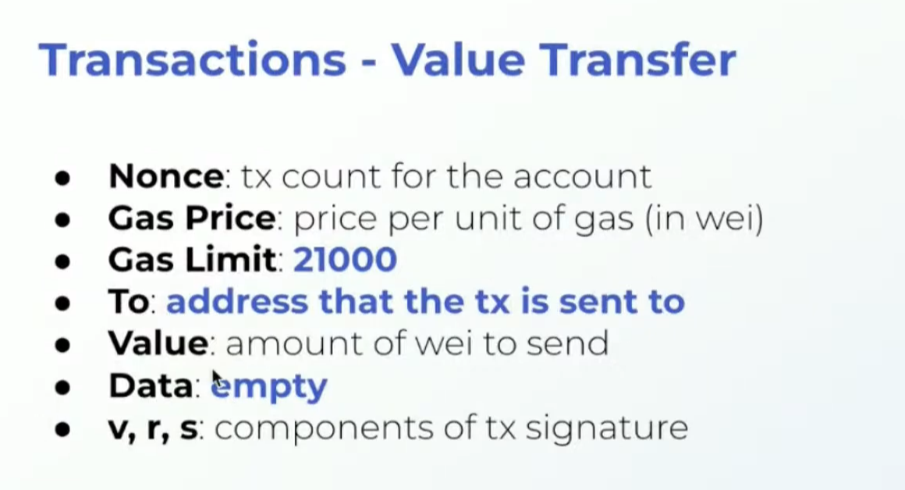

and here are some and when we transfer eth we often it often comes with a 21 000 gas limit, because that's how much it costs to to send eth and then we update two with the address the transaction is sent to. The data is going to be empty. 

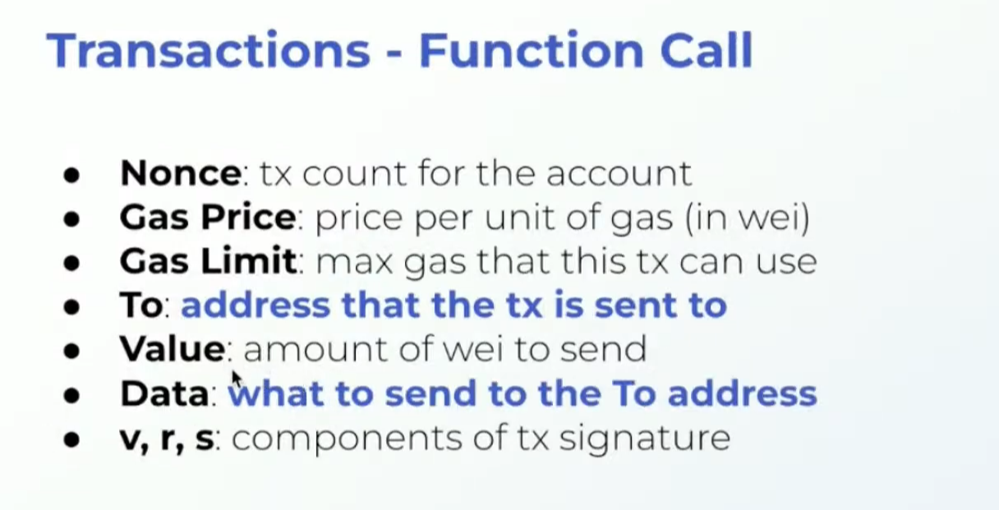

When we do a function call, the address to the transaction is sent is going to be updated, the gas limit is going to be whatever you want. The data is going to be all that data for that function, call 

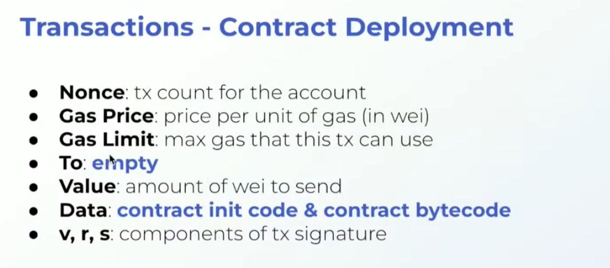

and then for contract deployments. The 2 is going to be empty and then in the data piece it's going to be the contract, initialization code and the contract byte code. So, even when we're deploying contracts, it's this data field that we want to keep in mind, making this as small as possible to make our code more gas efficient. Does it get overwritten, though? Yes, you're? Writing that one memory? Yes, well not to the one memory slot to the right into the storage slot. Yes, so if you write to storage in a function, it will get overwritten. Yes,

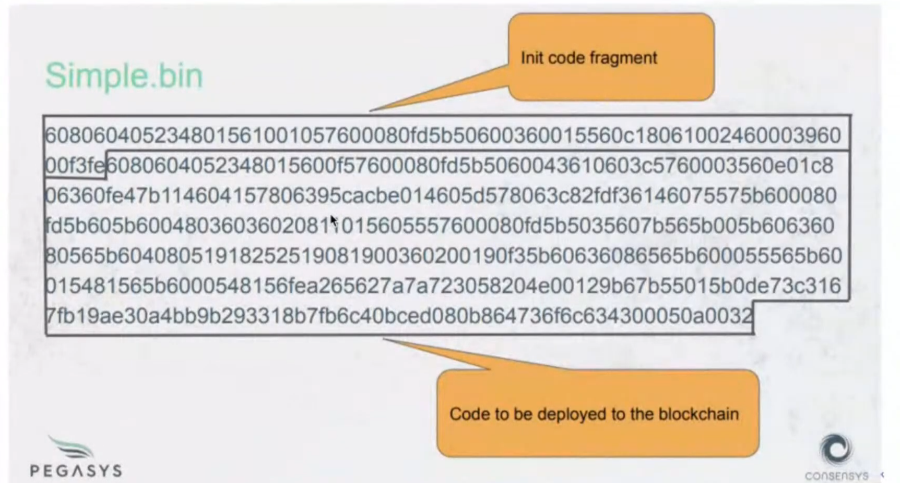

let's talk about contract deployments and here's a quick snapshot from somebody else's uh from somebody else's presentation, just because they I I didn't want to have to go through and figure out which one was the initialization code fragment, the code would be deployed to blockchain whenever you deploy a contract. It comes with almost like two sets in the binary code. Right, the first huge chunk is going to be what's called the initialization code fragment. This tells the blockchain like how to set up your contract, how to set up your code, and then you have the byte code that actually represents your contract, so this stuff up here is all the op codes that are saying: hey we're, building a contract. Let's get set up to do that and then this is the code that gets saved onto the blockchain. 

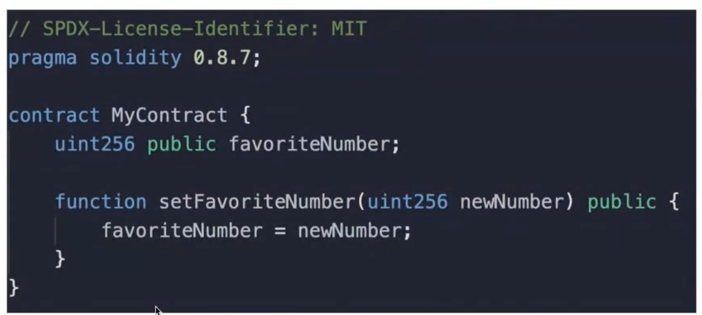

So let's look at a contract like this, real minimalistic contract contract, my contract. It's got a public favorite number, it's got a set, favorite number um and yes for uh matt who's been asking um. Favorite number gets overwritten when we do this right, because when we refer to favorite number, we're saying hey give me that storage variable and let's overwrite it with this new number thing

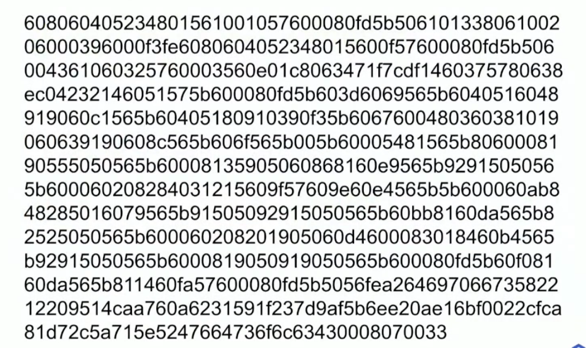

 and when we compile this contract, this is exactly what it looks like in bytecode, which is obviously completely unreadable. 

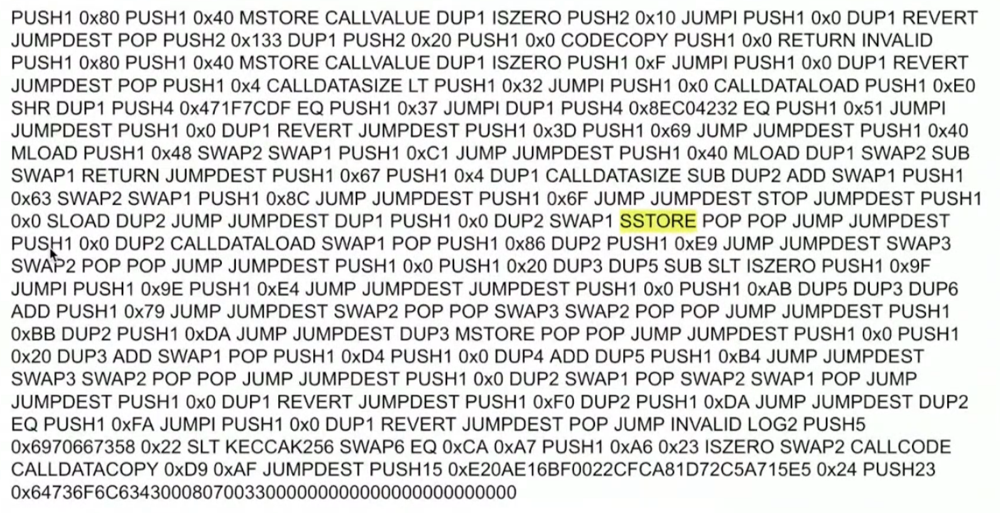

Here's what it looks like in with opcodes, which is also nearly completed completely unreadable, but it's slightly more readable right, because now we're we're saying: okay, push ox80 right and in here we know that 60 is push and we're pushing 80. Okay, what happens after that? Push ox40 oh cool, so we pushed 80. Okay, we're gonna push. Six zero is push we're gonna push 40; okay! What's next 52, what's 52, okay m store, we're going to m, store, we're going to m store some stuff and then blah blah. Now we can see we have this s store op code in here. If we remove that global variable right- and we just do you- interview, constant public favorite- number equals 77, we can once again, we can now see that there is no s-store opcode in our compiled bud code uh, which is cool.

https://blog.openzeppelin.com/deconstructing-a-solidity-contract-part-i-introduction-832efd2d7737/

That's what we want. We want to see less, we don't want to see that as store anymore, because we're no longer storing something and then I'll leave you with this uh there's a fantastic blog called deconstructing a solidity contract part one introduction. I think it's six parts by open, zeppelin, decon constructing solidity, open zeppelin put it in the chat here- is very good if you're looking to go even deeper than what we went in here so be sure to check that out and with that being said, that's going to be the conclusion of our of our talk here, uh before anybody leaves please fill out this this qr code here uh give us some feedback. Let us know what you liked. What you didn't like about this course I'll drop the link in the chat as well. Let me just grab it hold on one second uh, but yeah.

They help us figure out. You know if the workshops are a good use of time. If people hated them et, cetera um. So please grab the qr code grab the link here, it's gonna be in the comments uh. Let us know what you thought and then yeah questions in the last 10 minutes that we have. Could you show us how to measure some op code uh? What do you mean measure some op code could you could you elaborate hi, patrick what about the order or grouping on variable declaration, according with their size, to optimize storage, block, slash slot usage? What about the order or grouping on variable declaration, according with their sized optimized storage? What about the order group? I think I see what you're saying um. That's a good question. I don't know enough to answer that intelligently, uh. I do know that ordering does matter um, but I I don't. I don't think it matters so much that it would be worth focusing on. I think um, like I know like especially when you like order your functions, a different way, the ones that you're going to call the most you want at the top of your contract. I forget, but it's like small amounts of gas. That's a good question. I I forget the actual gas optimizations there, that's the meaning of 32 for stacking's trucks.

Yep. Are there any hardhat plugins that show you uh the op codes being executed? Um, I don't know actually, but uh. Foundry and brownie have uh opcode uh step throughs. So you can like literally step through op code to opcode, your entire solidities or or viper smart contracts, which is really cool. So if you want to see like a step through debugger for op codes, foundry and and brownie and uh- and I think ape works too- have stepped through debuggers hard hat might as well. I'm not sure, though, is evm always last and first oriented and never first in first out, yes, evm is stack based. Yes, I was wondering what specifically chain link has been liking for in a project these days, uh good question, cool stuff, cool stuff. That uh helps the world and does d5 nft gaming dows. You know you name it um, I'm assuming you're talking about chain link labs. The chain link oracle network likes. You know just smart contracts in general. So your questions here, any other questions. Any other questions.

Yeah. The takeaway from this should be uh. The minimum takeaway is that reading and writing to storage is expensive. So if you don't have to do it, don't that's the takeaway any other questions here, all right cool.

Well, if there are no more questions, am I looking at it? The plea please take the uh, the feedback form- let us know if you like this- if you didn't like this uh, if you want to see more gas optimization stuff, if you want to see less gas, optimization stuff and good luck with the rest of the hackathon tomorrow, we have some great workshops for you, so hopefully you show up to next to tomorrow's workshops as well. Uh we got a bunch of cool ones, the rest of the week and then after this week you know hacked up into link. We're nearing the halfway mark of this, of the hackathon already has already been going that fast, oh my goodness. So what is today today is the third. Tomorrow we got build a dow with zubin, it's gonna be fantastic fall coin; full stack, d5 application, then we're going into some smart contract security. I know all of you here are going to be excited about this. Then we're going to build a web 3 game, we're going to work a little bit with alchemy next week, we're doing a little bit more about security audits. Why uh binance smart chain, some new uh founding products and then we're at the midway check-in and it's off to the races. It is off the races so we're already getting close to the midway check-in point getting close to the middle of the hackathon. I hope you're all doing well hope you're all excited. I hope you're all building, I hope, you're all learning having fun and with that being said, thank you all for coming here and we'll see you in the next one.