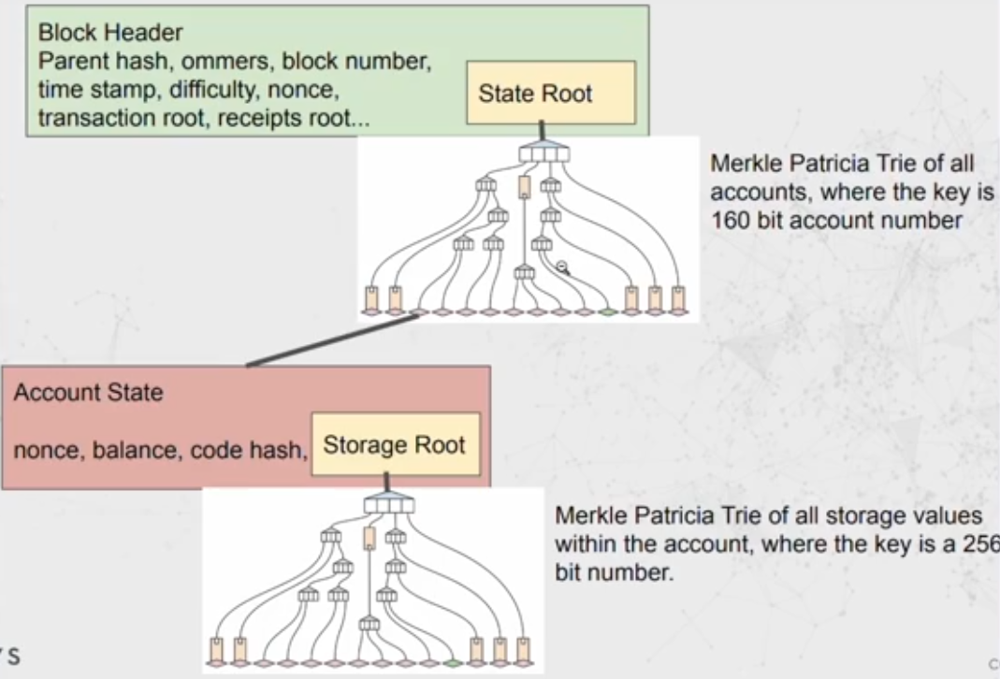
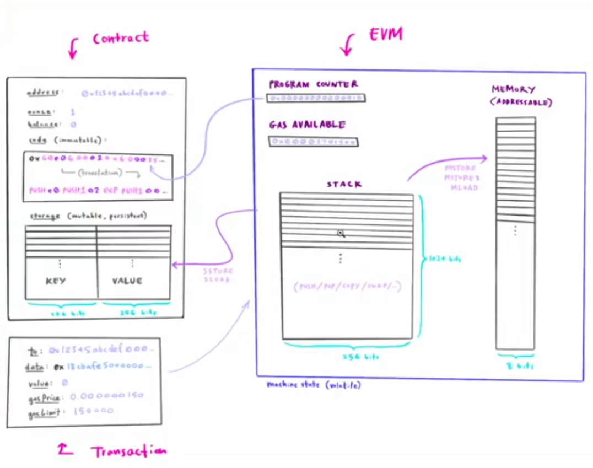
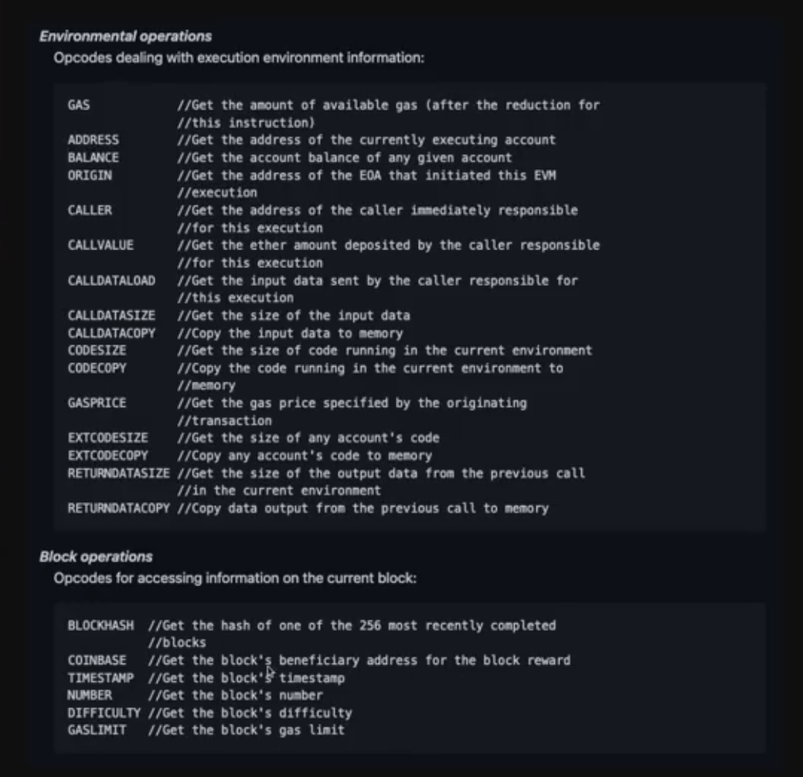

Ethereum block architecture

https://ethereum.stackexchange.com/questions/268/ethereum-block-architecture/6413#6413

记得看pdf后边的reference

首先在geth中，evm也只是go的源代码，如果只是简单的external account之间的转账，就是geth源码调用，from账号减少，to账户增加，如果是一个交易调用了Contract，那么则会把bytecode穿给evm源码进行解析

How the EVM works, what it does, where it runs, and how it's implemented. 

[0:00](https://www.youtube.com/watch?v=kCswGz9naZg&t=0s) World state 

[2:40](https://www.youtube.com/watch?v=kCswGz9naZg&t=160s) Externally owned accounts VS Smart contract accounts 

[3:43](https://www.youtube.com/watch?v=kCswGz9naZg&t=223s) State of both account types is stored in Merkly Patricia Tries 

[6:58](https://www.youtube.com/watch?v=kCswGz9naZg&t=418s) Lifecycle of a block (high level) 

[8:15](https://www.youtube.com/watch?v=kCswGz9naZg&t=495s) Why a virtual machine? Deterministic. 

[10:13](https://www.youtube.com/watch?v=kCswGz9naZg&t=613s) Architecture of virtual machines 

[11:45](https://www.youtube.com/watch?v=kCswGz9naZg&t=705s) Architecture of EVM 

[16:47](https://www.youtube.com/watch?v=kCswGz9naZg&t=1007s) Machine space of EVM - EVM is stack memory based, not register based 

[18:22](https://www.youtube.com/watch?v=kCswGz9naZg&t=1102s) Lifecycle of a transaction 

[20:24](https://www.youtube.com/watch?v=kCswGz9naZg&t=1224s) The EVM is a single threaded CPU that executes transactions contiguously. Each transaction: - code of contract is loaded - program counter is set to zero - contract storage is loaded - memory is zeroed - all block and env variables are set If gas runs out (tx revert), no changes to Eth state are applied, except sender's nonce increments and their ETH balance decreases (paid for tx gas) 

[24:00](https://www.youtube.com/watch?v=kCswGz9naZg&t=1440s) Higher level languages (Solidity, Vyper)  are compiled down to machine bytcode of the EVM 

[26:53](https://www.youtube.com/watch?v=kCswGz9naZg&t=1613s) The bytecode is composed of a bunch of opcodes, each of which has a gas cost (check out evm.codes) 

[29:51](https://www.youtube.com/watch?v=kCswGz9naZg&t=1791s) Viewing bytecode and Solidity source code on etherscan.io 

[31:01](https://www.youtube.com/watch?v=kCswGz9naZg&t=1861s) Gas cost per opcode is the cost of running these ops on the EVM running on computer hardware Gas price is an ETH price per unit of gas How expensive gas is in Metamask  = (sum of all opcode gas costs in a tx) * (gas price) 

[35:25](https://www.youtube.com/watch?v=kCswGz9naZg&t=2125s) Look at geth source code, can see the EVM opcodes 

[38:43](https://www.youtube.com/watch?v=kCswGz9naZg&t=2323s) The world state of Ethereum lives on the SSD's of nodes mining/validating the EVM 

[39:53](https://www.youtube.com/watch?v=kCswGz9naZg&t=2393s) Environmental and Block opcodes 

[41:44](https://www.youtube.com/watch?v=kCswGz9naZg&t=2504s) The EVM can only see current world state.  It can't see historical state, previous blocks (except most recent 256 block hashes), previous transactions, or external API's (like how many nodes are in the network, or the price of ETH) 

[43:08](https://www.youtube.com/watch?v=kCswGz9naZg&t=2588s) Smart contracts can call other smart contracts. Each call to a new contract creates a new instance of the EVM. Each call passes the sandboxed world stat to the next EVM. If gas runs out, all these state changes are reverted. 

[45:17](https://www.youtube.com/watch?v=kCswGz9naZg&t=2717s) Message call is triggered by CALL instruction Arguments and return values are passed using memory

