```solidity
// SPDX-License-Identifier: MIT

pragma solidity ^0.8.0;

contract Test {

    uint256 a = 3;

    function aPlusOne() external view returns(uint256) {
        return a + 1;
    }

}
```

Let's start with a very simple function that just takes the variable A adds 1 to it and returns it. Now, when we look at this as a programmer, semantically this is not ambiguous. We just say, okay, just, you know, take whatever variables here, add one to it and give it back to me. But that kind of language is not ambiguous, is not unambiguous to a computer. For a computer to execute this, it needs to know where exactly in memory or storage is A, I can't just add numbers in storage, I need to move that number from storage into memory, and you cannot just say, Oh, add a number to it. That number you're trying to add needs to be loaded into memory to, not only that, it needs to be loaded into a very specific location so that when you do the addition operator, the addition knows where to look for these two numbers in order to add them together.

So something that might look very simple like this, under the hood requires a lot of very tiny and precise instructions in order for a computer to understand it.

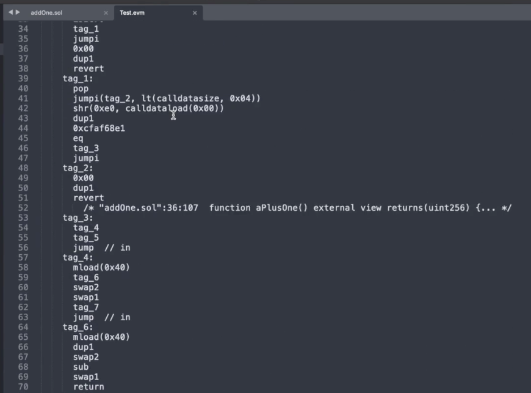

And that's what assembly code is. When the solidity code is compiled, it's actually going to end up looking something like this, which might seem kind of scary, but as we look through it, these are all just very simple operations that are carried out on the Etherium computer when it's trying to execute this smart contract, rather than trying to walk you through this little by little, I'm just going to try to focus on the parts that are relevant and informative here.

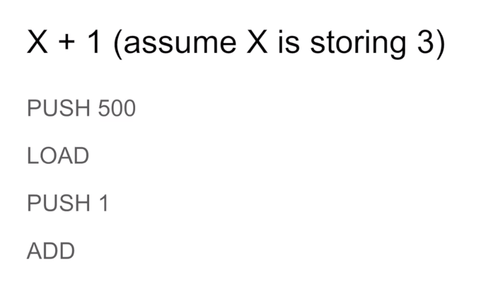

Here's our smart contract again, part that would be relevant is the operation of adding, offloading the numbers and adding them. So let's assume just for the sake of an argument, that we know that A is stored in location 0, so 0 is not a number we are doing math with, it saying 0 is a storage location for A, we need to tell the computer: "hey, computer look inside of location 0" and okay, so we just stored location 0 there.

And then what are we going to do with that 0?

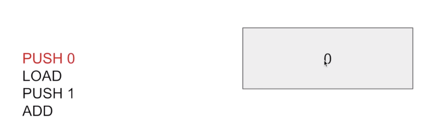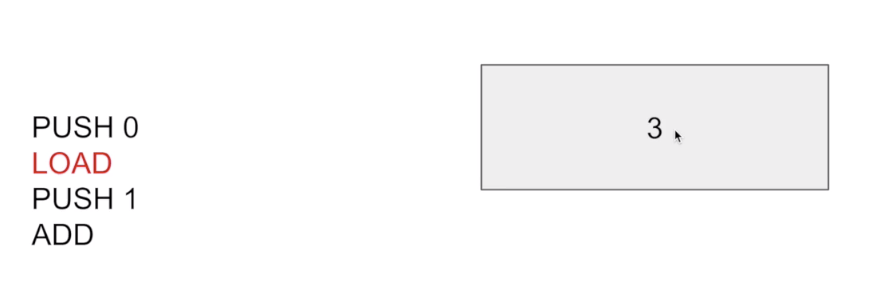

Well, we're going to take the value that is inside of location 0, the byte values over there and load those into memory, well, removing this value, once we have loaded those values, this 0 is not relevant to us anymore. So when we execute the LOAD operation, we're going to pull in what was stored at location 0 which is 3. We can't just say add 1 because the computer doesn't have a notion of adding a specific number or incrementing, at least Etherium doesn't.

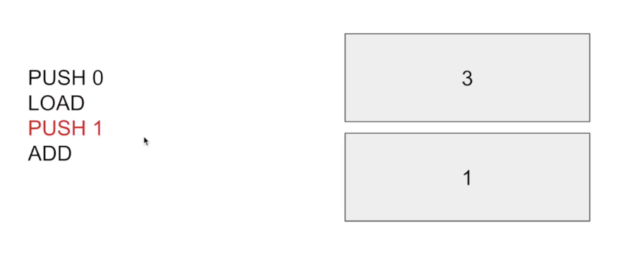

Instead, what we need to do is explicitly load in the number that we're trying to add it with, which is PUSH 1. At this point, the semantic of push might start to become intuitive, when we did a push that put that number onto the stack. So you can think of all of the information that is being stored in the intermediate states of being in the computation as being numbers on top of a stack.

That is so that when the operation comes along, it knows that I only have to look at the top two items inside of the stack in order to carry out my operation. If I, if I want 3 were not at the top two elements of the stack add would not work because it's specifically programs only look at the top two elements in the stack.

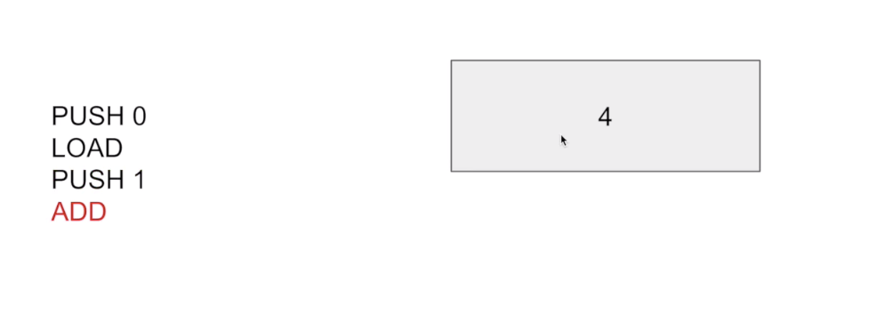

So it pops off the two items and adds them together and gives us four. So this sequence of codes is what under the hood Etherium is executing to execute X plus 1. Now, when we looked at the opcodes, we noticed, okay, there were a lot more than four over there. Well, that's because we need to do stuff like setting up the functions. And there's also the constructor part of the Smart contract. But I don't want to get into that right now, just for the sake of simplicity.

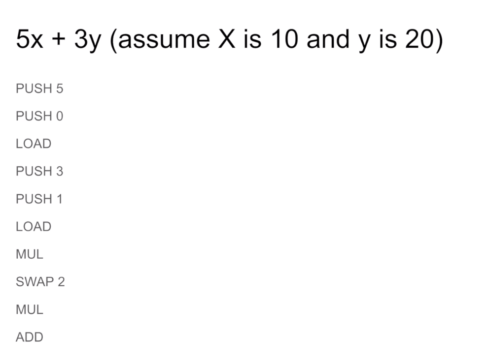

Let's look at something a little bit more complicated. 5X plus 3Y. And let's assume that we have X storing the value of 10 and Y storing the value of 20. And let's step through how this would be executed inside of the virtual machine after it was compiled.

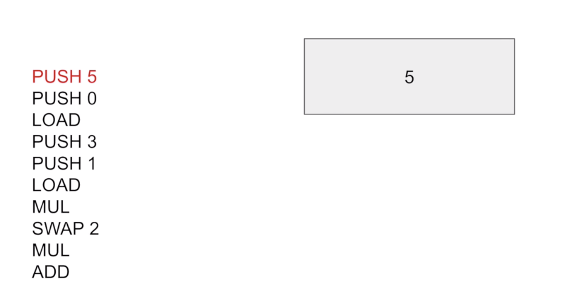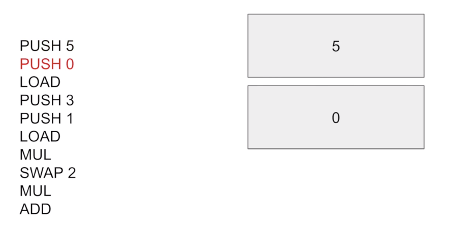

Well, first we need to push 5 onto the stack because we're trying to do 5X plus 3Y. Then we will push on the storage location of X which is 0, we will load the value from X onto the stack while removing the most recent (这个sb的栈是倒着的，栈口在下边，妈的) item on the stack, and that will replace 0 with 10.

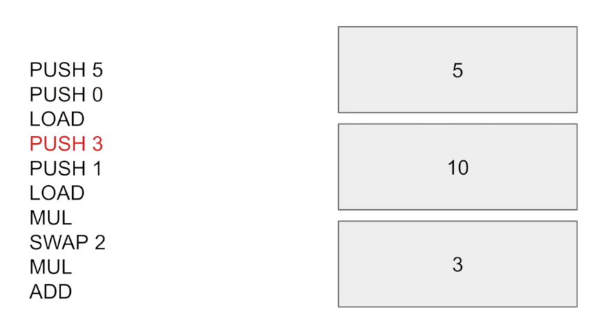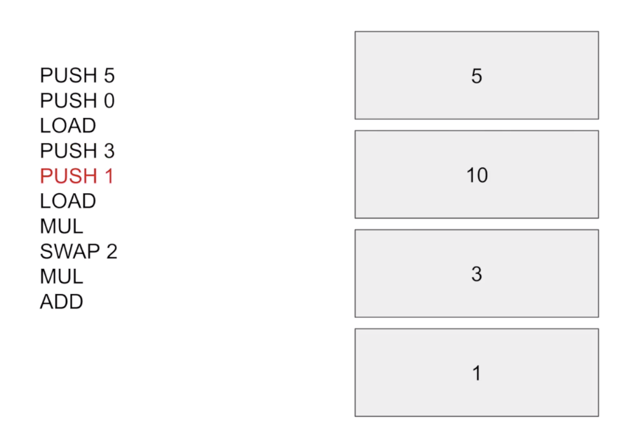

Then we will push the 3 onto the stack to correspond to the 3Y and then push the storage location of Y, which is, let's just say 1 in this case.

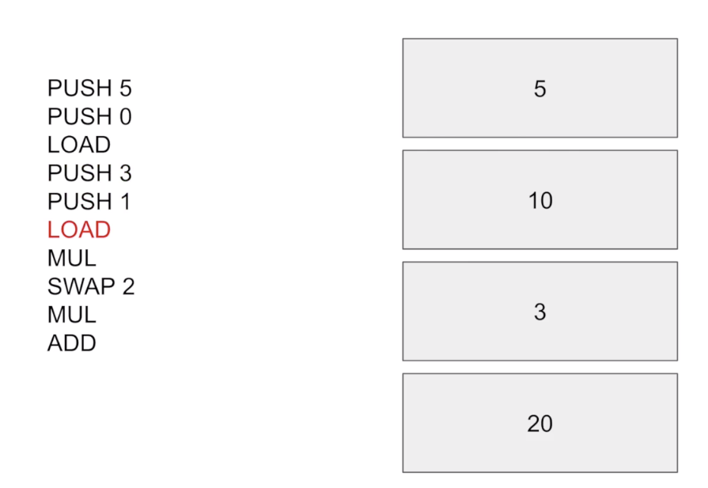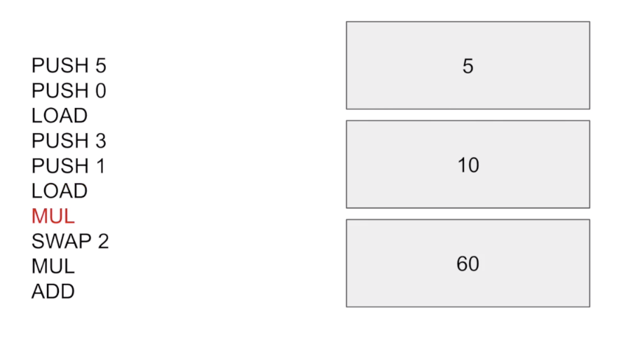

We will load the value of Y onto the stack and then multiply these two numbers together. Now remember how I said multiplication only load these... well, I said addition, but it's true of multiplication too. 

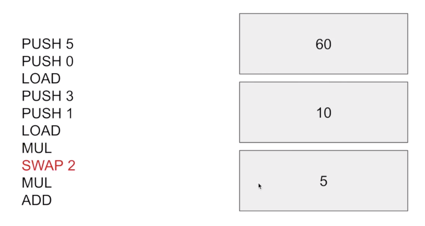

You can't multiply 60 by 10. That doesn't correspond to the actual mathematics of what you were doing. So if the compiler had set up the opcodes to look like this up to this point, what it would actually have to do, to do the math properly is compile a swap operation to move that 60 to unit's back (应该是把60放到其他unit后边的意思) and make sure that the two relevant numbers are on the top, because these mathematical operators that take 2 arguments only look at the top two most items.

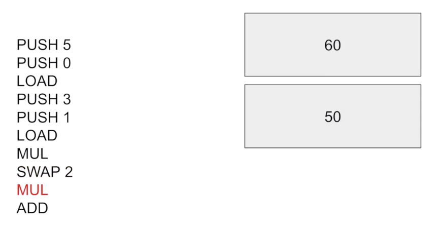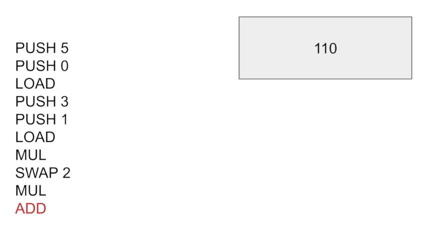

So that will carry out the multiplication and then add them together. This sequence of AB codes means technically you can... technically, you can program Ethereum in any language as long as it compiles to the appropriate opcode codes, that's why we have viper and solidity.

Now. Mark could be added later. Those two are the ones that are supported for now. In order to really understand gas costs, you will need to have a good intuition about what sort of solidity code gets turned into different opcodes, because I'll describe in the next video how these opcodes allow us to calculate what the gas cost will be.